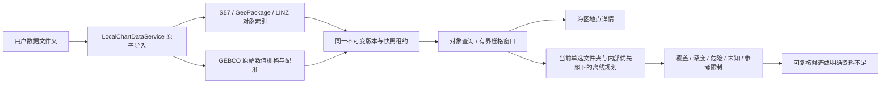

# 离线航行资料：GeoPackage、LINZ 与 GEBCO

本文描述当前生产导入器实际读取的字段与边界。系统所有权、版本快照、许可和规划门槛仍以[海图契约](product/CHART_INTERACTION_CONTRACT.md#数据图册与自动规划2026-09-25)为准。

## 可收集与离线导入的 Yokuli 包

`.yklchart` 是开放 ZIP 容器，将同一文件夹内的原始资料、来源、许可说明、优先级、长度及 SHA-256 清单一起保存，详见[包规范](../chart-library/package-format.md)。它不是一种新的海图测量格式，也不是官方认证；内部仍是当前支持的 MBTiles、S-57、GeoPackage 或 GEBCO 数值文件。图片海图包从「图册 → 海图」导入，航行数据包从「图册 → 数据」导入；一个包对应一个资料集合，两类不混装。

安装先完整校验再交给现有格式读取器，数据索引由原 `ChartDataService` 发布。损坏、缺文件、空间不足或取消不会覆盖上一完整版本。包更新替换整个集合；原有手动文件次序在对应文件仍存在时保留。复制后读取私有离线副本，日常使用无需原文件权限、网络或 LINZ API key。包清单的来源及许可用于溯源，不改写解析出的数据能力。图册不再提供“参考／分析”的手动标签；实际覆盖、深度与质量由读取器和规划器判断。

文件夹可在管理页编辑说明、来源、许可和任意自定义文本字段，并整体导出为 `.yklchart`。文件夹字段与文件字段分别保存；新导入的源文件随已安装版本保留，不依赖后续原目录权限即可重新导出。旧版本没有保存原始文件时需重扫或重导入。海图和数据仍分别导出，不混装。包格式版本 2 的 metadata 上限及版本 1 兼容规则见包规范。

[仓库离线资料库](../chart-library/README.md) 保存可单独下载与归档的包及元数据。全国 LINZ 资料不内置 APK；App 自带的全球基础底图不包含这份可计算水文数据。

## 它解决什么问题

MBTiles 提供海图画面；GeoPackage 提供可以搜索、点选和检查的对象及属性。两者可以配合使用，但图片中的水深数字不会自动成为可计算的水深。任意 `.gpkg` 也不等于航行资料：仅含瓦片的包不能从这个入口导入，普通道路、地形或兴趣点不会自动成为水深、障碍或覆盖证据。

用户在 QGIS 等编辑器中维护自己的原始资料，保存为一个完整 `.gpkg`，再在图库的航行资料入口导入。App 读取副本并创建离线对象索引；不会修改原始文件或在手机上改写提供方水深。相同资料的更新使用**整个包的新快照替换**，不是逐表追加。新版本中的删除会随替换生效，失败保留旧版本；正在读取旧版本的地图和分析由原有快照租约保护。

一个包的所有特征表合为一个逻辑图幅，保留每个对象的原表名。单包默认图幅为 `GPKG`；文件夹导入由数据服务给每个源文件分配稳定图幅 ID。这样覆盖表中的范围才能同时约束同包的水深、陆地、障碍等表，不会因把表误当不同图幅而互相遮蔽。通用 profile 的对象身份由数据集、图幅、表名和整数主键组成；修改同一对象时请保留表名及主键。下述 LINZ 适配使用提供方的 `fidn`，避免再次导出时整数 `fid` 重排导致对象身份变化。

全国 LINZ 资料按比例尺带分别打包时，每个包必须包含该带完整的覆盖、水深、陆地、障碍及其他已选图层。同一带的 Coverage 不能单独成为另一个文件，否则文件优先级会把它视为独立覆盖来源并遮住其他文件的对象。仅含同一个已识别 LINZ 比例尺带的包保留 `linzScaleBand`，初次安装在没有实际编制比例尺时按该带从细到粗设置文件顺序；带名不写成 `CSCALE`，已有用户顺序仍优先保留。混合比例尺带或混合未识别表的包不猜测一个统一带名。

## 文件与空间范围

- 标准 GeoPackage 1.x，SQLite `application_id=0x47504B47`，`user_version` 为 `10000..19999`。必须有标准 `gpkg_contents`、`gpkg_geometry_columns`、`gpkg_spatial_ref_sys` 元数据及至少一个非空特征表。
- 每张特征表只有一个 `INTEGER PRIMARY KEY` 和一个已登记的几何列。QGIS 默认的 `fid` 符合要求；具体列名不固定。不读取视图或无几何的属性表。
- 仅接受元数据明确声明为 **EPSG:4326** 或 **EPSG:3857** 的几何。`srs_id` 可为包内自定义编号，但其组织和坐标系编号必须正确指向这两个 EPSG 定义。其他 CRS 需先在编辑器中真正重投影，不能只改标签。
- 同包不同表可以使用这两种不同 CRS，导入时统一为经纬度。4326 的 X 是经度、Y 是纬度；3857 的 X/Y 是投影米坐标，不支持超出 Web Mercator 范围的极区数据。
- 支持 Point、LineString、Polygon、MultiPoint、MultiLineString、MultiPolygon，以及包含这些具体类型的 `GEOMETRY` 列。保留多部分几何和 Polygon 内洞。GeometryCollection、曲线、曲面、TIN、扩展几何和 EWKB 不在本 profile 内。
- 读取标准 GP 二进制头、包络与 ISO WKB；检查类型、维度、SRS、完整长度、有限坐标、闭合环和有效拓扑。坏几何不会自动修补后当成可靠资料。几何为空或 NULL 的对象仍可作为参考记录浏览，但不能成为规划依据。
- 可读取标准 Z/M 几何，但索引只使用水平坐标。Z/M 不作为水深，原始 Z/M 值也不承诺在索引中无损保留。必须使用下文的显式水深字段。

标准容器和坐标编码依据 [OGC GeoPackage](https://www.geopackage.org/spec/)。本 profile 是该标准的受限航行用途，不是对所有 GeoPackage 扩展的支持声明。

## LINZ LDS 原始导出适配（2026-09-27）

图册的 GeoPackage 导入现在在读取真实特征表时调用 `LinzLdsAdapter`，无需给 LDS 原表逐行补 `kind`。从 LDS 选择需要的水文图层和区域，导出 **GeoPackage / SQLite、WGS 84**，解压后把 `.gpkg` 放入数据文件夹。原文件与提供方附件仍由用户保留，App 只索引副本；导入后查询和辅助规划不再访问 LDS 或依赖 API key。[LINZ 导出说明](https://www.linz.govt.nz/guidance/data-service/linz-data-service-guide/getting-started-lds)

识别需要 `gpkg_contents.identifier` 或表名完整匹配已支持的 **`… (Hydro, 比例尺带)`** 名称，同时具备 LINZ 的 `fidn / sordat / sorind / inform` 和各类必要原字段。支持五个官方比例尺带：1:4k–1:22k、1:22k–1:90k、1:90k–1:350k、1:350k–1:1,500k、1:1.5mil and smaller。短横线、下划线、标点差异及 `linz-data-` 前缀可识别；只有 `depth` 列、带 LINZ 的任意文件名、普通 Topo 地形/道路表都不会触发适配。名称匹配但关键字段或几何元数据不符时明确拒绝，不猜测字段含义。

| LDS 原图层名称前缀 | 真实映射 | 原字段与边界 |
| --- | --- | --- |
| Depth area polygon / Dredged area polygon | DEPARE / DRGARE | `drval1 / drval2 / verdat / quasou`；保留水深区间与未知基准 |
| Sounding points | SOUNDG | 显式 `depth` 转为米制 `depth_m`；不读取任意 Z 作为水深 |
| Depth contour polyline | DEPCNT | `valdco / verdat`；不把等深线插值成可通航面 |
| Land area polygon | LNDARE | 使用实际陆地 Polygon 及内洞 |
| Coverage polygon | M_COVR | `catcov=1/2` 保留有资料/无资料范围 |
| Quality of data polygon | M_QUAL | 保留 `catzoc / posacc / souacc / sursta / surend` 等证据 |
| Underwater/awash rock points、Wreck points/polygon、Obstruction points/polygon/polyline | UWTROC / WRECKS / OBSTRN | `valsou / watlev / verdat` 等原值；没有深度仍为未知危险 |
| Restricted area polygon | RESARE | `catrea / restrn`；不把限制区域当普通背景 |
| Bridge polygon/polyline、Cable, overhead polyline | BRIDGE / CBLOHD | 保留真实 `verclr / verccl / verdat`，不默认净空基准 |
| Light points | LIGHTS | 保留灯质、颜色和扇区等原始属性 |
| Unsurveyed area polygon/polygons | UNSARE 参考对象 | 保留未测量语义并阻止静默放行；不生成已调查覆盖 |

字段直接核对自官方元数据：[水深面 50447](https://data.linz.govt.nz/services/api/v1/layers/50447/)、[测深点 50858](https://data.linz.govt.nz/services/api/v1/layers/50858/)、[覆盖 50704](https://data.linz.govt.nz/services/api/v1/layers/50704/)、[质量 50707](https://data.linz.govt.nz/services/api/v1/layers/50707/)、[陆地 50691](https://data.linz.govt.nz/services/api/v1/layers/50691/)、[碍航物 51621](https://data.linz.govt.nz/services/api/v1/layers/51621/)。原始 `fidn`、S-57 属性、图层全名、提供方和来源网址进入对象详情。`SCAMIN` 是显示阈值，不会误充 `CSCALE`；图层比例尺带也不会变成一个伪造的编制比例尺。缺失 `VERDAT` 不默认 LAT，缺少质量不假设测量可靠，日期不以导入时间冒充。

LINZ 太平洋图层可能使用连续的 160°–202° 经度。仅在明确识别的 LDS 路径中允许 `-180…360` 范围，索引时规范到 `-180…180`，按连续经度分支检查原几何拓扑；其他 GeoPackage 的坐标约束不变。

LINZ 包的下载、打包时间以及 `gpkg_contents.last_change` 不等于源资料发布日期。没有明确的官方出版时间时，LINZ 对象与图幅的 `issueDate` 留空；真实 `SORDAT` 仍作为对象来源日期保留，资料安装时间只表达本地安装时间。普通 GeoPackage 的既有日期读取方式不变。

这些 LDS GIS 图层的提供方明确不允许把它们作为导航海图替代品。适配后整个图幅标记 `referenceOnly=true`，对象/图幅保留 `REFERENCE_ONLY_LINZ_LDS`。结果只能是带来源限制的参考辅助规划，不能产生“已确认安全”的结论。若没有 Coverage 表，只能从有真实最小水深的 DEPARE/DRGARE Polygon（保留内洞）形成**参考覆盖**，并标记 `REFERENCE_COVERAGE_FROM_LINZ_DEPTH_AREAS`；绝不以包络、点/线插值填满区域。存在 M_COVR 时完全采用其明确范围，尊重无资料区。缺水深基准时完整检查仍报告资料不足；下述参考草稿例外不抹去这项限制。质量和未解释对象继续沿原规则处理。正式 ENC 仍走 S-57 原生路径，保留其版次与更新链。

设置中的 LINZ 密钥与图册的区域下载通过 `ChartDataService` 接入既有导入链，具体边界见[区域资料与规划](product/CHART_INTERACTION_CONTRACT.md#linz-区域资料与规划2026-09-30)。全国批量资料由 `scripts/download_linz_offline.py` 通过 WFS 分页下载为每个比例尺带一个完整 GeoPackage，再从图册的数据文件夹导入；手机上的区域下载入口不会默默扩大为全国下载。没有自动更新或任意字段自动猜测。文件夹内解压后的 GeoPackage 或单层 ZIP 包均可通过既有复制入口导入；不递归展开嵌套 ZIP。新增支持的名称和字段必须同时有官方 schema 依据；未列出的图层继续按通用 profile 的显式字段规则导入，不能默认为无害。

批量下载器从本机私有 `--key-file` 读取密钥，`--catalogue` 接受已从 WFS 获取的图层清单（`id/title/band/rank/acronym/count/bounds`），`--output` 指定仓库外的资料目录。同一目录和清单可断点续传；记录数、来源 ID 唯一性及每页完整性满足后才把 `.part` 改为 `.gpkg`。每个比例尺包保留原始对象属性、内洞和连续经度，不按南北岛外接框裁切，也不混合不同带的覆盖。输出 manifest 记录来源层网址、下载时间、数量与 SHA-256，不保存带密钥的 WFS 链接；剩余磁盘不足时保留可续传文件而非发布半包。源服务不固定跨请求的数据修订，因此数量一致不能被描述为服务端原子快照。

LINZ 官方说明 LDS 水文矢量和海图 GeoTIFF 自 2024 年 5 月起暂停更新。完整下载仅表示取得当前服务发布的已选资料，不表示覆盖了每片海域、不表示资料最新，也不替代正式 ENC。[提供方现状](https://www.linz.govt.nz/products-services/data/types-linz-data/hydrographic-data)

## 可维护字段

字段名匹配不区分大小写。额外的标量属性会保留供详情浏览；二进制属性不支持。下表字段可以分布在不同特征表，不必给每一表创建所有列。

| 字段 | 建议 QGIS 类型 | 含义与约束 | 接受的已有属性 |
| --- | --- | --- | --- |
| `kind` | 文本 | Yokuli 对象类别，或已识别的 S-57 acronym；与 `object_class` 至少明确一个 | 下表列出的类别 |
| `object_class` | 文本 | S-57 对象 acronym；也可为当前字典识别的数字对象类编码 | 如 `DEPARE`、`SOUNDG`、`M_COVR` |
| `name` | 文本 | 用户可读名称 | `OBJNAM`；原 `NOBJNM` 也保留并可搜索 |
| `depth_min_m` | 小数 | 面状深度区的下限，米；浅的一端 | `DRVAL1` |
| `depth_max_m` | 小数 | 面状深度区的上限，米；必须不小于下限 | `DRVAL2` |
| `depth_m` | 小数 | 测深点、等深线或障碍已知深度，米 | `VALSOU`、`VALDCO` |
| `vertical_datum` | 文本 | 深度使用的实际垂直基准；未知不能确认实际水深与余深，LINZ 参考草稿例外见下文 | `VERDAT` |
| `covered` | 布尔 | 仅对 COVERAGE 有效；真为有资料范围，假为明确无资料范围 | `CATCOV=1` 有资料，`CATCOV=2` 无资料 |
| `source` | 文本 | 真实提供方、调查或来源说明 | `SORIND` |
| `source_date` | 文本或日期 | 原始资料日期，不由导入时间代替 | `SORDAT` |
| `quality` | 文本 | 来源实际给出的调查质量；不是用户自行宣称“安全” | `QUASOU`、`CATZOC` 等原字段保留 |
| `accuracy` | 小数 | 明确的水平位置精度，米，非负 | `POSACC` |
| `compilation_scale` | 整数 | 已知编制比例尺的分母，未知可留空 | `CSCALE` |
| `description` | 文本 | 对象说明 | `INFORM` |

省略深度单位字段时，带 `_m` 的字段及本 profile 的深度别名统一解释为米。如存在 `depth_unit`、`S57_DEPTH_UNIT` 或 `DEPUNI`，只接受米的值（`m`、`metre(s)`、`meter(s)` 或 S-57 编码 `1`）；其他单位不会猜测转换。输入深度限于 `-20000..20000` 米。负数只表达源资料定义的干出高度/负深度，不会变成可通航水深。

同时提供同一语义的多个字段时必须一致。例如 `depth_min_m` 与 `DRVAL1` 不一致会产生资料问题，不会任选一个值继续规划。`kind` 与 `object_class` 冲突则保留为 OTHER 参考对象。

垂直基准只去掉首尾空格并规范大小写，**不会把 `LAT`、`MSL` 或 S-57 数字基准编码视为同一个基准**。请使用来源本身的定义，不要仅为消除提示替换名称。同一包的深度对象出现多个基准时仍保留混合基准提示；新导入的 GeoPackage 在实际查询窗口内检查同一资料单元是否存在多个深度基准，不因远方港区采用不同基准而封锁全国。当前不做潮位或垂直基准换算。桥梁净空的现有分析还需要可识别的基准信息，仅有自由文本不等于已满足净空核查。

## 对象类型与几何

| `kind` | 常用 `object_class` | 几何与用途 |
| --- | --- | --- |
| `COVERAGE` | `M_COVR` | Polygon/MultiPolygon；必须明确 `covered` 或 CATCOV |
| `DEPTH_AREA` | `DEPARE` | Polygon/MultiPolygon；使用实际最小深度，确认实际水深还必须有垂直基准 |
| `DREDGED_AREA` | `DRGARE` | Polygon/MultiPolygon；明确疏浚区深度证据 |
| `DRYING_AREA` | 可仅填 kind | Polygon/MultiPolygon；干出范围，不是安全水域 |
| `SOUNDING` | `SOUNDG` | Point/MultiPoint；必须有 `depth_m` 与基准 |
| `DEPTH_CONTOUR` | `DEPCNT` | LineString/MultiLineString；`depth_m`/VALDCO 表达等深值 |
| `LAND` | `LNDARE` | 通常 Polygon/MultiPolygon；陆地区域 |
| `ROCK` / `WRECK` / `OBSTRUCTION` | `UWTROC` / `WRECKS` / `OBSTRN` | 实际危险对象；未知深度必须继续保持未知 |
| `RESTRICTED` | `RESARE` | 限制区域，保留实际限制属性供核对 |
| `BRIDGE` / `OVERHEAD` | `BRIDGE` / `CBLOHD` 等 | 保留 VERCLR、VERCCL 等原始净空属性 |
| `LIGHT` / `BEACON` | `LIGHTS` / 已识别 BOY… / BCN… | 浮标和立标均归 BEACON；不证明周边有足够水深 |
| `TRAFFIC` | 已识别 TSS… / `FAIRWY` 等 | 交通组织对象，保留原属性供核对 |
| `QUALITY` | `M_QUAL` | 调查质量对象与原始质量属性 |
| `OTHER` | 未知类别 | 可浏览的参考信息，同时标注未解释语义 |

一个 MultiPoint 行只有一个 `depth_m`，因此其所有点使用同一个明确深度；不同深度的测点应分别存为 Point 行。深度等值线和离散测点不能代替连续的水深面，导入器不会在点之间插值制造安全走廊。

未知对象保留原字段与几何，并向所属图幅上报未解释语义。新导入的 GeoPackage 将可定位对象的问题交给实际查询窗口处理；其未知语义、缺失水深或未知基准仍在真实几何范围内阻止放行，不因“不认识这个对象”而忽略危险。无法定位的对象、损坏的覆盖语义及缺少有效覆盖写入 `wholeCellIssues`，继续作为整个有效图幅的保守门槛。旧目录没有该字段时保留原来的全幅门槛，重新扫描后才获得新的问题范围。查询截断、分页异常或当前窗口几何解析失败仍明确失败，不把缺少的对象当成空白。

## 在 QGIS 维护原文件

1. 在 QGIS 中使用“图层 → 创建图层 → 新建 GeoPackage 图层”，指定文件、表名、几何类型和上述支持的 CRS；保留整数 `fid`。按需建立覆盖面、水深面、测深点、陆地和障碍表，使用同一个 `.gpkg` 文件。
2. 添加上述字段。类别、深度、基准、来源和质量必须来自真实资料；在编辑模式中维护几何和属性。已有数据可先导出为 GeoPackage，并重投影到支持的 CRS。
3. 保存全部编辑并关闭正在写入此包的应用，交付一个完整独立的 `.gpkg` 文件，不交付尚依赖 WAL/SHM 的工作副本。再次更新时保留同一对象的表名和主键。
4. 从图册的数据入口导入文件夹或图包，自动读取每份文件的 metadata。导入后明确选用该文件夹；需要补充整体说明时编辑“文件夹资料”，不改写原始对象或各文件的说明。
5. 修改源文件后，从同一资料的更新入口选择新包。不要用“添加另一个同名资料”代替版本更新，否则它是另一个数据集与另一组对象身份。

QGIS 的创建、字段和默认 `fid` 行为见[官方创建图层文档](https://docs.qgis.org/3.44/en/docs/user_manual/managing_data_source/create_layers.html#creating-a-new-geopackage-layer)。上述工作流不要求生成演示数据或在 App 中伪造水深。

## 能浏览不等于能自动规划

不再由用户自我声明“允许分析”来开放规划。新导入和旧目录恢复使用自动能力判断，保留真实的过期／取消限制；`.gpkg` 扩展名、来源字符串或自定义 metadata 都不能代替实际水深、覆盖或质量证据。规划仍读取海图当前明确选择的数据集版本，并核对船体参数、实际覆盖、连续水深区间、基准、质量和障碍。覆盖表的真实 Polygon 及内洞参与判断；`gpkg_contents` 范围、图层包络、MBTiles 范围或离线底图都不生成覆盖证据。

缺少明确覆盖、深度/基准未知、未知对象或其他未解释语义，会留下可浏览的问题并限制自动规划。仅缺调查质量时保留待复核提示，不把整个资料伪装为完整测量。导入成功只代表资料被完整保存和索引，不代表它是官方 ENC，也不代表资料完整或航路安全。没有足够资料时仍可以手动画航线，不能把手动画线结果标成自动审核通过。

全国 LDS 的实际水深面大量没有 `VERDAT`。为了支持用户先画一条大致绕陆的海路，规划使用显式 `REFERENCE_DRAFT` 模式：仅已识别 LINZ 参考单元中，除基准缺失以外没有阻断问题、单位与数值有效的真实水深面可以参与搜索。测深点和等深线不能填补覆盖，其缺基准本身也不被虚构成物理障碍；真实浅值、陆地、干出、礁石、沉船、未知对象、坏几何和覆盖空洞仍保留原限制。配置的吃水只对来源数值作参考筛选，不证明实际余深。

成功路径实际接触缺基准资料时，候选标记 `draftOnly=true`，保持 `INSUFFICIENT` 与 `complete=false`，并引用对应对象、位置和来源问题。它可以预览、写回同一条可编辑草稿，不能凭该候选替换当前导航。完整航线检查仍使用严格模式；不会因生成了参考路线而消除未知基准，也不会改变原始资料。规则版本变化使旧候选过期。

## 与 S-57 的差别及当前资源限制

- S-57 的原生图幅、生产者、版次、更新序列和对象字典继续走既有 S-57 导入器。GeoPackage 不冒充 S-57，也不支持 S-63 解密、S-101 或任意 ENC 无损转换。
- GeoPackage 的对象类与标量属性可映射到现有对象契约，但不还原 S-57 的拓扑引用、完整更新链、全部对象语义或 S-52 符号规则。图幅内部 `edition=1/update=0` 仅为这个适配器的记录值，不是官方海图版次；资料新旧以系统的数据集版本为准。
- 一个数据文件夹可含多个完整 GeoPackage、S-57 交换集与 GEBCO 数值栅格。每个 GeoPackage 文件是独立资料单元，包内各表共同受同一覆盖面约束；不要把同一份 LINZ 水深、障碍、覆盖拆成互相替代的文件。文件夹重新扫描是完整版本替换，删除的源文件会退出新版本；单文件 S-57 增量继续沿用连续更新链。瓦片表不作为对象读取；仅有瓦片的 GeoPackage 拒绝导入。
- 内部空间对象索引优先使用 SQLite RTree 加速；部分 Android 厂商 SQLite 未编译可选 RTree 模块时，安装器自动退回普通边界表与 B-tree 索引。两种后端保存相同的对象/边界语义，区别仅是查询性能；纯 GEBCO GeoTIFF 不能因为宿主缺少 RTree 而拒绝导入。
- 支持的特征表扩展仅限标准空间索引、schema、metadata、CRS WKT 元数据；影响已读取特征表的未知扩展拒绝导入，避免误解扩展几何。
- 单文件上限 32,000,000,000 字节，单次导入展开后共 64,000,000,000 字节；磁盘不足会提前中断，不覆盖旧版本。每个 GeoPackage 最多 256 个特征表、2,000,000 个对象、20,000,000 个顶点；整个文件夹最多 2,000,000 个矢量对象。单表最多 128 列；单个几何最多 8,000,000 字节、200,000 个顶点。覆盖对象最多 2,000 个、合计 100,000 个顶点。
- 每个标量属性最多 8,192 个字符、每行属性合计最多 64,000 个字符。超过限制明确失败，不截去危险对象继续导入。包中的名称与日期不会代替实际来源授权。
- 导入在 IO 线程分块读取，逐对象/几何分段检查取消；只有完整阶段成功后才交给数据服务原子发布。失败或取消由数据服务清理阶段目录，原始文件和已发布版本不受影响。

生产入口为 `GeoPackageChartImporter.prepare`，LDS 语义由 `LinzLdsAdapter` 识别，几何校验为 `GeoPackageGeometryReader`，与 S-57 共用 `ChartFeatureIndex` 的对象、搜索和空间索引。发布、持久化回执、快照租约与许可仍由 `LocalChartDataService` 统一拥有；UI 通过领域端口读取，不直连 SQLite。

## GEBCO 2026 数值栅格与离线规划

GEBCO 2026 提供 WGS84、15 角秒、像元中心登记的全球高程；负值是海底高程，正值是陆地高程。图册读取的是 **Data 数值文件**，不是地图着色图片或 TID 来源分类网格。[GEBCO 2026 数据规格](https://www.gebco.net/data-products-gridded-bathymetry-data/gebco2026-grid)

- 支持官方分块/区域 **Data GeoTIFF** 和 **ESRI ASCII `.asc`/`.ascii`**。GeoTIFF 支持 Classic/BigTIFF、单波段有符号 Int16/Int32 或 Float32/Float64、strip/tile、无压缩/Deflate/TIFF LZW、整数/浮点预测器、北向上的 WGS84 配准。像元边界、中心与日期线分别处理。
- **不支持 NetCDF4/HDF5、彩色或阴影图、TID、任意投影/旋转网格或重采样分辨率。** 这些输入明确拒绝；下载同一官方产品的数值 GeoTIFF/ASCII 即可，不能只改扩展名。产品年份从文件名/元数据读取，区域下载省略产品名时可在导入中明确声明 GEBCO 2026；声明不绕过波段、配准、样本范围检查。
- 导入只复制用户选定资料；没有联网下载或后台请求。TIFF 保留在不可变版本内，ASCII 流式转为 Float32 小端文件；`raster-bathymetry.json` 保存配准、产品、原文件名和文件长度。原始下载不被修改，发布前同步落盘。更新失败、权限丢失、取消或空间不足保留上一完整副本。
- 随当前航线窗口读取原始像元，不整幅载入、不转换成数百万矢量对象、不插值制造精细水深。单次规划窗口最多 262,144 个像元，超出明确要求缩短航段或减少重叠资料；每个文件最多 4,000,000,000 个像元、单块解码最多 64 MiB、读取器缓存 16 MiB。NoData/NaN 始终表示未知，不能当作 0 或海平面。
- 图册显示实际文件、网格尺寸、像元角分辨率与覆盖范围；地图点选读取相同快照、相同优先级下的原始高程与参考海深。引用的文件被移除/更新时，读取租约保护正在使用的版本，完成后关闭文件句柄。
- GEBCO 不含 ENC 的完整岸礁、障碍、航标、限制、测量质量或统一海图深度基准。它只生成**离线参考候选**；搜索对陆地、浅值及空值边界保留像元尺度余量，不能把约数百米的网格当成港口精细水深。涉及 GEBCO 或 LINZ LDS 的结果至少为待复核，不会声称已确认安全。未覆盖或无原始数值的区域仍阻止自动搜索。

### 同一文件夹版本与重叠优先级

`ChartDataService` 是文件夹唯一所有者。海图与数据文件夹分别单选；不同文件夹代表不同资料类型，互不叠加、不排序。`selectedDatasetIds` 仅为兼容旧存储保留数组形状，最多一个 ID，旧多选升级时只保留原首选。`ChartCellRevision.priority` 决定当前文件夹内部的资料次序（小值优先）。明确排序前的旧单元仍保留原比例尺排序；新导入默认细资料优先。优先级是替代覆盖，不是把低优先资料的深水值填进高优先资料的空洞。GEBCO 的 footprint 中即使存在 NoData 也占据来源位置，低优先资料不能悄悄补出一条路线。

资料单元 ID 随相对源文件标识保持稳定，重新扫描保留已存在资料的手动次序，新资料接在末尾。文件夹重扫、改名、metadata 和次序均生成新的数据修订；分析固定一份快照，旧航线建议按修订及规则版本过期。`sourceUri` 只用于用户主动重扫，私有副本才是离线读取依据；没有原目录权限仍可使用已完整安装的副本。

