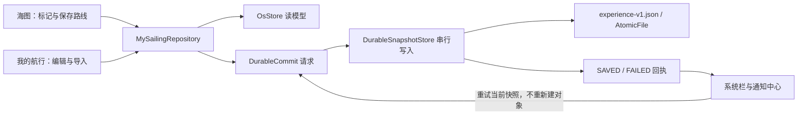

# experience.9 · 数据落盘与命令回执

2026-09-25，`codex/yokuli-os-rom`，versionCode 13。

本批落实 `NEXT_STEPS.md` 的 BUG-01～05。评审基线是 `b299911`；本批以已经修正访问返回关系的 `c3e3f49` 为起点。保留现有 Shell、应用边界与导航交互，不将评审中的长期 ROM 计划写成已完成能力。

## GPX 的数据含义

当前“我的航行”只接收 `wpt` 坐标和 `rte` 计划航线。含 `trk` 历史轨迹的文件整份拒绝并显示中英文原因，包括同时含坐标、路线的混合文件，不导入其中一半。`trkpt` 不再进入 Route，断开的 `trkseg` 不会被补线。

这批没有新增历史轨迹导入产品；未来必须为 RecordedTrack/TrackSegment 建立保存、预览和显式转换入口，不能把仓库里未启用的旧模块算作当前能力。原 8 MB、15000 点、坐标范围及 XML 输入限制保留，节点按 GPX 命名空间和所属层级识别。

## 保存成功需要磁盘回执

`MySailingRepository` 统一地点和计划航线的新增、编辑、删除、反向路线与 GPX 导入写入口。读模型仍由 `OsStore` 提供，保存返回 `DurableCommit`；更新读模型和完成磁盘写入是两个时间点。

`DurableSnapshotStore` 串行写入原 `experience-v1.json`，保持旧文件兼容。每个不可变快照有进程内 revision 和独立 Deferred 回执。队列最多等待 32 份；超出容量明确失败，不丢弃有回执的中间快照。显式文件 sync、AtomicFile 提交和主文件内容确认成功后才发 SAVED。失败保留当前内存模型，通知中心可重新提交当前快照，不再次执行新增对象命令。

系统栏显示保存中/未保存；通知中心展示失败与重试入口，不增减地图高度，不遮住地图按钮。页面离开不会取消进程内写入。若磁盘写入失败且进程随后被结束，未提交的内存改动仍可能丢失，界面明确提示这个边界。本批没有宣称跨多个文件或数据库原子恢复，也没有迁移导航会话所有权。

## 其余修复

- MapLibre 的虚线改用原生地理样式层表达，范围圈、COG 向量和测距线遵守同一 MapScene 语义；样式重载时重建，地图销毁时释放。
- 守锚操作使用进程内 commandId、sessionId、commandType 和执行回执。无关 NMEA 提示不清除等待；切页仍可观察请求；超时表示结果未知而非假定失败。重新确认复用原 ID；显式起锚仍可提交，按数据库确认结束后撤销旧请求，队列执行前再次检查终态，避免迟到的开始命令重开值守。
- 构建版本、Git 身份和渠道由根构建配置提供；备份和诊断读取实际宿主身份，区分 standalone/rom，保留既有 API Key 注入。

## 验证与后续边界

本地 `:app-shell:assembleRomDebug :app-shell:assembleStandaloneDebug` 已编译通过。按用户要求未运行单元测试、模拟器、真机或故障注入，也不等待 CI。实现描述不代表视觉效果、海上值守、磁盘故障和网络场景已通过验收。版本与源码标识随 APK、关于页、备份及支持包一致记录；APK 编译不等于完成 ROM 系统镜像构建。

评审中 GATE-01、ARCH-01～03、DATA-01、UX-01、MAP-01、SECURITY-01、ROM-01 的完整工作仍为后续批次：导航领域服务、完整备份、可信网络、独立进程和真实 ROM build/boot 不属于本批交付。
