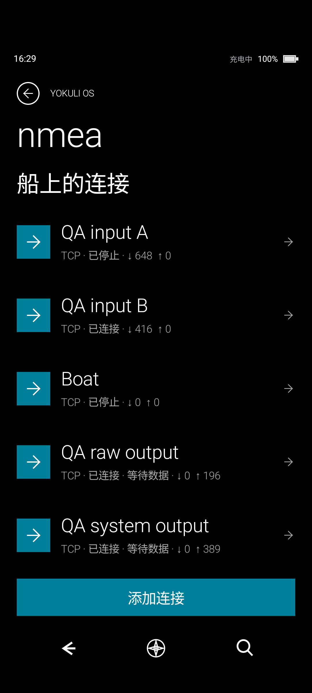

# 多连接实测 / Multi-connection verification

2026-09-09，`emulator-5554`，0.4.0-domains.1。仅使用本机回环 fixture，没有连接真实航海设备。

| 操作 / Action | 实际证据 / Observed result |
| --- | --- |
| 同时启动两个 TCP 输入与两个 TCP 输出 | A/B 接收独立数据；RAW 实际收到 A 的 RMC/GGA，SYSTEM 实际收到 RMC/GGA/VTG/HDT/XDR。系统位置与明确选择的 A 一致。 |
| 停止 B | A 接收计数继续，RAW/SYSTEM 写出继续，未重开 A。 |
| 重开 B，然后停止船位来源 A | B 仍在线；RAW 的 RMC/GGA 停在 98/98；SYSTEM 的 RMC/GGA/VTG 停在 77/77/77，HDT/XDR 从 84 增至 115。没有自动采用 B 的位置，也没有重复写出旧船位。 |
| 分别停止两个输出 | 主机实收总数维持 RAW 196、SYSTEM 593，后续没有新增语句。B 输入仍在线。 |
| 恢复测试前状态 | settings、vessel_data_settings、os_nmea_connections 三份原 DataStore 逐字节恢复；临时四条配置移除；收藏、地图和日志数据保留。Crash buffer 为空。 |

本轮修正了两个实际呈现问题：纯输出连接不再显示等待接收数据；来源选择页将可执行的“改用 B”与已选择但断开的 A 明确区分。

截图保留实测时的纯输出旧文案；箭头计数为真实接收/完成写出。

边界 / Limits: 本轮是有界的 TCP 实际验证，不声称验证了真机 GNSS 更新间隔、UDP 共享端口、重连压力或外部网关回送行为。UDP 隔离与回送防护已实现；其硬件与网络环境验收仍需分别进行。
