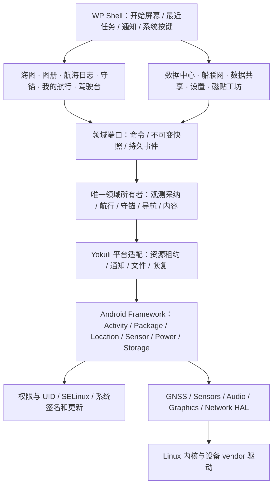
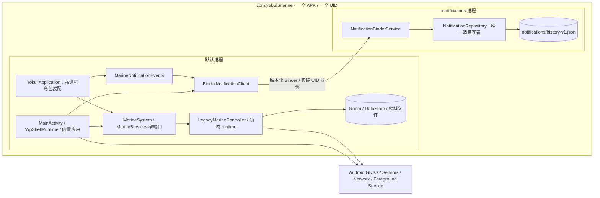
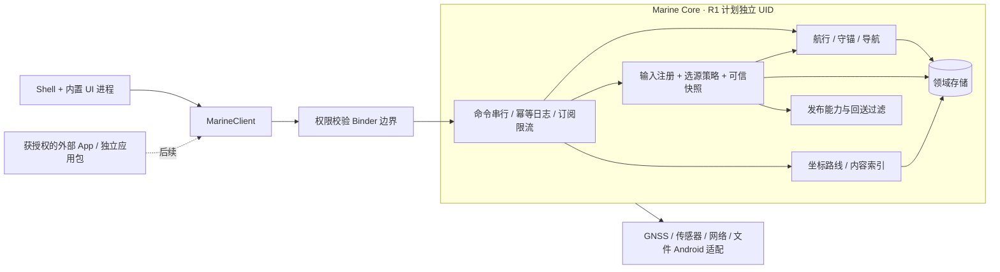

# 01 · 分层架构与迁移边界

状态：当前源码边界与后续设计分开维护。真实入口是 `app-shell/src/rebuild`；默认进程持有 Shell 与海事运行时，通知历史已接入同 APK/UID 的 `:notifications` Binder 服务。HOME/AOSP 产品输入已存在，完整 Marine Core 隔离、SystemUI、第三方 SDK 和 ROM 镜像仍未完成。最新详细接线见 [10 · 系统边界](10-INPROCESS-SYSTEM-BOUNDARIES.md)，阶段路线仍见 [08](08-ROADMAP-AND-ACCEPTANCE.md)。

## 产品边界

Yokuli OS 管理一艘船、一位设备使用者的一组可信读数和持续业务会话。屏幕上不同应用是同一工作环境中的不同工作台，不能各自打开 GPS、维护一套航行状态或重写数据来源。首版仍按单用户运行，不把 Android 多用户与多船档案假装成现成功能。

“应用独立”首先指职责、命令和数据所有权明确。需要故障隔离或第三方扩展时才引入进程与包边界。首版不把位置、风、气压、航行、守锚各拆成一个微服务。

## 从硬件到用户的层次

| 层 | 谁负责 | 首版决定 |
| --- | --- | --- |
| kernel / vendor / HAL | AOSP Cuttlefish，未来具体设备厂商适配 | 使用目标设备支持的实现；不自行绕过 HAL 读传感器，不承诺 USB-CAN/NMEA 2000 已支持 |
| framework / security | AOSP | 保留 ActivityManager、PackageManager、权限控制、SELinux、存储与音频策略 |
| 平台适配 | Yokuli Android adapter | 只调用明确授权的 API；提供资源租约、前台执行、系统通知、恢复判断与文件句柄 |
| 领域与数据 | Yokuli marine runtime | 一份来源决策、一份活动航行、一份守锚；业务状态由提交结果驱动 |
| 应用 | 各业务 UI | 拥有展示、筛选、编辑草稿与用户故事；业务提交经过对应领域端口 |
| Shell | WP Shell | 应用身份、页面调用链、磁贴、内部通知与 Home；不仲裁航海数据、不直接写业务数据库 |

Android 原生架构已经提供 kernel/HAL/framework/服务与应用边界；Yokuli 应在这些边界上扩展，而不是以全局单例模拟所有系统能力。[AOSP 架构](https://source.android.com/docs/core/architecture)

## 当前进程拓扑：真实接入与剩余边界

通知子进程的 Application 不创建 OsStore、MarineSystem、海事 Room、传感器或网络连接。消息服务由真实客户端绑定启动；主进程的领域事件桥与通知页面共享同一 Binder 客户端。消息历史单写，旧 `system-notifications.json` 只作为保留的迁移输入；Shell 不再写该文件，也不再持有领域事件消费游标。

这闭合了一个通知领域的 S1–S4 路径，不代表完整 Marine Core 已移走：来源、记录、守锚、AIS 仍在默认进程；导航冻结路线及索引仍由 OsStore 持有。主进程退出会影响这些运行时，消息进程不能替它们保持监控。两进程同 UID，不具有相互安全沙箱；普通 Binder 协议也不是 Stable AIDL 或第三方 SDK。最近任务仍是内部页面快照，不是 Android Recents 接管。

## R0：预置 HOME，不越级接管整个平台

- 将 `rom` flavor 声明为 HOME，预置到 `product/app`，产品配置覆盖 Launcher3/Launcher3QuickStep，使 Yokuli 成为唯一 HOME；APK 保持自身签名，不使用 `sharedUserId=android.uid.system`，不授予 platform 签名权限。
- 保留 Android SystemUI、Settings、权限确认、锁屏、紧急/恢复路径；Yokuli 内部导航键继续是 Back / Home / Notifications。
- Yokuli Home 回到开始屏幕；Android 系统 Home 将用户带到默认 HOME。系统权限页是外部 Activity，不能伪装成内部业务页面加入 Compose 栈。
- 开机未解锁时不读取加密的船位/历史，不启动发布服务。解锁后首次进入展示真实状态，不把页面打开当作开始航行或同意定位。
- 普通 APK flavor 保持原行为和原 key 注入方式。ROM 原型关闭 Google renderer，使用 MapLibre、离线底图和 OSM/网络图源；不依赖系统捆绑 GMS。在线提供方需要自身许可与配置；旧 GPS proxy 的 GMS 路径须明确不可用，不能据此阻断普通 LocationManager GNSS。

R0 的“应用安装”继续由 Android 包管理器执行。Yokuli 内置应用目录不能假称应用商店；APK 安装/卸载、第三方桌面入口、第三方通知接入各自需要后续明确产品与权限。

## R1：先抽端口，再移动一个领域服务

推荐目标为两个故障域：UI/HOME 与一个 **Marine Core** 服务。数据中心、船联网、数据共享仍是独立用户应用职责；其后台执行属于同一核心服务内的不同模块。大地图、海图解码可有受限工作进程，但不持有传感器或会话所有权。

迁移顺序必须逐步成立：

1. 在同进程实现 `MarineClient` 领域端口，移除页面对 `MainViewModel` 具体实现与 DAO 的直接依赖；返回不可变快照。
2. 将恢复、资源持有与命令调度从 UI 生命周期移出，明确每个状态的唯一持久化所有者。
3. 已以通知领域实现真实同 UID 子进程 Binder；其他领域按同样的契约/真实客户端/恢复闭环逐步迁移。独立服务 APK/UID 仍需另做授权与资料迁移。
4. 建立一次性数据迁移：旧 UID 导出带版本清单，受权新服务校验并导入，成功后写迁移标记；中断可重试，未成功前旧库不删。禁止让两个 UID 同时直接读写同一个 SQLite/DataStore 文件。
5. 迁移成功后 UI 只读接口；服务故障只影响实时能力，Shell 留在可恢复状态。领域健康不能由“Binder 已连接”代替。

同包子进程可隔离部分进程崩溃，但仍同 UID，Hilt 单例按进程重复。通知已经使用角色化 Application 和唯一文件写者；今后不能只给现有海事 Service 增加 `android:process`，否则会重复初始化连接、传感器及 DataStore/Room 所有者。

## 服务授权和系统边界

R1 使用专用签名级读/控制权限，服务显式 exported 并逐调用检查 Binder caller UID、Android user、签名与能力授权；包名和请求内自报 appId 不是安全身份。普通第三方集成默认拒绝；R5 外部 SDK 阶段才由受信任设置页发放只读、按能力/时限可撤销的授权，而不是放开整个服务。

只读导航数据、原始报文、位置历史、会话控制、对外发布、船舶偏好是不同能力。原始 NMEA 帧可能泄露位置，权限不得比规范化位置更宽。UI 请求 GPS 不得绕过 Android 运行时权限/AppOps；拒绝权限不会自动换用另一个来源。

不要把用户空间服务塞入 `system_server`。也不为修复拒绝访问将 SELinux 改成 permissive；需要新增原生组件时按进程最小权限单独制定和验证策略。[AOSP SELinux](https://source.android.com/docs/security/features/selinux)

Binder 接口设计见 [02](02-DOMAIN-AND-CONTRACTS.md)。跨独立更新组件使用显式版本契约；Stable AIDL 提供受控演进机制，但并不替我们设计鉴权、状态或迁移。[Stable AIDL](https://source.android.com/docs/core/architecture/aidl/stable-aidl)

## 共享复用与视觉一致性

海图、守锚、日志、我的航行共用 MapScene、地理覆盖物和地图 UX；只更换领域图层与主任务。数据格式和显示格式分离：存储使用规范单位，中文/英文与单位换算由共享 formatter 完成。每个应用拥有真实内容，设置仅用于偏好。

保留 WP 的层级标题、跟手 Pivot、返回到调用页、真实任务快照、应用冷开场与热恢复的区别。系统场景（权限、解锁、网络选择）采用 Android 提供的界面直到专项系统 UI 工作完成；不声称所有系统页面已 WP 化。

## 可实施的迁移完成标准

一次领域迁移须同时更新：所有者、状态机、命令/错误定义、真实客户端、源码适配位置、持久化迁移与故障恢复。编译和设备运行状态独立陈述；本轮不制作验收材料。若只完成 UI 重排，记录为 UI 工作；若只有 AIDL/schema，记录为协议草案；只有运行时、生命周期与调用方均接通后才能标记“服务完成”。
