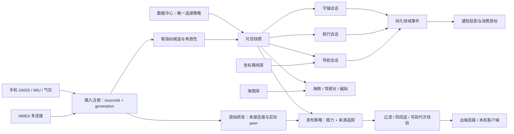

# 02 · 领域所有权、数据字典与服务协议

本章同时维护**当前所有权/接入路径**与**后续全域协议设计**。通知领域已通过版本化 Binder 接入同包消息进程，完整海事运行时及第三方 SDK 仍未迁移；具体边界见 [10](10-INPROCESS-SYSTEM-BOUNDARIES.md) 与 [通知契约](../product/NOTIFICATION_CENTER_CONTRACT.md)。下方标为“计划”的通用 schema 仍是设计，不能冒充已编译声明。实际签名以 [API 索引](../product/API_INDEX.md) 和链接生产代码为准。

## 一份事实对应一个所有者

| 事实 / 聚合 | 当前所有者 | 目标唯一写入者 | 用户入口 / 消费者 |
| --- | --- | --- | --- |
| 原始输入、连接身份及代次 | `NmeaConnectionStore`、连接运行时；手机 repository | Marine Core 的 InputRegistry/Transport 模块 | 船联网管理连接；数据中心查看来源 |
| 字段选源、候选、可信读数 | `VesselSettingsRepository`、`VesselSourceRegistry / VesselDataHub`、`AcceptedPositionRepository` | Marine Core 的 SourcePolicy/DataHub 模块 | 数据中心修改；其他应用和分享只读 |
| 手机安装、方向校准、定位意图 | `AppSettings / VesselMountCalibrationRepository` 与资源运行时 | Marine Core 的 DeviceInputPolicy 模块 | 数据中心；通知中心只导航到数据中心，不直接执行校准 |
| 航行会话、样本、事件 | `TripRuntime` + Room | Voyage 模块 | 海图/日志/快捷项都是同一组命令 |
| 守锚会话、锚点、范围与告警 | `AnchorWatchRuntime` + Room | Anchor 模块 | 守锚主界面；Shell/地图仅反映状态 |
| 活动导航及冻结路线版本 | `OsStore.activeRouteId/navigationRoute` + JSON | Navigation 模块；R0 保持现状 | 海图和我的航行启动；其他应用只读 |
| 坐标、路线、收藏锚地 | `MySailingRepository`、JSON/Room | SailingContent 模块 | 我的航行主编辑；地图提交标记；锚地只是坐标类型 |
| 海图文件夹、索引、优先级图层 | `ChartLibrary` | ChartCatalog 模块 | 图册管理；地图按版本读取 |
| 对外发送与本机监听 | 连接输出配置、`LocalNmeaServerSettingsRepository` | Publication 模块；每个目的地独立策略 | 船联网管理远端；数据共享管理本机服务器 |
| 船名、单位、校准等领域偏好 | 现有 DataStore repositories | VesselPreferences；原子更新 | 设置/数据中心按字段授权 |
| 语言、主题、文字大小、磁贴与布局 | `LauncherPersistedState` / Shell preferences | Shell preference store | 设置与磁贴工坊；不另存同名字段 |
| 领域事件与通知历史 | 业务 Room/AIS 事件；消息子进程 `NotificationRepository` | 原领域留警报与任务；消息服务单写历史、已读、聚合与消费游标；Shell 只拥有面板/提示 | `NotificationClient` 发布/订阅/清除；清除不确认警报 |
| 页面、返回链、地图视口与草稿 | Shell task state、各应用 saveable state | Shell / 所属应用 | 不写入航行或守锚的运行状态 |

多个模块可以位于同一个 Marine Core 进程。表格划分的是写入权限，不要求每行建立数据库、服务或远程 API。



## 公共语义

- `sourceId` 稳定标识物理/逻辑提供方；IP 地址、名称和重连代次不作主键。一个连接可以承载多个 talker/仪器候选。
- 质量、年龄、连接状态、用户运行意图是四件事：连接断开不擦除最后观测；空字段不刷新旧读数的采样时间；关闭来源也不把旧值伪造成实时值。
- 位置、SOG、COG、真船首向、横倾各自计时。COG 是对地运动方向，不能代替船首向。角度明确 TRUE/MAGNETIC/RELATIVE_TO_BOW。
- IPC 统一采用米、米/秒、秒、帕、摄氏度、十进制度；当前 legacy 的 knots/hPa/nm 由边界适配器显式换算。**R0 不执行批量改存量单位**，不能给旧值直接换单位标签。
- `elapsedRealtime` 只在相同 `bootId` 内可比较；UTC 只作显示、跨设备记录和排序辅助，不能单独推导新鲜度。没有可信源时 value 为 null；0 是真实测量值。
- 展示允许灰显历史值与时间；守锚、导航向量和输出分别检查其业务可用性。界面“不再显示不可用”不意味着警报可以使用失效位置。

## 核心数据 schema（计划）

```kotlin
/** 跨进程版本协商结果；major 不兼容时拒绝控制命令。 */
data class ProtocolInfo(
    val major: Int,                 // 破坏性协议版本
    val minor: Int,                 // 只增补可选字段的版本
    val schemaHash: String,         // 发布时冻结的接口摘要
    val serviceInstanceId: String, // 本次服务进程启动身份
    val bootId: String,             // 本次设备开机身份，不向外暴露硬件标识
    val capabilities: Set<String>, // 本实现支持的命令/指标；不等于调用方获授权
)

/** 所有领域聚合按 revision 并发控制，拒绝过期页面覆盖新设置。 */
data class EntityRef(
    val id: String,       // 稳定身份；迁移保留旧数字 ID 到新 ID 的映射
    val revision: Long,   // 每次成功提交递增；不能用更新时间替代
)

/** 单字段观测。实际 AIDL 必须使用有类型的 payload/union，不能传 Any 或 NaN。 */
data class Observation<T>(
    val metricId: String,             // 稳定指标名，例如 position、heading.true
    val value: T?,                    // 有限值或 null；位置含 lat/lon/accuracyMeters
    val unit: String,                 // 规范单位；由指标字典约束
    val reference: String?,           // 真北/磁北/船体坐标系等参考系
    val sourceId: String,             // 输入注册表稳定来源 ID
    val sourceGeneration: Long,       // 连接重建/传感器重新启动时递增
    val bootId: String,               // 用于拒绝跨开机的单调时钟比较
    val sourceTimeUtcMs: Long?,       // 报文带的测量时间，可能缺失或不可信
    val receivedElapsedMs: Long,      // 本机实际收到该字段的单调时间
    val receivedUtcMs: Long,          // 本机收到时的墙钟，仅供展示/记录
    val validity: String,             // VALID / INVALID / UNKNOWN
    val freshness: String,            // FRESH / HELD / STALE；派生，不能由 UI 改写
    val validForMs: Long,             // 指标有效窗口，不能因其他字段更新而续期
    val quality: String,              // GOOD / DEGRADED / UNKNOWN
    val reasonCode: String?,          // 缺失、质量/参考系问题的机器可读原因
    val lineage: List<SourceRef>,     // 派生值依赖链；转发保留原来源
)

data class SourceRef(
    val id: String,           // 原始来源身份
    val generation: Long,    // 实际采集/连接代次
    val peerAddress: String?,// 实际接收端 IP；用于防回送，不用显示名代替
)

data class SourcePolicy(
    val ref: EntityRef,                  // 指标策略 ID 与版本
    val metricId: String,                // 选择哪个字段的来源
    val mode: String,                    // OFF / PINNED / AUTO
    val pinnedSourceId: String?,         // PINNED 时必须存在
    val allowedAutoSourceIds: List<String>, // AUTO 仅在用户批准的候选间选择
    val switchReason: String?,           // 当前采纳原因，供 UI 解释
)

data class VesselSnapshot(
    val sequence: Long,                   // 本服务实例内快照序号
    val serviceInstanceId: String,        // 重连后识别序列重置
    val policyRevision: Long,             // 此快照采用的策略版本
    val readings: List<TypedObservation>, // 类型化的已采纳观测
    val candidates: List<SourceCandidate>,// 按授权请求提供，不能无限嵌套
)
```

`TypedObservation / SourceCandidate` 为拟议的类型化传输模型，占位名称没有现成实现。AIDL 冻结前必须完整声明 union、合法单位、范围和最大条数；本章不把 Kotlin 泛型代码当成已可发布的 Parcelable。

## 会话、配置与内容字典（计划）

| 类型 | 核心字段与中文含义 | 不变量 |
| --- | --- | --- |
| `ExecutionLease` | id 租约；owner 会话/功能；bootId 开机；requestedBy 操作者；purpose 用途；sourceIds 输入；grantedAt 授权时间；revokedAt 撤销 | 配置不产生租约；Stop 先持久撤销再拆资源；跨开机失效 |
| `VoyageSession` | ref 身份版本；phase 状态；startedAt/endedAt 时间；pausedAt/pausedDuration 暂停；segments 轨迹段引用；sourcePolicyRevision 来源策略；gaps 中断事件 | 每设备最多一个活动航行；暂停不等于结束；不跨中断连直线 |
| `AnchorSession` | ref；phase；anchorPoint 锚点；centerState 未解/估计/已确认；radiusMeters 警戒半径；positionBinding 固定船位来源；watchEpoch 值守代次；alarms 事件引用 | Pause 保留锚点范围历史；Lift 结束；估算没有足够证据不产生可应用候选 |
| `NavigationSession` | ref；routeId；routeRevision；routeSnapshot 冻结点序列；activeLeg 当前航段；phase；sourcePolicyRevision | 路线编辑不更改活动冻结版本；路线预览不创建导航会话；重启需确认 |
| `NmeaConnection` | ref；name；transport TCP/UDP；host/port/localPort；receive/send；requestedLeaseId；state；generation；actualPeers | 每条连接独立生命周期；连接建立不自动变为系统船位 |
| `PublicationPolicy` | ref；destinationId；mode SYSTEM/RAW；capabilities 能力集合；forwardSourceIds 原始输入；maxAgeByMetric；loopGuard | 无能力选择即不发布；SYSTEM 只读采纳快照；RAW 按来源和目的地过滤 |
| `LocalServer` | ref；port；bindingPolicy 网络接口；runLeaseId；state；clients；publicationPolicyId | 用户按开始才监听；不自动选择手机为来源；输出计数只计真实写入 |
| `Place / Route` | ref；kind；name；coordinates；note；collectionId；orderedPointRefs/冻结坐标 | 锚地属于 Place 类型；删除被导航引用的路线不破坏已冻结会话 |
| `ChartFolder / Layer` | ref；treeUri；accessState；scanRevision；files；priority；layerName；enabled | SAF 授权可撤销；无权限标记需重新授权；渲染按固定优先级而非加载完成顺序 |
| `UserPreferences` | revision；locale；unitSystem；coordinateFormat；vesselName；display 与 layout 独立命名空间 | 更改显示单位不改历史值；船舶数据与 Shell 外观按所有者分别写入 |
| `DomainEvent` | eventId；aggregateRef；type；occurredAt；bootId；sequence；payload；causationRequestId | 领域事件不可通过通知中心删除；同请求重复提交不重复生成 |
| `NoticeProjection` | noticeId；domainEventId；publisherAppId；messageKey/args；severity；destination；consumedAt | 内容本地化不改变事件身份；消费不调用 Pause/Lift/Snooze |

R0 对应的真实类型有 `NmeaConnectionSpec / Snapshot / RawFrame`、`VesselObservation`、`VoyageSessionState`、Room 各会话实体和 JSON 地图模型，不能将上表字段当成已存在的存储列。

## 命令与结果协议（计划）

```kotlin
data class CommandEnvelope(
    val requestId: String,           // 客户端生成 UUID；超时重试沿用同一个 ID
    val protocolMajor: Int,          // 控制命令要求兼容的主版本
    val command: String,            // 稳定命令名，未知命令明确拒绝
    val aggregateId: String?,       // 目标会话/配置；创建时可为空
    val expectedRevision: Long?,    // 要求在指定版本上修改，防止过期页面操作
    val userGestureToken: String?,  // 服务签发的短时授权凭据；不是客户端布尔值
    val payload: TypedCommand,      // 类型化参数，不接受任意 Intent/extras 调度
)

data class CommandResult(
    val requestId: String,          // 与原请求对应
    val status: String,             // ACCEPTED / APPLIED / REJECTED / FAILED
    val resultingRef: EntityRef?,   // 已提交的真实版本，ACCEPTED 不保证已完成
    val eventId: String?,           // 成功事件定位
    val error: DomainError?,        // 结构化错误；不能要求 UI 解析英文句子
)

data class DomainError(
    val code: String,               // 稳定码，见下表
    val messageKey: String,         // 中英文资源键
    val recoverable: Boolean,       // 能否由用户操作恢复
    val retryAfterMs: Long?,        // 仅提示最早重试时间，不触发自动控制
    val blockingOwnerIds: List<String>, // 哪些活动会话依赖待停止资源
    val suggestedDestination: String?,  // 可选明确页面，不自动跳转
)
```

调用身份从 `Binder.getCallingUid()` 和权限解析，**不接受 CommandEnvelope 自报 UID/包名作为权限依据**。内部签名应用的显式控制权也不等于可替用户静默创建租约；开始定位、值守、导航、对外发布分别需要明确用户操作。

| 错误码 | 含义 / UI 处理 |
| --- | --- |
| `PERMISSION_REQUIRED` / `CAPABILITY_DENIED` | Android 权限或服务能力授权不足；保留页面与草稿，指向对应授权流程 |
| `REVISION_CONFLICT` | 页面拿着旧版本；重新读并提示变动，不覆盖新锚点/来源 |
| `SOURCE_OFF` / `SOURCE_WAITING` / `SOURCE_STALE` / `SOURCE_INVALID` | 来源未运行、尚未收到、过期或明确无效；保留最后读数及时间，不伪装实时 |
| `DEPENDENCY_IN_USE` | GPS/连接被活动会话持有；列出依赖，给明确暂停/停止工作流 |
| `REQUIRES_RESUME_CONFIRMATION` | 重启/升级/状态不确定；显示恢复页，不自行执行旧 Start |
| `STORAGE_UNAVAILABLE` / `STORAGE_FULL` | 无法确认持久化；不显示保存成功，不擦除未确认数据 |
| `VERSION_UNSUPPORTED` / `COMMAND_UNKNOWN` | 不兼容客户端；只读模式或升级，不猜测替代命令 |
| `REQUEST_ID_REUSED` | 相同 requestId 被用于不同 payload；拒绝，防止不确定重试 |

幂等约定：持久命令日志以 `(Android user, caller identity, requestId)` 唯一索引，保存参数摘要及最终结果；状态修改、领域事件和 APPLIED 结果在同一事务提交。再次收到相同请求返回原结果；不同摘要拒绝。涉及网络副作用时写 outbox 与 generation，不能保证远端 NMEA 接收“恰好一次”；只保证本机不会把未确认输出说成成功。日志保留策略和分页额度在真正发布协议前固定，不能无限积累。

## 拟议接口清单

以下是端口清单，不意味着每个端口一个 Binder 对象/进程。首版可由一个受权服务提供。

| 端口 | 读 / 订阅 | 命令 |
| --- | --- | --- |
| `ProtocolPort` | getProtocolInfo、getGrantedCapabilities、getHealth | 无 |
| `DataPort` | subscribeSnapshot、listSources、getSourcePolicy | setSourcePolicy、enablePhoneInput、disablePhoneInput、confirmMount |
| `ConnectionPort` | listConnections、subscribeConnectionState、pagedDiagnostics | create/update/deleteConnection、connect、disconnect |
| `PublicationPort` | getPolicy、getServerState、listClients | setPolicy、startServer、stopServer、setRemotePublication |
| `VoyagePort` | getActive、listHistory、getTrackPage、subscribeSession | start/pause/resume/finish、addMoment、rename、export、deleteHistory |
| `AnchorPort` | getSession、subscribeWatch、listEvents、getCoverage | drop/arm/pause/resume/lift、setRadius、estimate/applyCenter、snooze |
| `NavigationPort` | getNavigation、subscribeNavigation | start、pause、resume、advanceLeg、end |
| `SailingContentPort` | list/getPlaces、list/getRoutes、getCollections | CRUD、import/export；地图预览属于 UI 请求不启动业务 |
| `ChartCatalogPort` | listFolders/files/layers、subscribeScan | grantFolder、scan、rename、reorder、enable、unlink、deleteOwnedCache |
| `PreferencePort` | getPreferences、observeRevision | patchOwnNamespace；范围/来源等不借通用 preference 绕过领域校验 |
| `EventPort` | eventsAfterCursor、subscribeEventHint | 计划中的领域消费游标由对应消费者所有者保存；本轮通知游标实际由消息服务单写，Shell 只保存画面状态；领域 acknowledge 是 AnchorPort 命令 |
| `HealthPort` | storage/network/provider/runtime health、redactedSupportBundle | exportDiagnostics；无远程 shell、任意路径读取或数据库执行 |

Shell 自己保留 `open / openLinked / openSystemDestination / back / home`，不由 Marine Core 管理 Compose 页面栈。外部应用地址要求 `appId + destination + objectId + callerContinuation`，路由注册白名单验证对象权限，不能把任意字符串当 Intent URI 执行。

## 订阅、版本与数据体积

- 每个调用方先拿全量快照再订阅 sequence 更新。断线/服务 instance 改变后重新取全量；不重放 Start、Resume、Publish 等控制命令。
- 高频传感器在服务侧采样/聚合；UI 默认限频到实际显示需要。只读快照可 latest-only 合并，持久领域事件必须按游标分页补齐，溢出返回 resyncRequired。
- Binder 传小型结构化控制/读模型；海图瓦片、GPX、图片、长轨迹使用授权文件描述符或分页，不塞进一个大 Parcelable。设置最大条数/文本长度/订阅数；client death 清理订阅，不结束持久业务租约。
- 首次对外发布前冻结 major=1 与 hash。增加可选字段有默认值；删除/改单位/改语义需 major。未知 enum 保留 UNKNOWN 并禁止相关控制，不能 silently 使用首个枚举。
- 数据库 schemaVersion、IPC protocolVersion、ROM buildVersion 分别演进。兼容适配不能借一个数字掩盖三个不同契约。升级前记录三者及数据备份校验信息。

Stable AIDL 的接口版本与兼容检查可作为实现工具；它不取代本章的业务兼容、caller 权限和迁移规则。[AOSP Stable AIDL](https://source.android.com/docs/core/architecture/aidl/stable-aidl)

## 新功能接入路径

这是现有架构上的实施指南，不另建示例框架。先从 [真实系统边界](10-INPROCESS-SYSTEM-BOUNDARIES.md) 确认旧路径与当前适配，不能只依据上文拟议的 `*Port` 名称实现。

1. **明确任务和所有者。** 写清用户完成什么、空值/错误/中断怎么结束；选择已有领域所有者。通知不是警报所有者，分享不是选源所有者，地图预览不是导航/记录会话。
2. **扩展窄契约。** 以不可变类型声明稳定对象 ID、规范单位、时间基准、来源、质量、revision/epoch 和能力原因。命令说明 requestId、必要 expectedRevision、结果是否只是受理或已持久化。历史与原始流走有界分页，不加入高频全系统快照。暂时保留的 legacy DTO 只供原迁移消费者；新远程接口不继续暴露它们。
3. **唯一执行入口。** 新执行由原 runtime/repository 实现。通过 `MarineSystem`/对应客户端接线，再替换所有真实入口；旧直连调用退出，兼容桥写明剩余调用者和撤除条件。不能既保留本地写文件又让远程服务写同一文件。
4. **发布真实事件。** 使用领域稳定事件 ID、首次/最近时间、对象描述与结构化标题正文。消息服务聚合与存储，Shell 本地化及呈现。活动任务读取原会话；业务确认/暂停由原命令协调器处理。
5. **接入真实页面。** 在实际 `app-shell/src/rebuild` 中注册并使用现有页面/地图/仪表组件。`ReportVisibleAppRoute` 报告实际子页；跨应用对象走明确地址与保存调用者的访问。地图、AIS 雷达/三维只读同一对象；历史图不注入当前船位/实时目标。相机和未提交草稿保留在页面实例。
6. **补齐平台与生命周期。** 传感器或网络交由已授权 adapter，不在 Composable 开 socket。显示需求申请自己的 `DisplayLease`，不可见/关闭释放；长期命令不依赖页面 scope。权限拒绝、服务死锁/断连、数据过期、存储失败都有真实可恢复状态。
7. **同步接口与边界。** 更新本章所有者、通知/来源/导航子契约及 API 索引；若改进程、协议或平台装配，一并改 03/05/10 与 ROM 入口。只在真实客户端已接通时记录迁移完成；必要编译不能当作设备能力证明。

### 已接入的通知示例

纯类型在 `core:runtime-contract/.../notification/NotificationContract.kt`。消息发布为 `NotificationClient.execute(NoticeCommand(...))`，读方订阅 `snapshot` 和 `connection`；`NoticeTarget(domain, objectType, objectId, section)` 传对象描述，Shell 才把它映射为已有白名单地址。请求与结果都保留 requestId；`COMPLETED` 指落盘完成，`UNKNOWN` 通过 `result(requestId)` 查询原请求，不能自动重新发布。真实消费者为 `SystemNotificationStore` 与 `NotificationCenter`，详情见 [通知契约](../product/NOTIFICATION_CENTER_CONTRACT.md)。

此模式不是要求新功能都走通知 Binder：守锚仍使用自身命令回执，AIS 仍使用唯一交通服务，导航仍需另行迁出 Shell。它说明契约、真实执行、客户端和旧路径退出必须一起完成。
