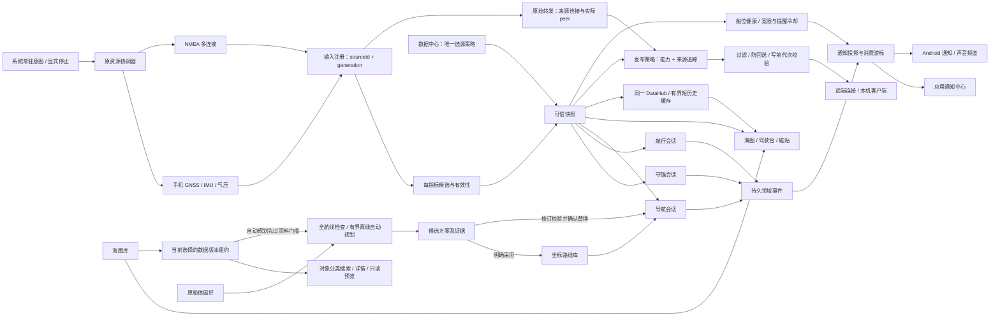
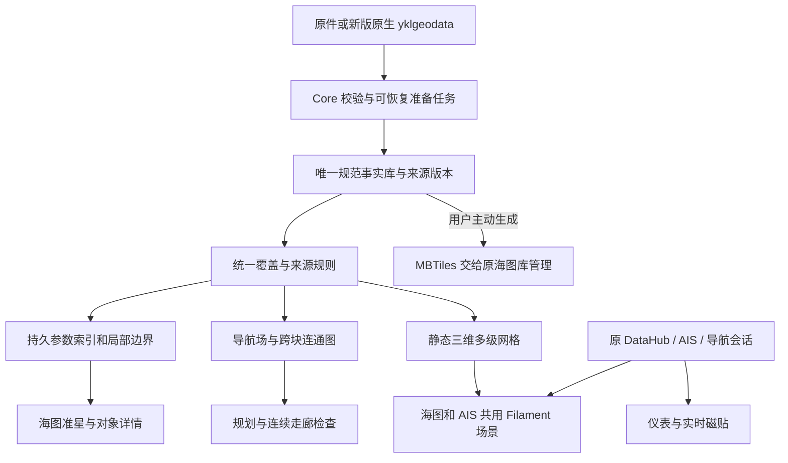
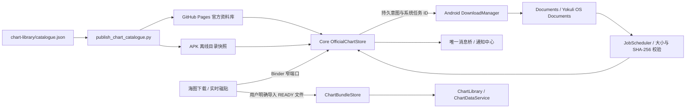

# 02 · 领域所有权、数据字典与服务协议

本章同时维护**当前所有权/接入路径**与**后续全域协议设计**。通知领域已接入同包消息进程，MarineSystem 窄端口已通过私有 Binder 接入默认 Core，已接入 .ykl 内部应用 SDK 2（JS / Kotlin/JS）；不支持原生 APK 插件；具体边界见 [10](10-INPROCESS-SYSTEM-BOUNDARIES.md) 与 [通知契约](../product/NOTIFICATION_CENTER_CONTRACT.md)。下方标为“计划”的通用 schema 仍是设计，不能冒充已编译声明。实际签名以 [API 索引](../product/API_INDEX.md) 和链接生产代码为准。

## 一份事实对应一个所有者

| 事实 / 聚合 | 当前所有者 | 目标唯一写入者 | 用户入口 / 消费者 |
| --- | --- | --- | --- |
| 环境、场景、时钟及原始记录 | `LocalHardwareLabService` + `MarineTime / MarineDeviceBus` | `MarineSystem.hardware` | 演练室、获授权 `.ykl`；页面不生成设备观测 |
| 原始输入、连接身份及代次 | `NmeaConnectionStore`、连接运行时；手机 repository | Marine Core 的 InputRegistry/Transport 模块 | 船联网管理连接；数据中心查看来源 |
| 字段选源、候选、可信读数 | `VesselSettingsRepository`、`VesselSourceRegistry / VesselDataHub`、`AcceptedPositionRepository` | Marine Core 的 SourcePolicy/DataHub 模块 | 数据中心修改；其他应用和分享只读 |
| 手机安装、方向校准、定位意图 | `AppSettings / VesselMountCalibrationRepository` 与资源运行时 | Marine Core 的 DeviceInputPolicy 模块 | 数据中心；通知中心只导航到数据中心，不直接执行校准 |
| 系统常驻意图与显式停止 | `RuntimeResidencyRepository` + 原 `YokuliRuntimeCoordinator` | `MarineSystem.residency` | 前台进入申请常驻，Settings/退出磁贴共用完整退出；页面关闭不释放系统采集 |
| 仪表短历史 | Core `LocalReadingHistoryService` + `ReadingHistoryCache`；Shell `DataHub` 只读 | 现有可信快照的有界只读投影 | 后台持续保留 15 分钟实际样本；同设备开机恢复，不能冒充当前值或接续跨进程曲线 |
| 航行会话、样本、事件 | `TripRuntime` + Room | Voyage 模块 | 海图/日志/快捷项都是同一组命令 |
| 守锚会话、锚点、范围与告警 | `AnchorWatchRuntime` + Room | Anchor 模块 | 守锚主界面；Shell/地图仅反映状态 |
| 活动导航及冻结路线版本 | `LocalNavigationSessionService` + 原子文件 | `MarineSystem.navigation` | 海图和我的航行发命令；驾驶台、地图和磁贴读取同一会话 |
| 坐标、路线、收藏锚地 | `MySailingRepository`、JSON/Room | SailingContent 模块 | 我的航行主编辑；地图提交标记；锚地只是坐标类型 |
| 海图文件夹、文件顺序、显示快照 | `ChartLibrary` | ChartCatalog 模块 | 图册海图页直接选用，一个文件夹自动生成一个显示组；无独立创建图层操作 |
| 结构化数据包、图幅、对象、更新链、用途和索引 | `LocalChartDataService` + 版本化 SQLite/RTree | `MarineSystem.charts` | 图册按资料包管理与对象浏览；当前地图单选包内数据，查询、三维与分析持有同一来源的快照租约 |
| 航线检查、候选、避让区、作业结果 | `LocalPassagePlanningService` + 原子工作区 | `MarineSystem.analysis/planning` 同一实例 | 海图提交不可变请求，确认候选才写现有草稿或导航会话 |
| 对外发送与本机监听 | 连接输出配置、`LocalNmeaServerSettingsRepository` | Publication 模块；每个目的地独立策略 | 船联网管理远端；数据共享管理本机服务器 |
| 船名、单位、校准等领域偏好 | 现有 DataStore repositories | VesselPreferences；原子更新 | 设置/数据中心按字段授权 |
| 语言、主题、文字大小 | `LauncherPersistedState` / Shell preferences | Shell preference store | 设置管理系统偏好 |
| 磁贴内容、表现与布局 | `TileBinding` / `TilePresentation` / `StartDocument` | Shell 引擎与原 Proto DataStore | 应用列表/工坊固定内容，Start 编辑既有实例，共用临时编辑器；工坊默认提供航行组合，按内容去重、按实例提交 |
| 领域事件与通知历史 | 业务 Room/AIS 事件；消息子进程 `NotificationRepository` | 原领域留警报与任务；消息服务单写历史、已读、聚合与消费游标；Shell/Android 只作呈现 | `NotificationClient` 发布/订阅/清除；领域 RESOLVE 解除持续状态，清除不确认警报；声音尊重 Android 频道设置 |
| 页面、返回链、地图视口与草稿 | Shell task state、各应用 saveable state | Shell / 所属应用 | 不写入航行或守锚的运行状态 |

多个模块可以位于同一个 Marine Core 进程。表格划分的是写入权限，不要求每行建立数据库、服务或远程 API。


```mermaid
flowchart LR
    Resident[系统常驻意图 / 显式停止] --> Resources[原资源协调器]
    Resources --> Phone
    Resources --> Nmea
    Phone[手机 GNSS / IMU / 气压] --> Input[输入注册：sourceId + generation]
    Nmea[NMEA 多连接] --> Input
    Input --> Candidates[每指标候选与有效性]
    Policy[数据中心：唯一选源策略] --> Accepted[可信快照]
    Candidates --> Accepted
    Accepted --> Anchor[守锚会话]
    Accepted --> Trip[航行会话]
    Accepted --> Nav[导航会话]
    Accepted --> Views[海图 / 驾驶台 / 磁贴]
    Accepted --> History[同一 DataHub / 有界短历史缓存]
    History --> Views
    Accepted --> Pub[发布策略：能力 + 来源追踪]
    Input --> Raw[原始转发：来源连接与实际 peer]
    Raw --> Pub
    Pub --> Guard[过滤 / 防回送 / 写前代次校验]
    Guard --> Out[远端连接 / 本机客户端]
    Places[坐标路线库] --> Nav
    Charts[海图库] --> Views
    Charts --> Snapshot[当前选择的数据版本租约]
    Snapshot --> Browse[对象分类搜索 / 详情 / 只读预览]
    Snapshot -->|自动规划先过资料门槛| Planner[全航线检查 / 有界离线自动规划]
    Vessel[原船体偏好] --> Planner
    Planner --> Candidate[候选方案及证据]
    Candidate -->|明确采用| Places
    Candidate -->|修订校验并确认替换| Nav
    Anchor --> Events[持久领域事件]
    Trip --> Events
    Nav --> Events
    Events --> Notices[通知投影与消费游标]
    Accepted --> PositionHealth[船位健康 / 宽限与提醒冷却]
    PositionHealth --> Notices
    Notices --> AppNotices[应用通知中心]
    Notices --> AndroidNotices[Android 通知 / 声音频道]
```

## 公共语义

- `sourceId` 稳定标识物理/逻辑提供方；IP 地址、名称和重连代次不作主键。一个连接可以承载多个 talker/仪器候选。
- 质量、年龄、连接状态、用户运行意图是四件事：连接断开不擦除最后观测；空字段不刷新旧读数的采样时间；关闭来源也不把旧值伪造成实时值。
- 位置、SOG、COG、真船首向、横倾各自计时。COG 是对地运动方向，不能代替船首向。角度明确 TRUE/MAGNETIC/RELATIVE_TO_BOW。
- IPC 统一采用米、米/秒、秒、帕、摄氏度、十进制度；当前 legacy 的 knots/hPa/nm 由边界适配器显式换算。**R0 不执行批量改存量单位**，不能给旧值直接换单位标签。
- `elapsedRealtime` 只在相同 `bootId` 内可比较；UTC 只作显示、跨设备记录和排序辅助，不能单独推导新鲜度。没有可信源时 value 为 null；0 是真实测量值。
- 展示允许灰显历史值与时间；守锚、导航向量和输出分别检查其业务可用性。界面“不再显示不可用”不意味着警报可以使用失效位置。

## 核心数据 schema（计划）

```kotlin
/** 跨进程版本协商结果；major 不兼容时拒绝控制命令。 */
data class ProtocolInfo(
    val major: Int,                 // 破坏性协议版本
    val minor: Int,                 // 只增补可选字段的版本
    val schemaHash: String,         // 发布时冻结的接口摘要
    val serviceInstanceId: String, // 本次服务进程启动身份
    val bootId: String,             // 本次设备开机身份，不向外暴露硬件标识
    val capabilities: Set<String>, // 本实现支持的命令/指标；不等于调用方获授权
)

/** 所有领域聚合按 revision 并发控制，拒绝过期页面覆盖新设置。 */
data class EntityRef(
    val id: String,       // 稳定身份；迁移保留旧数字 ID 到新 ID 的映射
    val revision: Long,   // 每次成功提交递增；不能用更新时间替代
)

/** 单字段观测。实际 AIDL 必须使用有类型的 payload/union，不能传 Any 或 NaN。 */
data class Observation<T>(
    val metricId: String,             // 稳定指标名，例如 position、heading.true
    val value: T?,                    // 有限值或 null；位置含 lat/lon/accuracyMeters
    val unit: String,                 // 规范单位；由指标字典约束
    val reference: String?,           // 真北/磁北/船体坐标系等参考系
    val sourceId: String,             // 输入注册表稳定来源 ID
    val sourceGeneration: Long,       // 连接重建/传感器重新启动时递增
    val bootId: String,               // 用于拒绝跨开机的单调时钟比较
    val sourceTimeUtcMs: Long?,       // 报文带的测量时间，可能缺失或不可信
    val receivedElapsedMs: Long,      // 本机实际收到该字段的单调时间
    val receivedUtcMs: Long,          // 本机收到时的墙钟，仅供展示/记录
    val validity: String,             // VALID / INVALID / UNKNOWN
    val freshness: String,            // FRESH / HELD / STALE；派生，不能由 UI 改写
    val validForMs: Long,             // 指标有效窗口，不能因其他字段更新而续期
    val quality: String,              // GOOD / DEGRADED / UNKNOWN
    val reasonCode: String?,          // 缺失、质量/参考系问题的机器可读原因
    val lineage: List<SourceRef>,     // 派生值依赖链；转发保留原来源
)

data class SourceRef(
    val id: String,           // 原始来源身份
    val generation: Long,    // 实际采集/连接代次
    val peerAddress: String?,// 实际接收端 IP；用于防回送，不用显示名代替
)

data class SourcePolicy(
    val ref: EntityRef,                  // 指标策略 ID 与版本
    val metricId: String,                // 选择哪个字段的来源
    val mode: String,                    // OFF / PINNED / AUTO
    val pinnedSourceId: String?,         // PINNED 时必须存在
    val allowedAutoSourceIds: List<String>, // AUTO 仅在用户批准的候选间选择
    val switchReason: String?,           // 当前采纳原因，供 UI 解释
)

data class VesselSnapshot(
    val sequence: Long,                   // 本服务实例内快照序号
    val serviceInstanceId: String,        // 重连后识别序列重置
    val policyRevision: Long,             // 此快照采用的策略版本
    val readings: List<TypedObservation>, // 类型化的已采纳观测
    val candidates: List<SourceCandidate>,// 按授权请求提供，不能无限嵌套
)
```

`TypedObservation / SourceCandidate` 为拟议的类型化传输模型，占位名称没有现成实现。AIDL 冻结前必须完整声明 union、合法单位、范围和最大条数；本章不把 Kotlin 泛型代码当成已可发布的 Parcelable。

## 会话、配置与内容字典（计划）

| 类型 | 核心字段与中文含义 | 不变量 |
| --- | --- | --- |
| `ExecutionLease` | id 租约；owner 会话/功能；bootId 开机；requestedBy 操作者；purpose 用途；sourceIds 输入；grantedAt 授权时间；revokedAt 撤销 | 配置不产生租约；Stop 先持久撤销再拆资源；跨开机失效 |
| `VoyageSession` | ref 身份版本；phase 状态；startedAt/endedAt 时间；pausedAt/pausedDuration 暂停；segments 轨迹段引用；sourcePolicyRevision 来源策略；gaps 中断事件 | 每设备最多一个活动航行；暂停不等于结束；不跨中断连直线 |
| `AnchorSession` | ref；phase；anchorPoint 锚点；centerState 未解/估计/已确认；radiusMeters 警戒半径；positionBinding 固定船位来源；watchEpoch 值守代次；alarms 事件引用 | Pause 保留锚点范围历史；Lift 结束；估算没有足够证据不产生可应用候选 |
| `NavigationSession` | ref；routeId；routeRevision；routeSnapshot 冻结点序列；activeLeg 当前航段；phase；sourcePolicyRevision | 路线编辑不更改活动冻结版本；路线预览不创建导航会话；重启需确认 |
| `NmeaConnection` | ref；name；transport TCP/UDP；host/port/localPort；receive/send；requestedLeaseId；state；generation；actualPeers | 每条连接独立生命周期；连接建立不自动变为系统船位 |
| `PublicationPolicy` | ref；destinationId；mode SYSTEM/RAW；capabilities 能力集合；forwardSourceIds 原始输入；maxAgeByMetric；loopGuard | 无能力选择即不发布；SYSTEM 只读采纳快照；RAW 按来源和目的地过滤 |
| `LocalServer` | ref；port；bindingPolicy 网络接口；runLeaseId；state；clients；publicationPolicyId | 用户按开始才监听；不自动选择手机为来源；输出计数只计真实写入 |
| `Place / Route` | ref；kind；name；coordinates；note；collectionId；orderedPointRefs/冻结坐标 | 锚地属于 Place 类型；删除被导航引用的路线不破坏已冻结会话 |
| `ChartFolder / Layer` | ref；treeUri；accessState；scanRevision；files；priority；layerName；enabled | SAF 授权可撤销；无权限标记需重新授权；渲染按固定优先级而非加载完成顺序 |
| `UserPreferences` | revision；locale；unitSystem；coordinateFormat；vesselName；display 与 layout 独立命名空间 | 更改显示单位不改历史值；船舶数据与 Shell 外观按所有者分别写入 |
| `DomainEvent` | eventId；aggregateRef；type；occurredAt；bootId；sequence；payload；causationRequestId | 领域事件不可通过通知中心删除；同请求重复提交不重复生成 |
| `NoticeProjection` | noticeId；domainEventId；publisherAppId；messageKey/args；severity；destination；consumedAt | 内容本地化不改变事件身份；消费不调用 Pause/Lift/Snooze |

R0 对应的真实类型有 `NmeaConnectionSpec / Snapshot / RawFrame`、`VesselObservation`、`VoyageSessionState`、Room 各会话实体和 JSON 地图模型，不能将上表字段当成已存在的存储列。

## 命令与结果协议（计划）

```kotlin
data class CommandEnvelope(
    val requestId: String,           // 客户端生成 UUID；超时重试沿用同一个 ID
    val protocolMajor: Int,          // 控制命令要求兼容的主版本
    val command: String,            // 稳定命令名，未知命令明确拒绝
    val aggregateId: String?,       // 目标会话/配置；创建时可为空
    val expectedRevision: Long?,    // 要求在指定版本上修改，防止过期页面操作
    val userGestureToken: String?,  // 服务签发的短时授权凭据；不是客户端布尔值
    val payload: TypedCommand,      // 类型化参数，不接受任意 Intent/extras 调度
)

data class CommandResult(
    val requestId: String,          // 与原请求对应
    val status: String,             // ACCEPTED / APPLIED / REJECTED / FAILED
    val resultingRef: EntityRef?,   // 已提交的真实版本，ACCEPTED 不保证已完成
    val eventId: String?,           // 成功事件定位
    val error: DomainError?,        // 结构化错误；不能要求 UI 解析英文句子
)

data class DomainError(
    val code: String,               // 稳定码，见下表
    val messageKey: String,         // 中英文资源键
    val recoverable: Boolean,       // 能否由用户操作恢复
    val retryAfterMs: Long?,        // 仅提示最早重试时间，不触发自动控制
    val blockingOwnerIds: List<String>, // 哪些活动会话依赖待停止资源
    val suggestedDestination: String?,  // 可选明确页面，不自动跳转
)
```

调用身份从 `Binder.getCallingUid()` 和权限解析，**不接受 CommandEnvelope 自报 UID/包名作为权限依据**。内部签名应用的显式控制权也不等于可替用户静默创建租约；开始定位、值守、导航、对外发布分别需要明确用户操作。

| 错误码 | 含义 / UI 处理 |
| --- | --- |
| `PERMISSION_REQUIRED` / `CAPABILITY_DENIED` | Android 权限或服务能力授权不足；保留页面与草稿，指向对应授权流程 |
| `REVISION_CONFLICT` | 页面拿着旧版本；重新读并提示变动，不覆盖新锚点/来源 |
| `SOURCE_OFF` / `SOURCE_WAITING` / `SOURCE_STALE` / `SOURCE_INVALID` | 来源未运行、尚未收到、过期或明确无效；保留最后读数及时间，不伪装实时 |
| `DEPENDENCY_IN_USE` | GPS/连接被活动会话持有；列出依赖，给明确暂停/停止工作流 |
| `REQUIRES_RESUME_CONFIRMATION` | 重启/升级/状态不确定；显示恢复页，不自行执行旧 Start |
| `STORAGE_UNAVAILABLE` / `STORAGE_FULL` | 无法确认持久化；不显示保存成功，不擦除未确认数据 |
| `VERSION_UNSUPPORTED` / `COMMAND_UNKNOWN` | 不兼容客户端；只读模式或升级，不猜测替代命令 |
| `REQUEST_ID_REUSED` | 相同 requestId 被用于不同 payload；拒绝，防止不确定重试 |

幂等约定：持久命令日志以 `(Android user, caller identity, requestId)` 唯一索引，保存参数摘要及最终结果；状态修改、领域事件和 APPLIED 结果在同一事务提交。再次收到相同请求返回原结果；不同摘要拒绝。涉及网络副作用时写 outbox 与 generation，不能保证远端 NMEA 接收“恰好一次”；只保证本机不会把未确认输出说成成功。日志保留策略和分页额度在真正发布协议前固定，不能无限积累。

## 拟议接口清单

以下是端口清单，不意味着每个端口一个 Binder 对象/进程。首版可由一个受权服务提供。

| 端口 | 读 / 订阅 | 命令 |
| --- | --- | --- |
| `ProtocolPort` | getProtocolInfo、getGrantedCapabilities、getHealth | 无 |
| `DataPort` | subscribeSnapshot、listSources、getSourcePolicy | setSourcePolicy、enablePhoneInput、disablePhoneInput、confirmMount |
| `ConnectionPort` | listConnections、subscribeConnectionState、pagedDiagnostics | create/update/deleteConnection、connect、disconnect |
| `PublicationPort` | getPolicy、getServerState、listClients | setPolicy、startServer、stopServer、setRemotePublication |
| `VoyagePort` | getActive、listHistory、getTrackPage、subscribeSession | start/pause/resume/finish、addMoment、rename、export、deleteHistory |
| `AnchorPort` | getSession、subscribeWatch、listEvents、getCoverage | drop/arm/pause/resume/lift、setRadius、estimate/applyCenter、snooze |
| `NavigationPort` | getNavigation、subscribeNavigation | start、pause、resume、advanceLeg、end |
| `SailingContentPort` | list/getPlaces、list/getRoutes、getCollections | CRUD、import/export；地图预览属于 UI 请求不启动业务 |
| `ChartCatalogPort` | listFolders/files/layers、subscribeScan | grantFolder、scan、rename、reorder、enable、unlink、deleteOwnedCache |
| `PreferencePort` | getPreferences、observeRevision | patchOwnNamespace；范围/来源等不借通用 preference 绕过领域校验 |
| `EventPort` | eventsAfterCursor、subscribeEventHint | 计划中的领域消费游标由对应消费者所有者保存；本轮通知游标实际由消息服务单写，Shell 只保存画面状态；领域 acknowledge 是 AnchorPort 命令 |
| `HealthPort` | storage/network/provider/runtime health、redactedSupportBundle | exportDiagnostics；无远程 shell、任意路径读取或数据库执行 |

Shell 自己保留 `open / openLinked / openSystemDestination / back / home`，不由 Marine Core 管理 Compose 页面栈。外部应用地址要求 `appId + destination + objectId + callerContinuation`，路由注册白名单验证对象权限，不能把任意字符串当 Intent URI 执行。

## 订阅、版本与数据体积

- 每个调用方先拿全量快照再订阅 sequence 更新。断线/服务 instance 改变后重新取全量；不重放 Start、Resume、Publish 等控制命令。
- 高频传感器在服务侧采样/聚合；UI 默认限频到实际显示需要。只读快照可 latest-only 合并，持久领域事件必须按游标分页补齐，溢出返回 resyncRequired。
- Binder 传小型结构化控制/读模型；海图瓦片、GPX、图片、长轨迹使用授权文件描述符或分页，不塞进一个大 Parcelable。设置最大条数/文本长度/订阅数；client death 清理订阅，不结束持久业务租约。
- 首次对外发布前冻结 major=1 与 hash。增加可选字段有默认值；删除/改单位/改语义需 major。未知 enum 保留 UNKNOWN 并禁止相关控制，不能 silently 使用首个枚举。
- 数据库 schemaVersion、IPC protocolVersion、ROM buildVersion 分别演进。兼容适配不能借一个数字掩盖三个不同契约。升级前记录三者及数据备份校验信息。

Stable AIDL 的接口版本与兼容检查可作为实现工具；它不取代本章的业务兼容、caller 权限和迁移规则。[AOSP Stable AIDL](https://source.android.com/docs/core/architecture/aidl/stable-aidl)

## 新功能接入路径

这是现有架构上的实施指南，不另建示例框架。先从 [真实系统边界](10-INPROCESS-SYSTEM-BOUNDARIES.md) 确认旧路径与当前适配，不能只依据上文拟议的 `*Port` 名称实现。

1. **明确任务和所有者。** 写清用户完成什么、空值/错误/中断怎么结束；选择已有领域所有者。通知不是警报所有者，分享不是选源所有者，地图预览不是导航/记录会话。
2. **扩展窄契约。** 以不可变类型声明稳定对象 ID、规范单位、时间基准、来源、质量、revision/epoch 和能力原因。命令说明 requestId、必要 expectedRevision、结果是否只是受理或已持久化。历史与原始流走有界分页，不加入高频全系统快照。暂时保留的 legacy DTO 只供原迁移消费者；新远程接口不继续暴露它们。
3. **唯一执行入口。** 新执行由原 runtime/repository 实现。通过 `MarineSystem`/对应客户端接线，再替换所有真实入口；旧直连调用退出，兼容桥写明剩余调用者和撤除条件。不能既保留本地写文件又让远程服务写同一文件。
4. **发布真实事件。** 使用领域稳定事件 ID、首次/最近时间、对象描述与结构化标题正文。消息服务聚合与存储，Shell 本地化及呈现。活动任务读取原会话；业务确认/暂停由原命令协调器处理。
5. **接入真实页面。** 在实际 `app-shell/src/rebuild` 中注册并使用现有页面/地图/仪表组件。`ReportVisibleAppRoute` 报告实际子页；跨应用对象走明确地址与保存调用者的访问。地图、AIS 雷达/三维只读同一对象；历史图不注入当前船位/实时目标。相机和未提交草稿保留在页面实例。
6. **补齐平台与生命周期。** 传感器或网络交由已授权 adapter，不在 Composable 开 socket。显示需求申请自己的 `DisplayLease`，不可见/关闭释放；长期命令不依赖页面 scope。权限拒绝、服务死锁/断连、数据过期、存储失败都有真实可恢复状态。
7. **同步接口与边界。** 更新本章所有者、通知/来源/导航子契约及 API 索引；若改进程、协议或平台装配，一并改 03/05/10 与 ROM 入口。只在真实客户端已接通时记录迁移完成；必要编译不能当作设备能力证明。

### 已接入的通知示例

纯类型在 `core:runtime-contract/.../notification/NotificationContract.kt`。消息发布为 `NotificationClient.execute(NoticeCommand(...))`，读方订阅 `snapshot` 和 `connection`；`NoticeTarget(domain, objectType, objectId, section)` 传对象描述，Shell 才把它映射为已有白名单地址。请求与结果都保留 requestId；`COMPLETED` 指落盘完成，`UNKNOWN` 通过 `result(requestId)` 查询原请求，不能自动重新发布。真实消费者为 `SystemNotificationStore` 与 `NotificationCenter`，详情见 [通知契约](../product/NOTIFICATION_CENTER_CONTRACT.md)。

此模式不是要求新功能都走通知 Binder：守锚仍使用自身命令回执，AIS 仍使用唯一交通服务，导航已经迁出 Shell，由 `MarineSystem.navigation` 经 Binder 访问默认 Core 的唯一执行会话。它说明契约、真实执行、客户端和旧路径退出必须一起完成。


## 当前导航与数据规划窄端口

- `NavigationSessionService` 的状态、命令和终态回执均在纯 Kotlin contract；保存航线变化不反写导航冻结路线。外部 NMEA 目标只通过用户明确选择进入同一个导航会话，不能默默覆盖本地目标。
- `ChartDataService.acquireSnapshot(datasetIds)` 显式参数是当前单选资料文件夹，最多一个 ID；列表形状兼容已有协议，空列表代表没有分析资料。禁止把全部安装数据、当前视口截取或图片瓦片作为隐式输入。明确选中的数值栅格通过该快照读取原像元，不从画面猜测深度。图册负责资料生命周期，`MapSessionStore` 只负责当前背景与选择。
- MBTiles 文件夹只负责显示，自动生成的 `ChartLayer` 是渲染快照，不是用户另建实体。数据文件夹由同一 `LocalChartDataService` 安装 S-57、GeoPackage / LINZ 与 GEBCO 数值栅格的完整版本；数据列表单选文件夹即选中该份资料，不叠加其他文件夹。`MapSessionStore` 只保存当前单选 ID，内部单元顺序归 `ChartDataService.reorderCells`，UI 不直接写索引。来源 URI 持久保存，原源重扫保留同 ID 与既有单元顺序，失败不替换旧副本。GeoPackage CRS 与语义见 [开放包 profile](../GEOPACKAGE_CHART_PROFILE.md)。
- 浏览端口 `browse(snapshotId, filter, limit, afterId)`、`readFeature(snapshotId, featureId)`、空间 `query` 与数值栅格 `rasterWindows` 复用同一冻结版本；前者按稳定 ID 分页，栅格按有界原像元窗口读取。对象页面持有并释放快照，运行时另保留正在读取的临时租约，取消读取不能抢删其索引；UI 不取得 SQLite / DAO。
- 在线 LINZ 仍归 `ChartDataService`：`configureLinz(apiKey)` 私有加密保存，`refreshLinz(bounds)` 经原导入作业/完整索引/原子目录发布；`ChartDataState.linz` 只暴露配置与缓存状态。图册选择固定 `linz-online` ID；规划在获取冻结快照前确保区域已完整下载，覆盖内离线读原版本。不得使用旧点查询的 400 对象截断结果充当区域覆盖，也不得把 LINZ 宣称为远端路由 API。
- `PassagePlanningEligibility` 只给资料状态及原因，目录层 `CHECK_REQUIRED` 不等于区域可搜索。服务读取实际覆盖和水域证据后才有 `READY`，这不保证实际深度与余深；无资料时自动规划停止于门槛，手动绘线 / 导航保持独立。选中文件夹内的多份资料按内部单元优先级和尺度合并，不混入其他文件夹或未选资料。LINZ/GEBCO 的参考来源限制由解析器保存，即使登记分析许可，也只能得到需核对的离线参考建议，不能由 UI 覆盖成 ENC。
- `RouteAnalysisService` 与 `RoutePlanningService` 由同一个持久工作区提供。候选接受是内容/导航原有写端口的操作，规划服务没有开启导航、记录、AIS 发送或操舵的权限。
- 当前导航、图册数据和规划均由默认进程 `InProcessMarineSystem` 持有；`:shell` 的窄合同已经经 `BinderMarineSystem` 实际消费，不在 Shell 重新创建所有者。完整格式、图幅语义与未知条件规则见 [海图契约](../product/CHART_INTERACTION_CONTRACT.md)。


### 海事运行时产物接入（2026-10-03）

`ChartDataService` 及其不可变版本租约继续是资料事实入口。本轮不另建 Shell 资料所有者，不把显示模型或派生缓存升级为导航依据。

| 实际产物 | 所有者及生产消费者 | 版本与失效边界 |
|---|---|---|
| 原始对象的紧凑查询索引 | Core `ChartFeatureIndex` v7 / `ChartFeaturePayload`，准星、三维区域与规划直接读取 | SQLite BLOB 内为压缩属性和无损 double 部件，带范围/偏移/校验；旧 JSON 旁路原子压实。局部读取只解码相交部件，完整详情用 `readFeature`，不再保存额外二进制副本 |
| 局部规划 world 工作集 | Core `PassageWorkSession`，供粗细搜索、冲突修补和走廊来源说明复用 | 单次请求、快照租约/船型/窗口/用途/规则完整键；估算 48 MiB 预算，结束释放，不跨取消后的投影回调复用 |
| 三维显示派生场景 | Shell 共用地形产品缓存，供海图导航与 AIS 观察使用 | 冷块读取取得 Core `acquireDisplaySnapshot` 局部租约；暖块先经 `validateDisplayProduct` 复核来源及修订；缓存只减少重复建模，不承诺测量精度、导航资格或 GPU 资源永久驻留 |

自动规划默认输出可编辑参考草稿。已知水域只缺水深/基准时可参与草稿搜索，并按实际经过区域保留 `INSUFFICIENT`；未知覆盖、NoData、损坏几何和明确硬障碍不能因此变为水域。`FULL_ANALYSIS` 不使用草稿例外，已有 Core 导航资格核验继续拒绝草稿分析引用。

规划整单 20 秒、分析整单 30 秒，单次搜索尝试 3 秒；使用宿主单调时钟，覆盖资料准备和计算，不受演练时间暂停影响。整单到时保留输入并持久化中断原因，不能解释成无海路。底层读取与循环协作取消，单个 JTS overlay 仍不能被强制抢占。完整规则见[海图规划契约](../product/CHART_INTERACTION_CONTRACT.md#分析与规划的当前实现)。

上述阶段最初未含持久导航场、二进制产品 FD 和恢复作业；这些部分的当前实现以下节为准。独立的完整 MaritimeRuntime facade、全局产品编译 DAG 和公开 mmap 协议仍未提供。之后迁移必须同时接上生产读方、源版本失效和资源释放，不能只增加未调用接口。

### 原生资料生产接入（2026-10-03）

当前实现沿下方设计接入原生产入口，具体边界如下；下方方案中未列入此表的能力仍是后续设计，不能据方案文字宣称完成或性能达标。

| 链路 | 已接入生产 | 仍有的边界 |
|---|---|---|
| 事实与准星 | `ChartFeatureIndex` v8 metadata-only + 唯一全精度 geometry_span；持久部件/纬度索引。`inspectPosition` 直接查局部边块，海图移除 Shell 几何驻留/重建路径；按精确位置与源版本防晚到覆盖 | 使用精确射线与相交边块，尚非完整平面 arrangement / 所有内部语义单元预烘焙；每点块/字节预算超出时明确 incomplete，不解码全国全文 |
| 旧资料 | v6/v7 旁路转换、fsync、原子交换；旧读连接及原件保持 | 首次转换需要时间与临时空间；旧版本在迁移完成前仍走兼容读 |
| 包 | `.yklgeodata` v3 显式 native-catalog/facts/terrain/navigation；导出真实事实与完成产物，导入验证后安装、重绑本机ID；`.yklpkg` 组合和CLI子包验证接通 | 导入仍校验/物化，不是ZIP直接mmap；桌面 `tools:maritime-compiler` 共用手机解析/编码/建模/规划生成原生包；实际分发清单才证明某地区已完成，不能由编译器存在推断全国覆盖 |
| 三维 | `LocalChartTerrainRuntime` 拥有SQLite任务、编译器和READY块；固定网格粗细层、复杂块细分、重启续作、取消保留完成块。海图/AIS共享只读loader和Filament地形层；先读READY祖先基础块，批量查询详细状态；Shell有界宿主租约保留90秒，低内存回收 | 无基础块的区域仍需编译；详细块可在基础层上继续准备；不凭空生成缺失海底/建筑高度。GPU冷上传与设备帧率不能由数据契约保证 |
| IPC | `ChartProductBlock`经CoreWire mode=2只读FD传输二进制；32MiB上限、schema/key/长度/SHA校验，避免GLB展开为JSON数字数组 | 小头为JSON；收端有界读入ByteArray，不宣称零复制。私有协议没有开放给扩展应用 |
| 规划 | 0.125°持久区域语义产物（nav v3），含深度/净空/原像元与真实归属；船型只从产物派生。先直线检查，被阻挡才在受约束三角网上A*+门户收紧；区域边按实际区内路径长度计价；移除重复粗细raw构图回退 | 有界搜索和层级近似，不保证连续空间数学最短路；冷区域首次生成耗时，GEBCO仍只支持有明确限制的参考路径 |
| 图册与后台 | `准备离线区域`使用当前海图中心2/5/10km；三维批量事务和规划准备进入Core；通知中心任务卡及Android常驻栏投影。规划完成/中断结果持久去重 | 页面离开继续；导航准备进程重启标为INTERRUPTED，由用户继续；全国分发覆盖以资料清单为准，尚无手机全域就绪总览 |

事实内容身份不包含本机 datasetId、revision或显示名称；新导入版本有持久 identity，内容链和来源规则组合成产品键。原生包保留身份，安装重绑不改变featureId/cellId；更改优先级与语义资格使组合产品隔离。矢量精度未量化；三维简化产物绝不供给规划证据。

新建事实库采用 16 KiB SQLite 页，保留实际浏览使用的 cell/kind 索引；LOD 从空间索引筛选后过滤，不再重复创建四套长 ID 索引。桌面编译器持久保存源文件 SHA-256、原子 catalog 检查点，支持有界并行与完成块续作；修改署名同时更新内外层资料描述，不复用不匹配来源。此压实不降低原始坐标精度，也不在准星查询时重写数据库。

静态 GLB 按材质精确共享位置与法线位模式相同的顶点，以 uint32 索引保留原三角形顺序和硬边，不量化坐标。基础层与详细层都不能在地形预算耗尽后发布残块；达到最小细分范围仍超限则明确失败。图册在 Core 安装收据落盘后删除 Shell 私有目录中的压缩数据传输副本，恢复时补清理；原始用户包和已安装资料保持不变。

2026-10-03 制作的[新西兰原生包](../../chart-library/README.md#新西兰原生离线资料2026-10-03-编译)实际包含 286,036 个事实对象、31,640 个导航区域、3,827 个三维基础块。外层 1,211,654,336 bytes，原生载荷 2,076,274,754 bytes；覆盖与限制继承原新西兰 EEZ 裁切资料，不包含南极或凭空补齐的水深。它使这份分发包无需在手机重做已经完成的静态准备，不代表所有其他来源都已预编译，也不代表设备耗时已测定。

手机原生安装还处理桌面 RTree 与 Android SQLite 可选模块差异，沿唯一 writer 的普通空间表/分桶查询保持格式和事实一致；见[安装规则](../../chart-library/package-format.md#手机安装与错误恢复)。`ChartImportJob.processedBytes / totalBytes` 为读取阶段的 Long 字节计数，阶段切换清零，不复用对象计数冒充总百分比。Shell 事务保留原失败原因，并可从旧 Core 请求回执恢复。

生产端口（完整类型见 API_INDEX）：

- `readStorageUsage(datasetId)`：图册展开后读取当前版本的原件、事实、三维、导航文件字节；关联原件单列，不由页面递归扫描或定时轮询。
- `ChartDataService.inspectPosition`：持久边块、版本/inode绑定的有界只读会话、属性和坐标缓存；GC不在点查热路。规划内部冻结快照 `ownershipOnly` 入口跳过设施展示，不被显示行数截断阻塞。
- `prepareTerrain` / `prepareTerrainRegion`：单块或同资料版本的有界批量提交，事务落盘后确认；普通页面只取消等待。
- `terrainStatus` / `terrainStatuses`：按数据ID、revision、bounds、LOD返回状态；批量共用租约/身份/两次有界查询。`terrainOverview` 先读取最近的已准备祖先基础层，无祖先时有界读取实际 READY 子块，不触发编译。复杂块可在分发阶段细分，不以局部成功冒充父块完成。`readTerrainBlock` 继续以单块只读FD传输，取消或瞬时读取失败不删除有效产物。显示与规划共用 `ChartGeometryOperations` 的稳健 NG 几何叠加；地形规则 `terrain-7` 去掉裁剪网格边的假海底竖墙。
- `cancelTerrainPreparation(datasetId)`：取消待准备/运行块，已完成块不删；`ChartDataState.terrainPreparation`为只读进度。
- `RoutePlanningService.prepareRegion(PassagePreparationRequest)` / 原 `cancel(requestId)`：落盘后回执的持久导航准备和取消；`PassageState.preparation`携带真实阶段与完成区域数。
- 原 `planning`、`analysis`、`readFeature`、快照/来源权限端口仍为唯一入口，没有第二套UI业务数据库。

规划基础产品通过 `PassagePreparedArchive` 导出；用户船型、避让私有派生及运行作业不进入资料包。最终候选仍核对规范事实，坏产品不能被当成通行许可。规则、恢复和 UI 语义见[海图交互契约](../product/CHART_INTERACTION_CONTRACT.md)、[生命周期](03-LIFECYCLE-AND-RECOVERY.md)和[包格式](../../chart-library/package-format.md)。

以下50ms/1秒/60fps等数字仍是设计目标；本期只进行必要编译，没有设备性能结论，也不宣称达到Garmin或Tesla的完整产品能力。

### 厂商对标与本次取舍（2026-10-03）

公开资料能确认的是产品行为及通用技术原则，不能当成厂商私有实现源码：

- [Garmin Auto Guidance](https://support.garmin.com/en-US/marine/faq/CTvlWm5UDX7WpRGSfHxEP7/) 使用海图及水深、净空、离岸限制生成避陆路线。公开说明不披露具体索引或搜索算法；Yokuli 采用预编译语义面和 A* 是本项目的工程选择。
- [Tesla AI](https://www.tesla.com/AI) 将感知输入汇聚为空间/时间一致的世界表示；[官方显示说明](https://www.tesla.com/ownersmanual/models/en_us/GUID-2CB60804-9CEA-4F4B-8B04-09B991368DC5.html) 以道路、对象和关键目标呈现环境。这里借鉴的是清楚、连续的语义场景，不是把符号图称作感知系统。Yokuli 的来源是海图、AIS 和传感器，缺失船型/高程不猜测。
- [MapLibre 架构](https://github.com/maplibre/maplibre-native/blob/main/ARCHITECTURE.md) 将资料、瓦片准备和呈现分离；[Detour](https://recastnav.com/) 区分离线导航面制作和运行时查询。Yokuli 应将原始资料处理留在制包/导入阶段，不能在用户点规划时重复解析全国几何。

当前三维交通采用共享的8类报告船型资产、中性海面/船体、蓝色路线、风险强调；事实索引在观测变化时建立，帧中只插值有界显示目标，不按帧重建全量AIS索引。未知类型保留泛型符号；不是实际船舶扫描模型。Filament仍由既有线程驱动，交互中延后新静态glTF解析；尚未迁移专用渲染线程。

本地学习暂不作为本期依赖。可讨论的后续范围是可关闭/重置的偏好排序、噪声估计和显示优先级；只有真实历史证据足以衡量改善时才引入。模型输出不能写入资料事实，不能把缺测水深变成可通行，不可替代确定性碰撞/覆盖判断。当前最短路和静态查询无需训练模型。

### 原生海事数据库与准备产物方案（2026-10-03，待实施）

本节回应“资料必须按应用标准组织，准星秒查，才能支撑实时三维与快速规划”。设计基线固定于 `bbc5bad2`；本节保留原施工设计。上方“原生资料生产接入”是当前已实施范围；未接部分及性能数字仍不得当作完成声明。沿用现有 Core、包事务、Filament 和领域类型，不重新搭建 OS 框架。本节细化此前《Maritime Runtime Engine Contract》的数据路径；其中的测试、基准、报告等工作不纳入本轮方案交付。

**决定：保留 SQLite，建立可持久分发的海事事实库和专用读取产物。** 同一份事实只解析、解释一次；不同使用方式读取适合自己的产物。重点不是换数据库品牌，也不是把所有应用的数据塞进同一张表。

#### 1. 当前真正缺少什么

| 当前生产实现 | 下一步需要改变的部分 |
|---|---|
| `ChartFeatureIndex` v7 已将几何改为无损压缩 BLOB，并支持旧库原子压实 | 索引仍主要指向完整对象/部件；一个部件可能就是大陆外环。需要持久的局部边界索引与区域内部归属，消除点击时解码巨环 |
| `ChartGeometryQueryIndex` 有内存边索引，准星有独立驻留快路 | 索引淘汰或进程重启后仍要构建。必须让未进内存的已准备区域也能直接查询 |
| `CoreWire` 大消息走只读 FD | FD 内仍为 JSON，收端仍整包转字符串再解析。三维不应继续分页传输大量 `NauticalFeature` |
| 海图和 AIS 已共享三维场景缓存 | `NavigationTerrainLoader` 首次仍在 Shell 做裁剪、组合、三角化和 GLB 生成。需要把静态产物准备归 Core，Shell 只流式读取和绘制 |
| 规划有请求内 `PassageWorkSession` 复用 | 水域 world、连通性与障碍组合仍随新请求构建。需要持久导航场与层级连通图 |

RTree 只能缩小候选集合，不能直接回答多边形内部、海陆和水深归属；这也是“已经有空间索引”仍然慢的原因。[SQLite 官方说明](https://sqlite.org/rtree.html#using_r_trees_effectively)

#### 2. 用户故事和就绪标准

1. **下载准备好的新西兰包。** 图册校验、安装兼容产物；不在手机上再次解析全国原始数据、构建全国岸线。校验和安装本身有进度，完成后即使内存为空也可以查参数。
2. **导入自己的原始资料。** 用户只操作一个资料包；Core 接受可恢复的准备任务。导入列表只显示任务，不发布假完成的资料。先准备当前位置/用户指定区域，完整可用区域可以单独发布，剩余区域明确仍在准备。
3. **拖动准星。** 坐标随地图立即更新，水深和设施自动跟随。正常已准备区域不出现每次点击都重建资料的过程；无覆盖直接显示无资料，不能无限转圈。
4. **从海图进入三维，再到 AIS 三维。** 同一海域使用同一静态场景，切换仅改变相机与覆盖信息；退出页面不删除已准备产物。冷 GPU 仍需上传，不能承诺显存永不释放。
5. **选择两个位置规划。** 先尝试经完整约束检查的直达线，不通再找绕行水域；不把中间陆地、一次粗网格失败或超时解释成一定无海路。

“可用”必须包含 `requestedRegion / preparedRegion / missingRegions / productKind / completeness`。参数查询、基础三维、详细三维、路径搜索分别表达能力；`offlineReadable=true` 不能代替这些状态。这里的“可规划”表示产品已准备，资料本身是否有足够证据是另一字段。完整全国准备包必须在声明的整个覆盖内有参数产品，不能以准备了当前位置冒充全国就绪。

#### 3. 包格式：只保留三个现有概念

| 用户格式 | 职责 | 新版安排 |
|---|---|---|
| `.yklpkg` | 图册唯一管理、选用和分发单元 | 继续组合一个海图子包、一个数据子包或其中之一；不在外层再复制一套数据产物 |
| `.yklgeodata` | 数据及其应用原生读取能力 | 规划版本 3 的 `native-maritime-v1` profile，保存规范事实、来源、查询/导航/三维产物；仍可导入旧版原始资料包 |
| `.yklcharts` | 供二维地图切换的显示海图 | 继续承载 MBTiles；由数据生成海图仍需用户主动操作，三维产物不等于自动生成二维海图 |

原生数据 profile 是正式的新编码，不把私有 `features.sqlite` 改名冒充 GPKG。`.yklpkg` 的外层组合语义可以保留现有版本；新增能力在内层显式升版，旧客户端应报告不支持该数据版本，不能部分导入后宣称完整成功。正式接入时同步严格解析器、导出器、命令行打包器、资料目录与最低读取版本。

一个原生数据包包含不可变事实版本和一个或多个有明确依赖的产物清单。原件可作为归档携带；允许明确的“原生资料版”只携带完整规范事实与来源记录。后者可以再次导出原生 `.yklgeodata`，但没有携带的原始 GPKG/ENC 不能凭空还原。新西兰分发包优先携带原件及准备产物，兼顾直接使用和后续重新处理。

每包仍为一个数据目录，文件/图幅优先级只作用于包内；不同包没有叠加优先级。用户选中哪个包，准星、三维、规划便固定它的数据版本。显示底图切换不改变资料选择。

#### 4. 所有权与数据流


```mermaid
flowchart TD
    Source[原件或新版原生 yklgeodata] --> Install[Core 校验与可恢复准备任务]
    Install --> Facts[唯一规范事实库与来源版本]
    Facts --> Resolver[统一覆盖与来源规则]
    Resolver --> Point[持久参数索引和局部边界]
    Resolver --> Nav[导航场与跨块连通图]
    Resolver --> Terrain[静态三维多级网格]
    Point --> Cursor[海图准星与对象详情]
    Nav --> Planner[规划与连续走廊检查]
    Terrain --> Scene[海图和 AIS 共用 Filament 场景]
    Facts -->|用户主动生成| Charts[MBTiles 交给原海图库管理]
    Live[原 DataHub / AIS / 导航会话] --> Scene
    Live --> Instruments[仪表与实时磁贴]
```

Core `ChartDataService` 继续拥有源资料、规范事实、就绪状态和读取租约；编译器是其内部工作模块，不另造资料所有者。规划继续归原 planning/analysis；Shell 只持有显示租约、解码缓冲、GPU 资源和相机。实时船位、AIS、NMEA、用户路线、日志仍由现有领域所有者管理，不写进只读地理包，也不因为“一份标准”每帧查询 SQLite。

#### 5. 实体与物理布局

以下为拟定的逻辑记录；复用 `NauticalFeature / DepthEvidence / ChartFeatureSource`，不是要求并行增加一套领域实体。事实与产品清单只读；编译账本单独可写，避免准备作业抢占交互读库。

| 记录 | 主键/重要字段 | 中文语义及约束 |
|---|---|---|
| `DatasetRevision` | datasetId、factsRevision、sourceSetHash、schema | 一个包内数据的不可变版本；不使用包名或文件修改时间充当内容身份 |
| `Source` / `Cell` | sourceId、原文件摘要、更新链、cellId、真实覆盖、CRS、datum、quality | 许可、原属性与规范值并存；没有基准不能填默认基准 |
| `Feature` | featureId、sourceId、cellId、kind、attributeRef、geometryRef、depthRef | 属性与完整精度几何各存一份；featureId 在修订间可追踪，更新不能随机换身份 |
| `GeometrySpan` | geometryRef、ringId、partId、offset、count、bounds、edgeKind | 连续坐标块；原始边与人工裁切边分开，保存洞、部件和日期变更线关系 |
| `DepthEvidence` | 类型、原数值/规范单位、支撑范围、datumRef、qualityRef | 区间、测深点、等深线和模型不可混为一个水深数字；NoData 明确表示 |
| `SemanticCell` | cellKey、成员集合引用、ownerRef、boundaryRefs、poiIndexRef、coverageState | 区域内部一致时直接查询成员；边界才读精确局部几何，设施独立索引 |
| `NavigationTile` | tileKey、连通分量、障碍/未知 mask、证据引用、保守几何清距 | 清距是几何距离界限，不把模型采样最小值伪称实际海底的深度下界 |
| `Portal` / `GraphEdge` | tileKey、componentId、邻接入口、witnessRef、条件、依赖键 | 每条连接有真实水域路径依据；不能因为格子两边都有水就连一条穿陆边 |
| `TerrainTile` | tileKey、LOD、meshRefs、局部原点、接缝、分辨率、未知 mask | 可绘制静态块；渲染简化与真实证据分开，实例引用事实对象 |
| `ProductManifest` | manifestId、source/facts/policy/compiler/schema 哈希、区域与块清单 | 固定同一次读取依赖；发布后不可原地添加块或替换内容 |
| `CompileJob` | requestId、输入/依赖哈希、stage、partitionKey、状态、产物摘要 | 每块幂等提交，重启续作；失效规则不能只用一个全局缓存版本 |

物理方案为小型 SQLite 目录/关系表，加少量按区域聚合的版本化块文件。语义、几何、导航和网格块通过 offset/length 定位；不为每个小格创建独立文件。块头记录类型、schema、压缩方式、原长、校验与产物身份，解码先校验长度、计数和算术溢出。大属性冷存，不随准星请求反复复制。统一事实坐标及单位，显示格式继续走 `MarineUnitFormats`。

空间分区采用固定地理层级键，日期变更线按明确分支切分；需要米制计算的块保存局部投影/原点。查询键不依赖相机 zoom、像素比或 Web Mercator 显示缩放。内部一致的广阔海域由大单元表示，复杂岸线、孔洞、狭水道才自适应细分；不铺满全新西兰的最高精度规则栅格。

初始块设计目标为常见压缩块 64–256 KiB，独立解压块上限 1 MiB；超过则分片，跨块复杂对象保留有界目录。它们是实现起点，不是已测最优参数。精确坐标保留原精度，不能为了凑大小统一量化成粗网格；显示专用 LOD 可以简化并记录误差。

#### 6. 准星：把“找对象后临时计算”变成“读取已准备答案”

导入准备时，对面对象生成内部归属单元和边界块。内部单元必须已经证明没有穿越真实边界；局部边界块持久保存边索引，精查不再读完整大陆外环。精确几何只保存一次，单元主要保存引用；必要局部切片不能重复携带全对象属性。

运行路径为：固定选中数据快照 → 定位语义单元 → 读取内部归属或局部边界 → 查附近设施/测深点索引 → 返回小结果。预取视野与相邻块改善体验，但冷读已准备区域不能依赖预热才能使用。完整对象属性只在用户打开详情时加载。

位置证据查询与屏幕点选分开：深度面包含关系只取决于经纬度和数据版本；附近设施点选可以有屏幕容差，但返回距离及真实坐标。附近 30 米的测深点不能显示成准星处实测；模型高程、区间深度和设施名保持原类型。大量重叠对象先给主参数、设施摘要和可展开数量，详情分页；结果注明覆盖和是否还有对象，不能靠截断宣称没有其他危险物。

准星结果携带位置序号、准确坐标、snapshotId、状态和证据引用。晚到结果不覆盖新位置；换包后不能显示旧包数值。没有数据直接返回 `NO_COVERAGE`，损坏返回 `CORRUPT`；已准备查询超出预算返回有原因的部分结果/超时，**不能偷偷转成整库解码或反复“准备中”**。只有实际未准备的区域才显示准备任务。

#### 7. 三维：准备静态世界，逐帧只更新活动对象

Core 产物任务生成岸线、真实设施、陆地/海底多级网格与对象实例表。继续使用 Filament；首版复用现有网格/GLB 生成逻辑，但迁到可恢复的资料准备流程。`NavigationTerrainLoader` 改为选择可见块并读取既有产品，去除正常显示路径的全国几何查询、JTS 组合与三角化。

每个已准备海域提供常驻成本很低的粗层，细层按视野渐进加载；保留父层直到子层真正可绘制，不能先清空整片场景。块原点、共享边和 LOD 接缝规则一起编译；浮点渲染坐标使用局部原点，换原点不修改地理事实。GPU 上传分帧预算，离开屏幕释放 GPU、保留磁盘准备产物，重进不重新建模。

船位、姿态、航迹向、AIS 与导航路线由原实时快照增量更新变换/覆盖层，不触发地形失效。AIS 三维与导航使用相同静态世界，分别强调交通风险和路线引导。动画插值不改测量时间、不补造缺失船首向。无建筑高度的数据只能使用有明确示意含义的设施表达，不能靠漂亮模型宣称得到真实港口数字孪生。

数据库改善解决读取和重复建模，但不自动保证 60 fps；几何数量、透明材质、标注、阴影、上传和合成仍需各自预算。本阶段不更换渲染引擎、不继续叠加视觉效果来掩盖资料加载。

#### 8. 规划：持久连通图找方向，精确证据检查整段路径

准备阶段编译静态海陆/危险物/未知区拓扑、局部水域连通分量、跨块入口和分层图。粗区域图保存入口间的实际可行路径引用；窄水道独立保留，不能因粗单元被陆地占一部分就永久封闭。岛屿、跨日期变更线、瓦片边界和来源接缝由编译阶段明确处理，人工切边不参与岸线缓冲。

一次规划执行以下生产链：

1. 固定资料、船型及规则版本，检查起终点和所需区域能力；先做有界的整条直线走廊检查，可直达就返回起终点，不堆多余途经点。
2. 直线被阻挡时在层级图上搜索绕行走廊；成本先以距离为主，再加必要的转向与已知约束，不能让任意惩罚制造无理由大绕路。
3. 按船宽、吃水、余量筛选并细化，抵达复杂/不确定边界时读取精确块。改变船参数只更新本次筛选及必要局部结果，不重新编译全国资料。预存的一条入口间路径不满足船型时应局部寻找替代连接，不能据此删除整个水域连通关系。
4. 连续检查整条路径扫掠走廊；发现问题将具体阻挡反馈给搜索器，尝试其他连通路径。简化途经点后再次检查整段，不只检查各点。
5. 返回真实折线、距离、用到的版本和必要限制。区分未知数据、尚未准备、预算耗尽与在完整搜索域确实不连通；保留用户输入，不以这些情况统一报告“经过陆地”。不偷偷移动用户端点；只有连到终点且完成所需静态检查的完整路径才能作为候选，计算到一半的折线不是完成结果。采用候选只写原草稿，不自动启航。

首版层级图保留可追溯的细层路径与启发式下界，优先提供最短距离候选；不承诺层级近似图必然得到连续空间的数学最短路径，也不保证任意跨国路线都一秒完成。长航程通过区域图扩展，不以当前单段 80 km 限制作永久产品边界；计算预算耗尽必须明确，不能把未探索海域当作无路。

GEBCO 模型可以服务离线参考路径，但不把低于海平面的陆地自动认作海水，不从缺测区域插值补出航道，也不从三维简化网格反推可航性。已知水域缺深度/基准可按现有显式参考草稿策略处理，完整分析保留限制。潮汐和天气目前没有数据源，只留版本化动态约束入口，本轮不造数据或对应页面。

#### 9. 读取端口与资源生命周期

在 `ChartDataService` 上增加窄的产品能力/租约端口；可提取内部统一读取门面，但不再平行构造一个资料服务。以下名字是拟定能力，不是已存在的签名：

| 能力 | 返回内容 | 主要消费者 |
|---|---|---|
| `acquirePreparedSnapshot` / `capabilities` | 源版本、产品清单、区域就绪情况、租约 | 地图、AIS、规划 |
| `inspectPosition` | 小型位置证据 DTO、坐标序号、完整性 | 准星；保留原端口并切换内部实现 |
| `openProductBlocks` | 类型、schema、块 key、offset/length、校验、只读句柄 | 静态三维和已授权只读语义块 |
| `readFeature` / `browse` | 原事实详情与分页 | 图册和对象详情，不承担每帧显示 |
| `prepareRegion` / `job` / `cancelPreparation` | 持久 requestId、阶段、真实完成分区、原因 | 图册后台任务 |
| 原 `planning / analysis` | 路径及连续检查结果 | 海图；内部改为消费导航产品 |

控制消息用小 DTO；静态大块通过只读 FD 和限定区段读取，避免 JSON 几何在两个进程间重新编码。Android `ParcelFileDescriptor` 是句柄传递机制，本身不会把 JSON 变成零拷贝；压缩块仍需解压。[Android 句柄接口](https://developer.android.com/reference/android/os/ParcelFileDescriptor)

句柄绑定 Core epoch、客户端、清单版本和租约；进程死亡、取消、换包、撤销时关闭句柄并停止新读取。已有 FD 不能靠一个逻辑标志强制收回字节，可信 Shell 也必须检查撤销并释放。旧版本等活跃租约结束才回收；新版本不能在旧请求中途替换。扩展 `.ykl` 应用仅通过授权 DTO/限额查询访问，不开放 SQLite 路径或任意 FD。

交互查询、规划、批量编译分队列：预留交互读取资源，限制批量编译并发和 IO；同位置小请求不能排在全国三角化后面。超时使用宿主单调时间，取消在块级生效；不在同一共享锁内完成来源检查、解码、裁剪和渲染。源权限/修订在租约与事件边界核验，不能每移动一点重新哈希整个包。

#### 10. 体积、随机读取与离线持久性

仓库当前新西兰包约 260 MB，原件载荷约 431 MB；压缩展开本身并不能解释用户报告的 3.x GB。v7 已减少旧 JSON 膨胀，但尚无该手机的最终体积数据，不宣称已恢复某个固定比例。新版图册应分别记账原件、事实、参数索引、导航、三维、生成海图及可释放缓存。

- 原件按摘要去重，使用 SAF 可稳定随机读取的原件就关联；不同时永久保留 ZIP、全部解压原件、旧 JSON 和重复几何缓存。
- 原生数据包的事实和几何是完整、持久的数据，不能放进 `cacheDir`；参数索引、必要导航产品和用户明确准备的三维区域同样持久。只有可重建且未被要求离线保留的额外细节按预算驱逐。
- 产物目录可物化为小型本地 SQLite。块按区域聚合，压缩在块内部独立完成；新版归档对需随机读取的成员使用 STORE，避免整层 Deflate 阻断区段读取。如外层嵌套数据包也被整包压缩，必须先提取，不能宣称可直接跳读。
- 首版可靠路径允许一次流式安装所需产物；在提供方支持稳定 seek 时允许块范围直接关联。非 seekable URI、旧 Deflate 包和权限不稳定时才物化必要文件。不开辟自研 SQLite ZIP VFS，不承诺任意文件提供方零复制。
- 几何事实只存一份；一致大海域共享成员集合；边界块只存必要局部边/引用。多级导航和三维产品不为每个吃水、每种视角再存一套全国数据。
- 编译前检查空间、保留旧版本和峰值暂存预算；按阶段显示实际占用与可回收项。空间不足保持旧可用版本，明确停止新增准备，不能静默降低事实精度或删除用户原件。

#### 11. 准备、更新与迁移

准备流水线：格式/权限/校验 → 忠实解析或安装规范事实 → 覆盖与来源归属 → 语义块 → 导航/三维产品 → 封存清单 → 原子发布。电脑离线打包与 Android 采用同一版本化编译实现；将纯计算逐步从 Android 依赖中抽离供 Kotlin/JVM 命令行复用，不另写语义不同的 Python 几何编译器。

`CompileJob` 持久记录每个完成块和依赖；重启复用已封存块，未封存块重做。编译按当前位置、活动航线、视野及剩余区域排序；离开应用不取消已经接受的准备任务，通知中心显示图册任务。取消清理本事务拥有的临时内容，不能删旧版本或让重复导入留下两个目录。

发布以不可变清单为单位：同一源可先发布区域能力 M1，后续扩大到 M2；M1 不原地修改。更新既有全国完整包时，默认旧版本服务至替代能力准备好；新源修正使旧路径可疑时标记需复核，不能为了无缝显示继续声称旧导航依据最新。源撤销或确证损坏立即撤销对应能力。

依赖键拆分内容哈希、事实 schema、编译 pass、归属策略、区域及 LOD。修改包名不重建地形；更改文件优先级只重算受影响的归属、语义和导航/三维组合；源几何更新用旧/新范围并集加实际 halo 重算，并传播到相关上层连通边。仅更新显示风格不使路线证据失效。

现有 v7 数据可作为迁移输入：保留 datasetId、featureId、来源、用户排序和包绑定，分块编译并原子切换；不要求用户再次下载全国数据。旧版本原件不足的情形不能偷偷伪造完整来源。旧 JSON/v7 热路径逐消费者退出，仅保留明确的兼容/详情用途；就绪的新路径不再静默回落到临时全国计算。

#### 12. 性能目标与实施顺序

以下是设计目标，不是已测结果或对任意 Android 设备的保证。前提为服务已运行、本地资料及对应区域已准备，冷读指内存中没有对应块，不包含首次导入、全包校验和系统启动。

| 操作 | 初始目标 | 不允许的代价 |
|---|---|---|
| 已驻留区域的准星主参数 | 50 ms 内更新 | 主线程 IO、全局扫描、每次重算来源规则 |
| 未驻留但已准备区域的准星主参数 | 通常 100–300 ms，目标 P95 小于 1 秒 | 临时读取巨环、临时裁剪/建索引；大量详情另分页 |
| 进入三维 | 先在 1 秒内提供已有基础场景，细节渐进 | 清空后等待整个视野全部重新建模 |
| 常见局部航线 | 目标 1–3 秒给出完成静态检查的可编辑路径 | 每次建立全国/大区域 world；失败伪装无海路 |
| 已加载场景交互 | 以 60 fps 的 16.7 ms 帧预算设计 | 每帧数据库查询、Compose 整页重组、同步重网格 |

实施按以下纵向闭环推进，前一项接入生产后再继续，不能只提交未调用接口：

1. **先做点查询。** v7 → 规范事实分块/持久语义编译 → 作业账本/快照 → Core `inspectPosition` → 真实准星。同步让新的新西兰资料包携带相同准备产物，完成安装、离线冷读、旧包迁移的整条路径。
2. **再迁三维。** 同一事实与编译器产出粗细网格 → 二进制块租约 → `NavigationTerrainLoader` → 海图/AIS 共享场景；关闭页面不重编译。去掉 Shell 临时生成静态世界的常规路径。
3. **补齐导航产品。** 同一来源归属 → 持久场/portal 图 → 层级搜索/精细走廊检查 → 原规划页和导航会话；替换请求内重复构造静态 world 的主路径。
4. **完成资料工具链。** 全区域产品、增量更新、体积管理、独立数据导出和用户显式 MBTiles 生成共享快照；清退重复缓存与旧所有权旁路。每一步都保留已发布可读版本和资源释放。

主要施工文件：`ChartDataContract.kt`（快照/能力/租约），`LocalChartDataService.kt`、`ChartFeatureIndex.kt`、`ChartFeaturePayload.kt`（事实读取和迁移），现有 chart 模块内新增 compiler/product 实现，`MarineCorePorts / MarineCoreCodec / MarineCoreProtocol`（窄端口/块协议），`ChartCursorProbe / ChartCursorReadout`（真实准星），`NavigationTerrainLoader / NavigationTerrainProducts`（静态三维读取），`PassageGeometry / LocalPassagePlanningService`（导航产品消费者），`YokuliChartPackage / ChartBundleStore`（格式与包事务）。不在未参与构建的旧 UI 中完成迁移。

协议依据：GeoPackage 继续作为标准输入/交换格式，其空间索引不等于本方案的应用产物；见 [OGC GeoPackage](https://docs.ogc.org/is/12-128r19/12-128r19.html#extension_rtree)。渲染继续沿 [Filament](https://google.github.io/filament/main/filament.html)，本方案不声称标准或引擎替本应用保证性能或数据质量。


### 新增端口的进程接入要求

生产入口现在有 Core / Shell / 通知三种进程角色。新增业务端口必须在 `MarineSystem` 的默认组合根注入唯一所有者，并在 `MarineCorePorts` 固定接口表/目标映射中注册；sealed DTO 必须显式列入 `MarineCoreCodec`，不能传任意 class 名。提供真实初始读模型、断线语义和有界订阅，资源型返回值必须实现 client-death 释放。写命令持久化后才确认，重连不能自动重播。兼容 Job/Room DTO 是同 APK 过渡边界，新公共接口仍使用纯契约。

Shell 设置依旧属于 Shell；通知单位采用 `RuntimePresentationService.updateUnits` 投影给 Core，而非从后台构造 OsStore。文件导出归领域生产，Android 分享/设置页面归前台宿主，通过 `MarineFeedbackService.presentationRequests/acknowledgePresentation` 交接。禁止默认 Core 直接启动新 UI 来绕过后台限制。

### 内部应用格式接入（SDK 2 / .ykl）

接入点为 `ExtensionPackageManager`（包及授权）、`ExtensionSdkContract / ExtensionMarineBridge`（版本化授权系统调用）、`ExtensionWebView`（页面生命周期）与既有 Shell task engine。详见[实际边界](10-INPROCESS-SYSTEM-BOUNDARIES.md#installable-apps)和[开发者指南](../developers/index.html)。

新增公共能力必须先确定唯一系统所有者、授权、输入/输出 DTO、测量时间/单位、撤销和限流；再同步 JS SDK、Kotlin/JS externals、开发者站点与应用内指南。不得直接导出私有兼容 Binder 表，不得允许页面直接写 Core 状态。当前公共包支持 JS / Kotlin/JS，不能将其描述成原生 Kotlin APK 或 Compose 插件。


`MarineSystem.devices` 为真实设备只读目录；内置数据中心与扩展通过相同服务查看 GNSS/IMU/气压/NMEA 生命周期，不复制采集器。SDK 2 控制经 `ExtensionSystemServices` 到原 sources/network/sharing/voyage 端口；来源和会话仍只有原唯一写者。每个公共调用必须先注册到 `ExtensionSdkContract`，设备目录只读总线/驱动事实；硬件控制走独立 `MarineSystem.hardware`，不借目录 setter 绕过生命周期。完整当前方法及未实现项见 [SDK 2 实际边界](10-INPROCESS-SYSTEM-BOUNDARIES.md#公共系统调用与真实所有者)。


### 虚拟设备、时间与持久化接入

1. 新设备适配器向 `MarineDeviceBus.attach / publish / detach` 提交类型化原始输入；真实 Android capture BOOTTIME 使用 `MarineTime.fromHostElapsedMillis` 转换。Core 消费者先核对总线 epoch/generation，再进入原解析器与选源链。来源包含 REAL/SIMULATED/REPLAY；不要因来自“手机指标”而丢失其虚拟后端。
2. 业务时间读 `MarineTime.nowElapsedMillis / nowUtcMillis`，周期及领域等待用 `sleep / sleepUntil / withTimeoutOrNull`。控制页、Binder、网络物理超时、存储重试和动画使用宿主时间，确保虚拟暂停仍可退出/恢复。固定测量时间不可换成接收时间；同一时刻重发旧帧不增加历史。
3. 环境变更只能提交 `HardwareLabCommand`，由 Core 持久账本处理 requestId。Shell 与通知进程同步 Core 的时钟/环境快照，不运行第二套场景或录制器。`HardwareLabSnapshot` 区分当前 mode、保存场景、设备、故障、录像及错误；保存配置不意味着已切换环境。
4. 新存储继续使用唯一领域所有者及 Application 提供的 world 路径；若需要参与故障演练，在真实操作边界接 `VirtualHostServices.beforeRead / beforeWrite`，失败走原业务错误与回执。不得向真实路径写实验记录，不把故障模拟理解为允许实际损坏文件。
5. 新 `.ykl` 公共方法先登记 `ExtensionSdkContract`；hardware 读取和控制分离授权，控制要求当前前台会话。公开 JSON 不暴露原生对象、文件路径或任意反射。内置应用与用户应用目录共用 `YklPackageCatalog`，仅 APK 内可信清单可引用 host-kotlin 白名单组件。

具体帧字段、可用故障与边界以 [HardwareLabService](../../core/runtime-contract/src/main/kotlin/com/yokuli/runtime/contract/hardware/HardwareLabService.kt)、[MarineDeviceBus](../../core/runtime-contract/src/main/kotlin/com/yokuli/runtime/contract/hardware/MarineDeviceBus.kt)、[HardwareFaultPolicy](../../core/runtime-contract/src/main/kotlin/com/yokuli/runtime/contract/hardware/HardwareFaultPolicy.kt) 与 [MarineTime](../../core/runtime-contract/src/main/kotlin/com/yokuli/runtime/contract/time/MarineTime.kt) 为准；数据拓扑见[实际虚拟环境](10-INPROCESS-SYSTEM-BOUNDARIES.md#虚拟海事运行环境2026-09-27)。


### 官方资料下载接入（2026-10-03）

`海图下载 / Chart Downloads` 是独立的内置 `.ykl` 应用，生产入口为 `ChartDownloadsScreen`。分发目录与已安装图册分开；选择地区、下载文件和导入图册是三个明确步骤，下载完成不改变活动资料包或导航数据源。图册可以按需跳转到下载应用，下载应用通过原任务栈返回图册，不创建第二份安装目录。


```mermaid
flowchart LR
    Source[chart-library/catalogue.json] --> Generator[publish_chart_catalogue.py]
    Generator --> Web[GitHub Pages 官方资料库]
    Generator --> Asset[APK 离线目录快照]
    Web --> Store[Core OfficialChartStore]
    Asset --> Store
    UI[海图下载 / 实时磁贴] -->|Binder 窄端口| Store
    Store -->|持久意图与系统任务 ID| Android[Android DownloadManager]
    Android --> Files[Documents / Yokuli OS Documents]
    Files --> Verify[JobScheduler / 大小与 SHA-256 校验]
    Verify --> Store
    Store --> Notices[唯一消息桥 / 通知中心]
    UI -->|用户明确导入 READY 文件| Bundles[ChartBundleStore]
    Bundles --> Charts[ChartLibrary / ChartDataService]
```

纯契约位于 `core/runtime-contract/.../chart/OfficialChartStore.kt`：包身份冻结系列、版本、文件大小和摘要；有界分页 `browse` 返回目录项，`state` 只推地区和至多 32 项下载记录；`download(packageId, requestId)` 同请求返回同一任务，同摘要不重复下载。`cancel / retry / remove / readyUri` 只操作本服务拥有的任务。`READY` 表示真实文件完成长度和摘要校验，不等于已经导入，也不授予导航资格。目录源、全球系列命名及发布方式见 [官方资料库维护](../../chart-library/README.md)。下载端口是同 APK 私有接口，未向外部 `.ykl` SDK 暴露任意 URL 下载能力。

地区和版本从单一目录维护；网页、在线目录与 APK 备用快照共用它。只对 `published` 开放下载，`uploading` 明确展示发布中，隐藏草稿与撤回条目。源资料声明保持原样；“官方包”表示 Yokuli 分发，不表示水文主管机构认证。新海域的真实数据必须另外制作，不用空地区或假包填充列表。

官方旧源资料入口已撤回，目录升级时将 APK 内撤回信息应用到旧缓存，离线也不再推荐重复来源；已有下载记录和用户文件保留。系统下载导入使用 Core READY 回执身份和本 UID DownloadManager 的实际文件名，不再用通知标题判定扩展名。
