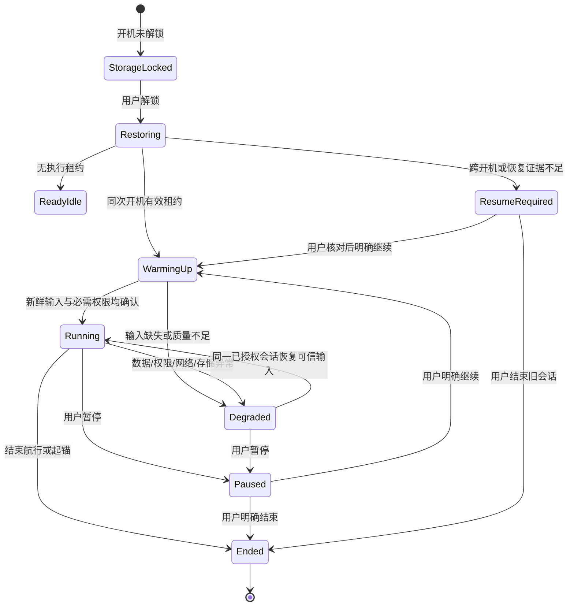

# 03 · 开机、持续运行、中断与恢复

状态：R1 生命周期契约与验收清单；真机持续运行在 R3 验证，升级与回滚在 R4 实施。阶段统一见 [08 · 交付顺序与验收门槛](08-ROADMAP-AND-ACCEPTANCE.md)。R0 继承现有运行时，未因预置 HOME 就自动获得本章保证。设计依据是保留用户意图、明确中断、禁止凭保存配置重新开启功能。

## 恢复的三个不同对象

1. **内容**：坐标、路线、海图目录、日志、船名与单位可以恢复，它们不代表正在执行。
2. **运行意图**：本次开机中用户按下 Start 后产生的租约。明确 Stop/Pause/撤权后不可复活；租约绑定 owner、来源、bootId 和代次。
3. **画面**：当前页、地图视口、筛选和草稿可以恢复；恢复画面不能替用户执行 Start、Resume、Arm、Connect 或 Publish。

画面与业务会话独立：关闭守锚卡片不是起锚，Home 不是结束航行；反过来，看到旧的“正在值守”截图也不是值守仍在运行的证据。

## 状态模型（计划）

这是运行协调状态，不替代每个领域自己的状态机。守锚的“锚点尚未估算”与“来源尚未准备”不同；航行的“记录中但缺位置”与“用户暂停”不同；所有等待都必须能说明原因。

## 生命周期行为表

| 触发 | 内容/画面 | 定位与连接 | 航行 / 导航 | 守锚 / 告警 |
| --- | --- | --- | --- | --- |
| 初次启动 | 初始偏好、说明与空库；不伪造船位 | 全关；在数据中心显式启用及申请权限 | 无会话 | 无会话 |
| 普通切应用 / Home / 最近任务 | 恢复实际页面实例；可暂停绘图 | 依赖已授权 owner 持续，不随页面关闭 | 正在执行的会话继续 | 值守继续；关闭 UI 消息不停止声音/警报 |
| 关闭最近任务卡片 | 关闭该 UI 会话与截图 | 不等于停止领域租约 | 持续，Shell 状态仍反映活动会话 | 持续，明确操作才暂停或起锚 |
| 锁屏 / 熄屏 | UI 停动画/地图刷新；内容保留 | 按业务 owner 持有前台执行、必要资源；没有 owner 则释放 | 记录继续；显示关闭不切换来源 | 值守与告警按已授权状态继续；不靠屏幕常亮维持 |
| 仅 UI 进程崩溃（R1） | HOME 可重启；页面可恢复 | 独立 Marine Core 不受 UI 生命周期控制 | 会话继续，UI 重连只读快照 | 值守继续；重新打开不重复 Arm |
| 核心进程崩溃，同次开机 | 记录缺口和恢复事件 | 仅恢复有效且未撤销的旧租约；不得新增来源、客户端输出目标 | 当前航行分新轨迹段；导航进入 WarmingUp，缺输入不推进 | 不把缺口说成持续保护；先显示恢复/数据等待，取得新鲜固定来源后恢复旧会话 |
| Android 强制停止 / 用户停止应用 | 内容保留 | 不绕过系统强停；资源由系统停止 | 下次显式打开显示中断，确认后继续 | 不承诺强停后值守；下次显示未监控缺口与恢复要求 |
| 整机重启 / 电源中断 | 解锁后恢复内容；记录上一执行终止点未知 | 前次 bootId 租约失效；不开 GPS、不重连、不监听 | 航行暂停待确认；导航待确认，不按旧页面自动前往 | 会话锚点/范围/轨迹保留为待恢复，清除旧的消音到期假设，用户核对后继续 |
| 系统计划升级重启 | 先保存检查点；不自动删除内容 | 不自动延续发布授权 | 先结束/暂停，升级后核对恢复 | 活动值守时拒绝自动安排重启；用户安排监控替代并显式暂停后才升级 |
| 权限被撤销 / GNSS 被关闭 | 保留上次值及时间；显示真实限制 | 停止无权输入，不偷偷切手机/NMEA | 轨迹记 gap；不续接假位置；导航变为缺输入 | 触发数据保障失效告警；不会显示“安全”或自行移动锚点 |
| 外置海图介质消失 | 保留图层定义，标记需重新授权/挂载 | 不影响其他来源 | 使用默认离线底图并标注图层缺失 | 地图降级不停止已运行守锚引擎 |

“同次开机恢复已授权租约”不是静默开启一个新功能。它必须有已提交的明确运行意图、同一 bootId、未撤销记录和同一来源绑定；任何证据不完整都转入 `ResumeRequired`。服务重连绝不重放客户端缓存的 Start 请求。

## 守锚的不可混淆动作

| 动作 | 持久会话 | 定位/轨迹 | 警报含义 |
| --- | --- | --- | --- |
| 下锚/建立会话 | 生成会话与锚点来源；未确认估计值保持 UNKNOWN | 开始收集已授权输入；不足时说明等待 | 未具备监控条件不能显示正在保护 |
| 开始/继续值守 | 保持同一锚点、范围和来源绑定；watchEpoch 更新 | 等待新鲜可信位置，记录恢复边界 | 输入满足后才激活监控；失败保持暂停/待确认 |
| 暂停 | 会话继续存在，保存中心/范围/轨迹 | 释放该 owner 资源；其他 owner 可继续使用 | 停止该会话值守，明确提示暂停；不是起锚 |
| 暂时静音 | 会话与保护继续 | 继续测量与检测 | 只限时消音，持续告警在到期后按策略重新提示 |
| 起锚 | 会话结束并记录事件 | 停止本会话采集，保存历史范围 | 结束本次保护；不是隐藏通知 |
| 点击/划走通知 | 不变 | 不变 | 只消费消息，不确认、消音或结束业务警报 |

锚点估计缺少足够轨迹时，返回 `INSUFFICIENT_EVIDENCE` 和进展，不能生成一个 `(0,0)`、问号位置或可“应用”的候选。半径、估计不确定度、GPS 精度和历史覆盖范围是四个不同图层，不能把最大精度圈当作曾到达区域。

## 启动与解锁顺序

Android Direct Boot 区分解锁前可用的设备加密存储与解锁后可用的凭据加密存储；声明 directBootAware 并不让所有私有数据自动可读。[Android Direct Boot](https://developer.android.com/privacy-and-security/direct-boot)

**R0 不新增解锁前航海服务**：现有接收器仅处理 `BOOT_COMPLETED`，不配置 `LOCKED_BOOT_COMPLETED` 或以解锁前隐藏数据库副本启动监控。

R1 计划顺序：

1. 锁屏阶段只允许系统 UI、时间和最低限度恢复说明；位置历史、海图目录、网络凭据留在凭据加密存储。
2. 解锁后读取 schema 版本、bootId 和上次检查点；完成数据库迁移，失败进入可导出诊断的恢复状态，禁止先开连接再迁移。
3. 事务化处理跨开机会话：标记中断、撤销旧运行租约、保留内容、创建一次恢复事件。
4. 再发布全量状态给 HOME；页面可读历史但运行状态为待确认。
5. 用户在恢复卡/所属应用核对锚点、来源、权限与时间，明确继续；取得新的租约并等待当前真实输入后进入执行。

不能依赖 BootReceiver 一定先于 Activity/Service 执行。**恢复屏障放在唯一核心存储/协调入口**，任意入口都必须完成同一个幂等恢复事务后才能申请资源。Receiver 只触发/提示，不独占正确性。

## 时间、轨迹与来源恢复

- 重启后旧 elapsed 时间戳全部不可视作“刚收到”；保持 UTC 历史用于展示，实时观测等待新样本。
- 核心进程恢复后每个来源 generation 更新，清空待发输出队列，阻止旧代次报文再次发布；保存的句子仅为诊断历史。
- 船首向与手机姿态的安装确认不能因恢复一个位置样本而恢复。手机移动/安装证据失效时要求重新确认，保留真实横倾，不用“调平”把斜船伪造成水平。
- 轨迹缺口记录起止和原因；不能在断点之间画成真实经过路线。缺少精确终点时使用“最后确认时间”，不捏造丢失时刻。
- 来源失联不自动切换显式固定源；AUTO 只按预先批准的候选与稳定窗口选择，并发出可解释的来源改变事件。守锚位置绑定的修改必须暂停并核对，不随普通显示仲裁改变锚点参考。
- 数据短时未更新时显示最后读数和年龄；后台安全检测仍按该指标时效处理。数据丢失告警必须去抖/去重，并留下记录，不能用反复 snackbar 阻挡按钮。

## 存储、升级与回滚

业务提交先落盘再呈现完成；后台结束航行必须 flush 成功，写失败继续显示真实未完成状态。满盘时保留当前会话和可恢复内容，不无声丢弃待写队列；压缩/清理只针对可重建缓存，用户海图与日志不自动删除。

每次系统/服务升级记录 `ROM build / APK version / database schema / IPC major / migrationId`。不可逆数据库迁移前创建同设备受保护备份与校验；迁移以事务和完成标记执行，重复启动不能重复迁移。回滚旧 APK 前检查旧版本能否读取新 schema，不能假设 A/B 切换系统分区会回滚 `/data`。不兼容时进入只读恢复流程，经过明确选择恢复备份，说明会损失哪个时间之后的记录。

计划升级不在正在值守或记录时自动触发重启。电源断开和用户强制重启无法阻止，下一次启动应明确记录中断；不能通过 ROM 权限承诺永不中断。

## 现状与设计之间的实际差距

| 源码证据 | 已有行为 | 本章要求仍需落地的部分 |
| --- | --- | --- |
| [BootRestoreReceiver](../../legacy-marine/src/main/java/com/yokuli/anchorwatch/service/BootRestoreReceiver.kt) | 重启后暂停活动锚警、清理 mock 开关、通知恢复；没有航行暂停事务 | 统一 boot 恢复屏障；航行/导航待确认；所有入口幂等 |
| [AnchorWatchRuntime.restore](../../legacy-marine/src/main/java/com/yokuli/anchorwatch/runtime/anchor/AnchorWatchRuntime.kt) | 恢复中心/轨迹/状态；未暂停会话重新申请资源和固定来源 | 用租约与 bootId 证明是否允许自动恢复；避免 Receiver 时序竞态；发布明确缺口 |
| [TripRuntime.restore](../../legacy-marine/src/main/java/com/yokuli/anchorwatch/runtime/trip/TripRuntime.kt) | 恢复会话和历史期待字段；未暂停则申请资源并启动 ticker；失败转暂停；姿态要求重新确认 | 区分同次开机与设备重启；统一执行授权和恢复状态 |
| [NmeaConnectionStore](../../legacy-marine/src/main/java/com/yokuli/anchorwatch/data/nmea/NmeaConnections.kt) | 连接租约绑定 BOOT_COUNT，Stop 同步撤销后可防复活 | 与锚警安全连接、本机 listener、发布队列共用恢复判断 |
| [LocalNmeaServerSettingsRepository](../../legacy-marine/src/main/java/com/yokuli/anchorwatch/data/sharing/LocalNmeaServerSettingsRepository.kt) | 本机 listener 运行意图也按 boot count 失效 | 对外协议、客户端授权和完整恢复 UI |
| [OsStore](../../app-shell/src/rebuild/java/com/yokuli/marine/shell/rebuild/Model.kt) | activeRoute/navigationSnapshot 从 JSON 自动恢复 | 独立导航所有者及恢复为待确认的迁移 |
| [AnchorForegroundService](../../legacy-marine/src/main/java/com/yokuli/anchorwatch/service/AnchorForegroundService.kt) | START_STICKY、stopWithTask=false、资源协调 | UI/业务分进程、Binder death/重连、可验证后台存活 |

这些缺口应作为 R1 实现工作，不在 R0 文档里改写成已经完成的事实。R0 的虚拟设备没有真实守锚能力认证。

## 最小验收故事与所需证据

每项记录 build、设备、输入来源、前置会话、实际事件序列和结果。模拟数据标注为 replay/demo，不写成海上实测。尚未执行的项标记 NOT RUN。

| 故事 | 预期结果 | 证据 |
| --- | --- | --- |
| 值守中按 Home、关守锚卡片、熄屏 | 相同 sessionId 与来源继续；警报可发声；再次打开只恢复画面 | 领域事件/资源 owners/真实通知，R3 加实际音频和位置变化 |
| 杀 UI，保持 Marine Core | 核心 session 与 lease 不变；客户端重新订阅不发 Start | 两进程 PID、命令日志、订阅 sequence；R1 后才可验证 |
| 同次开机杀核心后恢复 | 有缺口；旧租约不变；等待新输入；无重复会话或旧包输出 | bootId、generation、requestId、持久事件、对端实收记录 |
| 值守+航行后整机重启 | 不自动开 GPS/连接/监听/导航；锚点和轨迹保留，明确待恢复 | 开机日志、数据库状态、socket/资源清单、恢复页面 |
| 停止连接后立即杀进程 | 重开不复活；保存的配置仍可见 | stop 提交时间、租约、对端连接日志 |
| 连续点击或超时重试 Start | 只有一个会话、一个提交事件 | 同一 requestId 结果、数据库唯一约束与事件 |
| 撤销定位权限/切断 NMEA | 不偷偷换源；展示年龄；保护数据缺失被明确报告 | 来源策略未改、观测时间、去重领域告警 |
| 通知点击/滑走 | 消息消失，业务仍运行；同页无开场动画 | notice 消费与业务 session/event 独立记录 |
| 正在值守时计划 OTA | 不自动重启，提示先安排并暂停；正常升级后待确认 | 更新状态、会话状态和重启前后事件 |
| 模拟满盘与迁移失败 | 不显示已保存，不删除旧库；可导出诊断并恢复 | 存储错误、事务结果、文件校验与恢复记录 |

长时间屏灭、温升、GNSS 遮挡、Wi-Fi 漫游、音量/勿扰、低电压重启和外置介质断连属于 R3 真机阶段。没有这些证据，不把“后台前台服务存在”解释为可靠航海设备已经完成。
