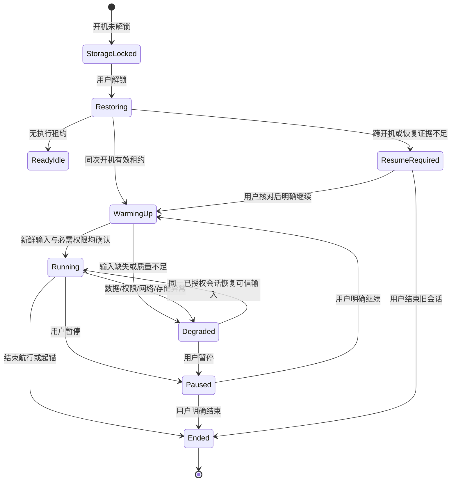

# 03 · 开机、持续运行、中断与恢复

状态：Shell/Core 进程隔离、命令账本和 boot 恢复屏障已接入生产；真机持续运行、独立 UID 和升级回滚仍有明确缺口。阶段统一见 [08 · 交付顺序与验收门槛](08-ROADMAP-AND-ACCEPTANCE.md)。R0 继承现有运行时，未因预置 HOME 就自动获得本章保证。设计依据是保留用户意图、明确中断、禁止凭保存配置重新开启功能。

## 恢复的三个不同对象

1. **内容**：坐标、路线、海图目录、日志、船名与单位可以恢复，它们不代表正在执行。
2. **运行意图**：本次开机中用户按下 Start 后产生的租约。明确 Stop/Pause/撤权后不可复活；租约绑定 owner、来源、bootId 和代次。
3. **画面**：当前页、地图视口、筛选和草稿可以恢复；恢复画面不能替用户执行 Start、Resume、Arm、Connect 或 Publish。

画面与业务会话独立：关闭守锚卡片不是起锚，Home 不是结束航行；反过来，看到旧的“正在值守”截图也不是值守仍在运行的证据。

## 当前系统常驻与完全退出（2026-09-27）

`MarineSystem.residency` 是可见应用入口与设置共用的系统运行端口。`MainActivity` 在 RESUMED、Core 已连接且恢复状态已收到时发起启动；`AnchorForegroundService` 继续承载同一个 `YokuliRuntimeCoordinator`，新增 `SYSTEM_RESIDENT` 资源 owner，持续观察设备实际提供的运动、旋转/罗盘与气压。页面租约仍可用于临时视线，但不再决定后台数据是否存在。手机 GNSS 只按数据中心已选来源及 Android 权限采集；NMEA 连接、发送和监听服务只保持用户已经开启的租约，常驻不会自动选源、连接或分享。Android 14+ 本地持续仪表会话声明 `specialUse` 及具体用途，所选手机定位取得 `location` 类型后才获得系统常驻定位租约。厂商电池限制、系统强停、权限或硬件缺失仍会限制执行，不承诺永不被回收。

`RuntimeResidencyState` 将运行意图、执行阶段、定位/传感器真实注册、输入输出连接数量和分享状态分开呈现；权限与后台页读取这份状态。前台通知使用 Yokuli OS 身份。来源、导航、记录、守锚和 AIS 仍各有唯一所有者；该端口仅编排现有命令，不是另一套数据中心。

设置和退出磁贴统一进入 `settings:exit`：先展示将暂停/关闭的任务，再由用户确认。退出首先持久化显式停止闩锁，阻止后台恢复重新启动，再以有界等待暂停导航、关闭 AIS 警戒、冲刷并暂停航程、暂停守锚、停止定位代理、关闭输入/输出/本机监听并释放资源；Core 确认 `STOPPED` 后立即移除 Android 任务。磁贴不会一次轻触就关闭保护。任一步失败返回未完成，停止闩锁与已成功暂停的领域保持，用户可重试；不伪造跨领域原子事务。再次打开只恢复系统数据采集，已暂停任务、关闭连接及共享仍由用户重新开启。Home、Back、关内部最近任务卡片及锁屏均不调用退出。

显式退出闩锁同时约束资源管理器、系统定位、NMEA 恢复和服务 sticky/boot 入口。已开启手机数据输出现在与输入和本机监听一样保存同次开机运行租约；Android 回收后不因 `outputRunning` 内存丢失而静默停止，明确 Stop/退出或重启手机均撤销租约。源级安装姿态失效时同步撤销船首向候选和对应输出资格，原始设备罗盘、气压及定位独立保留。

历史边界保持真实：压力沿原 `PressureHistoryRepository` 持久化，开启航程后的各项采样沿原记录器落盘。默认 Core 的 `LocalReadingHistoryService` 在无界面时继续追加规范观测，Shell `DataHub` 仅订阅读数和有界历史切片；最近 15 分钟短历史每 5 秒批写原私有 AtomicFile；同次设备开机重开应用可恢复历史，当前读数和来源选择不从缓存恢复。原始 UTC、值、来源和连续性标识保持不变，额外进程代次令恢复样本与新观测断线。`BOOT_COUNT` 改变或无法确认时不复用旧 elapsed；异常回收最多可能丢失尚未刷批的一段。明确退出在 Core 已确认停止后，对短历史和退出通知做有界收尾；这些显示/消息缓存失败不得继续占住退出页面，已有批次与持久状态在下次运行恢复。短历史是有界显示缓存，并非新增的全传感器长期仓库；详见[数据中心历史契约](../product/DATA_CENTER_CONTRACT.md#2026-09-27-后台显示历史缓存)。

## 当前通知生命周期与内容恢复

- `:notifications` 由同包 Binder 绑定启动，仅持有消息文件与有界请求回执。`YokuliApplication` 根据进程角色跳过海事和 Shell 初始化；领域事件由默认进程的 `MarineNotificationEvents` 发布，不依赖通知面板打开。
- 面板冷启动为 `CLOSED`，不持久化逐帧偏移。`NotificationShadeState` 统一持有展开、触摸、拖动、收敛与返回快照；动画通过 `attachHost` 使用 Compose 宿主的帧时钟，宿主销毁取消动画并收敛，不能放在无帧时钟的 Application scope。真实关闭且触摸结束才恢复输入和截图资格。旋转重测高度保持进度并向稳定锚点收敛；Home 立即切换底层桌面、放弃面板交接链，但实际关闭前不撤输入屏障。
- 消息服务死亡后客户端保留已读取历史、公布 `DISCONNECTED`，重新绑定、版本握手、重新订阅并按 epoch/revision 获取全量有界快照；断线不把旧数据标成新结果，不重放 UI 未知命令。客户端死亡移除服务回调，不结束航行、守锚或 AIS。
- 删除、已读、全部清除、历史撤销都只操作通知文件。用户命令的 `UNKNOWN` 保留原 requestId 查询；领域事件重播只对带稳定事件身份/消费游标的发布进行幂等重送。服务进程没有航行或守锚算法。
- 历史写失败保留旧的已提交内存快照和一份可重试事务，`persistenceFailure` 独立显示，不递归发布保存失败通知。新文件成功前旧历史原样保留；坏格式/未来 schema 不自动清空。
- `MySailingRepository` 的内容订阅失败保留已读目录并退避重订阅，用户可以明确重新读取。地点、坐标、集合与路线对象缺失显示明确空态，不能跳回首页假装成功；仍在导航的冻结路线可单独查看/管理。
- Shell 资料初始读取明确区分“没有文件”与“文件无法解析/未知版本”。后者保留原 `experience-v1.json` 并让唯一写入者 `DurableSnapshotStore` 拒绝所有覆写；不会将单条无效收藏或航线静默丢掉后保存。通知中心可真实重读，先留下完整独立恢复副本，再把原收藏/航线与本次运行改动按 ID 合并，本次改动优先，当前非空草稿优先。恢复不移动地图、不自动重启导航/记录/守锚；恢复副本保留旧草稿及导航快照并可导出。重新启动仍可找到最近恢复副本。文件仍损坏/缺失时继续保护并明确未恢复；当前临时改动在进程退出后没有持久保证。
- 守锚地图的累计覆盖读取有互斥和异常边界，取消不当作业务失败；查询失败保留上次图层并提供重试。历史加载失败仅展示已存锚点/范围，不能假装已加载摆动区域；它不改变活动守锚和警报。

以上是实际生产接入范围。Marine Core 在默认进程，Shell 在独立子进程；下面表格仍包含发行与设备层面的长期目标，不能从代码接线推定设备保证。详见 [通知契约](../product/NOTIFICATION_CENTER_CONTRACT.md) 与 [10](10-INPROCESS-SYSTEM-BOUNDARIES.md)。

## 状态模型（计划）

```mermaid
stateDiagram-v2
    [*] --> StorageLocked: 开机未解锁
    StorageLocked --> Restoring: 用户解锁
    Restoring --> ReadyIdle: 无执行租约
    Restoring --> ResumeRequired: 跨开机或恢复证据不足
    Restoring --> WarmingUp: 同次开机有效租约
    WarmingUp --> Running: 新鲜输入与必需权限均确认
    WarmingUp --> Degraded: 输入缺失或质量不足
    Running --> Degraded: 数据/权限/网络/存储异常
    Degraded --> Running: 同一已授权会话恢复可信输入
    Running --> Paused: 用户暂停
    Degraded --> Paused: 用户暂停
    Paused --> WarmingUp: 用户明确继续
    ResumeRequired --> WarmingUp: 用户核对后明确继续
    Running --> Ended: 结束航行或起锚
    Paused --> Ended: 用户明确结束
    ResumeRequired --> Ended: 用户结束旧会话
    Ended --> [*]
```

这是运行协调状态，不替代每个领域自己的状态机。守锚的“锚点尚未估算”与“来源尚未准备”不同；航行的“记录中但缺位置”与“用户暂停”不同；所有等待都必须能说明原因。

## 生命周期行为表

| 触发 | 内容/画面 | 定位与连接 | 航行 / 导航 | 守锚 / 告警 |
| --- | --- | --- | --- | --- |
| 初次启动 | 初始偏好、说明与空库；不伪造船位 | 全关；在数据中心显式启用及申请权限 | 无会话 | 无会话 |
| 普通切应用 / Home / 最近任务 | 恢复实际页面实例；可暂停绘图 | 依赖已授权 owner 持续，不随页面关闭 | 正在执行的会话继续 | 值守继续；关闭 UI 消息不停止声音/警报 |
| 关闭最近任务卡片 | 关闭该 UI 会话与截图 | 不等于停止领域租约 | 持续，Shell 状态仍反映活动会话 | 持续，明确操作才暂停或起锚 |
| 锁屏 / 熄屏 | UI 停动画/地图刷新；内容保留 | 按业务 owner 持有前台执行、必要资源；没有 owner 则释放 | 记录继续；显示关闭不切换来源 | 值守与告警按已授权状态继续；不靠屏幕常亮维持 |
| 仅 UI 进程崩溃（当前已隔离） | HOME 可重启；页面可恢复 | 独立 Marine Core 不受 UI 生命周期控制 | 会话继续，UI 重连只读快照 | 值守继续；重新打开不重复 Arm |
| 核心进程崩溃，同次开机 | 记录缺口和恢复事件 | 仅恢复有效且未撤销的旧租约；不得新增来源、客户端输出目标 | 当前航行分新轨迹段；导航保留冻结路线并进入 RECOVERY_REQUIRED，用户确认后继续，缺输入不推进 | 不把缺口说成持续保护；先显示恢复/数据等待，取得新鲜固定来源后恢复旧会话 |
| Android 强制停止 / 用户停止应用 | 内容保留 | 不绕过系统强停；资源由系统停止 | 下次显式打开显示中断，确认后继续 | 不承诺强停后值守；下次显示未监控缺口与恢复要求 |
| 整机重启 / 电源中断 | 解锁后恢复内容；记录上一执行终止点未知 | 前次 bootId 租约失效；不开 GPS、不重连、不监听 | 航行暂停待确认；导航待确认，不按旧页面自动前往 | 会话锚点/范围/轨迹保留为待恢复，清除旧的消音到期假设，用户核对后继续 |
| 系统计划升级重启 | 先保存检查点；不自动删除内容 | 不自动延续发布授权 | 先结束/暂停，升级后核对恢复 | 活动值守时拒绝自动安排重启；用户安排监控替代并显式暂停后才升级 |
| 权限被撤销 / GNSS 被关闭 | 保留上次值及时间；显示真实限制 | 停止无权输入，不偷偷切手机/NMEA | 轨迹记 gap；不续接假位置；导航变为缺输入 | 触发数据保障失效告警；不会显示“安全”或自行移动锚点 |
| 外置海图介质消失 | 保留图层定义，标记需重新授权/挂载 | 不影响其他来源 | 使用默认离线底图并标注图层缺失 | 地图降级不停止已运行守锚引擎 |

“同次开机恢复已授权租约”不是静默开启一个新功能。它必须有已提交的明确运行意图、同一 bootId、未撤销记录和同一来源绑定；任何证据不完整都转入 `ResumeRequired`。服务重连绝不重放客户端缓存的 Start 请求。

## 守锚的不可混淆动作

| 动作 | 持久会话 | 定位/轨迹 | 警报含义 |
| --- | --- | --- | --- |
| 下锚/建立会话 | 生成会话与锚点来源；未确认估计值保持 UNKNOWN | 开始收集已授权输入；不足时说明等待 | 未具备监控条件不能显示正在保护 |
| 开始/继续值守 | 保持同一锚点、范围和来源绑定；watchEpoch 更新 | 等待新鲜可信位置，记录恢复边界 | 输入满足后才激活监控；失败保持暂停/待确认 |
| 暂停 | 会话继续存在，保存中心/范围/轨迹 | 释放该 owner 资源；其他 owner 可继续使用 | 停止该会话值守，明确提示暂停；不是起锚 |
| 暂时静音 | 会话与保护继续 | 继续测量与检测 | 只限时消音，持续告警在到期后按策略重新提示 |
| 起锚 | 会话结束并记录事件 | 停止本会话采集，保存历史范围 | 结束本次保护；不是隐藏通知 |
| 点击/划走通知 | 不变 | 不变 | 只消费消息，不确认、消音或结束业务警报 |

锚点估计缺少足够轨迹时，返回 `INSUFFICIENT_EVIDENCE` 和进展，不能生成一个 `(0,0)`、问号位置或可“应用”的候选。半径、估计不确定度、GPS 精度和历史覆盖范围是四个不同图层，不能把最大精度圈当作曾到达区域。

## 启动与解锁顺序

Android Direct Boot 区分解锁前可用的设备加密存储与解锁后可用的凭据加密存储；声明 directBootAware 并不让所有私有数据自动可读。[Android Direct Boot](https://developer.android.com/privacy-and-security/direct-boot)

**R0 不新增解锁前航海服务**：现有接收器仅处理 `BOOT_COMPLETED`，不配置 `LOCKED_BOOT_COMPLETED` 或以解锁前隐藏数据库副本启动监控。

R1 计划顺序：

1. 锁屏阶段只允许系统 UI、时间和最低限度恢复说明；位置历史、海图目录、网络凭据留在凭据加密存储。
2. 解锁后读取 schema 版本、bootId 和上次检查点；完成数据库迁移，失败进入可导出诊断的恢复状态，禁止先开连接再迁移。
3. 事务化处理跨开机会话：标记中断、撤销旧运行租约、保留内容、创建一次恢复事件。
4. 再发布全量状态给 HOME；页面可读历史但运行状态为待确认。
5. 用户在恢复卡/所属应用核对锚点、来源、权限与时间，明确继续；取得新的租约并等待当前真实输入后进入执行。

不能依赖 BootReceiver 一定先于 Activity/Service 执行。**恢复屏障放在唯一核心存储/协调入口**，任意入口都必须完成同一个幂等恢复事务后才能申请资源。Receiver 只触发/提示，不独占正确性。

## 时间、轨迹与来源恢复

- 重启后旧 elapsed 时间戳全部不可视作“刚收到”；保持 UTC 历史用于展示，实时观测等待新样本。
- 核心进程恢复后每个来源 generation 更新，清空待发输出队列，阻止旧代次报文再次发布；保存的句子仅为诊断历史。
- 船首向与手机姿态的安装确认不能因恢复一个位置样本而恢复。手机移动/安装证据失效时要求重新确认，保留真实横倾，不用“调平”把斜船伪造成水平。
- 轨迹缺口记录起止和原因；不能在断点之间画成真实经过路线。缺少精确终点时使用“最后确认时间”，不捏造丢失时刻。
- 来源失联不自动切换显式固定源；AUTO 只按预先批准的候选与稳定窗口选择，并发出可解释的来源改变事件。守锚位置绑定的修改必须暂停并核对，不随普通显示仲裁改变锚点参考。
- 数据短时未更新时显示最后读数和年龄；后台安全检测仍按该指标时效处理。数据丢失告警必须去抖/去重，并留下记录，不能用反复 snackbar 阻挡按钮。

## 存储、升级与回滚

业务提交先落盘再呈现完成；后台结束航行必须 flush 成功，写失败继续显示真实未完成状态。满盘时保留当前会话和可恢复内容，不无声丢弃待写队列；压缩/清理只针对可重建缓存，用户海图与日志不自动删除。

每次系统/服务升级记录 `ROM build / APK version / database schema / IPC major / migrationId`。不可逆数据库迁移前创建同设备受保护备份与校验；迁移以事务和完成标记执行，重复启动不能重复迁移。回滚旧 APK 前检查旧版本能否读取新 schema，不能假设 A/B 切换系统分区会回滚 `/data`。不兼容时进入只读恢复流程，经过明确选择恢复备份，说明会损失哪个时间之后的记录。

计划升级不在正在值守或记录时自动触发重启。电源断开和用户强制重启无法阻止，下一次启动应明确记录中断；不能通过 ROM 权限承诺永不中断。

## 现状与设计之间的实际差距

| 源码证据 | 已有行为 | 本章要求仍需落地的部分 |
| --- | --- | --- |
| [BootRestoreReceiver](../../legacy-marine/src/main/java/com/yokuli/anchorwatch/service/BootRestoreReceiver.kt) | 与 Application、Binder、运行时共用恢复屏障；跨开机同事务暂停守锚与记录并保存缺口 | 不能越过 Android 强制停止、解锁与前台启动限制 |
| [AnchorWatchRuntime.restore](../../legacy-marine/src/main/java/com/yokuli/anchorwatch/runtime/anchor/AnchorWatchRuntime.kt) | 屏障后恢复中心/轨迹；同次开机保留来源意图，跨开机待确认；原命令按持久效果对账 | 设备级长时间后台存活与警报能力仍取决于权限和实际设备 |
| [TripRuntime.restore](../../legacy-marine/src/main/java/com/yokuli/anchorwatch/runtime/trip/TripRuntime.kt) | 屏障后恢复会话，重放持久采样尾日志，轨迹断段；跨开机暂停，姿态要求重新确认 | 无法重建 Core 停止期间没有采集到的观测 |
| [NmeaConnectionStore](../../legacy-marine/src/main/java/com/yokuli/anchorwatch/data/nmea/NmeaConnections.kt) | 连接租约绑定 BOOT_COUNT，Stop 同步撤销后可防复活 | 与锚警安全连接、本机 listener、发布队列共用恢复判断 |
| [LocalNmeaServerSettingsRepository](../../legacy-marine/src/main/java/com/yokuli/anchorwatch/data/sharing/LocalNmeaServerSettingsRepository.kt) | 本机 listener 运行意图也按 boot count 失效 | 对外协议、客户端授权和完整恢复 UI |
| [LocalNavigationSessionService](../../runtime/marine-local/src/main/java/com/yokuli/runtime/marine/navigation/LocalNavigationSessionService.kt) | 默认 Core 进程持有导航；Shell 走 Binder；恢复为 RECOVERY_REQUIRED；命令修订检查和持久回执 | 独立 UID、公开稳定协议与设备级后台存活保证 |
| [AnchorForegroundService](../../legacy-marine/src/main/java/com/yokuli/anchorwatch/service/AnchorForegroundService.kt) | 默认 Core 进程执行，Shell 独立；START_STICKY、stopWithTask=false、资源协调和 Binder 重连 | Android/厂商仍可能终止 Core；进程隔离不能证明海上持续可靠性 |

当前已接入的 R1 代码能力与设备级保证分开记录。R0 的虚拟设备没有真实守锚能力认证。

## 历史路线：设备阶段故事与所需证据（本轮不执行）

每项记录 build、设备、输入来源、前置会话、实际事件序列和结果。模拟数据标注为 replay/demo，不写成海上实测。尚未执行的项标记 NOT RUN。

| 故事 | 预期结果 | 证据 |
| --- | --- | --- |
| 值守中按 Home、关守锚卡片、熄屏 | 相同 sessionId 与来源继续；警报可发声；再次打开只恢复画面 | 领域事件/资源 owners/真实通知，R3 加实际音频和位置变化 |
| 杀 UI，保持 Marine Core | 核心 session 与 lease 不变；客户端重新订阅不发 Start | 两进程 PID、命令日志、订阅 sequence；R1 后才可验证 |
| 同次开机杀核心后恢复 | 有缺口；旧租约不变；等待新输入；无重复会话或旧包输出 | bootId、generation、requestId、持久事件、对端实收记录 |
| 值守+航行后整机重启 | 不自动开 GPS/连接/监听/导航；锚点和轨迹保留，明确待恢复 | 开机日志、数据库状态、socket/资源清单、恢复页面 |
| 停止连接后立即杀进程 | 重开不复活；保存的配置仍可见 | stop 提交时间、租约、对端连接日志 |
| 连续点击或超时重试 Start | 只有一个会话、一个提交事件 | 同一 requestId 结果、数据库唯一约束与事件 |
| 撤销定位权限/切断 NMEA | 不偷偷换源；展示年龄；保护数据缺失被明确报告 | 来源策略未改、观测时间、去重领域告警 |
| 通知点击/滑走 | 消息消失，业务仍运行；同页无开场动画 | notice 消费与业务 session/event 独立记录 |
| 正在值守时计划 OTA | 不自动重启，提示先安排并暂停；正常升级后待确认 | 更新状态、会话状态和重启前后事件 |
| 模拟满盘与迁移失败 | 不显示已保存，不删除旧库；可导出诊断并恢复 | 存储错误、事务结果、文件校验与恢复记录 |

长时间屏灭、温升、GNSS 遮挡、Wi-Fi 漫游、音量/勿扰、低电压重启和外置介质断连属于 R3 真机阶段。没有这些证据，不把“后台前台服务存在”解释为可靠航海设备已经完成。

## 导航执行运行时（2026-09-25）

`core/runtime-contract/navigation/NavigationContract.kt` 公开纯值会话、观测、指导与命令端口。`MarineSystem.navigation` 装配 `LocalNavigationSessionService`，Android 前台容器为 `NavigationTrackingService`。导航不归海图 Compose scope 所有，也不借日志的 trip 当导航状态。

会话、冻结路线、当前目标、设置、分析引用、最后指导检查点和最近 32 条命令回执保存到 `filesDir/navigation/session-v1.json` 的 AtomicFile。读取失败阻止写入并保留原文件；重新读取是明确操作。旧 `experience-v1.json` 的 activeRoute/navigationSnapshot/routeLeg 仅在首次迁移时导入，迁移成功后才移除旧写入字段。没有可读原资料时不以空状态覆盖。进行中的检查点约每 30 秒保存，不把观测 age 当成新测量。

恢复 ACTIVE 或 PAUSED 的持久会话统一进入 `RECOVERY_REQUIRED`；不依据旧 elapsedRealtime 恢复实时观测，不申请导航资源、不重放 START。用户核对后提交 RESUME，本地导航还要求当前可信船位。服务使用 `START_NOT_STICKY`，没有导航开机接收器；强杀/重启后由真实恢复入口继续。

用户明确开始/继续导航且持久提交成功后，前台容器申请 `NAVIGATION_SESSION` 资源 owner。GPS、NMEA、唤醒和 Wi-Fi 需求通过现有 `RuntimeResourceManager` 合并，不创建另一定位监听或网络 socket，也不自行切换全船来源。前台服务注册 `connectedDevice|location`，只在当前选择手机位置且 Android 允许时启用 location 类型。系统拒绝后台定位/前台启动或容器被终止时，保留会话与目标，释放本 owner 租约并通过共享状态/通知明确后台受限；不声称依旧持续采集。暂停/结束释放导航 owner，其他记录、守锚、连接 owner 仍按各自意图运行。

START、SELECT_TARGET、ADVANCE、ARRIVE、PAUSE、RESUME、END、REPLAN、SELECT_EXTERNAL、SETTINGS 在同一进程级命令队列中处理。命令必须匹配预期会话和修订；状态与回执一起落盘后才更新 UI。页面离场不取消队列接受的命令；同请求重试返回原结果。路线收藏改动不会更换导航副本。冻结副本同时保存完整几何、业务目标映射与当前几何段游标；形状点不会变成需要逐个确认的目的地，重启恢复也不从零重复经过已确认的业务目标。自动推进还需要新鲜且精度明确的连续位置、接近/通过线依据、滞回与冷却，来源或修订改变立即重新建立证据。

航行记录仍由独立 `VoyageSessionService` 控制。“导航时同时记录”仅是用户明确选择的两项命令：已有/暂停记录保持原状态，开始记录失败不能伪装成导航失败或反向结束导航；停止导航、确认到达、Home 或关闭海图都不替用户停止记录。

当前不包含自动驾驶输出、潮汐/天气路由或跨设备会话复制。独立于 Shell 的 Core 及私有 Binder 已接入；Android 前台容器没有设备级持续运行保证，本节不把 ROM 架构目标当成已经完成的系统权限能力。

### 图册连接与客户端恢复（2026-09-30）

Marine Core 对相同 callback/session 的 ATTACH 幂等；DETACH 和 Binder 死亡仅释放其实际 Client 实例，旧回调不得移除刚恢复的新会话。回调以轻量同步事务确认接收方入队，不在 Binder 回调中等待业务执行。暂时回调失败不销毁仍存活客户端的快照租约；确认死亡才断开。订阅对活 Binder 的瞬时传输失败保留同一 sequence 并退避重送，成功后才推进差分基线，不让静态状态永久失去订阅；序列化错误不作无限重试。快照/租约返回与断开清理共用所有权守卫。

只有服务端在接受 CALL 之前明确返回 `MARINE_CLIENT_NOT_ATTACHED` 时，客户端才修复附着并用同一个 call ID 重送一次。超时、已接受写操作和结果未知均不得换 ID 重试。`startFromForeground` / `onPermissionsChanged` 等自动维护、只读取消和资源释放由连接及领域状态呈现，不转成用户“操作未完成”。明确用户命令的失败按动作、状态和真实目标聚合，未知结果仍保留独立请求记录。

可取消只读请求在等待方取消时，除终止本地等待任务，还按原 call ID 发送幂等 `ABANDON_READ`。这样即使快照已回包、调用方在恢复执行之前离场，Core 仍能释放从未交到调用方的句柄；`invoke` 内的取消清理可重复发送相同放弃请求。已接受写命令不走这条取消路径，其 requestId 与执行语义保持不变。

资料导出由 `ChartDataService.exportPackage` 接受后在 Core scope 运行，保留不可变目录版本和原始文件租约。进度通过 `ChartDataState.exportJob` 发布并落盘；先私有打包，再复制目标文档。取消关闭输出并尽力移除不完整目标；恢复将未完成作业转为 INTERRUPTED，不自动覆盖目标。新安装保留原件，旧目录缺原件必须重新导入。图册页面离场只结束展示，不取消已接受的导出。

三维静态编译由 Core 持有不可变资料租约；Shell 当前显示链只请求准备并读取产物，不再将原始对象、覆盖和栅格窗口跨 IPC 送入页面编译。`acquireDisplaySnapshot / query / rasterWindows` 仍是受窗口约束的底层显示读取端口，不能因此恢复 Shell 的整片几何热路径。常驻目录只发送覆盖能力摘要，不随状态变化重发全国多边形；摘要不能替代实际航线分析。

`terrainStatuses` 对同一资料/修订的请求共用来源快照、身份和数据库；`terrainOverview` 读取已 READY 的祖先基础块，不触发编译。同步显示缓存按所选 ID、修订、可读状态和 `preparedFactsRevision` 隔离；Core 后续读取沿来源租约核验目录、权限和原件身份。异步发布再次核对当前选择及修订，来源失败清除相应旧缓存。同步热显示没有逐次访问 SAF，不能宣称每次命中前都调用了 `validateDisplayProduct`。读取取消只释放本次句柄，不取消已接受的准备任务。

没有 READY 祖先时，`terrainOverview` 可在同一租约内有界读取预制基础子块：最多八级、每级 576 个键，包含祖先查询最多九次 SQL，最多返回 24 个真实 READY 范围。祖先已覆盖的请求不进入回退。此路径不扫描 payload、不提交准备、不依赖包内存在 jobs；取消信号终止 SQLite 读取，租约与连接按原 finally 释放。子块只证明其自身已准备，不把父块标成 READY。

Core 的 `features.sqlite` v8 将属性与唯一的全精度坐标 span 分开存储；v6/v7 在后台完整写入新 SQLite、校验/fsync，再短暂持索引打开锁原子替换。在途连接完成旧 inode 读取，资料目录由租约保护。转换失败保持旧可读版本；进程死亡遗留未发布副本在再次迁移时清理，原始 SAF/包文件不变，首次转换需要临时空间。

静态三维编译已迁至 Core `LocalChartTerrainRuntime`。任务先事务落入 facts 版本目录中的 `terrain-products.sqlite` 再确认；离开海图/AIS不中止已接受任务。每块完整编码、校验后原子成为 READY；恢复重新排队未完成且来源仍一致的块，取消只终止待处理内容、保留 READY。换包/修订隔离内容身份，已失效几何不得继续呈现。图册显式区域准备与按需视野共享此任务表。规划区域准备持久保存阶段与完成分区；进程重启显示 INTERRUPTED，用户继续时复用已完成基础拓扑，不隐式重跑旧输入。

Shell `NavigationTerrainLoader` 仅请求/读取 Core 准备块；GPU/小型解码缓存可释放，Core磁盘产物不随页面清理。`CoreWire` mode=2 为受限二进制产品：小 JSON 头 + key/schema/SHA-256 + 只读 FD（最多 32 MiB）；接收端核对实际长度/摘要并关闭句柄，异常也释放。它不是 mmap 零拷贝或对扩展应用开放的任意文件访问。源版本在 Core 读取租约与 Shell 发布时再次核验；客户端取消登记为可取消读，后台已经接受的准备不会随等待者死亡而被取消。

Shell 的 `MaritimeSceneResources` 为海图和 AIS 各保留一个 GPU 宿主，使用 applicationContext，所有租借/回收都在 UI / Filament 线程。离页 `park` 停帧、关闭页面回调并清掉上一帧点击、交通选择和观测插值；Surface 脱离销毁交换链，Engine/材质/网格最多保留 90 秒。重新借用必须接入当前页面数据后出帧，不恢复旧领域快照。超时或内存压力释放空闲宿主和对应原生资源；活动租约不被抢走。同类页面过渡重叠时创建临时宿主，释放即销毁。Compose `onRelease` 与 `onDispose` 共用幂等租约，不能双重销毁；低内存清理不删除 Core 已准备产品。

### 数据文件夹准备与版本发布

`LocalChartDataService` 先校验真实文件名和清单类别，接受后只持久记录后台任务及 requestId；完整成功才将新文件夹加入 catalogue。数据包只接受 `.yklgeodata`，显示海图只接受 `.yklcharts`，旧错后缀或改名 ZIP 不能绕过类别限制。普通文件夹逐文件复制与解析，压缩包先完整校验和解包。任务属于 Core，离开图册或回桌面不取消；Android 进程和存储限制仍可能中断任务。

相同规范来源 URI 复用既有资料身份，新的 requestId 不等于新的文件夹。正在取消的作业必须完成清理后才接受下一项，避免旧回调覆盖新任务。完整提交使用不可变目录与原子 catalogue，更新失败保留旧可读版本，在途读取由版本租约保护；目录名称、metadata 和内部次序在提交时合并。进度分开呈现文件次序及当前 GPKG 所有表累计对象量，不把单个文件的百分比当作整包完成。

新导入取消或失败只留下可重试的任务结果，不留下空文件夹。恢复将未完成作业标记 INTERRUPTED，清理上一版无原件、无索引的空 PENDING 占位；真实已安装部分资料保留供重扫，不能静默删除。`preparing / preparationIssue` 继续读取旧记录，不表示新任务可提前选用；整个集合完整后才能导出。旧任务新增进度字段先迁移，再恢复状态。未发布临时目录可以清理，已发布资料和租约目录不能提前删除。

准星查询只持有短暂只读租约，不拥有导入或航行任务。拖动立即取消旧位置查询，`inspectPosition` 从当前单选资料获取内部短租约，矢量和网格同版；页面离开、来源变更和查询完成均释放。局部准备状态、无值和读取失败分别在地图读数条呈现，不创建后台失败通知，也不生成传感器水深。

## 当前 Core 恢复屏障与幂等执行

启动时 `AnchorForegroundService` 先立即发布 Android 必需的无声常驻卡，再在 IO 队列构造运行时、恢复和执行命令。`MarineCoreBinderService` 仅注入 Providers，领域初始化及 RPC 执行不占 Android 主线程；服务重建的旧清理只能释放其本人持有的一代运行时。退出/超时取消 Shell 等待，不取消 Core 已接受的写操作，也不能换 requestId 重发。

演练控制端口 `hardwareLab` 独立于业务存储恢复屏障；暂停时间或注入存储故障后仍能清除故障。虚拟 SQLite 路径映射幂等，Room 传入绝对路径不能重复增加世界目录。连接/本机发送/本机服务器明确运行时保持网络租约，离开界面不释放；Android 强制停止与厂商限制仍不能绕过。

`MarineRecoveryBarrier.ensureRecovered()` 是 Application、Binder、ForegroundService 与 BootReceiver 共用的唯一入口。它先检查命令账本可读性，按 Android BOOT_COUNT 判断同次开机，再在 Room 事务中提交恢复缺口与跨开机暂停，最后原子提交本代标记。无法证明同次开机时保守暂停原守锚/航程，不假定持续保护。失败保留文件并阻止安全命令；显式重试重新读取，不清空或重建用户资料。

同次开机恢复保留原会话 ID 和授权来源，历史段因恢复缺口断开；跨开机清除旧消音假设，守锚和记录待确认。导航原有冻结路线/回执继续由自己的 AtomicFile 所有者恢复为 RECOVERY_REQUIRED。AIS 历史缓存只提供最后观测，不能成为新鲜目标或触发基于旧相对运动的保护；既有监控意图仍受退出闩锁、来源租约及 Android 前台启动权限约束。

守锚/航行命令在接受及执行前分别持久化 QUEUED/EXECUTING；Core 死亡后未确定的命令为 UNKNOWN。开始、暂停、继续、结束的状态与 `CORE_COMMAND_<type>` 效果标记在同一 Room 事务内完成；标记保留原 requestId 与 sessionId。因此数据库已提交而账本回执尚未落盘的窗口可按 `(type, requestId)` 精确对账。已处于目标状态的显式无操作请求同样写入自身效果，不能把开机自动暂停或另一个活动会话猜作该请求成功。UI 重连只订阅与查询，不重新发送 Start/Arm。

命令账本最多保存 32,768 个请求且文件不超过 8 MiB；达到容量或不可写时拒绝接受新命令并保留原文件，不通过淘汰旧 ID 伪装无限幂等。短期仪表历史由 Core 单写，保留约 15 分钟并每 5 秒刷盘；突然断电仍可能丢失最后一次刷盘之后的短图数据，它不是航程持久采样的替代品。

航程采样先进入持久尾日志再发布已保存事实，批入 Room 使用原 `(tripId, recordingSequence)` 唯一键去重，统计与样本同事务提交；重启重放未完成尾批，不重复累计距离。仍无法补回进程不运行期间的真实传感器观测，断电前尚未接受到运行时的输入也没有持久保证。

Android 强制停止、撤权、厂商回收、锁定存储或关机不由应用绕过。当前没有 Direct Boot 海事数据库副本；只在解锁后的 BOOT_COMPLETED 恢复。界面进程独立只是避免 UI 崩溃连带杀掉领域运行时，不是“永不停止”的承诺。

## 可安装应用的访问生命周期

应用中心的包管理器在 Shell 进程有唯一实例。恢复注册表后提交整个应用目录；默认进程 Marine Core 仍独立拥有采集与航行任务。每个扩展使用独立 LauncherAppId、入口和 UI 实例键，打开系统应用走已有 linked visit，Back 恢复调用者，Home 不充当停止按钮。

安装事务不依赖安装页面继续可见；以不可变资源目录和原子注册表为提交点，失败不显示安装成功。未确认候选被丢弃。进程重建从注册表恢复，而非恢复旧 WebView 或内存授权。恢复故障阻止变更，不清空注册表。扩展私有 JSON 通过原子文件持久化，更新保留资料，卸载删除资料。

WebView 暂停时终止未完成请求并发送生命周期事件，销毁时移除桥并释放资源。SDK watch 仅可见时按秒读取既有规范快照，不承担传感器或 NMEA 后台运行。版本/授权改变必须建立新会话，旧会话不能把异步写入提交给重装后的应用。

### .ykl 应用操作与设备目录（SDK 2）

设备目录由 Core 实例持有，runtimeId 标识本次进程实例；Binder 中断立即使目录 ready=false，不靠旧 active 值声称设备仍在运行。内置数据中心与扩展共用这个状态。设备观察不取得资源租约，不改变原后台采集生命周期。

扩展脚本仅在前台活动时发起系统操作；页面暂停/销毁取消其等待和订阅，已被 Core 接受的连接、选源、分享和记录命令仍由原所有者完成。航行命令使用应用命名空间的稳定 requestId 与目标 sessionId，通过 `VoyageSessionService.receipt` 查询完整持久账本；最近回执 Flow 不是幂等判断依据。会话换版、卸载重装或授权变化撤销旧访问身份，不能让旧页面继续操作。状态不明返回 UNKNOWN，SDK 不自动重发有副作用请求。

## 虚拟环境生命周期与恢复

- 真实、模拟、回放是 Core 的运行环境，不是页面开关。重复进入模拟复用 `last-simulation` 持久资料空间；场景不变恢复原位置/事件游标且暂停，场景改变则在同一模拟资料空间开始新场景并保留历史。每份录像由 recordingId 稳定生成独立回放 world ID，重进不遗失该录像的回放资料。切换要求现有守锚/航程/导航已结束且系统录像已停止，拒绝时保留原任务。保存场景仅更新下一次进入模拟的配置，当前 `activeScenario` 不变。
- `HardwareLabBoot` 在 Room/DataStore/驱动构造前选择 world 路径及后端。模式变更先原子保存 boot 选择与命令结果，再重启默认 Core 和消息进程；Shell 任务栈保留、连接进入恢复状态。只通过系统读取方重连，不重新发起业务命令。
- 模拟检查点保存航段位置、下一个航点、移动目标、当前参数、事件游标、故障与冻结帧的原测量时刻。回放保存游标；重启均暂停，用户继续才推进。原始录制按批刷盘；突然死亡可能丢失末批及最近检查点，不能补写不存在的输入。中断录像保留可导出的完整行并标记未完整结束。
- 暂停停止业务时间，演练控制/持久化/Binder 的宿主心跳继续工作。领域休眠等待时钟推进而非忙循环。单步只唤醒已到期任务，不伪造步长期间未采到的全部中间样本。
- 设备 detach 或后端切换同步使旧来源代次失效；关闭模拟器停止 job、清空延迟队列并 detach。真实资源仍按原 owner 租约管理，Home 不结束记录或演练。
- 演练消息使用同一 world 的通知存储，Shell/通知进程镜像 Core 时间；实验警报不落入真实历史。全部七个 PreferencesDataStore 经生产委托感知故障。清除存储故障使用同 world 重启以重建失败的数据库/DataStore Flow，不靠错误标签清空假报恢复。boot 控制及录像导出走宿主存储，不被实验故障锁死。
- 录制中的演练命令用于审计，回放只恢复设备输入/目录、电源及存储事件；不自动执行 Start、Arm、Connect、Publish。回放不是恢复真实保护的授权，也不是系统全内存快照。

持久模拟世界、各录像回放世界与真实世界使用独立 files/noBackup/database/preference 命名空间；用户海图外部文件保持原样。Android 强停、断电及后台限制仍适用，暂停恢复不能证明中断期间持续保护。

## 官方资料下载的生命周期（2026-10-03）

下载网络任务由 Android DownloadManager 持有，Core 持有唯一 AtomicFile 账本。提交前先写持久请求，拿到系统 ID 再写回执；进程在两者间死亡时按来源和目标 URI 对账，不能重复创建文件。Home、锁屏、Shell/Core 被系统回收不主动取消系统下载；断网后由 Android 重试，无法续传时明确失败，由用户重新下载。已提交给 Android 的传输独立于 Yokuli 海事采集退出闩锁，用户可在“海图下载”或系统下载通知取消。

DOWNLOAD_COMPLETE 接收器只提交持久 JobScheduler 作业，大文件校验在 Core 后台流式读取，不占广播时限和 UI 主线程。`VERIFYING` 与 `READY` 分开，校验中断后重新核对整个文件；长度或 SHA-256 不符不能导入。取消先落盘再删除系统任务，迟到完成事件不能复活已取消项；重试递增 attempt。缺失文件转为 `MISSING`，不继续显示可用。

结果通知复用唯一 `MarineNotificationEvents` 与图册交付账本：按任务、尝试次数及终态去重，通知仓库确认后再落交付游标；不按进度鸣响。系统常驻栏与通知中心投影下载任务，不创建第二份业务任务。下载对象变更用真实宿主时间，演练不发起、删除或校验真实下载；回到真实世界再恢复对账。目录和账本损坏不得覆盖为空。

导入前 `readyUri` 再次确认同 UID 文件可读；DownloadManager URI 没有 SAF 持久授权，可信内部导入入口仅对已验证的系统下载 URI 略过 takePersistableUriPermission。图册的原有完整解析、校验及事务仍照常执行；手动文件选择仍保留原 SAF 授权路径。导入得到独立图册内容后，可明确删除下载文件，不联动删除已导入资料。
