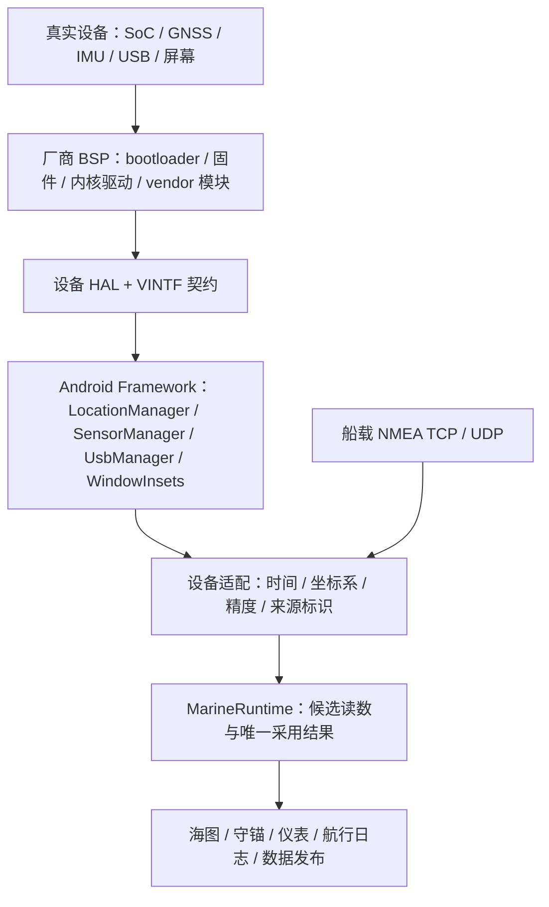

# 04 · 设备与硬件适配

本文区分三种状态：**现有**是仓库中的应用实现；**本轮配置**是 R0 的构建输入，尚不代表镜像已构建或设备已启动；**后续计划**是进入真机或系统服务阶段前必须落实的契约。没有实测记录的能力，一律不写成“设备支持”。

## 1. R0 参考设备与交付边界

| 项目 | R0 决定 | 状态与限制 |
| --- | --- | --- |
| Android 基线 | AOSP 16，固定 `android-16.0.0_r4`，构建标识 `BP4A.251205.006`，补丁日期 `2025-12-05` | 本轮配置；这是可复现的兼容验证基线，不是最新安全版本或生产发布基线 |
| 参考硬件 | Cuttlefish，x86_64 虚拟 phone | 本轮配置；不代表 ARM 手机、船载主板或任意 GSI 设备可直接刷入 |
| 产品目标 | `yokuli_cf_x86_64_phone-trunk_staging-userdebug` | 本轮配置；继承 Cuttlefish 设备能力，不自造板级支持包 |
| 桌面 | `rom` flavor 的 Yokuli HOME APK，放入 `product/app`，保留 APK 签名 | 本轮配置；普通预置应用，不是 privileged 应用，不用平台签名 |
| Android 基础界面 | 保留 SystemUI、Settings、Provision；覆盖 Launcher3/Launcher3QuickStep 的产品预置项 | 本轮配置；HOME 候选与首次启动仍须在实际镜像验证 |
| 本机可交付物 | 产品配置、文档、可构建的 ROM HOME APK | 不等于 ROM 镜像；当前 Mac arm64、约 16 GB 剩余磁盘不具备完整 AOSP 构建条件 |

AOSP 官方完整构建环境要求 Linux、约 400 GB 可用空间和至少 64 GB RAM；Cuttlefish 启动还依赖宿主的虚拟化能力。后续构建机应单独准备 x86_64 Linux 与 KVM，并记录宿主、源码 manifest、镜像和 Cuttlefish host 工具的对应版本。本机 Android APK 构建成功，不能代替这些条件。[AOSP 构建要求](https://source.android.com/docs/setup/start)、[Cuttlefish 入门](https://source.android.com/docs/devices/cuttlefish/get-started)

## 2. 哪一层负责什么

图中 Android 硬件层是目标设备提供的环境；仓库当前拥有 Framework 之上的航海应用和适配逻辑。不能把应用内 NMEA 解析器叫作 GNSS HAL，也不能为了让海图收到数据，直接让各应用读 `/dev`。

| 层 | 负责内容 | 当前边界 |
| --- | --- | --- |
| BSP / bootloader | 启动链、DDR、显示、触控、电源、无线、固件、分区和恢复方式 | 后续真机选择后由板厂资料与代码落实；当前只有 Cuttlefish 参考配置 |
| GKI / vendor kernel modules | 通用内核与板级驱动边界，驱动 ABI、内核配置和启动模块 | 继承目标设备基线；GKI 不会自动补齐 GPU、GNSS、USB 电源或厂商驱动 |
| HAL / VINTF | 把真实硬件能力交给 Android，声明可用接口和版本 | 本轮不新增自有 HAL；真机需逐项核对声明、服务实例与实际行为 |
| Android 系统服务 | 权限、传感器事件、定位、USB 授权、窗口指标 | 保留 AOSP 服务；普通 HOME 身份不绕过授权 |
| Yokuli 数据适配 | 连接状态、采样时间、读数质量、来源候选、安装校准 | 已有手机定位、手机传感器及网络 NMEA 路径；USB 串口适配尚未实现 |
| 业务应用 | 使用统一读数与来源，呈现各自用户故事 | 现有同一 APK 内的逻辑应用，不各自建立硬件连接和第二套来源开关 |

GKI 通过通用内核和稳定 KMI 约束设备模块边界；设备 HAL 则应在 VINTF 声明中与 Framework 兼容。新 HAL 设计优先遵循稳定 AIDL 的系统/厂商边界，具体版本须服从选定 BSP，而不是仅改 XML 声称支持。[GKI 架构](https://source.android.com/docs/core/architecture/kernel/generic-kernel-image)、[内核模块](https://source.android.com/docs/core/architecture/kernel/modules)、[VINTF manifests](https://source.android.com/docs/core/architecture/vintf/objects)、[AIDL HAL](https://source.android.com/docs/core/architecture/aidl/aidl-hals)

## 3. 船位、船首向与手机安装

### 3.1 GNSS 与 NMEA 必须保留来源身份

**现有：** `SystemLocationRepository` 使用 Android `LocationManager.GPS_PROVIDER`，不依赖 Google Fused Location 才能获得本机 GNSS。代码请求约每秒更新，但这只是请求条件，不是设备承诺。无新回调时，界面可以保留最后可信位置并显示采样时间；不能制造新时间戳或把每次延迟变成“断开”消息。

手机 GNSS、船载 NMEA 位置、手机罗盘和船载罗盘都进入候选读数。数据中心通过 `VesselSettingsRepository.metricSourcePins`、`GpsDataSource` 与位置连接设置选择来源，`MarineRuntime` 向业务应用提供同一采用结果。硬件适配不能私自切源，也不能让网络连接成功等同于所有指标有效。

**真机适配契约：** 为每个定位样本保留经纬度、精度、原始采样时间、单调时钟基准、提供者与模拟标记；缺失高度、速度、航向时分别标为缺失。确认 GNSS 硬件与 HAL 的实际能力、冷启动、遮挡、恢复与系统定位开关行为。Cuttlefish 的注入定位仅验证通路，不证明天线、定位精度或海上接收能力。

GNSS HAL 位于 Android 硬件接口层；本轮不实现该 HAL。[AOSP GNSS 接口源码](https://android.googlesource.com/platform/hardware/interfaces/+/refs/tags/android-16.0.0_r4/gnss/aidl/android/hardware/gnss/)

### 3.2 手机固定以后，方向才有船舶语义

**现有：** `PhoneVesselSensors` 通过 `SensorManager` 查询旋转向量、地磁旋转向量、陀螺仪、磁力计、气压和线性加速度等能力；不是每台设备都具备这些传感器。数据中心负责手机安装方向、船艏对齐及姿态重新确认。姿态确认检查当前运行周期的真实事件时间，保留实际横倾，不把当前姿态全部归零。

**真机适配契约：**

- 明确设备坐标、屏幕旋转坐标与船体坐标的转换；安装配置属于这艘船上的这台设备，换装后需确认。
- 磁航向、真航向与 COG 分开。真航向的磁偏角参考需要有效地点和时间；COG 表示移动方向，不能充当静止时的船首向。
- 保留传感器精度与时间信息；旧位置可以显示年龄，过期的关键航向不能继续伪装成实时船头。
- 覆盖固定安装、竖屏/横屏转换、磁干扰、振动、手机取下后重新安装、屏幕熄灭及进程重启。
- 没有气压计或合适姿态传感器时，显示真实能力缺失；不以虚拟默认值填充仪表或趋势。

Android Sensors HAL 负责硬件事件与 Framework 的边界；应用层的安装校准不能弥补错误轴向或不可靠的 HAL 时间戳。[Sensors AIDL HAL](https://source.android.com/docs/core/interaction/sensors/sensors-aidl-hal)

## 4. USB 串口、船载网络与数据输出

| 通道 | 现状 | 进入产品前的契约 |
| --- | --- | --- |
| NMEA TCP / UDP 输入 | 已有多连接业务与解析/来源汇聚逻辑 | 分连接身份、连接重试、帧边界、空字段、采样年龄、网络切换分别处理 |
| NMEA 网络输出 | 已有发送和按来源发布的逻辑 | 区分本机生成与转发，避免把接收到的数据回送到同一来源端点；不得因 ROM 预置而自动开放新监听 |
| 本机数据共享服务 | 已有本机 NMEA 服务与发布内容选择 | 保留用户启停、绑定/端口和来源选择，服务状态与界面任务生命周期分离 |
| USB Host 串口 | **后续计划：当前未实现 `UsbManager` 串口传输后端** | 明确支持的桥接芯片/VID/PID/协议、波特率、端点、权限、热插拔与供电；先实现一个可复核设备组合 |
| 板载 UART / RS-422 | 后续计划 | 由板级守护进程或受控服务拥有设备节点，定义访问权限、隔离、电平与断线行为；应用不得获取任意节点访问权 |
| NMEA 2000 / CAN | 后续计划 | 独立网关、协议许可和硬件适配评估；不能把 NMEA 0183 网络解析能力称为原生 NMEA 2000 支持 |

USB Host API 提供设备枚举、授权和端点传输；它不是通用 USB 串口驱动，更不保证手机能在持续充电的同时稳定承担 Host。权限申请、拔出后关闭、再次连接后的身份确认均需实现。[Android USB Host](https://developer.android.com/develop/connectivity/usb/host)

未来 USB 适配输出的是与 TCP/UDP 相同的“来源标识 + 接收时间 + 原始帧”，继续使用共同解析和汇聚路径。不要新增一个绕过数据中心的“USB 船位”。环回防护还须覆盖网关别名、多网卡与原始来源标记；仅比较显示名称不足以证明无回送。

## 5. 屏幕、输入、电源与离线地图

**现有：** `AndroidShellWindowMetrics` 读取窗口、挖孔与圆角信息；`ShellSafeBands.horizontalInsets` 按内容所处纵带计算圆弧截面的横向安全距离。标题、地图栏、页面、Pivot 和内部通知顶部使用这些指标。地图可以铺满背景，可点击内容向内靠；不通过整页上下挪动制造黑边。

**真机契约：** 同时验证四角半径、挖孔、曲面误触、系统栏临时出现、软键盘、显示缩放、长宽比、旋转和外接屏。API 31 以上读取系统报告的真实圆角；缺失数据不能假设一个虚构圆角。较旧设备的系统资源值也只是适配输入，需要实机检查。当前 Activity 仍以竖屏为主，横屏船载显示器不是已经完成的适配。

**本轮配置：** ROM flavor 固定使用 MapLibre，离线全球底图与用户海图不要求 GMS；在线来源使用其现有在线路径。旧 Google 卫星选择须降级为可用来源，不能把普通在线底图标成卫星。离线底图用于背景与定位参照，不自动获得官方航海图的精度、更新或授权。

**后续计划：** 船载设备还须记录持续亮屏功耗、背光最低亮度、夜间配色、日照可读性、发热降频、外部电源丢失、电池续航和存储寿命。船位/守锚后台能力需在目标电源策略下验证，不能靠关闭 Android 电源管理或永久 `WakeLock` 代替设计。

## 6. 真机进入条件与适配记录模板

选择设备后，先建立一份可追溯记录，再决定刷机流程：

| 记录项 | 必填内容 |
| --- | --- |
| 身份与授权 | 厂商、准确型号/硬件版本、SoC、ABI、bootloader 解锁政策、固件使用和再分发条件 |
| 可恢复性 | 原厂镜像来源、分区表、恢复入口、回原厂条件、解锁/恢复是否清数据 |
| 启动链 | BSP/内核/固件版本，AVB 根信任，rollback index，实际 A/B 或 Virtual A/B 方案 |
| 硬件能力 | GNSS、传感器清单/轴向、USB Host/供电、网络、显示/触控/圆角、声光告警 |
| 软件边界 | HAL/VINTF、SELinux、权限与功能声明、纯 AOSP/GMS 依赖、后台限制 |
| 验证证据 | 构建 manifest、包签名摘要、镜像摘要、启动日志、真实采样记录和未通过项目 |

首批验收应覆盖：冷启动与解锁、HOME 恢复、无网络地图、真实 GNSS 时间、断源再连、守锚/航行后台、USB 热插拔（实现后）、通知与声音、存储满、异常断电和升级恢复。硬件层再增加相关 CTS/VTS 与厂商验证；Cuttlefish 通过不能替代真机证据。

当前没有选定真机与刷机证明，因此本文件不提供猜测的 `fastboot flash` 命令，不宣称已适配任何实体设备。签名、升级和恢复要求见 [05 · 安全与更新](05-SECURITY-AND-UPDATES.md)，界面接管范围见 [06 · 系统体验](06-SYSTEM-UX.md)。

## 7. 当前代码入口

- [ROM Manifest](../../app-shell/src/rom/AndroidManifest.xml)：HOME 声明；不授予平台身份。
- [SystemLocationRepository](../../legacy-marine/src/main/java/com/yokuli/anchorwatch/location/SystemLocationRepository.kt)：Android GNSS 适配。
- [PhoneVesselSensors](../../legacy-marine/src/main/java/com/yokuli/anchorwatch/location/vessel/PhoneVesselSensors.kt)：本机传感器与安装姿态。
- [VesselSettingsRepository](../../legacy-marine/src/main/java/com/yokuli/anchorwatch/data/vessel/VesselSettingsRepository.kt)：逐指标来源设置。
- [MarineRuntime](../../app-shell/src/rebuild/java/com/yokuli/marine/shell/rebuild/data/MarineRuntime.kt)：业务读数与候选来源汇聚。
- [Android 窗口适配](../../adapter/shell-android/src/main/java/com/yokuli/marine/adapter/shell/android/ShellWindowMetrics.kt)、[窗口安全区契约](../../core/shell-contract/src/main/kotlin/com/yokuli/shell/contract/ShellWindowMetrics.kt)：圆角与挖孔输入及计算。
