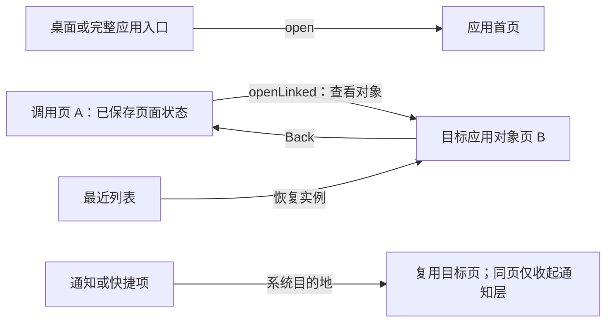

# 06 · 系统体验与接管边界

Yokuli 的方向是有统一桌面、磁贴、返回关系、通知与船舶数据的航海 OS。R0 先把已有 WP8 风格 Shell 放到 Android 的 HOME 位置，继续使用 Android 的系统服务；不能把“成为默认桌面”写成“已经替换整个 Android 系统界面”。

状态约定：**现有**指当前应用实现；**本轮配置**指 ROM flavor 和 AOSP 产品输入，尚待完整镜像启动验证；**后续计划**指未来工作，不是本次交付承诺。

## 1. 三个不同层次的“应用”

| 层次 | 用户看到什么 | 实际运行与生命周期 |
| --- | --- | --- |
| Yokuli 内部应用 | 海图、海图库、航行日志、守锚、我的航行、仪表、数据中心、船联网、数据共享、设置、磁贴库等 | 现有同一 APK、UID、进程中的业务模块；`AppId` 与页面实例由 Shell 管理 |
| Android 应用与 Task | 将来安装的第三方应用、Android Settings 等 | PackageManager / ActivityTaskManager 管理，独立包与系统任务，可能有多个 Activity/Task |
| Android 系统界面 | 锁屏、系统状态栏/导航、权限、系统通知和安装确认等 | R0 保留 SystemUI、Settings、权限/安装组件；Yokuli 不自行模拟授权结果 |

“关闭内部应用卡片”当前表示结束该 UI 会话，不等于卸载 APK、杀死独立进程或结束全局航行/守锚。航行、警报与 NMEA 连接由业务服务负责。将来拆分独立 APK 时，才需要真正的跨进程身份、版本与权限契约；现在不以业务模块名冒充 Android 安全隔离。

## 2. HOME 的第一步做到哪里

**本轮配置：** `rom` flavor 在 `MainActivity` 增加 `MAIN + HOME + DEFAULT` 声明，使用现有 Shell。产品预置 `PRESIGNED` 的普通 `product/app` APK，覆盖 Launcher3/Launcher3QuickStep 的预置项，让 Yokuli 成为预期的 HOME 候选；保留 SystemUI、Settings 与 Provision。没有平台签名、privileged 身份或权限自动授予。

Android HOME 是一种系统角色与 Intent 入口，不会自动赋予全部通知和任务控制能力。单独把 ROM APK 安装在普通手机上，还需走该设备的默认桌面选择流程；产品中唯一 HOME 的实际解析、首次开机和故障行为仍需启动验证。[Android HOME 角色](https://developer.android.com/reference/android/app/role/RoleManager#ROLE_HOME)

**现有：** `MainActivity` 的全屏/系统栏控制用于沉浸展示。系统栏可以由 Android 手势临时出现；这不是替换 SystemUI，更不是屏蔽所有系统入口。R0 不保证首次设置、锁屏、键盘、权限弹窗和外部应用已具有 WP8 视觉风格。

**验收时要分开记录：** HOME 能否启动、Yokuli 内部返回是否正确、Android 系统导航是否正常、保留的系统设置是否可达。移除 Launcher3QuickStep 不等于实现了新的系统 Overview；系统手势和 Overview 行为尤其需要在实际 Cuttlefish 镜像检查。

## 3. 三个虚拟键的职责固定下来

| 位置 | 短按 | 长按/补充 | 边界 |
| --- | --- | --- | --- |
| 左：返回 | 关闭当前临时层，返回当前应用子页/调用者；内部应用根页可回 Yokuli 桌面 | 长按进入 Yokuli 内部应用切换 | 不能把所有页面一律重开根页，也不能变成通知键 |
| 中：Home | 回 Yokuli 桌面 | 保留当前应用会话供最近列表恢复 | **Home 始终是 Home，不改成通知** |
| 右：通知 | 展开或收起 Yokuli 通知中心 | 替换原搜索键职责 | 不使用顶边下拉手势与 Android 系统通知手势争抢 |

上表是 Yokuli 内部虚拟键的行为，不等于重映射实体键、Android 导航栏或锁屏手势。内部应用根页不显示一个占空间的“返回 Yokuli OS”标题按钮；只有应用内子页或明确调用关系才出现对应的页面返回表达。

## 4. 返回、普通启动和查看对象是不同故事

**现有导航契约：**

- 普通 `open` 表示进入完整应用入口，避免上次查看某个标记后，新的“我的航行”入口仍困在标记详情。
- `openLinked` 表示“从这里查看那个对象”，保留调用页及其页面实例；从目标返回，应恢复原来的页签、选中对象、草稿和已保存地图视角。
- 最近列表表示恢复已有会话，保留其内部页面关系，不重新执行冷启动故事。
- 通知/快捷入口使用系统目的地导航：同页只收起通知层，复用可用目标页和调用链；不为了显示一次消息重新播放应用开场。

页面实例状态和长期业务状态分开：页签、选择与草稿可保存，正在执行的 IO/Job 不作为可恢复结果保存；航行记录、守锚会话和数据连接继续由统一仓储/服务维护。Android 杀进程后的业务恢复，不应仅依赖 Compose 的页面状态保存。

具体接口以 [应用导航契约](../product/APP_NAVIGATION_CONTRACT.md) 和 [OS 接口拓扑](../product/OS_INTERFACE_TOPOLOGY.md) 为准。ROM HOME 不新增第二套返回栈。

## 5. 最近列表：已有内部切换，系统任务仍在后续

**现有：** Shell 使用自身页面实例和窗口快照呈现内部应用卡片，拖动关闭跟随手势；卡片恢复的是内部页面，不是 Android 进程。快照采集只覆盖自身窗口内容，不读取别的应用私有画面。

普通 Android 应用不能依赖 `getRecentTasks` 取得完整系统任务列表；`AppTask` 管理的是自身任务。取得默认 HOME 身份也不自动解除这个边界。[ActivityManager](https://developer.android.com/reference/android/app/ActivityManager#getRecentTasks(int,int))、[AppTask](https://developer.android.com/reference/android/app/ActivityManager.AppTask)

**后续计划：** 真正统一内部应用和 Android Task 的 Overview，需要单独的系统集成设计，检查所选 AOSP 基线的 Launcher/Quickstep、SystemUI 与任务动画边界，再确定最小权限和实现位置。不能靠读取使用记录或 Accessibility 假装拥有可靠任务截图/关闭能力。

未来卡片模型至少区分 `InternalAppSession` 与 `AndroidTask` 的身份、启动/恢复方式、关闭语义和快照来源；这些名称是设计角色，尚不是新增的生产接口。工作资料、安全窗口和不能关闭的任务要遵循 Android 隐私与生命周期规则。退出卡片仍不能暗中解除业务警报。

## 6. 通知：内部消息与 Android 通知分层

**现有：** `SystemNotificationStore`、`MarineNoticeBridge` 和 `NotificationCenter` 提供的是 Yokuli 内部消息。轻量提示和历史列表共享消息，点击消费并进入明确目的地，横向滑动清除；删除消息不等于确认或解除守锚等业务警报。页面内通知快捷项可操作日夜、定位、常亮与相关活动，但仍走原业务写入口。

**尚未实现：** Android `NotificationListenerService` 桥接、第三方通知汇聚、系统级通知面板替换、锁屏通知策略。现有 Android 前台服务通知由 Android 管理；它与内部消息可能描述同一活动，但不是同一个存储对象。内部名字包含 “System” 不代表已经接管系统。

**后续桥接契约：**

| 项目 | 必须保留的语义 |
| --- | --- |
| 身份 | 包名、Android 用户/资料、系统通知 key，与内部消息 ID 分开，避免重复和串应用 |
| 内容 | 使用发布者允许公开的内容，尊重锁屏/敏感内容和资料边界；不绕过隐藏内容 |
| 点击 | 使用真实的系统 PendingIntent/操作，处理其失效和应用卸载；不能猜一个内部路由代替 |
| 清除 | 仅按平台允许取消的通知执行；持续任务/服务状态从原发布者读取 |
| 生命周期 | 连接、更新、分组、移除、监听权限撤回与进程恢复均需同步 |
| 业务警报 | 消息已读/移除与业务 ack、静音、停止值守分别建模 |

通知监听需要声明对应服务并取得系统允许的通知访问。它可以作为未来汇聚入口，但不会因此替换 SystemUI，也不能把监听服务伪装成系统权限控制器。[NotificationListenerService](https://developer.android.com/reference/android/service/notification/NotificationListenerService)

真正替换系统下拉面板属于再下一层 SystemUI 工作，需同时考虑锁屏、状态栏、持续通知、隐私提示、紧急界面和权限入口。R0 不实现，也不向用户宣称下拉的是 Yokuli 的系统通知中心。

## 7. 安装、卸载、权限与外部应用

**当前：** 内部 `AppId` 列表是随 APK 编译的产品模块，不是应用商店；移除磁贴不是卸载应用。当前没有完整的外部 Android 应用安装/卸载与启动管理 UI。

**后续计划：** 桌面可通过平台的应用目录与启动入口展示真正的 Android 包，区分内部应用与外部应用。`LauncherApps` 可用于面向启动器的应用/资料交互，仍需遵守系统可见性与用户边界。[LauncherApps](https://developer.android.com/reference/android/content/pm/LauncherApps)

安装流程应展示应用名、来源、版本、更新对象和系统返回的结果，通过 `PackageInstaller` 等平台入口提交，正确处理 `STATUS_PENDING_USER_ACTION`。普通 HOME 不做静默授权/静默安装。卸载交给系统确认；清除应用数据、卸载更新、移除桌面磁贴是不同动作。[PackageInstaller](https://developer.android.com/reference/android/content/pm/PackageInstaller)

定位、通知、相机及其他运行时权限仍由 Android 授予。Yokuli 可以说明为什么需要、当前是否获准、拒绝后哪些能力仍可使用，再引导系统授权；自己的 Switch 不能制造“已授权”状态。R0 保留 Android 权限界面，不为模仿 WP8 自绘一个没有权限效果的确认框。[Android 运行时权限](https://source.android.com/docs/core/permissions/runtime_perms)

## 8. 设置与业务应用的职责

| 入口 | 应负责 | 不应混入 |
| --- | --- | --- |
| Yokuli 设置 | 语言、单位、坐标格式、船舶基础资料、日夜/显示偏好、Shell 行为及关于信息 | NMEA 连接编辑、逐指标来源竞争、锚警的操作故事 |
| 数据中心 | 逐指标采用来源、候选读数/时间、手机 GPS 启停、手机安装与校准 | TCP/UDP 连接配置、输出目标或独立的第二套源选择 |
| 船联网 | 多连接、网络收发、连接诊断、发送内容与转发限制 | 把手机传感器列成一条虚构 NMEA 输入连接 |
| 数据共享 | 本机 NMEA 服务与发布内容、来源解释、监听状态 | 另造船位选择或隐式开启数据来源 |
| 磁贴库 | 按应用预览样式、尺寸、实时内容与桌面组织 | 重复固定相同类型来填满桌面，或把业务设置散进磁贴配置 |
| Android Settings | Wi-Fi/蓝牙、权限、锁屏、系统账户、设备信息及系统安全 | R0 中仍由保留的系统应用承担，不声称已有 Yokuli 原生替代 |

从业务应用进入系统设置只用于实际需要的设备操作，返回应回到原任务。普通看船位、看日志或选来源不应随意跳到设置。数据中心的单一来源事实见 [数据中心契约](../product/DATA_CENTER_CONTRACT.md)。

**后续系统偏好层：** 先列出每个设置的实际 Android API/服务、权限、读回状态和失败原因，再决定是否原生呈现。缺少权限时提供系统入口，不做一个不会生效的副本。多用户、船舶档案与工作资料未来也要明确谁拥有设置，不能共用一个无身份的全局 JSON。

## 9. WP8 体验在系统化时保持一致

**现有基线：** 内部页面继续采用统一的大标题/眉题层级、Pivot、方形选择控件、应用栏、磁贴和转场；字号、颜色、间距与触控区域走共同组件。地图、守锚等需要连续操作的内容使用共同地图交互，不另套旧地图故事。

**持续优化契约：**

- 开场动画表达冷启动；已有会话切回保持连续，通知同页操作不重播开场。
- 手势移动跟随手指，松手根据距离与速度结算；转场中保留可理解的来源/目标关系。
- 字号有主次，实时仪表大数值与紧凑说明各司其职；不能把所有文字统一放大或缩小。
- 安全区按圆角截面和挖孔向内收内容，背景保持全屏；系统栏与键盘变化不应让地图标记漂移。
- 动画丰富度不替代真实状态；权限等待、定位年龄、下载进度与数据缺失都使用真实事件。
- R0 先保证 Yokuli 内部一致；Android 系统对话框仍呈现平台样式，不能宣称整机已完整复刻 WP8。

## 10. 分期与可验收证据

| 阶段 | 范围 | 进入下一阶段的证据 |
| --- | --- | --- |
| 现有应用 | 内部桌面、应用会话、通知、数据与航海业务 | 对应 APK 的实际体验记录；不能以文档代替验证 |
| R0，本轮配置 | Cuttlefish 产品输入、普通预置 HOME、纯 AOSP 地图选择、保留基础系统组件 | 后续完整构建、首次启动、HOME/系统导航与权限验证；本轮未获得 ROM 启动证据 |
| R2 的第一步，后续计划 | 外部应用目录与平台安装入口、通知监听桥及清晰权限引导 | 拒绝/撤回权限、第三方应用、持续通知和调用者恢复验证 |
| R2，后续计划 | 受控的系统 Overview/通知与状态栏集成 | 系统权限设计、Task/隐私/锁屏/故障恢复验证，不能只验内部截图 |
| 真机产品，后续计划 | BSP、传感器、供电、更新、加密与长期运行 | 对应硬件的实测、升级/恢复证据与生产签名；不由模拟器结果推定 |

实现入口：[MainActivity](../../app-shell/src/rebuild/java/com/yokuli/marine/shell/rebuild/MainActivity.kt)、[Shell Runtime](../../app-shell/src/rebuild/java/com/yokuli/marine/shell/rebuild/WpShellRuntime.kt)、[内部通知中心](../../app-shell/src/rebuild/java/com/yokuli/marine/shell/rebuild/ui/NotificationCenter.kt)。设备边界见 [04 · 设备与硬件](04-DEVICE-AND-HARDWARE.md)，发行边界见 [05 · 安全与更新](05-SECURITY-AND-UPDATES.md)。
