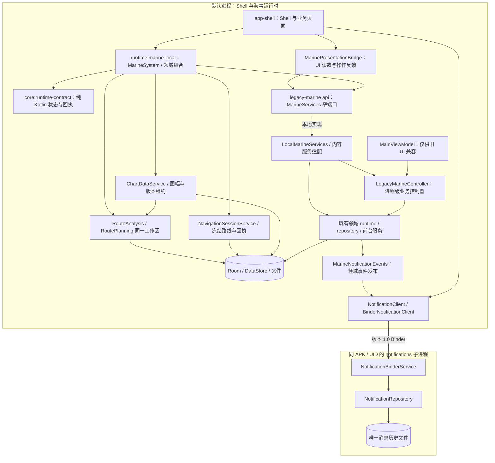

# 10 · 已接入的运行时与通知系统边界

本页维护当前生产代码边界，文件名保留以兼容已有链接。海事运行时仍在默认进程，通知历史已迁到同 APK/UID 的 `:notifications` 进程，并有真实发布者、Binder 客户端和通知页面消费者。**通知 IPC 不等于完整 Marine Core 隔离或 Android 系统通知接管**。

实际入口以 `app-shell/build.gradle.kts` 的 `src/rebuild` sourceSet 与 rebuild Manifest 为准。[主实施规则](../product/YOKULI_MASTER_EXECUTION.md)、[领域接入指导](02-DOMAIN-AND-CONTRACTS.md#新功能接入路径)、[通知专项](../product/NOTIFICATION_CENTER_CONTRACT.md) 分别维护任务约束、扩展路径与通知产品决策。编译/镜像/设备状态独立陈述，不从接口存在推定能力已运行。

## 1. 模块按实际依赖分层



| 位置 | 当前代码职责 | 明确不承担 |
| --- | --- | --- |
| `core:runtime-contract` | 纯 Kotlin 的连接/位置/录制/守锚/AIS 契约，以及通知记录、目标、请求、结果和订阅快照 | Android API、legacy DTO、数据库、UI 文案、实际服务启动 |
| `runtime:marine-local` | `MarineSystem`、共享航行命令协调、导航会话、结构化海图数据、离线规划、AIS 及通知 Binder 服务/客户端、持久事件到通知桥 | Shell 页面、磁贴、Compose 动画或反向依赖 `app-shell`；UI 不取得业务实现和 DAO |
| `legacy-marine/api` | 当前迁移用的领域命令端口与兼容读投影 | 宣称自己已经是稳定公共 SDK / Binder schema |
| `LocalMarineServices` | 将窄端口委托给同一个控制器和内容服务 | 创建第二份数据来源、活动航行、守锚或数据库 |
| `LegacyMarineController` | 原 ViewModel 中的执行、订阅和服务编排，使用应用进程范围 | Activity 生命周期、Compose 选择/草稿、系统权限弹窗 |
| `MainViewModel` | 旧页面的转发兼容入口 | 新 Shell 的服务定位器、业务状态所有者或第二个控制器 |
| `app-shell` | 用户故事、页面状态、Shell 导航、通知面板/提示投影、显示格式 | 直接获取业务 Controller/DAO、写通知历史或按面板生命周期启动领域任务 |

**仍然存在的编译依赖：** `runtime:marine-local` 当前通过 `api(project(":legacy-marine"))` 暴露迁移所需类型。服务接口也暂在 legacy 模块中，因此 Shell 仍能编译期看到部分 legacy 类型。本轮不是“已经移除 legacy 依赖”，而是约束活动调用方只经过明确端口；脚本帮助阻止重新直连实现。

## 2. MarineServices 是入口，领域端口是写入方向

| 属性 | 接口 | 命令/读取范围 |
| --- | --- | --- |
| `sources` | `DataSourceService` | 逐指标选源、手机定位启停、位置连接选择、权限变化、安装/船首向确认 |
| `voyages` | `VoyageService` | 同一个航行会话的开始/暂停/继续/结束、时刻、历史编辑、地图资料及导出 |
| `anchor` | `AnchorService` | 下锚草稿、值守、暂停/继续、起锚、警报确认、条件警戒及锚点估计 |
| `network` | `NetworkService` | NMEA 多连接的保存、连接、断开、移除和连接状态 |
| `sharing` | `SharingService` | 本机发布策略、监听服务启停与明确停止共享 |
| `preferences` | `VesselPreferencesService` | 语言、船体尺寸、船名/吃水、声音/提醒间隔、仪表排列的独立命令，以及资料备份与恢复 |
| `feedback` | `MarineFeedbackService` | 运行反馈消费与应用目的地事件；不替代警报业务确认 |
| `display` | `DisplayDemandService` | 独立申请地图航向/实时仪表的显示句柄；不隐式开启全局业务 |
| `content` | `MarineContentService` | 地点/锚地内容与集合、历史点/事件等读取或修改；数据库留在实现侧 |

接口位置：[MarineServices.kt](../../legacy-marine/src/main/java/com/yokuli/anchorwatch/api/MarineServices.kt)。调用者应把动作交给对应端口，而不是向一个万能字符串命令入口发送方法名。

这些是同进程代码边界，不是基于调用方 UID 的安全授权。多个应用可以通过同一个端口参与完整故事，例如海图和日志都操作同一个航行；通知快捷项读取来源摘要并导航到数据中心，由数据中心明确修改同一来源策略。端口决定“哪一领域拥有状态”，不要求用户只能从某一个页面操作。

### 偏好不再回写整份旧快照

新端口不接受 `AppSettings` 或 `VesselDataSettings` 整对象。六个写入入口为 `setLanguage`、`setVesselGeometry`、`setVesselIdentity`、`setAlarmSound`、`setAlarmSnoozeMinutes`、`setInstrumentLayout`，只携带本次修改字段，返回执行 `Job`。

调用路径是页面 → `preferences` 窄命令 → 控制器 → Repository 的字段级 `DataStore.edit`，只写相应键。例如改变船名或仪表排列不会附带旧的 `metricSourcePins`，改变声音不会附带旧的 GPS/连接/共享开关。控制器的旧整对象方法仍为旧 UI 保留，但不在新端口中，Shell 源码守卫也禁止调用。

“先读取最新 StateFlow 再 copy 整对象”仍可能在异步回流窗口覆盖并发选源，因此本轮直接采用字段级持久化，而不是只更换方法名称。数值范围、有限值和自定义音频 URI 等输入在执行层验证，保存结果继续由真实读投影确认。

## 3. 读模型为什么还没有全部独立

**当前兼容投影：** `MarineStateReader.state: StateFlow<MainUiState>`。多个端口读取同一事实快照，调用者拿不到 `MutableStateFlow` 或控制器，但快照仍包含旧实体、旧 UI 字段及其他 legacy 值类型。

因此这轮必须同时承认两点：

- 页面已经通过只读观察与命令端口交互，可以逐步替换服务实现。
- `MainUiState` 不是完整 OS 公共数据模型，Room entity 也不是跨进程消息格式。Android `Uri`、`ComponentName`、协程 `Job` 等当前签名进一步表明这些端口仍是本地迁移接口。

下一步应按领域把确有消费者的稳定字段抽到纯契约模块，声明 ID、单位、来源、采样时间、质量与版本，再迁移调用者。不要一次复制整个 `MainUiState` 到 `core` 里，改名后声称完成分层。

`core:runtime-contract` 已有的独立类型是有限范围：`RuntimeConnection`、`RuntimeTransport`、`RuntimeReadiness`、`RuntimeBindingResult`、`PositionSourceRequest`、`VoyageSessionState` 和航行命令事件等。源码以 [RuntimeContract.kt](../../core/runtime-contract/src/main/kotlin/com/yokuli/runtime/contract/RuntimeContract.kt) 为准。

### READY 的含义有限

本地组合层当前用设置加载完成推进运行时 `READY`。这表示兼容运行时的初始化阶段，不表示 GPS 已定位、NMEA 已连接、警报一定可响或所有硬件正常。这些能力仍需读取各领域的真实状态。

`RuntimeBindings.resolve(BINDER)` 仍返回 `ROM_BINDER_NOT_IMPLEMENTED`，这里特指**完整 MarineSystem**。通知已独立接入 `NotificationClient` 的版本化 Binder，不通过这个全域占位枚举冒充所有端口已远程化。完整海事端口和第三方授权仍未完成。

## 4. 生命周期从页面中移出什么

**控制器：** `LegacyMarineController` 使用 `@Singleton` 和自身 `CoroutineScope(SupervisorJob() + Dispatchers.Main.immediate)`。`MainViewModel` 只转发同一个控制器，不以页面 `onCleared` 作为停止船位、航行、守锚或 NMEA 的信号。

**系统组合：** 默认进程的 `InProcessMarineSystem` 为本地 `MarineServices` 和航行协调提供进程内宿主。具体接线见 [MarineSystem.kt](../../runtime/marine-local/src/main/java/com/yokuli/runtime/marine/MarineSystem.kt)。应用只取得 `MarineSystem` 接口；`MarineSystemBootstrap` 是合法宿主初始化入口，承担一次性的旧后端诊断初始化，不启动 GPS/连接/业务会话。应用不能直接引用本地系统实现、协调器、DI 绑定或 `LegacyMarineRuntime`。普通 APK 与 ROM HOME 复用这一路径，不维护两套运行时。

**显示需求：** `acquireMapHeading()`、`acquireInstruments()` 各返回独立的 `DisplayLease`。第一个消费者申请才开启对应显示需求，最后一个消费者释放才关闭；`close()` 幂等，关闭一个页面不会撤销另一个页面仍持有的需求。Shell 在 `DisposableEffect` 中持有和释放句柄。这是同进程引用计数，不是 Binder 死亡通知或跨进程资源租约；显示句柄关闭也不停止全局航行/守锚。

**仍然会中断的情况：** 默认进程崩溃、被系统终止或设备重启仍会影响海事对象。通知进程故障只隔离消息历史，不能替海事运行时维持守锚或记录。`@Singleton` 只限定进程内实例；`SupervisorJob` 不是故障隔离、持久任务日志或后台存活保证。后台限制、前台服务、持久资料和恢复判断仍由 Android 及既有业务执行层承担，参见 [03 · 生命周期与恢复](03-LIFECYCLE-AND-RECOVERY.md)。

## 5. 航程录制状态属于运行时，UI 只作投影

[VoyageSessionCoordinator](../../runtime/marine-local/src/main/java/com/yokuli/runtime/marine/VoyageSessionCoordinator.kt) 是航行窄客户端/投影；唯一执行账本由 legacy 运行时的 `VoyageCommandRegistry` 持有。`MarineSystem.voyage` 对应用暴露纯契约中的 `VoyageSessionService`，不暴露协调器实现类。活动会话来自服务读投影，包含 ID、名称、距离、起始/暂停时间和时刻数；Shell 再按用户单位和语言呈现。

开始、暂停、继续、结束通过 `VoyageSessionService.request(VoyageRequest)` 或兼容便利方法进入同一协调器，`VoyageRequest` 保留 requestId、动作、expectedSessionId、名称和姿态记录意图。`commands: StateFlow<List<VoyageCommandReceipt>>` 直接投影 `MarineServices.voyages.commandResults`，由 `VoyageCommandRegistry` 保留有界进程内账本，状态为 QUEUED / EXECUTING / UNKNOWN / CONFIRMED / REJECTED / FAILED。Controller 投递带 requestId 的 `RuntimeCommand.Voyage`，`YokuliRuntimeCoordinator.launchTrackedVoyage` 在原 trip actor 中校验来源/目标会话、执行并读取 TripDao 的持久结果，再写终态；不再仅依据 MainUiState 的某个变化推断成功。

18 秒未确认变为 UNKNOWN 后保留原请求，不释放并行命令锁，也不自动再发 Start/Finish。`VoyageSessionService.recheck` → `MarineServices.voyages.recheckCommand` → Controller → `RuntimeCommand.QueryVoyage` → `queryTrackedVoyage` 在原 trip actor 内只读 TripDao 并更新原回执。Start 成功先关联实际 sessionId 再核对落盘事实；若中断前尚未关联，不把其他活动会话猜成本请求结果。执行中断或执行后异常保留 UNKNOWN，尚未执行的 QUEUED 在服务关闭时明确 FAILED，实际业务拒绝为 REJECTED。用户明确 FINISH 可在旧 UNKNOWN 后排队，结束真正落盘后才替代旧请求，避免界面永久无法结束会话。

晚到的原执行及持久结果仍能完成原回执；投影本身不以旧状态完成它。关闭通知/页面不丢失等待；当前任务卡从这份账本及 `VoyageSessionState` 显示正在处理/结果未确认。`VoyageCommandFeedback` 已在记录对话框及日志入口接入原请求查询。`MarineNotificationEvents` 直接订阅 `commands`，按 requestId 更新同一通知卡；`events` 仅保留兼容反馈队列，不是请求或通知状态的唯一记录。

Shell 的所有航行启停经 `MarinePresentationBridge` 转发到共享 `VoyageSessionService`。`services.voyages.startTrip/pauseTrip/resumeTrip/endTrip` 仅供运行时适配调用，页面不能直接调用或取方法引用，否则新按钮会绕过全局命令等待与确认。静态守卫明确检查这四个旧入口；历史编辑和导出等命令仍走相应领域端口。

这仍是**进程内**账本，不是持久幂等航行协议。进程重启后的请求追踪、调用方身份及航行 IPC 仍未完成；通知持久回执不扩大成航行的保证。纯契约保留业务代码，Shell 决定用户反馈。

这里的 `VoyageSessionCoordinator` 负责轨迹录制。实际路线导航的冻结路线、目标索引和引导计算目前仍在 `OsStore` / UI `Navigation.kt` 中，不能把录制协调器称为已完成的 `NavigationSessionService`。两者是独立生命周期，导航领域迁移属于后续工作。

### 守锚回执（experience.9）

`MarineSystem.anchorCommands` 暴露纯 Kotlin 的 `AnchorCommandMonitor`。`AnchorCommandSnapshot` 携带 commandId、操作类型、expectedSessionId、实际 sessionId、状态和原因代码；进程内 `AnchorCommandRegistry` 保存请求账本，执行层按相同 ID 写回结果。页面及通知快捷项只订阅，NMEA 等通用通知不参与命令确认。

`requestArm`、`requestPauseWatch`、`requestResumeWatch`、`requestLiftAnchor` 提交命令后返回 ID。运行时在同一个串行执行块中校验目标会话、执行并读取数据库事实；45 秒未收到终态只变为 UNKNOWN，仍允许真实回执迟到。清除通知、显示回执、关闭页面都不能解除值守。

该账本仍是进程内机制，不承诺进程被杀或重启后的持久请求去重，也不是独立 Binder 运行时。

### 点击捕获与补记（experience.19）

`MarineServices.voyages.captureMoment/restoreMoment/retryMoment/editCapturedMoment` 经 `LocalMarineServices` 委托同一 `TripRuntime`。点击入口冻结航程 ID、UTC 与 Hub 快照，返回稳定 requestId；`capturedMoments` 给 UI 发布 SAVING / SAVED / UPDATING / FAILED / REJECTED / NOT_RECOVERABLE。没有另建采集器或航行会话。

`TripMomentJournal` 用 AtomicFile 保存未完成捕获及用户明确提交的文字草稿；`TripDao.insertCapturedMoment` 在原 Room 事务中插入 USER_MOMENT 并更新原航程计数。重启重放已写入日志的同一 ID，已在数据库存在时读取原事件，不能再次取时间与位置。尚未写到日志即遭进程终止的点击不能承诺恢复，UI 此时仍显示保存中。缺合格位置为 null，采集证据保留来源、观察 UTC、接收 elapsed、质量、时效与参考；备注只改用户字段。

该能力仍是同进程 `VoyageService` 接线，使用既有 legacy 事件 DTO，并非独立 IPC 或新的 Marine Core 进程。日志、地图回看与原多格式导出已消费这份事件；页面离开不取消写入。当前仅支持文字/类型，不引入未接入的照片模型。

开始屏幕图片由宿主 `StartBackgroundStore` 管理：只拥有系统外观，不拥有海事状态。照片缩小解码并写入私有文件后，原 Launcher DataStore 原子更新引用；后续选项和布局继续共享原偏好所有者。普通 APK 与 ROM HOME 使用同一绘制与存储实现。

## 6. 内容访问与数据库边界

地点、锚地、集合、历史轨迹与警报事件需要共享，但 UI 不应为了显示一个列表就拿到 `AppDatabase`。本轮通过 [MarineContentService](../../legacy-marine/src/main/java/com/yokuli/anchorwatch/api/MarineContentService.kt) 暴露实际用户故事需要的读取和修改，由本地实现调用已有 repository/DAO。

`MySailingRepository` 是 UI 内容投影/调用门面，不再用 Hilt EntryPoint 取得业务数据库。守锚的轨迹读取、地点集合成员读取和内部警报通知订阅也应走内容端口。通知消费仍不解除业务警报，数据库访问位置改变不改变这一语义。

实体值类型暂可作为参数和返回值保留；这不意味着 UI 可以通过 entity 包任意取得 DAO。另一方面，Shell 中仍有自己的页面、磁贴、地图选择以及部分坐标/航线文件状态，本轮并没有把所有持久资料搬到新的统一 OS 数据库。

experience.9 将 Shell 坐标和计划航线的写操作集中到 `MySailingRepository`，通过 `DurableSnapshotStore` 保存原 `experience-v1.json`。内存投影与 `DurableCommit` 分离，用户成功反馈等待真实落盘。失败后重试当前快照，不重复导入或新增对象；这不包含 Room 锚地资料与 Shell 文件之间的跨存储原子事务。

当前读取通过 `readShellContent` 完整校验旧格式/版本与所有收藏、航线、草稿元素；无法读取时 `PersistenceState.readFailure` 使唯一写者拒绝覆写。`OsStore.retryContentRead` 从原文件重新读取，先保留完整独立恢复副本再合并当前收藏/航线，当前非空草稿优先；恢复副本可经真实系统文件选择器导出。`ContentRecoveryStatus` 是通知中心和失效对象页的实际恢复入口。文件仍损坏时继续保护，不冒充已恢复；这条恢复链不自动执行导航、记录或守锚。

## 7. 可执行的源码边界检查

从仓库根执行：

```sh
python3 scripts/check_runtime_boundaries.py
```

相同检查由 `:app-shell:checkRuntimeBoundaries` 执行，并作为 `preBuild` 依赖作用于所有 APK flavor。构建机需要 Python 3；脚本失败或 Python 缺失会让构建失败，不跳过检查或吞掉退出码。

脚本位置：[check_runtime_boundaries.py](../../scripts/check_runtime_boundaries.py)。它扫描 `app-shell/src/rebuild` 的**全部 Kotlin/Java 生产源**，以及 `core`、`runtime` 全部生产 source set，不挑选少数已迁移文件。测试 source set 和构建产物不作为生产调用方；必要生产根目录缺失或为空也会失败。

| 规则 | 阻止什么 |
| --- | --- |
| `SHELL_IMPLEMENTATION` | Shell 引用 `MainViewModel`、`LegacyMarineController`、本地服务/内容实现、`InProcessMarineSystem`、`VoyageSessionCoordinator`、`MarineSystemBindings` 或 `LegacyMarineRuntime` |
| `SHELL_VM_ACCESS` | `.vm`、`?.vm`、`::vm` 等实际成员访问；包含跨行和字符串插值中的代码 |
| `SHELL_BROAD_PREFERENCES` | Shell 调用旧 `updateSettings` / `updateVesselDataSettings` 整对象写入口 |
| `SHELL_RAW_VOYAGE_COMMAND` | Shell 直接调用或引用 `startTrip` / `pauseTrip` / `resumeTrip` / `endTrip`，绕过共享航行协调器 |
| `SHELL_DATABASE` | DAO 类型/字段/工厂、`AppDatabase` 等实现，或直接调用数据库获取工厂 |
| `REVERSE_SHELL_REFERENCE` | `core` / `runtime` 生产源反向引用 `com.yokuli.marine.shell` 包 |
| `CONTRACT_PLATFORM_REFERENCE` | `core:runtime-contract` 使用 Android、AndroidX、Google Android 或 legacy 类型 |
| `REQUIRED_SOURCE_ROOT` | 必需的 Shell/契约/本地运行时生产目录缺失，防止空扫描显示成功 |
| `STALE_EXCEPTION` | 已失效或没有原因的豁免 |

注释与普通字符串会被遮罩，Kotlin `${...}` 里的真实代码仍检查。`AnchorSessionEntity` 等 DTO 不因位于 `data.database` 包而误报；调用 `anchorDao()` 则属于越界。显式例外必须列出规则、文件、行号、命中内容和原因，禁止目录通配或整文件豁免；当前例外列表为空。

检查退出码 `0` 表示这些静态规则通过，`1` 表示需要修复。它是词法边界检查，不是 Kotlin 类型分析：不会证明隐藏在反射中的调用、所有传递依赖、并发正确性、完整权限边界或 UI 行为。构建、必要的业务验证与实际设备检查仍各自记录。不能把脚本通过写成“OS 分层已经全部完成”。

## 8. 通知的真实 S1–S4 接入闭环

| 所有者 / 文件 | 实际职责 |
| --- | --- |
| `core/runtime-contract/.../notification/NotificationContract.kt` | 不依赖 Android/legacy 的记录、文本、类型化目标、命令、结果、连接状态及 NotificationClient |
| `runtime/marine-local/.../notification/MarineNotificationEvents.kt` | 默认进程唯一守锚/AIS 事件发布桥，订阅内容/交通服务，以领域 ID 与游标发布；不依赖 OsStore 或通知页面 |
| `NotificationRepository.kt` | 子进程唯一写者；历史、聚合、已读、清除、幂等去重、回执与故障恢复 |
| `NotificationBinderService.kt` | 非导出同 UID 服务、协议检查、分页、有限订阅与 client death 清理 |
| `BinderNotificationClient.kt` | 主进程共享连接、IO 传输、握手/重连、epoch/revision 快照与未知结果查询 |
| `SystemNotifications.kt` | NotificationClient 的 Shell 兼容投影及 toast 队列；无文件写入、无业务事件游标、无 expanded 状态 |
| `NotificationShadeState.kt` / `NotificationCenter.kt` | Shell 面板状态、跟手动画、输入/焦点、可见已读和历史操作；不拥有领域任务 |
| `NotificationQuickActions.kt` / `NotificationTasks.kt` | 显示偏好结果、来源/连接只读摘要、原领域当前任务与命令入口 |
| `WpShellRuntime.kt` / `WpShellExperience.kt` | 统一关闭/Back/Home、通知交接、原实例恢复、输入屏蔽、显示租约与截图资格 |

`YokuliApplication` 按进程角色装配：`:notifications` 不初始化 Shell、海事 runtime、Room、定位或 socket。消息服务用 `notifications/history-v1.json`，旧 `system-notifications.json` 留作只读迁移输入，旧 Shell 直接写入与 `MarineNoticeBridge` 的领域订阅路径已退出。服务使用普通版本化 Binder 1.0，非 Stable AIDL；同 UID 不是独立安全边界。细节见 [通知契约](../product/NOTIFICATION_CENTER_CONTRACT.md)、[03](03-LIFECYCLE-AND-RECOVERY.md)、[05](05-SECURITY-AND-UPDATES.md)。

## 9. 按真实缺口继续

1. 逐领域迁出兼容 `MainUiState`/legacy entity，不整体搬到 core 改名；新契约必须有真实消费者。
2. 路线导航状态仍在 OsStore/Navigation.kt，内容仍跨 Room 与 Shell JSON；这两项尚未完成独立领域/跨存储原子迁移。
3. 记录、守锚、AIS 和显示租约仍在默认进程，尚无完整 Marine Core Binder、独立 UID、持久幂等会话命令或统一 boot 恢复屏障。
4. 通知不读取第三方通知，不替换 Android SystemUI/Recents，不迁移航海服务到 system_server。
5. ROM 产品输入和 HOME flavor 已有，完整镜像、Cuttlefish 启动、真机/BSP、AVB/OTA 与发行密钥仍各有外部依赖，不能以本轮消息 IPC 或必要编译推断完成。

## 内容磁贴接入闭环（2026-09-25）

普通 APK 与 ROM HOME 均由 rebuild 的 `WpShellRuntime` 安装同一内容提供者目录；动态内容仅是既有 App 的查看入口，不扩充应用身份。App/工坊/Start 发起 `TileWorkshopController` 临时会话，经 `LauncherEngine.commitTile/removeTile/undoTile`、原 `ProtoDataStoreLauncherPersistence` 更新唯一 `launcher_state.pb`，真实桌面读取已落盘 `StartDocument`。静态 Host 可更新内容入口目录；All Apps 和搜索仍只展示正式 App。

合同层 `TileBinding/TilePresentation` 不依赖 Android/Compose/OsStore。引擎只校验身份、内容键、版本、尺寸与排布；业务对象是否存在由 UI 组合层只读提供者处理，不能在结构恢复阶段据此删磁贴。`TileLayoutPreview.place` 与正式保存共用纯排布规则；未知提供者及未来字段保留，旧 App 偏好一次性迁入实例。

存储格式 LauncherPersistedState schema 5；StartDocument 延续 schema 2 并追加实例/文档版本、32 条近期回执、32 条移除逆操作、恢复说明。草稿纯配置最多 64 KiB，与文档同属原 DataStore。实例移除/撤销不修改业务数据；撤销或扩尺寸时原格被占，只安排目标的最近空位并说明，保留其他实例与 Spacer 的实际位置。慢写期间导航仍可处理，正式布局必须待回执发布。

呈现通过现有系统快照与 DataHub，不创建传感器订阅源、后台地图或航行会话；只在可见且 RESUMED 时观察所需字段。此能力为当前进程内系统边界的完整接入，不宣称已经有磁贴 Binder 服务、独立进程隔离或新 ROM 镜像。


## 导航、图册数据和自动规划迁移闭环

`MarineSystem.navigation/charts/analysis/planning` 已由 `InProcessMarineSystem` 注入真实所有者。海图的工具菜单、自动规划面板、图册数据页、驾驶台导航读数和磁贴均已接入。导航从 OsStore 活动路线 JSON 迁移为 `LocalNavigationSessionService` 的持久会话，旧字段仅一次性导入，兼容 getter 为只读；导航 FGS 持有独立 NAVIGATION_SESSION 租约，不借用页面寿命或录制状态。

`LocalChartDataService` 的文档读取、解析、SQLite 版本安装和许可状态不放在页面；地图只查询选中数据集的快照。`LocalPassagePlanningService` 的检查、搜索、取消与结果持久化不随页面离开而结束。它们并未因此成为独立 UID 或 Marine Core IPC 服务；ROM HOME 与普通 APK 注入同一套本地能力。

图库的资料浏览也接入上述所有者：MBTiles 仍走显示目录，S-57 与 GeoPackage 进入同一版本索引；资料包 / 图幅 / 分类搜索对象 / 对象详情只调用 `charts` 的 `browse/readFeature/query`。只读地图预览不改变当前资料选择或开始业务任务。页面的快照与一次 SQLite 读取的临时租约分别释放，包更新 / 移除不能破坏尚在读取的版本。GeoPackage 支持范围和字段映射由 [profile](../GEOPACKAGE_CHART_PROFILE.md) 维护；QGIS 等工具编辑原包后整包原子更新，App 没有官方深度编辑写端口。

自动规划已接入共享 `PassagePlanningEligibility` 与实际区域证据门槛：明确选中的多个包共同提供覆盖和深度；无数据、不可读、用途不允许或缺实际支持时返回原因与零候选，不能进入搜索。规划页共享该状态禁用自动操作，并提供资料管理和不覆盖现有草稿的手动编辑入口。这个闭环不新增 S-63 / S-101 解码、潮汐或天气能力，也不把普通 GIS 参考包当成获认可的导航资料。

显示用设备视线由独立 `DisplayDemandService.deviceViewOrientation` 租约提供，只观察现有旋转矢量源，不修改船艏来源或安装校准。真北转换缺乏位置/时间依据时，立体视图降级到明确的二维方向信息。显示补间不改写原始四元数、采样时间或导航指导。
