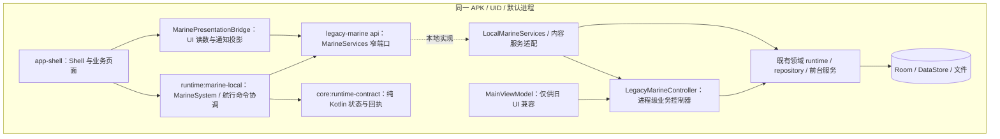

# 10 · 已落代码的进程内系统边界

这轮先把“应用页面直接控制一个大 ViewModel”改成“应用调用领域端口，运行时拥有业务执行”。它是实际的源码与生命周期分层，**仍在同一个 APK、UID 和进程内**。没有新增 Binder 服务、独立进程或故障隔离，也没有让普通 HOME 获得 Android 系统权限。

本页描述本轮运行时重构，补充 [01 · 分层架构](01-ARCHITECTURE.md) 中以 R0 提交为基线的旧拓扑。编译与设备验证应查本次交付记录，不能从下面的设计说明推定已经通过。

## 1. 模块按实际依赖分层



| 位置 | 当前代码职责 | 明确不承担 |
| --- | --- | --- |
| `core:runtime-contract` | 纯 Kotlin 的运行时连接状态、传输类型、位置请求及航行状态/命令回执 | Android API、legacy DTO、数据库、UI 文案、实际服务启动 |
| `runtime:marine-local` | Android 组合层，提供 `MarineSystem`，绑定本地服务并拥有共享航行命令协调器 | Shell 页面、磁贴、通知文案或反向依赖 `app-shell`；应用不能直接实例化/注入本地实现 |
| `legacy-marine/api` | 当前迁移用的领域命令端口与兼容读投影 | 宣称自己已经是稳定公共 SDK / Binder schema |
| `LocalMarineServices` | 将窄端口委托给同一个控制器和内容服务 | 创建第二份数据来源、活动航行、守锚或数据库 |
| `LegacyMarineController` | 原 ViewModel 中的执行、订阅和服务编排，使用应用进程范围 | Activity 生命周期、Compose 选择/草稿、系统权限弹窗 |
| `MainViewModel` | 旧页面的转发兼容入口 | 新 Shell 的服务定位器、业务状态所有者或第二个控制器 |
| `app-shell` | 应用用户故事、页面状态、Shell 导航、显示格式与通知投影 | 直接获取 ViewModel/Controller/本地实现/业务 DAO |

**仍然存在的编译依赖：** `runtime:marine-local` 当前通过 `api(project(":legacy-marine"))` 暴露迁移所需类型。服务接口也暂在 legacy 模块中，因此 Shell 仍能编译期看到部分 legacy 类型。本轮不是“已经移除 legacy 依赖”，而是约束活动调用方只经过明确端口；脚本帮助阻止重新直连实现。

## 2. MarineServices 是入口，领域端口是写入方向

| 属性 | 接口 | 命令/读取范围 |
| --- | --- | --- |
| `sources` | `DataSourceService` | 逐指标选源、手机定位启停、位置连接选择、权限变化、安装/船首向确认 |
| `voyages` | `VoyageService` | 同一个航行会话的开始/暂停/继续/结束、时刻、历史编辑、地图资料及导出 |
| `anchor` | `AnchorService` | 下锚草稿、值守、暂停/继续、起锚、警报确认、条件警戒及锚点估计 |
| `network` | `NetworkService` | NMEA 多连接的保存、连接、断开、移除和连接状态 |
| `sharing` | `SharingService` | 本机发布策略、监听服务启停与明确停止共享 |
| `preferences` | `VesselPreferencesService` | 语言、船体尺寸、船名/吃水、声音/提醒间隔、仪表排列的独立命令，以及资料备份与恢复 |
| `feedback` | `MarineFeedbackService` | 运行反馈消费与应用目的地事件；不替代警报业务确认 |
| `display` | `DisplayDemandService` | 独立申请地图航向/实时仪表的显示句柄；不隐式开启全局业务 |
| `content` | `MarineContentService` | 地点/锚地内容与集合、历史点/事件等读取或修改；数据库留在实现侧 |

接口位置：[MarineServices.kt](../../legacy-marine/src/main/java/com/yokuli/anchorwatch/api/MarineServices.kt)。调用者应把动作交给对应端口，而不是向一个万能字符串命令入口发送方法名。

这些是同进程代码边界，不是基于调用方 UID 的安全授权。多个应用可以通过同一个端口参与完整故事，例如海图和日志都操作同一个航行，通知快捷项与数据中心都向来源端口发出明确命令。端口决定“哪一领域拥有状态”，不要求用户只能从某一个页面操作。

### 偏好不再回写整份旧快照

新端口不接受 `AppSettings` 或 `VesselDataSettings` 整对象。六个写入入口为 `setLanguage`、`setVesselGeometry`、`setVesselIdentity`、`setAlarmSound`、`setAlarmSnoozeMinutes`、`setInstrumentLayout`，只携带本次修改字段，返回执行 `Job`。

调用路径是页面 → `preferences` 窄命令 → 控制器 → Repository 的字段级 `DataStore.edit`，只写相应键。例如改变船名或仪表排列不会附带旧的 `metricSourcePins`，改变声音不会附带旧的 GPS/连接/共享开关。控制器的旧整对象方法仍为旧 UI 保留，但不在新端口中，Shell 源码守卫也禁止调用。

“先读取最新 StateFlow 再 copy 整对象”仍可能在异步回流窗口覆盖并发选源，因此本轮直接采用字段级持久化，而不是只更换方法名称。数值范围、有限值和自定义音频 URI 等输入在执行层验证，保存结果继续由真实读投影确认。

## 3. 读模型为什么还没有全部独立

**当前兼容投影：** `MarineStateReader.state: StateFlow<MainUiState>`。多个端口读取同一事实快照，调用者拿不到 `MutableStateFlow` 或控制器，但快照仍包含旧实体、旧 UI 字段及其他 legacy 值类型。

因此这轮必须同时承认两点：

- 页面已经通过只读观察与命令端口交互，可以逐步替换服务实现。
- `MainUiState` 不是完整 OS 公共数据模型，Room entity 也不是跨进程消息格式。Android `Uri`、`ComponentName`、协程 `Job` 等当前签名进一步表明这些端口仍是本地迁移接口。

下一步应按领域把确有消费者的稳定字段抽到纯契约模块，声明 ID、单位、来源、采样时间、质量与版本，再迁移调用者。不要一次复制整个 `MainUiState` 到 `core` 里，改名后声称完成分层。

`core:runtime-contract` 已有的独立类型是有限范围：`RuntimeConnection`、`RuntimeTransport`、`RuntimeReadiness`、`RuntimeBindingResult`、`PositionSourceRequest`、`VoyageSessionState` 和航行命令事件等。源码以 [RuntimeContract.kt](../../core/runtime-contract/src/main/kotlin/com/yokuli/runtime/contract/RuntimeContract.kt) 为准。

### READY 的含义有限

本地组合层当前用设置加载完成推进运行时 `READY`。这表示兼容运行时的初始化阶段，不表示 GPS 已定位、NMEA 已连接、警报一定可响或所有硬件正常。这些能力仍需读取各领域的真实状态。

`RuntimeTransport.BINDER` 只是预留枚举值；`RuntimeBindings.resolve(BINDER)` 明确返回 `ROM_BINDER_NOT_IMPLEMENTED`。不能因为类型里出现 Binder 就宣称存在远程服务。

## 4. 生命周期从页面中移出什么

**控制器：** `LegacyMarineController` 使用 `@Singleton` 和自身 `CoroutineScope(SupervisorJob() + Dispatchers.Main.immediate)`。`MainViewModel` 只转发同一个控制器，不以页面 `onCleared` 作为停止船位、航行、守锚或 NMEA 的信号。

**系统组合：** `InProcessMarineSystem` 为本地 `MarineServices` 和航行协调提供进程内宿主。具体接线见 [MarineSystem.kt](../../runtime/marine-local/src/main/java/com/yokuli/runtime/marine/MarineSystem.kt)。应用只取得 `MarineSystem` 接口；`MarineSystemBootstrap` 是合法宿主初始化入口，承担一次性的旧后端诊断初始化，不启动 GPS/连接/业务会话。应用不能直接引用本地系统实现、协调器、DI 绑定或 `LegacyMarineRuntime`。普通 APK 与 ROM HOME 复用这一路径，不维护两套运行时。

**显示需求：** `acquireMapHeading()`、`acquireInstruments()` 各返回独立的 `DisplayLease`。第一个消费者申请才开启对应显示需求，最后一个消费者释放才关闭；`close()` 幂等，关闭一个页面不会撤销另一个页面仍持有的需求。Shell 在 `DisposableEffect` 中持有和释放句柄。这是同进程引用计数，不是 Binder 死亡通知或跨进程资源租约；显示句柄关闭也不停止全局航行/守锚。

**仍然会中断的情况：** 应用进程崩溃、被系统终止或设备重启仍会影响这些对象。`@Singleton` 只限定进程内实例；`SupervisorJob` 不是故障隔离、持久任务日志或后台存活保证。后台限制、前台服务、持久资料和恢复判断仍由 Android 及既有业务执行层承担，参见 [03 · 生命周期与恢复](03-LIFECYCLE-AND-RECOVERY.md)。

## 5. 航行状态属于运行时，UI 只作投影

[VoyageSessionCoordinator](../../runtime/marine-local/src/main/java/com/yokuli/runtime/marine/VoyageSessionCoordinator.kt) 将航行的共享状态与命令等待放在运行时层。`MarineSystem.voyage` 对应用暴露纯契约中的 `VoyageSessionService`，不暴露协调器实现类。活动会话来自服务读投影，包含 ID、名称、距离、起始/暂停时间和时刻数；Shell 再按用户单位和语言呈现。

开始、暂停、继续、结束不因按钮被点击就立即宣布成功。协调器发出领域命令，等待读模型中对应会话状态确认，返回 `CONFIRMED`、`NOT_CONFIRMED`、`POSITION_REQUIRED` 或 `FAILED`。当前实现的等待上限为 18 秒；“未确认”不等于后台必然失败或已取消，UI 继续依据真实状态显示，不能自动重发制造重复航行。

Shell 的所有航行启停经 `MarinePresentationBridge` 转发到共享 `VoyageSessionService`。`services.voyages.startTrip/pauseTrip/resumeTrip/endTrip` 仅供运行时适配调用，页面不能直接调用或取方法引用，否则新按钮会绕过全局命令等待与确认。静态守卫明确检查这四个旧入口；历史编辑和导出等命令仍走相应领域端口。

这仍不是持久幂等命令协议。进程重启后的命令追踪、调用方身份、跨进程订阅与可恢复回执都还需要独立设计。命令反馈的双语文案由 Shell 决定，纯契约只携带业务代码。

## 6. 内容访问与数据库边界

地点、锚地、集合、历史轨迹与警报事件需要共享，但 UI 不应为了显示一个列表就拿到 `AppDatabase`。本轮通过 [MarineContentService](../../legacy-marine/src/main/java/com/yokuli/anchorwatch/api/MarineContentService.kt) 暴露实际用户故事需要的读取和修改，由本地实现调用已有 repository/DAO。

`MySailingRepository` 是 UI 内容投影/调用门面，不再用 Hilt EntryPoint 取得业务数据库。守锚的轨迹读取、地点集合成员读取和内部警报通知订阅也应走内容端口。通知消费仍不解除业务警报，数据库访问位置改变不改变这一语义。

实体值类型暂可作为参数和返回值保留；这不意味着 UI 可以通过 entity 包任意取得 DAO。另一方面，Shell 中仍有自己的页面、磁贴、地图选择以及部分坐标/航线文件状态，本轮并没有把所有持久资料搬到新的统一 OS 数据库。

## 7. 可执行的源码边界检查

从仓库根执行：

```sh
python3 scripts/check_runtime_boundaries.py
```

相同检查由 `:app-shell:checkRuntimeBoundaries` 执行，并作为 `preBuild` 依赖作用于所有 APK flavor。构建机需要 Python 3；脚本失败或 Python 缺失会让构建失败，不跳过检查或吞掉退出码。

脚本位置：[check_runtime_boundaries.py](../../scripts/check_runtime_boundaries.py)。它扫描 `app-shell/src/rebuild` 的**全部 Kotlin/Java 生产源**，以及 `core`、`runtime` 全部生产 source set，不挑选少数已迁移文件。测试 source set 和构建产物不作为生产调用方；必要生产根目录缺失或为空也会失败。

| 规则 | 阻止什么 |
| --- | --- |
| `SHELL_IMPLEMENTATION` | Shell 引用 `MainViewModel`、`LegacyMarineController`、本地服务/内容实现、`InProcessMarineSystem`、`VoyageSessionCoordinator`、`MarineSystemBindings` 或 `LegacyMarineRuntime` |
| `SHELL_VM_ACCESS` | `.vm`、`?.vm`、`::vm` 等实际成员访问；包含跨行和字符串插值中的代码 |
| `SHELL_BROAD_PREFERENCES` | Shell 调用旧 `updateSettings` / `updateVesselDataSettings` 整对象写入口 |
| `SHELL_RAW_VOYAGE_COMMAND` | Shell 直接调用或引用 `startTrip` / `pauseTrip` / `resumeTrip` / `endTrip`，绕过共享航行协调器 |
| `SHELL_DATABASE` | DAO 类型/字段/工厂、`AppDatabase` 等实现，或直接调用数据库获取工厂 |
| `REVERSE_SHELL_REFERENCE` | `core` / `runtime` 生产源反向引用 `com.yokuli.marine.shell` 包 |
| `CONTRACT_PLATFORM_REFERENCE` | `core:runtime-contract` 使用 Android、AndroidX、Google Android 或 legacy 类型 |
| `REQUIRED_SOURCE_ROOT` | 必需的 Shell/契约/本地运行时生产目录缺失，防止空扫描显示成功 |
| `STALE_EXCEPTION` | 已失效或没有原因的豁免 |

注释与普通字符串会被遮罩，Kotlin `${...}` 里的真实代码仍检查。`AnchorSessionEntity` 等 DTO 不因位于 `data.database` 包而误报；调用 `anchorDao()` 则属于越界。显式例外必须列出规则、文件、行号、命中内容和原因，禁止目录通配或整文件豁免；当前例外列表为空。

检查退出码 `0` 表示这些静态规则通过，`1` 表示需要修复。它是词法边界检查，不是 Kotlin 类型分析：不会证明隐藏在反射中的调用、所有传递依赖、并发正确性、完整权限边界或 UI 行为。构建、必要的业务验证与实际设备检查仍各自记录。不能把脚本通过写成“OS 分层已经全部完成”。

## 8. 下一步按真实缺口推进

1. 继续把使用频率高、语义稳定的读 DTO 从 legacy 投影迁出，逐领域替换 `MainUiState`。
2. 继续迁移仍使用大控制器/整对象方法的旧兼容调用方，最终删除不再使用的兼容入口；新 Shell 已使用字段级偏好命令。
3. 为显示句柄补充后续跨进程断开语义；当前本地多消费者计数不能直接当作远程客户端死亡恢复。
4. 若实际需要进程隔离，再实现 Binder 端口、调用者验证、订阅限流、持久命令身份和死亡/重连恢复；先完成这些，再把 `processIsolated` 标为真。
5. 为新端口的真实失败路径补必要验证。源码检查负责防止回退为直连实现，不代替产品验收。
