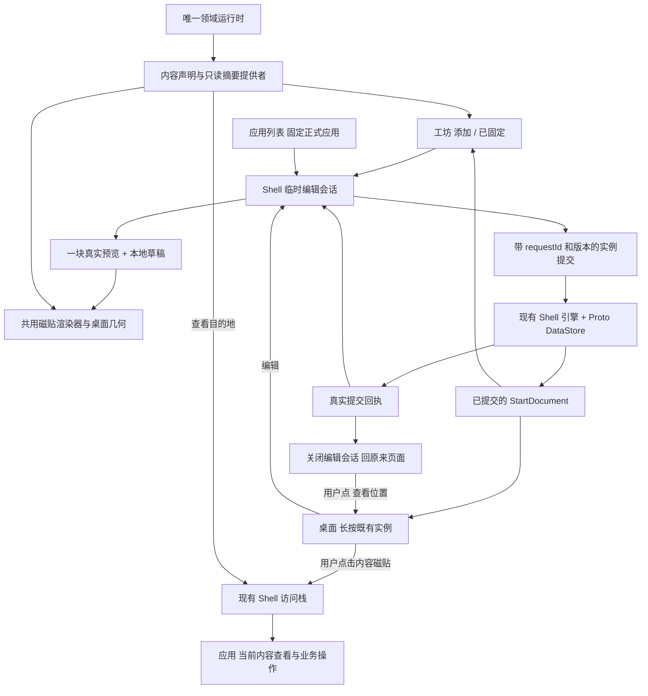

# 磁贴工坊重构施工文档

状态：**2026-09-25 用户以“施工吧”确认；四批已接入实际 rebuild 生产入口。**

实际落地：`TileBinding / TilePresentation` 扩展现有 StartDocument；`TileWorkshopController` 拥有唯一临时草稿；`TileLibraryScreen` 提供添加/已固定。按用户最新收口规则，**新固定只从应用列表和磁贴工坊发起**，桌面长按继续编辑、移除已有实例；`TileEditorHost` 为这些操作提供同一临时编辑会话。初次重构曾有业务应用内固定按钮，现已移除，不再作为接入方式。`TileLayoutPreview.place` 与提交共用排布，`instanceTilePresentation` 与真实 Start 共用渲染。现有 Proto 增加回执、版本、草稿和移除逆操作，未新增第二套业务存储。

真实查看路由为 `task:navigation`、`task:anchorWatch`、`task:recording`、`tileplace:<id>`、`tileroute:<id>`。迁移保留旧根入口、模式和布局；删除收藏不借活动导航快照复活。成功回原页面，定位为独立操作；保存中允许 Home/切应用，失败保留草稿。主文件清单和具体 API 见权威契约与接口索引。该状态是代码接入事实，不代表设备体验或性能已实测。

基线：2026-09-25，`codex/yokuli-os-rom`，`da81de3`。用户附件《一、先定职责：工坊负责内容，桌面负责布局，应用负责提供内容》已完整读取；以下合并其十部分要求与本轮补充。施工前重新核对 HEAD 和未提交修改，行号仅用于定位本基线。

本文件是这一轮的施工顺序和用户故事，不是已交付功能声明，也不是新的长期架构规范。落地后的事实继续维护于 [仪表与磁贴契约](../../product/INSTRUMENT_TILE_CONTRACT.md)、[访问与返回契约](../../product/APP_NAVIGATION_CONTRACT.md)、[W10M 设计基线](../../product/WINDOWS_10_MOBILE_DESIGN.md) 及 [系统接入边界](../../os/10-INPROCESS-SYSTEM-BOUNDARIES.md)。本轮不新增或运行测试、不改 CI、不制作截图或验收材料；实现阶段允许必要编译。

## 1. 用户故事判断与需要调整的地方

主线合理：用户固定的是关心的内容；工坊负责寻找和表现，桌面负责实际排列，应用负责提供内容和完整操作。允许同一应用的不同内容并存；同一具体内容只固定一次；保存后回原位置。保留 W10M 控件、透明磁贴与现有经典应用/Home 动效。

本轮采用以下修订：

1. **迁移、恢复和真正保存必须进入第一批。** 不能第四批才处理，否则新增的水深和航速会被旧规则再次合并。
2. **共用编辑器由 Shell 临时编辑会话承载。** 应用列表固定正式应用、工坊固定具体内容、桌面编辑既有实例都复用这份草稿，不启动另一次工坊访问、不创建额外最近任务，也不改工坊已有的浏览状态。业务应用提供内容声明与查看页面，不提供固定按钮。
3. **预览渲染器已经共用，继续复用。** 当前错误是预览自算尺寸、间距和取景；不重新造一套“共享渲染器”。
4. **目录构建目前并不采集传感器。** 实际问题是每块呈现中的磁贴订阅全量船舶状态、历史与连接，并各自计时。开放多内容时必须收窄订阅。
5. **当前任务与收藏对象必须分开。** 删除收藏航线不会停止正在运行的导航；也不能用导航保留的快照把已删除收藏假装成存在。
6. **撤销不能撤掉后来发生的桌面操作。** 无后续修改时恢复完整原位置；存在后续修改时只恢复被移除实例，原格被占用则寻找最近合法位置并说明，不覆盖另一块磁贴。
7. **收藏内容先有真实保存的 ID，才能固定。** 未保存的标记或路线草稿不先生成一个将来可能失效的磁贴。

参考微软 [Secondary tiles](https://learn.microsoft.com/en-us/windows/uwp/launch-resume/secondary-tiles) 的内容直达关系，及 [设计指导](https://learn.microsoft.com/en-us/windows/uwp/launch-resume/secondary-tiles-guidance) 的用户主动固定、明确内容身份、移除不删除应用、磁贴不充当业务命令按钮。这里借鉴 Windows 10 的产品语义，不移植 UWP API，也不照搬 Win11 开始菜单。采用“已固定 → 编辑/查看位置”是 Yokuli 的明确取舍，避免用户误点后直接移除。

## 2. 职责与接入拓扑

| 所有者 | 负责 | 不负责 |
| --- | --- | --- |
| 应用列表 | 列出正式应用，长按未固定项发起固定，已固定项进入编辑/查看位置 | 列出读数、任务、收藏等内容磁贴，直接移除已固定项，或创建新 AppId |
| 磁贴工坊 | 添加目录、搜索、已固定实例清单，发起编辑/移除/定位 | 第二个桌面、业务来源设置 |
| Shell 编辑会话 | 草稿、来路、输入门控、共享编辑器、提交状态 | 应用业务栈副本、另一个最近任务 |
| Shell 布局与存储 | 实例身份、绑定、表现、位置、提交版本、去重、迁移、撤销 | 传感器采集和业务状态机 |
| 真实开始屏幕 | 拖动、让位、尺寸快捷操作、长按编辑/移除既有实例、滚到指定实例 | 发起新固定，替工坊提供添加目录 |
| 内容提供者 | 声明可固定内容、读取所需摘要、解析查看目的地 | 改来源、启动业务、持久化第二份业务资料 |
| 各应用与领域 | 读数来源、导航/记录/守锚、收藏、AIS 的唯一事实与完整操作 | 在业务页放固定按钮，为每块磁贴创建一个新 AppId |

## 3. 用户故事：把入口、完成和异常一次讲清楚

这些是产品行为，不是另建测试清单。所有保存成功都以持久化回执为准。

| 故事 | 路径与结果 | 必须保留的边界 |
| --- | --- | --- |
| S01 先安排水深，即使没接仪器 | 工坊添加 → 水深 → 中尺寸真实空状态 → 添加 → 回原分类/搜索/滚动位置 | 显示等待水深，允许固定；不填假值、不启动 NMEA |
| S02 同时看航速和水深 | 分别添加，两块独立出现；修改/移除水深不影响航速 | App 主磁贴也能同时存在；设置按 tileId 写入 |
| S03 从应用列表固定应用 | 应用列表 → 长按驾驶台 → 固定到开始屏幕 → 已绑定驾驶台根入口的编辑器 → 添加 → 回应用列表；已固定时入口为“编辑或查看磁贴” | 固定的是正式应用入口；不把水深等内容塞进应用列表，不打开工坊任务、不改来源，不在列表长按菜单直接移除 |
| S04 修改这块尺寸 | 桌面长按水深 → 编辑 → 宽 → 保存 → 原桌面 | 保留 tileId；工坊不展示完整可拖桌面；快捷改尺寸也使用同一提交规则 |
| S05 再次固定同内容 | 工坊选择已有水深，或应用列表长按已固定应用并选择“编辑或查看磁贴” → 已在开始屏幕 → 编辑这块 / 查看位置 | 两处调用同一去重与编辑会话；不新增、不覆盖样式，不把它说成错误 |
| S06 更换内容 | 编辑水深 → 更换内容 → 同一内容选择器 → 返回草稿 → 保存 | 原 tileId 和位置尽量保留；如航速已有实例，先显示已有项选项并保留水深草稿；明确选择编辑已有项时才按脏草稿规则切会话 |
| S07 从工坊固定回家路线 | 工坊添加 → 我的收藏 → 已保存的回家路线 → 预览名称/概要 → 添加 → 回原工坊分类/搜索/滚动位置 | 绑定 stableId，不开始导航；重命名跟随，同名不同 ID 可以并存；路线详情不放固定入口 |
| S08 看当前任务 | 当前导航/记录/守锚磁贴 → 打开点击时的当前角色 | 无任务显示未进行；不绑定固定时某个会话、不进入无关设置草稿、不自动开始 |
| S09 保存后查看位置 | 成功反馈中的查看位置 → 真实 Start → 滚到 tileId 并短暂强调 | 不重新排列、不整页重新入场；桌面不建立“Back 回编辑器”的伪栈；已删除则留原页说明 |
| S10 取消或临时离开 | 未提交时无修改 Back 关闭、有修改选择继续/放弃；Home 暂存草稿离开；保存中允许离开并说明写入继续 | Home 不等于放弃，不拦截系统 Home；不能把“离开保存过程”说成取消已接受写入；恢复核对版本，不自动提交 |
| S11 保存失败或冲突 | 保留草稿、显示真实原因、同请求重试；被另处修改的实例显示冲突 | 不提前改变正式磁贴、不复活已移除实例；后台成功不抢前台、不重放提示 |
| S12 移除与撤销 | 已固定或桌面移除 → 成功后可撤销 → 恢复完整绑定/表现/位置 | 不停止守锚、不删除路线；后续有人重新固定同内容时定位现有项，不能生成第二块 |
| S13 对象加载与删除 | 冷启动加载中保留位置；真实删除后显示内容已删除，可移除或改绑 | 读取失败可重试；未知提供者保留；当前导航快照不冒充还存在的收藏 |
| S14 更换系统偏好和来源 | 单位/语言/主题立即同步；数据中心切换来源后同一水深磁贴展示新来源 | 不改身份/排列，不按手机或 NMEA 新增磁贴；历史在换源处断开 |

从桌面点击内容磁贴是一次真正应用访问，继续遵循既有栈：从 Start 进对象后可回所属应用首页，再回 Start；应用 A 打开 B 的对象则返回 A 的原页。编辑临时会话不会改变这条规则。

## 4. 工坊与编辑器的信息结构

### 工坊只保留两个同级页

**添加**：搜索 + 固定顺序分组（航行与值守 / 常看读数 / 我的收藏 / 应用入口）。分类和中英文搜索共用内容选择器；名称、用途与所属应用参与搜索，单位、实时读数、风险排名不决定排序。静态候选不挂实时订阅；可用性摘要复用缓存，缺少数据不能挡住添加。

每行只有内容名、静态缩略表达、一句用途和“已固定/等待数据”等必要状态。收藏为空时解释可在“我的航行”保存地点/路线，不塞演示对象或额外推荐栏。已有收藏多时按稳定顺序分页/惰性列表读取，避免把整个收藏加载为实时磁贴。

**已固定**：按真实布局解析后的行/列顺序列真实实例，稳定 tie-break 使用 rank/tileId；不按实时值改顺序。每项显示内容名、尺寸、表现和状态，点入编辑；菜单提供查看位置与移除。桌面排列变化后更新清单并保持原可见项锚点。

两个页支持现有 Pivot 点击/横滑；标题仅在将被遮挡时滚动。背景与透明度仍归系统设置，工坊保留一个轻量入口，不在每项编辑中重复。

### 共用编辑器

正常只显示：内容标题 → 一块预览 → 尺寸 → 适用的少量表现 → 点按后去向 → 添加/保存。更换内容为独立次要动作。去掉横滑预览选内容、页码圆点、完整模式列表的重复选择。

- 小尺寸只给能以图标/简短身份表达的应用入口；读数、任务和收藏第一版用中/宽，避免压缩成难认数字。
- 内容不支持的尺寸/样式不出现；换内容导致当前样式不适用时，在草稿中明确恢复该内容默认表现，保存前可见。
- 系统字体放大时允许编辑页面滚动。真实磁贴优先保留内容身份、主要值、关键状态/时效，再裁掉次要说明；不能靠缩字体突破系统偏好。
- 已存在内容进入时显示“已在开始屏幕”，操作是编辑现有实例和查看位置；不是再次创建。
- 草稿比较只比较用户可编辑配置，不因实时值变化判成“有未保存修改”。尺寸或表现未变时不产生一次无意义提交。
- 移除不和保存摆成同等强调的两个主按钮；统一术语“固定到开始屏幕 / 保存 / 从开始屏幕移除”。

## 5. 第一版内容目录与真实目的地

| 内容绑定 | 默认尺寸；表现 | 点击目标 | 状态与约束 |
| --- | --- | --- | --- |
| 航速 `Reading(SOG)` | 中；简洁 / 读数与短趋势 | 现有 `instruments:metric:SOG` | 明确对地航速；不默认铺对水航速 |
| 真船首向 `Reading(HEADING_TRUE)` | 中；方位 / 方位与近期变化 | 现有 `instruments:metric:HEADING` | 明确真北；失效时不拿 COG 替代 |
| 水深 `Reading(DEPTH)` | 中；简洁 / 读数与短趋势 | 现有 `instruments:metric:DEPTH` | 保留测深参考；UKC 是独立量，不作为其别名 |
| 真风 `Reading(TRUE_WIND_SPEED)` | 中；简洁 / 速度与方向 | 现有 `instruments:metric:TRUE_WIND_SPEED` | 可附真实可用方向及参考，不和视风合并 |
| 视风 `Reading(APPARENT_WIND_SPEED)` | 中；简洁 / 速度与船体风角 | 现有 `instruments:metric:APPARENT_WIND_SPEED` | 方向缺失只显示已有速度 |
| 气压 `Reading(PRESSURE)` | 中；简洁 / 读数与短趋势 | 现有 `instruments:metric:PRESSURE` | 复用真实观测/历史；无传感器也能先固定 |
| 当前导航 `CurrentTask(navigation)` | 宽；简洁 / 详细 | `task:navigation` 当前导航角色 | 指向实际活动导航展示，不落到海图上另一条预览路线 |
| 当前守锚 `CurrentTask(anchorWatch)` | 宽；简洁 / 详细 | `task:anchorWatch` 当前值守角色 | 状态、警报、暂停和船位时效常驻；未值守不自动转设置草稿 |
| 当前记录 `CurrentTask(recording)` | 宽；简洁 / 详细 | `task:recording` 当前记录角色 | 点击时解析会话；暂停仍是同一角色，无记录不自动开始 |
| AIS 交通概况 `Overview(aisTraffic)` | 宽；简洁 / 详细 | 现有 AIS 观察入口 | 保留用户雷达/3D选择；不自动选最近目标、不开启警戒 |
| 收藏地点 `SavedObject(place/spot,id)` | 中；对象摘要；有可信素材再给封面 | 现有 `place:<id>` 及 spot 变体 | 用既有地点/spot身份，不按名字或坐标合并 |
| 收藏航线 `SavedObject(route,id)` | 宽；对象摘要；有可信素材再给封面 | 现有 `route:<id>`，先解析收藏存在性 | 固定不启动；删收藏后活动导航仍独立存在 |
| 正式应用 `AppRoot(appId)` | 沿用默认；静态图标 / 应用摘要 | 现有正式应用根入口 | All Apps 只保留真实应用；无有用摘要的应用只给静态图标 |

AIS 概况是持续能力摘要，不伪装成可开始/结束的会话。上述角色目的地已经接入所属应用的真实展示状态；空导航给出未导航状态，守锚不进入设置草稿，记录直达当前航行。内容目录只收有可用渲染和真实点击入口的声明。

新增内容不开放独立字体、颜色、单位、来源、动画时长或字段拼装。旧应用磁贴明确保存的轮换和间隔保留在兼容配置；新内容使用模板约定，关键状态永不轮走。

## 6. 实时、短趋势、缺失与性能

**只读呈现**：预览与桌面使用同一绑定提供者和渲染器，只按绑定读取必要指标/历史/任务摘要。水深不订阅所有连接、AIS 或全部仪表历史；提供者不持有 Room DAO、设备控制器或另一个采集服务。

**可见性**：只有屏幕上可见的桌面磁贴及唯一活跃编辑预览持有所需观察；离屏、锁屏、应用遮挡和不活跃预览停止动画、时效 ticker 与展示订阅。业务采集继续由原领域生命周期管理。共有时效时钟，按实际时间计算年龄，不给每块开一秒循环。恢复时重新取权威值，不把缓存续成实时。

**趋势**：沿 [现有图型契约](../../product/INSTRUMENT_TILE_CONTRACT.md#历史可视化与固定回看)；航速用范围/均值、水深向下、气压真实点/同源直线、方位跨北断线。移除当前所有指标共用背景折线的做法。主读数实时；迷你历史是注明截止时刻的近五分钟快照，最多在分钟边界且确有新观测时替换。当前快照的点、分桶与纵轴不随每次读数重算；查看精确历史进入驾驶台固定回看。无数据、无连续样本时不造曲线。预览更改尺寸不改变采样语义。

**状态**：提供者状态与数据时效分开。`Loading`、`Available`、`Missing`、`Failed`、`Unsupported` 描述内容是否可解析；数值的 FRESH/HELD/STALE/OFF、quality、来源及测量时间仍来自唯一领域。任务空闲、暂停、警报属于任务状态，不能被折叠成“数据不可用”。缺哪项显示哪项缺失，不凭一个新字段刷新全块年龄。

**安全信息**：守锚/AIS/当前任务的关键状态常驻，简洁样式也不能隐藏；用文字和图标辅助颜色。磁贴不放开始导航、暂停守锚、确认警报等快捷业务按钮。普通内容磁贴只进入对应详情。

**图片与透明背景**：封面必须有对应对象/地图范围、捕获时间、来源与必要署名；不能拿全局最后一张海图截图充任任意路线封面。没有可信素材就不提供该样式。本轮不为封面创建地图实例、下载瓦片或后台渲染 3D。使用现有背景取景和统一对比度处理，屏幕阅读器能读出内容、值、单位、时效与已固定状态。

## 7. 模型与事务：扩展现有模型，不另造平台

以下为故事阶段定义的语义；实际 `TileTemplate` 对应 `TileContentChoice`，`TileInstancePresentation` 对应 `TilePresentation`，`TileContentKey` 由 `TileBinding.contentKey` 派生。精确签名见 API 索引。

| 结构 | 中文字段语义与所有者 |
| --- | --- |
| `TileTemplate` | 提供者稳定 ID、模板版本、绑定种类、合法尺寸、表现、所需读模型、默认值、缺失表达、查看目的地策略。静态声明先于对象列表加载。 |
| `TileBinding` | `AppRoot / Reading / CurrentTask / Overview / SavedObject`；稳定指标/角色/对象 ID。按 kind 编码，禁止用显示名、数组序号或当前会话 ID 代替。 |
| `TileContentKey` | 由 provider + binding kind + 规范指标/角色/对象 ID 派生；不含尺寸、语言、单位、样式和用户当前选用的数据源。 |
| `TileDocumentEntry` 扩展 | 保留 tileId、entryId、size、rank、groupId、preferredCell；追加 binding、typed presentation、实例 revision、兼容点击策略。位置只存在这一处，不另存实例位置表。 |
| `StartDocument` 扩展 | 文档 schema 和递增 revision；同一文档包含配置与位置，并保留受限数量的近期提交回执/撤销信息。继续 Proto DataStore 单文件。 |
| `TileEditorSession` | requestId、新建时固定的 tileId、originSurface/taskId/UiStateKey、原实例版本、草稿、提交状态。只引用既有访问栈，不复制页面/业务会话。 |
| `TileSummary` | 真正的内容状态、所需规范值及其来源/质量/时间、摘要与可信素材引用；不把 Bitmap 或格式化文案写成业务事实。 |
| `TileCommitResult` | Saved(tileId,revision)、AlreadyPinned(tileId)、Conflict(current)、Failed(reason)、结果待恢复；文案由 UI 本地化，失败不可伪装成成功。 |

沿用 `LauncherEntryId` 连接现有渲染与打开流程。为内容绑定派生可恢复的 Start-only entry；不新增 AppId、不登记进 All Apps。实例仍独立以 tileId 标识；旧 preset entry 只作为兼容迁移输入。提供者只发布能力与摘要，不能任意创建未注册的执行命令。

### 一次提交的真实含义

1. 草稿开始时固定 requestId/tileId；提交携带预期实例版本和字段变更，不携带一份过时的整张桌面替换稿。
2. 在现有引擎写入路径串行处理；对当前文档核对身份、唯一内容、合法样式与尺寸。结构校验不因业务暂不可用拒绝旧实例。
3. 另处只移动了无关磁贴时，应用本次目标实例变更并保留其他布局；目标实例已改变/删除则 Conflict，保留草稿，不静默覆盖。
4. 同一个 `DataStore.updateData` 提交绑定、表现、位置和版本/回执，保留并发系统偏好；成功后发布正式状态与 Saved。保存中可以显示本地草稿，不提前发布“已固定”。
5. 双击或离开后的迟到回执仍按匹配的 requestId 记录完成结果，不抢前台、不重复提示。请求已接受后，“放弃草稿”不能撤销已经开始的持久化。结果未知时先按原请求/实例恢复结果，不生成新 ID 猜测重试；近期回执有明确容量，超出恢复范围就说明无法确认。
6. `RevealTile(tileId)` 与提交分开；只有显式查看位置才显示 Start，复用 StartReveal 滚动/强调。快速尺寸调整、拖动提交、移除与撤销也走同一落盘语义，避免另一入口绕过规则。

编辑状态为干净/已修改 → 保存中 → 已保存或保留草稿的失败/冲突。保存中防双击；Home 和切应用仍可用，完成只更新原会话状态，不能把人拉回。草稿利用现有可恢复 UI 状态设施保存纯配置；进程恢复先重新解析对象/版本/提交回执，不恢复成自动执行。

草稿恢复绑定原 origin UiStateKey。原任务关闭或原页面已丢失时，不能重造那套访问栈；在工坊的轻量“继续未完成编辑”入口让用户明确继续或放弃，不增加第三个常驻页。恢复编辑完成后只关闭该恢复流程、回其实际发起页，不假装返回已失效的内容页。未完成草稿有数量/体积上限，不保存图片或实时历史。

移除撤销保存完整被删实例与其位置提示，采用针对该实例的逆操作，不直接恢复整个旧 `transaction.before`。位置冲突按第 1 节处理；若同内容已重新固定，不覆写它。动作回执与撤销元数据走原存储边界，不扩张成通用事件溯源框架。

## 8. 冷启动与旧桌面迁移

恢复顺序：读取原始文档/偏好 → 捕获旧 preset 和旧入口语义 → 建立兼容实例 → 结构迁移及校验 → 发布已提交布局 → 提供者加载并解析内容。不得先按 App collapse 再尝试恢复具体内容。

- 保留尚存的 tileId、rank、preferredCell、groupId、尺寸、显式模式、轮换和间隔。无效旧尺寸沿已有转换规则，不因为重构重置整桌面。
- 当前旧主磁贴拷贝 `${app.id}.tile.*` 到自身 typed 兼容配置；保留原 root 点击含义。旧 preset 的自身模式与点击语义单独保留，不先改成 AUTO。
- 已迁移实例以版本判定，不能每次启动再从旧 App 偏好覆盖。源键仅在成功提交后清理；迁移失败保留旧存储及可解释故障，不输出空桌面冒充成功。
- 旧兼容驾驶台磁贴显示水深，与新水深内容磁贴可共存。编辑器注明旧入口会进入驾驶台首页；用户选择“改为水深内容”才改变绑定/点击。撞上已有水深时保留旧实例并进入已有项分支，不自动合并。
- `StartDocumentValidator/Repair` 校验唯一 tileId、规范 contentKey、字段/尺寸结构；不再要求 App 唯一。未知提供者、未加载对象、业务删除不触发布局清理；保留原配置供恢复/改绑。
- 若数据本身存在重复内容或未来版本字段，保留原载荷和可解释恢复状态，不再按最早 rank 静默丢弃。普通提交阻止产生新的同内容重复。
- 已被旧版本真正删除的历史磁贴没有证据可恢复，不根据猜测自动补回。
- `layoutLocked` 当前仅发现持久字段，未发现活动编辑入口/执行策略。本轮不顺便新增锁定功能，也不突然赋予旧字段阻塞编辑的行为。

## 9. 动效与实际几何

继续使用 `WpStartGeometryCalculator / ResolvedStartGeometry`、`AdaptiveTilePacker` 和现有 Start 布局；预览按照实际桌面 viewport、profile、seam、尺寸和字体算像素，容器不足时整体等比缩小并说明。新增预览用提议位置，编辑预览用当前实例位置，背景沿相同取景计算；不靠另一个 312dp 桌面重排内容。

| 时刻 | 交互 |
| --- | --- |
| 打开编辑器 | 内容关联的短层级转场；不播放工坊冷启动，不污染最近任务 |
| 改尺寸 | 同一预览连续改变轮廓与可用内容区域，180–260ms 作为调校起点；不因 key 改变重建数据订阅 |
| 改表现 | 主读数锚点保留，辅助区域局部显隐；不用整块翻页迫使重新找数字 |
| 保存 | 立即按压反馈，真实进行中与失败状态，收到保存回执后才完成 |
| 查看位置 | Start 按 tileId 滚动并短暂强调一次，保留其他磁贴布局 |
| 拖动/回弹 | 沿用跟手、邻居让位、抬手落位；取消恢复本次提议，不变更已提交配置 |

连续位移/颜色在绘制层读取，轮换只改变辅助内容，帧时钟沿系统 vsync。先完成按绑定收窄数据依赖再开放多块内容，不能用降低观测真实性或取消必要动效掩盖开销。帧率目标不写成未经设备依据的实测结果。

## 10. 施工前后对照（基线行号仅作历史定位）

| 基线位置 | 施工前事实 | 本轮修改 |
| --- | --- | --- |
| `app-shell/.../ui/TileLibraryExperience.kt:35,60,77,114` | App 清单、找首块、先偏好再 PinEntry | 添加/已固定、按实例编辑、单提交回执 |
| 同文件 `:137–146` | 共用 Renderer，自算 312dp/12dp 几何 | 保留 Renderer，统一真实几何与背景上下文 |
| `app-shell/.../ui/TilePresentations.kt:68,106,138,153,304` | preset root 跳转、App 偏好、广订阅/独立 ticker、统一折线 | 绑定/模板/窄摘要、实例配置、按数据图型 |
| `app-shell/.../WpShellExperience.kt:173,238,290–311` | app/preset 贡献、背景入口、真实页面路由 | 动态 Start-only 贡献、编辑会话宿主、角色目的地 |
| `app-shell/.../WpShellRuntime.kt:28,277,396–409` | Shell 覆盖层/访问链、旧 preset collapse | 复用覆盖输入边界，先迁移具体内容再做旧别名处理 |
| `feature/desktop/.../WpStartScreen.kt:273,384,424` | Reveal、按 launchToken 打开、只有移除/尺寸按钮 | 新增 EditTile(tileId)、保留 Reveal/拖动引擎 |
| `core/shell-engine/.../layout/StartDocument.kt:10` | 有 tileId/位置，缺实例绑定配置/版本 | 扩展单一文档 |
| `StartLayoutEditor.kt:54–72`、`StartDocumentPolicy.kt:16–21,66–82` | App/entry 去重，未知入口会剔除 | 按内容身份，加载/未知不当作坏布局 |
| `core/shell-engine/.../LauncherReducer.kt:802–903,940` | before 冲突保护、整文档 Undo、Pin 强制 Desktop | 实例变更提交、逆操作撤销、独立 Reveal |
| `core/shell-engine/.../LauncherEngine.kt:91–104` | 先公布文档再保存，失败仅 incident | 发布已提交文档与请求回执 |
| `core/shell-engine/.../LauncherPersistence.kt:194–210` | aliases 仅留最早一块 | 旧内容语义捕获先于 collapse，避免新实例被重复迁移 |
| `adapter/shell-storage/.../LauncherProtoMapper.kt:69–132`、`src/main/proto/launcher_state.proto:22–40` | 只编码旧 placement | typed 字段、schema/版本、兼容迁移 |
| `ProtoDataStoreLauncherPersistence.kt:73–101,134–145` | 已有原子 updateData | 扩展既有存储，不新增 JSON/第二个仓储 |
| `InstrumentsExperience.kt:40–43,175–205` | 已有指标详情深链 | 指标声明供工坊固定，磁贴直达实际详情；初次重构增加的详情固定按钮已按最新规则移除 |
| `MySailingExperience.kt:119–169,204–216`、`PlacesScreen.kt:17–23` | 地点/路线详情、保存回执、路线活动快照回退 | 工坊只固定已保存对象，区分收藏删除与活动任务；对象详情不再提供固定入口 |

表中 `app-shell/...` 均指 `app-shell/src/rebuild/java/com/yokuli/marine/shell/rebuild`；Shell 引擎指 `core/shell-engine/src/main/kotlin/com/yokuli/shell/engine`。不在未构建的旧页面完成入口。纯合同不引入 Compose、Context、DAO 或 OsStore。

## 11. 实施顺序与范围

四批是同一次重构的纵向交付，不把未接入接口或预览当作一批完成。迁移、失败、来路、资源释放在受影响批次同步实现。

| 批次 | 必须进入生产路径的结果 |
| --- | --- |
| 1 独立实例 | 航速/水深从工坊目录固定、同屏共存、分别直达真实详情、修改/移除独立；同时完成 typed schema、旧迁移顺序、恢复、单提交/失败回执及最小共用编辑器、按绑定订阅。 |
| 2 工坊流程 | 添加/已固定、搜索与分组、应用列表固定正式应用、同一编辑器、桌面 EditTile、显式定位、取消与冲突；分别保持应用列表、工坊及桌面编辑的来路，不在业务页增设固定入口。 |
| 3 内容完善 | 目录中余下读数、当前角色目的地、AIS摘要、地点/航线；持久对象与任务区分、关键状态和缺失处理完整。 |
| 4 体验收口 | 尺寸/表现局部动效、透明背景与字体适配、并发撤销、离屏资源细节、中英文与权威文档/API索引；不把前三批的数据完整性拖到本批。 |

本轮不做主题商店、推荐榜、任意字段拼装、云同步、桌面多方案、第二个布局编辑器、磁贴实时 3D、新天气服务、新设备来源配置。新增对水航速、UKC 等内容必须有单独产品理由，不因现有枚举很多就全铺满工坊。

## 12. 已确认范围与实际限制

用户已确认并收口这组用户故事：**内容优先、同内容单实例、新固定仅应用列表和工坊、桌面编辑/移除既有实例、共用 Shell 临时编辑器、保存回原页、点按磁贴直达查看而不启动业务、布局迁移与可靠落盘先行**。新增状态和冲突处理都是为了让这些故事完整，不扩充工坊的业务职责；各业务 App 只提供真实内容与查看目的地。

四批已接入生产代码，精确接口回写现有权威契约与 API 索引。实际限制：同一时刻保留一个编辑草稿（最多 64 KiB），近期回执和移除逆操作各保留 32 条；超过记录范围不能凭空恢复。真实海图封面只沿用旧海图快照，不新增任意收藏封面或后台地图/3D渲染。现有 ROM HOME 与普通 APK 共用实现，本轮未新增 Binder 磁贴服务或固件镜像。
