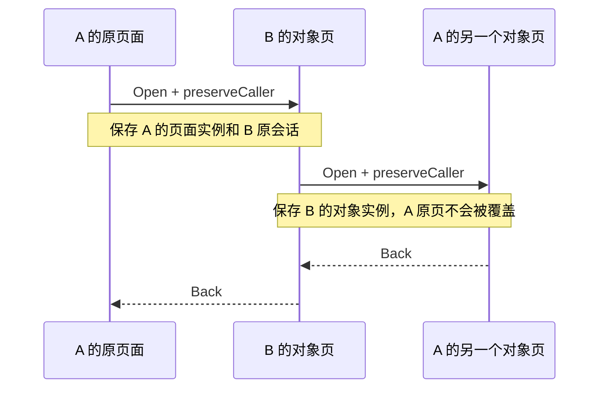

# 应用访问与返回契约

更新：2026-09-25。实现位于 `LauncherReducer`、`WpShellRuntime`、`WpShellExperience`。

## 四种访问

| 用户动作 | 应用接口 | 返回行为 |
| --- | --- | --- |
| 桌面、应用列表或“打开完整应用” | `os.open("places")` | 打开新的首页访问；首页 Back 返回桌面 |
| 当前页打开本应用对象 | `os.open("route:<id>")` | Back 恢复本应用上一页 |
| 当前页请求另一应用查看/操作对象 | `os.open("place:<id>")`；目标为根地图时使用 `os.shell.openLinked("chart")` | 目标对象页 Back 直接回调用页；目标对象内再深入的页面先在目标应用内返回 |
| 最近任务恢复 | `LauncherAction.ActivateTask(taskId)` | 恢复该任务页面及仍有效的调用链，不创建全新首页 |

Home 明确离开当前用户故事并清空跨应用返回链；再次从桌面打开是新访问。
从最近任务主动选回调用链上游，放弃它之后的未完成调用。关闭任务只关闭 UI 会话；航行、守锚与数据连接由各自系统运行时维护。

## 状态不是地址

`LaunchToken` 表示业务地址。`InternalAppTask.savedUiStateKey` 表示这一次页面访问：相同的地点地址可以从不同任务发起，必须有独立的页面状态。

`backStack` 保存应用内父地址；`backStackUiStateKeys` 同步保存对应实例。`LinkedTaskReturn` 保存调用者完整任务快照以及目标应用之前的会话。`InternalTaskState.retainedUiStateKeys` 汇总仍会被返回引用的实例，供 Compose `SaveableStateHolder` 保留。

页面中需要跨应用恢复的选择、滚动、编辑草稿必须使用 `rememberSaveable` 或所属应用的持久状态，不能只依赖离场后即销毁的 `remember`。

海图的中心、缩放、跟随、准星、测距、地点选择与路线/日志预览在离开页面时按实例保存，返回时恢复。它不回滚底图选择、实际导航、记录或已保存的业务数据。原生相机每次访问独立持有视野，旧页面的相机回调不能写回当前页面。任务卡历史图最多保留八张且合计不超过 32 MiB；淘汰图片不会丢弃页面逻辑状态，也不会回收仍被当前任务卡引用的 Bitmap。

### AIS 观察工作区与海图交接

`AisScreen` 的雷达、三维、船舶是同一工作区内可横滑的三个同层页面。切换页签、点选目标、拖开详情不创建新的应用访问。面板展开时 Back 先收起，再取消选中；接收状态、警戒设置和完整目标详情仍有明确的本应用父页。由目标详情选择在三维查看时，已有 `traffic` 父页直接出栈恢复，不再次堆出 `traffic → target → traffic`。

AIS 的 48dp 紧凑应用栏同样消费 `PageNavigation`。真实跨应用来路存在时提供相同返回动作，不为了显示返回再增加一行头部，也不把 AIS 品牌当作返回目的地。

“在海图查看”和目标航迹使用 `os.openLinked("chart:ais:<MMSI>")`，海图消费同一交通快照、选中指定 MMSI，并保留调用者的 AIS 页面实例；Back 恢复原 AIS 页签、目标、量程、相机和仍有效的详情展开状态。未选中目标时，“打开海图”链接 `chart`；已选中时携带当前 MMSI，不推断其他目标。AIS 中不嵌入第二份海图，也不把海图调用伪装成本应用页签。

缺少船位时进入 `data_center:source/POSITION`，接收问题进入本应用的来源页或具体 NMEA 连接；这些修复入口遵循相同调用链。暂时没有位置报告的目标不能用本船或默认中心坐标代替来打开目标位置。

### 地点摘要、前往与来源修复

海图点中地点只替换本次选中对象，不移动相机、不打开另一个应用。摘要就地呈现坐标、距船距离及简短备注，主操作是“前往这里”，次操作是编辑和更多；完整资料才关联打开 `place:<id>`。摘要的进入/收回只作用于底部覆盖层，`NativeChart` 始终保留同一实例和固定视口。退出摘要不再接受触摸。

单个目的地直接进入本船至目标的几何预览，不再要求选择唯一的“起始航点”。多点路线默认沿保存顺序，明确展示当前起始目标；最近航点仅作提示，改变起点时明示跳过数量。用户按开始才更新现有导航状态。当前已经在海图时，开始、切换目标和查看整条路线不再次打开海图访问；来自其他应用时才进行关联交接。

启动预览及当前导航中的“检查船位来源”直接调用 `openLinked("data_center:source/POSITION")`，不转到设置或 NMEA 目录。开始/管理弹窗、起始目标与子状态使用本次访问的 `rememberSaveable`，在来源修复期间隐藏并停止接收输入；返回恢复原预览。离场的管理面板不能通过 `LaunchedEffect` 改写当前海图的显示路线。

当前目标卡可直接前往下一点；已到目标附近时不再绕进管理弹窗。尚未确认到达时跳点、确认终点并结束均需明确确认。推进动作核对用户所见的路线 ID 和目标索引，旧面板不能在目标已变化后再多跳一次。

“同时开始航行记录”是用户明确保存的 `recordWhenNavigating` 偏好。实际开始记录仍调用现有航行运行时命令，与导航状态保存及其结果分开。已有记录继续复用，暂停记录保持暂停；结束任一任务不自动结束另一个。此偏好不创建第二套航行会话。标记的采集依据、存储回执与原地重试见 [海图交互契约](CHART_INTERACTION_CONTRACT.md#标记与落盘回执)。

以上是 UI 访问所有权。航行引导的业务会话尚由 `OsStore.navigationRoute`、`activeRouteId`、`routeLeg` 及 `Navigation.kt` 管理；本轮未迁成与 AIS 同级的独立运行时端口。唯一导航运行时、冻结路线版本与命令恢复属于下一项独立迁移，不能把返回链修复写成该迁移已完成。

## 输入与动效

通知和快捷入口使用 `os.openSystemDestination`，目的地消息是类型化 `NoticeTarget`，不携带页面闭包。若与底层当前具体对象相同，收起中心并聚焦，不新建页面或重播开场。新目标交接由 Shell 保存原页面实例和 `NotificationShadePresentation`（列表位置、展开正文、更多、子详情）；到本次目标入口边界后 Back 恢复通知中心，再关闭中心回原页。目标内部更深页面仍先按内部层级返回。

通知返回上下文不写消息数据库，也不作为最近任务中的假“通知 App”。Home、独立启动或显式离开访问链后放弃该上下文；不能稍后无缘无故复活中心。通知键/把手/关闭只关闭中心；系统 Back 先交给真实上层对话框、键盘或中心子详情，不能同一次又退底层 App。开关卡片不跳页，来源和连接详情先在中心展开；明确进入所属应用才交接。

对象删除/归档/失效必须说明“对象已不存在”并给明确相关列表入口，不默默返回或猜测另一个对象。活动导航的冻结路线即使收藏被删除，也仍可查看和管理；导航与收藏是不同事实。此处不会为展示详情自动重新启动记录或导航。

`ReportVisibleAppRoute` 登记数据中心、设置和日志实际显示的局部页面，以免进入某个 token 后又切换了 tab，仍被误判为停留在入口页。`reuseExistingRoute` 可恢复保留的父页面；若同一入口 token 对应的可见局部页已经变化，`reenterCurrentRoute` 创建新访问并保留原访问供返回，而不把它当成无操作。通知消费本身不确认业务警报，也不结束后台会话。

物理 Back 和虚拟 Back 都由 Shell 分发到当前页面的输入处理链：先关闭临时编辑、选择和弹层；随后由引擎处理应用内父页与跨应用边界。离场页面及通知中心背后的页面不接收输入。

数据中心、设置、磁贴库的局部层级共用 `AppPageTransition`：只消费原 path/section/owner，不另建返回栈。内容按页面键复用，草稿和滚动继续使用各自 `SaveableStateHolder`；深度减小采用反向位移。退出页通过 `LocalInternalAppInputEnabled=false` 注销局部 Back，Initial pointer pass 拦截触摸，并清除交互语义。容器尺寸固定，无 SizeTransform；不能将持有原生地图的两页无条件同时挂载。

最近任务截图仅用于任务卡。温启动和应用内进退页直接显示各自页面内容，不在动画中间换成旧截图。离场面保留自身入场参数，不能因新页面出现而重新从零播放旋转。跨应用故事使用相互对应的前进/后退动效；首次打开应用保留开场。

## 历史已有回归代码（本轮不新增或执行）

`LauncherNavigationTest` 覆盖：跨应用对象直接返回、对象内再次深入、A→B→A、目标原有会话恢复、Home 放弃调用链、最近任务继续调用链、独立页面实例、桌面直接打开对象的父首页。

`ShellTransitionResolverTest` 覆盖应用内与跨应用前进/后退类型。真实设备上的地图绘制与手势顺滑程度仍需实机手测，不由纯 reducer 测试代替。

## 统一头部与交接入口（experience.8）

`PageNavigation` 将应用身份、当前标题、返回可见性、返回目的地和返回动作分开。`PageHeader` 与 `MapPageHeader` 都调用这一结果。按钮统一进入 `os.back()`，与系统 Back 使用同一局部处理器和 Shell 栈；头部不再接受能绕过系统的固定父页回调。当前 [Windows 10 Mobile 基线](WINDOWS_10_MOBILE_DESIGN.md) 使用 24sp 页标题与同行紧凑子层返回，不叠放应用身份和第二行大标题。紧凑布局统一标为“返回 / back”，不把当前应用名伪装成目的地；根页不制造“返回 Yokuli OS”按钮。

独立应用首页无顶部 Home 或品牌占位。对象页的应用身份与返回行分开；系统品牌只留在适合的系统界面。地图从关联调用进入时也显示返回，并保留工具/弹层先处理的规则。

| 入口 | 归属与返回 |
| --- | --- |
| 普通地点、收藏锚地 → 在此设置守锚 | `openLinked("anchor:setup")`；入口本身就是 setup。返回保留草稿并回原地点，取消清除本次草稿并回原地点；进入选项后先回 setup。 |
| 设置 → 磁贴工坊 | 有目的的关联访问，工坊首页返回原设置页面；选择应用样式后先回工坊列表。 |
| 海图 → 修复不可用图层 | 优先进入对应 `library:<folderId>`；目录已不存在才进入图册首页。直接修复页“回到海图”恢复调用者，不再次嵌套打开海图。 |
| 航线/地点/日志 → 海图预览 | 使用已有调用者快照；地图头部与系统 Back 走相同的工具关闭/页面返回路径。 |
| AIS → 目标位置或航迹 | `openLinked("chart:ais:<MMSI>")`；目标海图返回原 AIS 访问，内部展开/选择先按当前页面规则处理。 |

下锚输入参数仅供本次页面访问消费；地点身份保存在页面实例中，不再让下次从桌面打开守锚继承这次地点参数。海图工具菜单移除没有具体任务的整应用“我的航行”入口，独立应用启动由 Shell 提供。

原有 `LinkedTaskReturn` / `SaveableStateHolder` 继续保存应用访问；通知来路在 Shell 覆盖层交接中补充，不把应用归属当作回退链。地图中心、缩放、列表筛选、滚动与目标旧会话仍由原页面实例机制恢复。具体面板状态及输入边界见 [通知契约](NOTIFICATION_CENTER_CONTRACT.md)。
