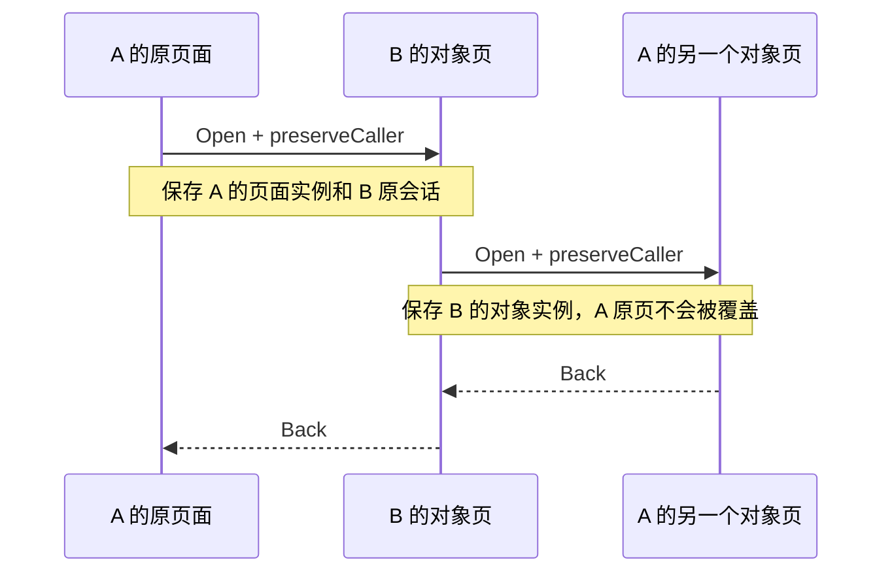

# 应用访问与返回契约

更新：2026-09-18。实现位于 `LauncherReducer`、`WpShellRuntime`、`WpShellExperience`。

## 四种访问

| 用户动作 | 应用接口 | 返回行为 |
| --- | --- | --- |
| 桌面、应用列表或“打开完整应用” | `os.open("places")` | 打开新的首页访问；首页 Back 返回桌面 |
| 当前页打开本应用对象 | `os.open("route:<id>")` | Back 恢复本应用上一页 |
| 当前页请求另一应用查看/操作对象 | `os.open("place:<id>")`；目标为根地图时使用 `os.shell.openLinked("chart")` | 目标对象页 Back 直接回调用页；目标对象内再深入的页面先在目标应用内返回 |
| 最近任务恢复 | `LauncherAction.ActivateTask(taskId)` | 恢复该任务页面及仍有效的调用链，不创建全新首页 |

Home 明确离开当前用户故事并清空跨应用返回链；再次从桌面打开是新访问。
从最近任务主动选回调用链上游，放弃它之后的未完成调用。关闭任务只关闭 UI 会话；航行、守锚与数据连接由各自系统运行时维护。

## 状态不是地址

`LaunchToken` 表示业务地址。`InternalAppTask.savedUiStateKey` 表示这一次页面访问：相同的地点地址可以从不同任务发起，必须有独立的页面状态。

`backStack` 保存应用内父地址；`backStackUiStateKeys` 同步保存对应实例。`LinkedTaskReturn` 保存调用者完整任务快照以及目标应用之前的会话。`InternalTaskState.retainedUiStateKeys` 汇总仍会被返回引用的实例，供 Compose `SaveableStateHolder` 保留。

页面中需要跨应用恢复的选择、滚动、编辑草稿必须使用 `rememberSaveable` 或所属应用的持久状态，不能只依赖离场后即销毁的 `remember`。

海图的中心、缩放、跟随、准星、测距、地点选择与路线/日志预览在离开页面时按实例保存，返回时恢复。它不回滚底图选择、实际导航、记录或已保存的业务数据。原生相机每次访问独立持有视野，旧页面的相机回调不能写回当前页面。任务卡历史图最多保留八张且合计不超过 32 MiB；淘汰图片不会丢弃页面逻辑状态，也不会回收仍被当前任务卡引用的 Bitmap。

## 输入与动效

物理 Back 和虚拟 Back 都由 Shell 分发到当前页面的输入处理链：先关闭临时编辑、选择和弹层；随后由引擎处理应用内父页与跨应用边界。离场页面及通知中心背后的页面不接收输入。

最近任务截图仅用于任务卡。温启动和应用内进退页直接显示各自页面内容，不在动画中间换成旧截图。离场面保留自身入场参数，不能因新页面出现而重新从零播放旋转。跨应用故事使用相互对应的前进/后退动效；首次打开应用保留开场。

## 定向回归

`LauncherNavigationTest` 覆盖：跨应用对象直接返回、对象内再次深入、A→B→A、目标原有会话恢复、Home 放弃调用链、最近任务继续调用链、独立页面实例、桌面直接打开对象的父首页。

`ShellTransitionResolverTest` 覆盖应用内与跨应用前进/后退类型。真实设备上的地图绘制与手势顺滑程度仍需实机手测，不由纯 reducer 测试代替。
