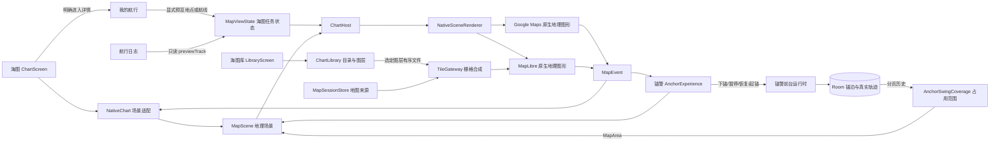

# 海图、海图库与锚警交互契约

本文描述本次代码中的实际职责、接口和状态。业务存储使用 WGS84 坐标与米；用户看到的坐标、距离、航速由 `DisplayFormats` 按全局偏好格式化。

## 数据图册与自动规划（2026-09-25）

这次是两个完整领域：图册维护资料；海图使用当前选中的背景与数据集进行检查和自动规划。潮汐、天气、天气路由和基于环境的通航窗口不在本轮范围。`PassageEnvironmentReference` 仅保留未来提供方/版本/有效期的扩展形状，当前没有连接环境提供方，也不伪造修正值。

### 用户路径

1. 图册的“海图”保留文件夹栅格能力；“数据”导入未加密 S-57 `.000`、含连续更新的 ZIP 或目录。数据集详情管理名称、用途声明、更新、图幅版本、取消/重试与移除。选用是明确动作，导入不会自动更换当前资料。
2. 海图来源面板分别选择背景与数据集。切换卫星或栅格背景不清空所选数据；没有数据时可继续看图、手工画线，但不能把底图颜色当成深度。
3. 海图“航线规划”选择起终点，或选择已有航线/草稿；“检查航线”给出问题与沿程证据，“自动规划”生成直达或绕行候选。全线和指定航段都保留原几何，方案在海图并列比较后才显式采用。
4. 船体参数直接修复到已有“设置 / 船舶资料”。吃水、船宽、船舶水线上方高度、富余水深、避让余量、走廊半宽、最小转弯半径及计划航速在原 vessel DataStore 保存。未知值保留为空；桅杆长度不替代水上高度。
5. 接受方案写入现有路线草稿，可撤销；原草稿和采用后的身份、几何、目标映射一起原子保存，撤销不覆盖后来的手动修改。不会自动开始导航或记录。替换执行中的路线是另一条明确确认的导航命令，带会话/修订比较和分析引用。
6. 对象点按只查询当前地图位置，不移动镜头或准星。重叠对象先给列表，详情展示名称、深度证据和版本；保存参考位置、按明确点按坐标加入航线草稿分别确认，航标不会自动成为目的地。原生标记也传递真实触点坐标，拿不到触点时不以对象中心冒充。深度全部使用全局单位。
7. 开始导航前可检查本船真实接入段和所选目标之后的完整路线，保留自动规划的形状点；沿用同一分析作业与当前数据选择。船位、目标、船型或资料变化使接入结果过期，只有适用结果引用才随开始命令保存。无资料仍可明确手动导航，界面不把原路线检查说成本次接入已检查。

### 真实数据链与边界

`ChartDataService` → `LocalChartDataService` → Android 文档授权 / 临时复制 → ISO8211/S-57 解析 → 图幅连续更新 → 不可变 SQLite + RTree 版本 → 原子安装指针 → 当前选择的快照租约 → 地图 / `RouteAnalysisService` / `RoutePlanningService`。

- 实际解析 `.000` 与连续 `.001` 起的更新，核对图幅、版次、更新序列和记录版本；处理增加/修改/删除及 edition=0 取消。保留 FSPT/VRPT 拓扑、外环/孔洞、SOUNDG 独立深度点、DEPARE/DEPCNT、干出/疏浚、陆地、碍航物、航标灯、交通/限制、桥梁净空、覆盖和质量元数据。
- 当前只接受受支持的 ENC 3.x chain-node、WGS84 经纬度及 DDR 字段布局；非 WGS84 不作伪转换。普通属性、Latin1 和 UTF16LE 国家语言字段可解码。若 M_SDAT / M_VDAT / M_CSCL 局部覆盖采用与图幅不同的基准或尺度，当前标记未支持，不套用错误的统一基准。未支持几何或语义不会悄悄用于“已检查”。
- 读取版本在租约存续期间不随更新或删除变化；分页查询显式说明是否还有数据。地图可有绘制数量上限，分析独立分页读取，不能把未显示的对象当成不存在。
- 数据用途由提供方与持有人确认；文件能解码不等于允许分析。未知、仅参考、到期或取消资料不进入自动规划。过期/缺失选择显式保留，不私自换成另一个数据集。
- 这是实用地理对象绘制，**不是完整 IHO S-52/ECDIS 制图或认证系统**。S-63 尚无获许可客户端集成、生产 OEM 设备密钥/标识、User Permit 和对应 cell permits，不能解密或宣称已支持 NZ ENC。S-101/S-100 后续可扩展，但当前没有解码器。

技术依据：[GDAL S-57 官方格式说明](https://gdal.org/en/stable/drivers/vector/s57.html)、[IHO ENC 保护](https://iho.int/en/enc-data-protection-s-57)、[LINZ ENC 服务](https://encservice.linz.govt.nz/about)。通用 LINZ 参考地理数据不因为能显示就成为航行 ENC；[LINZ 用途说明](https://www.linz.govt.nz/guidance/data-service/linz-data-service-guide/questions-and-answers)。APK 随包保留 GDAL 对象/属性字典的来源与许可证。

### 分析与规划的当前实现

纯合同在 `core/runtime-contract/.../planning/PassageContract.kt`；几何和作业在 `runtime/marine-local/.../planning`。使用已有 GeographicLib WGS84 反解和 [JTS 几何运算](https://locationtech.github.io/jts/javadoc/org/locationtech/jts/geom/Geometry.html)。长航线按局部块检查完整线段与走廊，保留日期线、陆地岛屿和孔洞；按所选数据顺序和图幅编图尺度处理覆盖归属。

`PassageRequest` 固定路线几何/版本、背景、数据集 ID、船体参数、避让区与 UTC 出发时刻。`PassageAnalysis` 固定数据集版本、规则版本、累计距离、结果等级和每个问题的航段/位置/沿程距离/对象证据。换路线、资料、船体或避让区后旧结果显示条件已变化，不能直接采用旧方案。ETA 只按明确计划速度估计，不包含潮汐/天气修正。

结果只有“有冲突 / 需要核对 / 资料不足 / 已检查条件下未发现冲突”，没有安全分数。测深点不扩展成区域；深度区间保留上下界和基准；沿程图分别表示覆盖、资料空白、深度区间和孤立测深点，横轴是固定累计距离。限制/交通和无法完整解释的条件要核对，不凭缺少告警推定允许。

自动规划是有界、可取消的离线 A*，边与简化线段都检查整个路径；未知深度/覆盖不当成普通水域。绕弯按最小半径构造相切路径，再检查最终几何和所有连接。当前每条待搜索航段限制 80 km，有限网格和搜索预算；找不到候选只说明当前资料、范围和约束下没有找到，不代表不存在航路。用户可增加中间航点或调整明确的约束。仅返回实际生成并复核的候选，不凑三条伪差异方案。用户避让区存于同一个规划工作区。人工核对批注按分析 key 与 issueId 落在该工作区，只记录依据，不消除问题等级或允许未知水域；条件变化后不继承为新版本的确认。

作业属于进程级服务，离开页面不取消；进程死亡后的未完成作业标记中断，冻结请求、作业种类和航段选择一并保存，用户可恢复该路线并按当前选择重新计算。结果/避让区落盘有错误状态，不把内存结果说成已保存。完整海事跨进程服务、跨重启自动续算、S-63 解密、环境/帆船天气路由仍不是已实现能力。

## 拓扑

三个应用共用地图能力，但不共用页面状态。海图、锚警、地点预览、地图选点器分别持有自己的 `MapViewState`。改变某个任务的镜头，不会移动其他应用的镜头。地图来源由系统统一管理。

## 地理与地图接口

| 类型 | 字段或动作 | 中文含义 |
|---|---|---|
| `GeoPoint` | `lat`, `lon` | WGS84 纬度、经度；只接受有限且合法的坐标 |
| `MapSource` | `Offline`, `Satellite`, `CustomLayer(layerId)` | 内置离线底图、卫星、自定义文件夹图层；不是多组互相冲突的开关 |
| `MapVessel` | `point`, `courseDegrees`, `fresh` | 船位、可用航向、是否新鲜；陈旧船位使用灰色 |
| `MapPoint` | `id`, `point`, `label`, `color`, `radiusDp`, `draggable`, `style` | 稳定身份的地理图钉；大小是屏幕 dp，位置始终是地理坐标 |
| `MapLine` | `id`, `points`, `color`, `widthDp`, `dashed` | 有序轨迹或航线；颜色 alpha 可表示时间衰减 |
| `MapCircle` | `id`, `center`, `radiusMeters`, `color`, `dashed` | 以米为半径的真实地理范围 |
| `MapArea` | `id`, `boundary`, `holes`, `color` | 有边界的观测色斑；颜色不是水深或安全海域判断 |
| `MapScene` | `vessel`, `points`, `lines`, `circles`, `areas`, `demo` | 供渲染器使用的不可变场景快照；渲染器不承担导航、记录和锚警业务 |
| `MapViewState` | `center`, `zoom`, `follow`, `showCrosshair` | 本任务镜头、缩放、跟随和准星显示 |
| `MapViewState` | `ruler` | 两个测距端点；拖动修改真实坐标 |
| `MapViewState` | `selectedPlaceId` | 海图本地选中的地点，选中不会自动打开其他应用 |
| `MapViewState` | `previewTrack`, `previewTitle` | 航行日志请求的只读历史轨迹预览，不覆盖实时记录 |
| `MapViewState` | `interactive`, `scaleTopDp` | 是否接受手势、比例尺在屏幕上的位置 |
| `MapViewState` | `fly(point, zoom)`, `fit(points)` | 显式镜头请求；`fit` 覆盖指定地理范围 |
| `MapCameraRequest` | `id`, `point`, `zoom`, `points` | 单次镜头命令；消费后清除，重组不会重复执行 |
| `MapSessionStore` | `source`, `select`, `selectedLayer`, `sourceName`, `removingLayer` | 持久化地图来源并处理图层移除 |
| `MapSessionStore` | `view(key, center, zoom)` | 按任务键取回独立镜头状态 |
| `MapSessionStore` | `nauticalScale`, `distanceLabel`, `chinese` | 全局单位与语言的地图显示适配 |
| `MapSessionStore` | `snapshot`, `snapshotSource`, `snapshotCapturedAt`, `snapshotDemo` | 海图磁贴的真实地图快照及来源/时间/演示标识 |
| `MapSessionStore` | `saveFailed` | 来源偏好写入失败，界面不能伪称已保存 |
| `MapEvent` | `CameraChanged(center, zoom)` | 原生相机的实际状态回报 |
| `MapEvent` | `ItemSelected(id)` | 点中原生图钉，由应用决定是预览还是业务操作 |
| `MapEvent` | `PointMoved(id, point)` | 拖动测距或编辑航线的端点 |
| `MapEvent` | `CoordinateSelected(point)` | 在地图上明确选点 |
| `MapEvent` | `GestureStarted` | 真实手势开始，关闭跟随并显示准星 |
| `ChartCamera` | `project`, `unproject`, `move`, `zoom`, `fit` | 原生投影、反投影与镜头桥接；屏幕像素不写入业务模型 |
| `ChartHost` | `update`, `updateStyle`, `captureSnapshot`, `lifecycle`, `destroy` | 原生地图资源、生命周期、来源切换和磁贴快照 |

地理图形由 `NativeSceneRenderer` 直接加入原生 Google Maps / MapLibre，相机缩放和平移时与地图同帧变换。此前第二层 Canvas 按回调重新投影地理位置的方式已移除；屏幕 Canvas 只画准星和比例尺。渲染器按稳定图形 ID 比较内容，船位变化不会清空并重建所有航线和区域。

比例尺由共享 `MarineUnitFormats.scaleBar` 在用户选定的单位内取 `1/2/5 × 10^n`，包含 `0.5 / 0.02 / 0.001` 等小数尺度，再根据真实投影距离反算线段长度。默认所有缩放均跟随全局距离单位；设置可显式选择另一种固定比例尺单位。没有“小于一海里改米”的隐式规则，船体/锚链的尺寸单位也不再影响比例尺。标签完整宽度参与背景绘制，不将小数截为整数或把短距离扩成超出视口的一整海里。

## 海图用户故事

1. 拖动地图：关闭跟随，准星显示；坐标紧贴底部操作栏。显示准星或坐标时，原生地图的尺寸保持不变。
2. 点中收藏：只高亮该坐标，在底部显示名称、格式化坐标、距船距离及最多两行备注。主操作“前往这里”，次操作编辑和更多；明确打开完整资料才关联进入地点对象。更换地点替换摘要，不移动地图镜头。
3. 完整应用启动由桌面或应用列表负责；海图工具不再常驻“我的航行”等应用目录。地点、航线和来源修复各自保留有明确对象和来路的入口。
4. 标记：按可见操作区分“标记此处”和“记录当前船位”。点下后就地显示同一对象及真实保存状态；无有效船位且未选点时，先明确进入“选择标记位置”，不能把地图中心悄悄说成船位。
5. 测距：A/B 两点都由原生引擎定位；拖动只改变相应坐标。关闭测距仅清理测距状态。
6. 规划航线：草稿与保存路线分离；保存不会自动显示，也不会修改正在导航的冻结路线。
7. 日志回看：日志设置 `previewTrack` 和标题，再显式打开海图。橙色历史轨迹和实时记录分别显示，可从“更多”结束日志预览。
8. 船位暂不可用：留在地图，产生可追溯系统通知；不把点击“船位”变成跳到设置。
9. 海图来源：通过地图头部的唯一图源入口选择内置离线、卫星或一个命名图层；底部更多不重复提供图源。自定义海图无覆盖时保留内置 Natural Earth 全球离线背景。卫星的联网与宿主条件见 [离线底图边界](OFFLINE_WORLD_BASEMAP.md)。声纳调查入口已从海图移除。

### 标记与落盘回执

`Place.capture` 是可选的 `PlaceCapture`，旧收藏仍能读取。`capturedAtUtc` 记录点击时间；“记录当前船位”同时冻结当次船位的 `positionObservedAtUtc` 和 `positionSource`。地图准星选点只记录点击时间，不伪造船位来源。编辑名称、备注或分类保留依据；改动坐标清除原船位依据，避免新位置继续冒充旧观测。

写入仍通过 `MySailingRepository.put` 和 `OsStore.saveWithFeedback`，由既有 `DurableSnapshotStore` 保存。`placeCommit(id)` 暴露该对象最近一次 `DurableCommit`；`PlaceSaveFeedback` 在海图摘要及地点详情共用“保存中/已保存/尚未保存”。成功来自实际落盘回执或包含该对象的后续完整快照，不来自内存里已经出现图钉。失败原地重试相同 ID 和已冻结内容，不重新采样、不新增重复地点；退出页面不取消进程级写入。

### 导航预览与当前目标

单点“前往这里”直接显示本船到目的地的几何草图与距离，不展示只有一项的起始航点选择。多点预览显示路线及当前起始目标，按保存顺序继续；更改起点明示跳过哪些前置航点，最近点只作解释性提示。草图不是自动避障航路，不创建第二个原生地图。

“开始”才更新现有导航状态；当前目标卡直接提供下一航点/确认到达。未确认到达时跳点和终点结束需要确认，操作核对原路线 ID、目标索引。缺船位时“检查来源”直接进入 `data_center:source/POSITION`，返回恢复原预览、选点或管理子状态，来源修复不自行开始导航。

底部地点摘要使用真实进退动画，保持 `NativeChart` 实例、相机及视口不变；退出摘要停止接收操作。开始导航可明确选择“同时开始航行记录”，偏好保存在 `recordWhenNavigating`。记录继续调用现有 voyage 命令与独立结果通知；已有记录不重复启动，暂停记录不自动恢复，导航和记录分别结束。访问返回及当前导航所有者边界见 [应用访问契约](APP_NAVIGATION_CONTRACT.md#地点摘要前往与来源修复)。

## 海图库结构与 CRUD

| 类型 | 字段 | 中文含义 |
|---|---|---|
| `ChartFolder` | `id`, `uri`, `name`, `layerName`, `enabled` | 文件夹身份、持久访问 URI、用户标签、可选图层名及兼容启用标记 |
| `ChartFile` | `id`, `uri`, `source` | 文件身份、读取地址、所属文件夹 URI |
| `ChartFile` | `name`, `filename`, `label`, `displayName` | 档案元信息名称、实际文件名、用户显示名、最终显示名；重命名不改原文件 |
| `ChartFile` | `minZoom`, `maxZoom`, `tileSize`, `scheme` | 栅格缩放范围、像素尺寸及 TMS/XYZ 规则 |
| `ChartFile` | `focus`, `previewZoom` | 显式预览这张海图的有效中心与缩放级别 |
| `ChartFile` | `bytes`, `modified`, `attribution` | 大小、更新时间、署名 |
| `ChartFile` | `enabled`, `priority`, `error` | 是否参与图层、优先级（小数值优先）、读取失败原因 |
| `ChartLayer` | `id`, `name`, `files` | 一个文件夹图层的可渲染快照；文件按优先级排序，排除禁用和读取失败项 |
| `ChartLayer` | `rasterSize`, `minZoom`, `maxZoom` | 根据参与海图推导的合成栅格规格 |
| `ChartLibrary` | `files`, `folders`, `excludedFiles`, `layers` | 当前档案、文件夹、显式移除记录、可用图层 |
| `ChartLibrary` | `busy`, `progress`, `failure`, `rejected`, `revision` | 真实扫描进度、失败结果和渲染刷新版本 |

操作：

- `linkFolder` / `importCopy`：连接用户文件夹、导入本机副本。
- `setLayer` / `removeLayer`：创建或重命名图层、移除图层。
- `renameFolder` / `renameFile`：编辑用户标签，保留原路径和文件名。
- `toggle` / `includeAll`：单个或批量决定是否参与渲染。
- `moveFile`：修改重叠区域优先级；高优先级空白/透明区域继续显示下层。
- `rescan`：发现新增、更新、移除文件，保留用户顺序、显示名和显式移除记录。
- `forget` / `restore`：从库中移除与恢复单个海图；重新扫描不擅自恢复已移除项。
- `forgetFolder`：断开引用，保留原文件。

根页按文件夹组织，点文件夹进入管理；不存在“选中但不知道接下来会怎样”的全局单选列表。进入文件夹后，用户明确点“在海图中使用此图层”才更改地图来源并打开海图。文件行展开后才显示优先级、启用、定位、重命名和移除操作。

## 锚警故事与观测范围

主线是“下锚 → 确认锚点与范围 → 开始值守 → 起锚回顾”。地图占据主要空间，当前距离/半径在底部简短显示；原来的大说明卡片已移除。复杂的锚点估计、风与深度阈值属于内部选项页，不占据常用下锚流程。NMEA 实测深度仍可作为警戒输入；这与移除声纳调查功能是独立事项。

- `AnchorExperience` 通过 `MarineServices.anchor` 调用下锚、更新、暂停、恢复、确认及起锚命令，不创建另一套锚警状态。
- 定位可信性继续由 `AcceptedAnchorPositionPolicy` 判断。用当前船位下锚需要可信定位；地图选定的已知锚点可以创建等待定位的会话，界面明确显示等待。
- 最近轨迹使用最近 30 分钟、10 个时间档位渐隐。拒绝/隔离的位置和数据源变化、断流会断线，不伪造船走过的路径。
- `AnchorSwingCoverage` 通过 `AnchorDao.pointsPage(sessionId, afterTimestamp, afterId, limit)` 读取全部会话历史，然后只增量处理新点。
- `add(samples)` 只累计有效、未隔离的真实样本。`areas()` 输出格子对应的 `MapArea` 色斑，浓度表示停留样本量。
- 最多保留 800 个格子；超出后合并网格，保留旧位置和样本数，不因近期轨迹裁剪丢失整体范围。
- 起锚后，回顾地图同样从已保存完整历史还原区域，最近轨迹与整体范围同时保留。

`AnchorSwingCoverage` 的色斑是“曾观测到船位的区域”，不是声纳扫描、水深、航道或保证安全的锚泊区。地图只显示真实数据能够支持的内容。

## 历史实图记录（2026-09-17，非本轮验证）

2026-09-17，在 `emulator-5554` 上通过真实 UI 检查了自定义 `QA_Priority` 图层下的准星、测距缩放、地点预览、显式详情跳转、从海图重新打开我的航行根页、锚警下锚确认与取消。比例尺在两个缩放级别显示 `500 m`、`200 m`；原生 A/B 图钉与底图一起缩放。创建的临时“标记 2”已通过 UI 删除，未改动原来的标记、航线或来源设置；未启动真实锚警。截图位于 `docs/experience/screenshots/experience3-*.png`。

实图发现版权文字与顶部状态叠放，以及右侧缩放按钮可能覆盖测距端点，已在代码中修正：版权位置只跟随底部上下文区高度变化，缩放按钮移到右上方，地图视口保持原尺寸。最终 APK 需包含此后续修正。此轮没有宣称完成海上锚警实测或所有文件提供器兼容验收。

### 立体指向与相机

海图内的地图 / 立体方向是同一导航会话的两个显示方式。立体方向使用真实透视的罗盘、地平与目标几何，同一投影负责文字、点选和边缘提示；当前/下一目标不自建路线状态。手机手持时使用穿过屏幕的视线，固定模式读取既有安装及船艏状态；自由查看有明确标识和归位动作。临时姿态显示租约在离场/遮挡时释放，不修改数据中心的来源选择或校准。

抬起提示不自行切换；只有用户打开自动切换偏好才按角度/稳定时间/滞迟切换，编辑、拖图或弹窗时抑制。地图支持北向、船艏向和明确命名的航迹向，保留期望模式与实际降级模式，船艏不可用不以 COG 冒充。

系统 `GeomagneticField` 的公共 API 不披露设备磁场模型版本；当前磁差显示为模型近似，缺少位置/时间/可用姿态依据时降级到二维信息。没有相机 AR 或目标真实高度。官方 API 依据：[SensorEvent](https://developer.android.com/reference/android/hardware/SensorEvent)、[GeomagneticField](https://developer.android.com/reference/android/hardware/GeomagneticField)、[OpenGL Matrix](https://developer.android.com/reference/android/opengl/Matrix)。

### 路线形状与导航目标

自动规划曲线保留完整路径用于绘制、沿程距离、横偏和引导；插值点不是需要用户确认的业务航点。`Route` / `NavigationRouteSnapshot.navigationTargetIndices` 指定实际业务目标，旧路线缺少该字段时保留原每点目标语义；`geometryIndex` 只跟踪沿线路径。目标方位与沿线转向分别发布，立体指向不能直接指向障碍物另一侧的终点替代沿线引导。不能在给定转弯约束下保留用户中间目标时，规划明确拒绝该候选。

GPX 导出保留所有路线点，并在 Yokuli 命名空间扩展中保存业务目标索引；本机重导不会把所有形状点变成确认航点。外部应用不认识该扩展时仍可读取标准路线几何，不承诺其导航目标策略相同。
