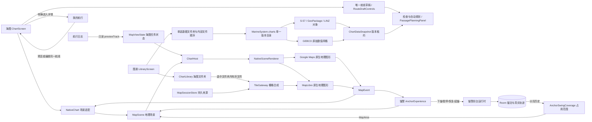

# 海图、海图库与锚警交互契约

本文描述本次代码中的实际职责、接口和状态。业务存储使用 WGS84 坐标与米；用户看到的坐标、距离、航速由 `DisplayFormats` 按全局偏好格式化。

## 数据图册与自动规划（2026-09-25）

图册维护并配置资料；海图只有一个航线编辑工作区。手动调整、检查与自动生成建议消费同一份草稿。航行数据和显示背景分别配置，背景不参与航线计算。潮汐、天气、天气路由和基于环境的通航窗口不在本轮范围。`PassageEnvironmentReference` 仅保留未来提供方/版本/有效期的扩展形状，当前没有连接环境提供方，也不伪造修正值。

### 用户路径

1. 图册明确分为“海图”和“数据”。海图文件夹是一个可选显示组，连接后直接可选，不再另行创建图层；MBTiles 只负责画面。“数据”以文件夹为一份资料，支持文件夹内多份 S-57、GeoPackage / LINZ 水文资料和 GEBCO 高程网格，也保留单文件与 ZIP 导入。文件夹代表一种资料集合，列表单选一个文件夹，选择立即作为海图查询和所有离线规划的资料输入；打开管理、浏览内容或**数据预览**不改变选择。矢量呈现设置属于“数据”，不再放在背景/图层设置中；它只控制 S-57 / LINZ / GeoPackage 怎么画。用途许可仍单独记录，选用不等于分析资格。
2. 地图头部来源入口只显示当前背景和已启用航行数据，并关联进入图册修复；不再提供第二套数据选择器。切换背景不清空数据、不改写船舶参数，也不使同一数据和路线的检查结果失效。底图颜色、图片水深标注和文件夹范围都不是计算水深的证据。
3. 海图只有“规划航线 / 继续航线草稿”一个编辑入口；“我的航行”中的新建、继续和编辑已有航线都进入同一张海图、同一个 `OsStore.draftRoute`。当前同 ID 的未保存草稿优先继续；换成另一条已存航线需要确认，不静默覆盖。
4. 在当前地图用准星设置起点、终点并添加途经点，或明确使用当前有效船位为起点。拖动既有航点调整路线；从收藏地点添加、查看航点及手动路线反向在同一编辑器内完成。无需先选择“手动”或“自动”模式。
5. 常驻地图的航线摘要显示航点数与最近一次明确检查状态。检查与自动规划面板只消费当前草稿，不再持有独立 `from / to / useExisting / pickedRouteId`。编辑停顿只自动保留草稿，**不会后台自动启动完整航线检查**；完整检查只在用户点“检查当前航线”时运行，避免抢占自动规划作业。缺数据时仍能手动画线；问题项可回到当前地图定位，资料修复只跳到“图册 / 数据”，船体修复只跳到“设置 / 船舶资料”，返回保留草稿。
6. “自动规划”是当前编辑器的主生成动作：轻量门槛通过后优先占用规划作业直接生成粗航线，不先做一遍完整原线分析，也不在候选后再重复完整分析。候选在当前地图叠加比较；“采用并继续编辑”验证输入和数据版本未变后替换同一份草稿，等待保存回执后回到地图编辑。保留一次采用撤销，后续编辑存在时不以旧撤销覆盖它。不会自动开始导航或记录。
7. “保存航线”写入“我的航行”，实际落盘成功前不清空草稿；失败保留同一 ID 重试。成功后结束编辑展示，回到正常地图；只有明确查看已存航线才显示预览。“保留并退出”和返回只离开编辑，保留可继续的草稿；“丢弃草稿”是单独的确认动作。自动保留草稿不冒充已正式保存航线。
8. 草稿可直接进入现有“开始导航”确认，不强制绕经航线列表。开始前可检查本船真实接入段和余下路径，保留自动绕行的形状点；采用建议或保存收藏不替代出发确认。重新规划余程先以有效船位和后续目标装入同一编辑器；替换执行中的路线仍是带会话/修订比较和分析引用的明确确认命令。
9. 对象点按只查询当前地图位置，不移动镜头或准星。重叠对象先给列表，详情展示名称、深度依据和版本；保存参考位置、按明确点按坐标加入草稿分别确认，航标不会自动成为目的地。拿不到原生标记的真实触点时不以对象中心冒充。深度全部使用全局单位。

### 实现入口与恢复

- `ChartScreen` 保持原生地图宿主，`RouteDraftSummary / RouteDraftControls / RouteDraftDialogs` 只负责当前编辑和对象动作；草稿仍由现有 `OsStore` 字段与 `DurableSnapshotStore` 保存。
- `PassagePlanningPanel` 现在是“检查与自动规划”面板，不是独立规划页面。`planningRequest` 固定当前路线、图册启用的数据 ID、船舶参数与可选避让区；兼容字段 `backgroundKey` 使用固定的数据上下文标识，不再存显示图层身份。`DraftPassageAnalysis` 仅承担编辑停顿后的草稿自动保留和规划叠加清理，不再自动提交完整分析。
- `LibraryBackgroundSettings / LibraryDataSettings` 复用原 `MapSessionStore` 来源持久化文件和键，避免丢失旧配置。数据列表使用即时生效的单选控件，一次只选一个文件夹；显式“不使用数据”可以清空选择。没有跨文件夹优先级，也没有另一个“已启用资料”弹窗。只有详情中的文件/图幅可排序，顺序经 `ChartDataService.reorderCells` 落盘并递增资料版本。旧多选偏好迁移时仅保留原第一项作为当前选择，其余已安装资料不删除。
- 数据文件夹导入是完整离线快照流程，不是文件系统实时监视器。`ChartDataset.sourceUri / sourceIsFolder` 保存原来源；“重新扫描原文件夹”用同一个 dataset ID 重新安装完整内容，原名、选择与仍存在的单元优先级保留，新增单元排到后方。目录内可包含多份 GeoPackage、S-57 与数值栅格，所有文件成功才发布同一版本；失败保留旧版本。原权限失效时显式重连文件夹，旧资料不悄悄替换为其他来源。单个 S-57 更新仍沿连续更新链继承已安装基础图幅。
- 当前变更不调整全局黑白主题、W10M 磁贴强调色、导航运行时或资料许可。API 全量索引仅在完整源码 checkout 中重新生成，不能由局部读取覆盖。

### 真实数据链与边界

`ChartDataService` → `LocalChartDataService` → Android 文档授权 / 临时复制 → S-57 连续更新 / GeoPackage 与 LINZ 显式适配 / GEBCO 数值栅格 → 共用对象索引与原始网格 → 同一不可变目录版本 → 原子安装指针 → 图册单一选中文件夹的快照租约 → 内容浏览 / 数据预览 / 海图查询 / 离线航线检查与规划。数据预览使用独立快照：低缩放只画真实覆盖边界；当前视口像元预算允许时，GEBCO 按有界抽样显示陆地、浅水、较深水和未知区。预览色块绝不回灌规划，规划仍读原始像元。

| 资料 | 实际用途与边界 |
| --- | --- |
| MBTiles / 内置全球底图 / 卫星 | 地图显示背景；栅格图像不是自动规划的深度或覆盖依据 |
| 未加密 S-57 ENC | 读取真实海图对象、拓扑、图幅与更新链；格式支持不等于完整 S-52/ECDIS 制图或认证 |
| GeoPackage 矢量包 | 支持 EPSG:4326 / EPSG:3857 的矢量点线面及多部件，不读取 GeoPackage 栅格瓦片；经转换统一为 WGS84。规划语义按 [GeoPackage profile](../GEOPACKAGE_CHART_PROFILE.md) 显式声明，不猜普通 GIS 的水深字段 |
| LINZ LDS 水文 GeoPackage | `LinzLdsAdapter` 核对正式 Hydro 图层名称、原字段与几何类型，再映射实际 S-57 语义。保留提供方、来源日期、深度基准和稳定 `fidn`。参考用途是解析事实，不能通过用户修改用途声明升级为 ENC；有分析许可与足够数据时可做离线参考规划，结果至少需要核对 |
| GEBCO 数值网格 | 读取 WGS84、原生 15 角秒、单波段有符号数值 GeoTIFF / BigTIFF 或 ESRI ASCII `.asc`；保存原始像元与 NoData，按窗口读取。支持 GeoTIFF 无压缩、LZW、Deflate；不支持 NetCDF、旋转网格、影像瓦片、阴影图或 TID 分类网格。数值是海平面高程，不是海图基准水深；只能参与参考规划，不能证明近岸安全 |

数据文件夹提供重命名、用途管理、原源重扫、重连、内部优先级和移除；单文件导入使用同一套生命周期。S-57 沿原连续更新规则处理；GeoPackage 可在 QGIS 等外部工具中编辑原文件，再扫描安装同文件夹的完整新版。App 不编辑官方深度、航标或覆盖对象，也不修改来源文件；索引准备或安装失败保留上一完整版本。收藏坐标、用户航线、避让区仍是独立用户内容，不能回写成海图证据。

- 实际解析 `.000` 与连续 `.001` 起的更新，核对图幅、版次、更新序列和记录版本；处理增加/修改/删除及 edition=0 取消。保留 FSPT/VRPT 拓扑、外环/孔洞、SOUNDG 独立深度点、DEPARE/DEPCNT、干出/疏浚、陆地、碍航物、航标灯、交通/限制、桥梁净空、覆盖和质量元数据。
- S-57 读取当前只接受受支持的 ENC 3.x chain-node、WGS84 经纬度及 DDR 字段布局；S-57 非 WGS84 不作伪转换。普通属性、Latin1 和 UTF16LE 国家语言字段可解码。若 M_SDAT / M_VDAT / M_CSCL 局部覆盖采用与图幅不同的基准或尺度，当前标记未支持，不套用错误的统一基准。未支持几何或语义不会悄悄用于“已检查”。
- 读取版本在租约存续期间不随更新或删除变化；分页查询显式说明是否还有数据。地图可有绘制数量上限，分析独立分页读取，不能把未显示的对象当成不存在。
- GeoPackage 的普通字段名、任意图层名称、几何 Z/M 和地图颜色不自动成为水深或通航语义；只有 profile 或命中完整官方 schema 的 LINZ adapter 可以解释。LINZ 深度面的实际几何可以形成参考覆盖，不伪造 ENC `M_COVR`，也不补造缺失基准。S-57 与开放包消费同一套 `NauticalFeature`；数值栅格通过同一个 `ChartDataService` 快照读取，不另设资料选择。
- `acquireSnapshot` 固定调用方明确选择的版本；`browse` 按图幅 / 类别 / 文本筛选，以稳定对象 ID 跨包分页，`readFeature` 读取同一版本的完整详情，空间 `query` 给地图和分析使用。三种读取都有内部临时读租约与 SQLite 取消信号；调用方在离页 / 输入更换时释放快照，内部读取结束后才允许清理旧索引。不存在的对象返回空结果，失效快照和损坏索引显示错误，不伪装成空资料。
- 数据用途由提供方与持有人确认；文件能解码不等于允许分析。界面“仅浏览”对应 `REFERENCE_ONLY`，未登记分析许可、到期或取消资料不进入自动规划。它与解析器持久标记的 `ChartCellRevision.referenceOnly` 不同：LINZ/GEBCO 即使具备分析许可，也只生成需核对的参考结论，不能升级为 ENC 无冲突结论。官方 GEBCO 2026 可在“来源与用途”中用其公开 Terms of Use 作为来源依据，但界面同时保留 GEBCO“不得用于导航或海上安全”的免责声明；Yokuli 只把它作为粗略参考地形。过期/缺失选择显式保留，不私自换数据集。
- `rasterWindows` 与矢量读取共用快照租约；按原像元窗口读取，不插值、不从地图截图反推。GEBCO 无数据格保持未知，来源分辨率、海平面基准和不含障碍/法律通航信息的限制随证据保留。导入页默认自动识别产品；文件元数据不能明确识别时，用户可声明官方 GEBCO 2026 高程，不能把普通 TIF 或 TID 声明成可航行水深。
- Android SQLite 初始化中会返回结果集的 `PRAGMA` 统一走查询游标并实际消费结果；纯 GEBCO GeoTIFF 导入不得在栅格解析前因 `execSQL` 查询类型失败，也不要求把有效 `.tif` 转成 ASCII。
- 这是实用地理对象绘制，**不是完整 IHO S-52/ECDIS 制图或认证系统**。S-63 尚无获许可客户端集成、生产 OEM 设备密钥/标识、User Permit 和对应 cell permits，不能解密或宣称已支持 NZ ENC。S-101/S-100 后续可扩展，但当前没有解码器。

技术依据：[GDAL S-57 官方格式说明](https://gdal.org/en/stable/drivers/vector/s57.html)、[IHO ENC 保护](https://iho.int/en/enc-data-protection-s-57)、[LINZ ENC 服务](https://encservice.linz.govt.nz/about)。通用 LINZ 参考地理数据不因为能显示就成为航行 ENC；[LINZ 用途说明](https://www.linz.govt.nz/guidance/data-service/linz-data-service-guide/questions-and-answers)。APK 随包保留 GDAL 对象/属性字典的来源与许可证。

### 分析与规划的当前实现

纯合同在 `core/runtime-contract/.../planning/PassageContract.kt`；几何和作业在 `runtime/marine-local/.../planning`。使用已有 GeographicLib WGS84 反解和 [JTS 几何运算](https://locationtech.github.io/jts/javadoc/org/locationtech/jts/geom/Geometry.html)。长航线按局部块检查完整线段与走廊，保留日期线、陆地岛屿和孔洞；只在选定文件夹内，按文件/图幅 `priority`、编图尺度处理覆盖归属；低数值优先，兼容旧资料的相同 priority 时仍保留尺度等既有消歧。

`PassageRequest` 固定路线几何/版本、当前唯一数据文件夹 ID（列表字段兼容旧格式，最多一个）、船体参数、避让区与 UTC 出发时刻；显示背景不参与分析身份。`PassageAnalysis` 固定数据集版本、规则版本、累计距离、结果等级和每个问题的航段/位置/沿程距离/对象证据。换路线、资料、船体或避让区后旧结果显示条件已变化，不能直接采用旧方案。ETA 只按明确计划速度估计，不包含潮汐/天气修正。

结果只有“有冲突 / 需要核对 / 资料不足 / 已检查条件下未发现冲突”，没有安全分数。测深点不扩展成区域；深度区间保留上下界和基准；沿程图分别表示覆盖、资料空白、深度区间和孤立测深点，横轴是固定累计距离。限制/交通和无法完整解释的条件要核对，不凭缺少告警推定允许。

`PassagePlanningEligibility` 是界面与运行时共用的资料门槛。目录检查返回 `BLOCKED / CHECK_REQUIRED`，先核对明确选择、存在性、离线可读性、用途与有效结构化覆盖。**自动规划采用 route-first 路径**：GEBCO / 数值栅格先用网格元数据快速确认起终点落在数据范围，不为了“资格检查”提前把同一区域像元 polygonize 一遍；真实 NoData、陆地、浅水和端点可通行性在随后的搜索 `world` 中读取原始像元并检查。纯矢量资料因为仅靠图幅元数据不能证明存在可搜索水域，仍保留局部语义门槛。缺资料时保存 `INSUFFICIENT`、`complete=false`、零候选及原因。自动规划不会再在搜索前完整分析原线、搜索后又完整分析候选；完整深度、净空、限制和资料质量证据由独立“检查当前航线”按需运行。

一个文件夹可以有多份数据文件：选中该文件夹后，内部各单元按文件/图幅优先级与尺度合并覆盖和深度，允许起点在文件 A、终点在同文件夹的文件 B。其他文件夹代表可切换的资料类型，不参与叠加，也不要求或提供跨文件夹排序。高优先级单元内缺失的深度不能偷偷借低优先级资料补成已知。单元质量问题只影响其有效优先级范围与实际查询区域相交的部分；远方或被高优先级完整遮盖的单元不阻断本区。缺少 / 损坏覆盖时，元数据边界只用来判断可能影响，绝不充当有效覆盖。端点门槛只是搜索前提，完整搜索边、走廊和最终候选仍需实际几何检查。

自动规划是有界、可取消的离线 A*，目标是**先自动出一条可编辑的粗航线**，而不是要求用户先配置一套复杂的避障模型。这里“陆地不可穿越”和“规划失败”必须严格分开：陆地、岛屿、半岛等是搜索网格中的不可走区域，**它们的出现应触发 A* 向两侧继续展开并自动寻找绕行水路，而不是终止规划**。未知/NoData 或真正没有连续水域时才可能导致无解。限制区与交通规则属于后续 `REVIEW`，不作为粗略出线的硬墙。纯栅格路线在首次范围找不到通路时会自动扩大两档绕行范围，用户不需要为了普通岛屿/岸线手工补中间航点。

基础船舶信息即可启动规划：用户只需要维护**吃水、船宽、水面以上最高点**。自动规划请求不再读取旧版的 UKC、障碍附加余量、走廊半宽、转弯半径或计划航速，因此隐藏字段不会继续暗中改变路线。船宽缺失时使用内置 25 m 基础横向余量；船高只在桥梁/高空净空实际相关时使用。用户自定义避让区仍是可选附加约束，不是常用流程的必填项。

对于 GEBCO 等参考高程，自动规划不要求海图基准“可信深度面”作为出线前置条件。纯 GEBCO 快速路径把**水/陆地**作为硬约束，吃水作为强偏好：优先绕开参考高程明显浅于吃水的像元，但不会让一个粗糙浅水像元把整条粗规划彻底卡死。若用户明确选择的 A/B 被 15″ 岸线像元误判为陆地，规划器会在最多约 0.75–2 km 的局部范围寻找最近可用水域作为内部接入形状点，同时保留用户原始 A/B；这只解决粗栅格端点误差，结果仍保持 `REVIEW`。当前每条待搜索航段限制 80 km，搜索节点预算有上限，首次局部搜索失败可扩大范围；复杂区域宁可给出明确失败原因，也不无限转圈。用户按下“自动规划”本身就是对当前草稿的明确规划命令：requestId 在提交时记录，即使计算先于弹窗打开完成，本次新候选也会消费一次并直接写回草稿、返回地图，同时保留一次撤销；它不会保存成正式收藏航线，也不会自动开始导航或记录。

**控制点与快速栅格规划补充（2026-09-27）**：自动规划把用户明确选择的 A/B/C 当作控制点，把算法新增点当作形状点。采用过一次建议后继续添加 C，下一次规划会先剥掉旧形状点，只拿 A/B/C 重新生成整条路线；旧版本漏更新末点索引的草稿也按物理末点恢复最新用户目标。纯 GEBCO / 数值高程资料走原始像元 A* 快速通道，不再先把搜索区域 polygonize 成大量 JTS 面；混合数据和矢量海图仍使用完整几何引擎。自动规划按钮生成的新结果会直接变成当前草稿中的完整折线，随后继续添加 C 时仍只把 A/B/C 当控制点重算。用户已在图册选择的数据默认就是规划输入，附加 UKC、走廊和转弯半径保持可选，不作为“先出一条粗航线”的必填门槛。

作业属于进程级服务，离开页面不取消；进程死亡后的未完成作业标记中断，冻结请求、作业种类和航段选择由原工作区保留。编辑恢复以已保留的同一份草稿为准，用户重新计算时使用当前图册数据和船体参数，不自动续算或重放副作用。结果/避让区落盘有错误状态，不把内存结果说成已保存。完整海事跨进程服务、跨重启自动续算、S-63 解密、环境/帆船天气路由仍不是已实现能力。

## 拓扑

```mermaid
flowchart LR
  CS[海图 ChartScreen] --> NC[NativeChart 场景适配]
  CS --> RD[唯一航线草稿 / RouteDraftControls]
  RD --> PP[检查与自动规划 / PassagePlanningPanel]
  LIB[图册 LibraryScreen] --> CL[ChartLibrary 海图文件夹]
  LIB --> DS[单选数据文件夹与内部文件顺序]
  DS --> SERVICE[MarineSystem.charts 单一版本目录]
  SERVICE --> VECTOR[S-57 / GeoPackage / LINZ 对象]
  SERVICE --> RASTER[GEBCO 原始数值网格]
  VECTOR --> LEASE[ChartDataSnapshot 版本租约]
  RASTER --> LEASE
  LEASE --> PP
  CL -->|选中文件夹内有序文件| TG[TileGateway 栅格合成]
  MS[MapSessionStore 持久来源] --> TG
  MY[我的航行] -->|预览或编辑同一航线| CS
  TR[航行日志] -->|只读 previewTrack| VS[MapViewState 海图任务状态]
  CS -->|明确进入详情| MY
  NC --> SC[MapScene 地理场景]
  AW[锚警 AnchorExperience] --> SC
  AW -->|下锚/暂停/恢复/起锚| RT[锚警前台运行时]
  RT --> DB[(Room 锚泊与真实轨迹)]
  DB -->|分页历史| SW[AnchorSwingCoverage 占用范围]
  SW -->|MapArea| SC
  VS --> CH[ChartHost]
  SC --> CH
  CH --> NS[NativeSceneRenderer]
  NS --> GM[Google Maps 原生地理图形]
  NS --> ML[MapLibre 原生地理图形]
  TG --> ML
  GM --> EV[MapEvent]
  ML --> EV
  EV --> NC
  EV --> AW
```

三个应用共用地图能力，但不共用页面状态。海图、锚警、地点预览、地图选点器分别持有自己的 `MapViewState`。改变某个任务的镜头，不会移动其他应用的镜头。地图来源由系统统一管理，在图册配置。

## 地理与地图接口

| 类型 | 字段或动作 | 中文含义 |
|---|---|---|
| `GeoPoint` | `lat`, `lon` | WGS84 纬度、经度；只接受有限且合法的坐标 |
| `MapSource` | `Offline`, `Satellite`, `CustomLayer(layerId)` | 内置离线底图、卫星、自定义文件夹图层；不是规划数据选择 |
| `MapVessel` | `point`, `courseDegrees`, `fresh` | 船位、可用航向、是否新鲜；陈旧船位使用灰色 |
| `MapPoint` | `id`, `point`, `label`, `color`, `radiusDp`, `draggable`, `style` | 稳定身份的地理图钉；大小是屏幕 dp，位置始终是地理坐标 |
| `MapLine` | `id`, `points`, `color`, `widthDp`, `dashed` | 有序轨迹或航线；颜色 alpha 可表示时间衰减 |
| `MapCircle` | `id`, `center`, `radiusMeters`, `color`, `dashed` | 以米为半径的真实地理范围 |
| `MapArea` | `id`, `boundary`, `holes`, `color`, `dashed` | 有边界的观测色斑；颜色不是水深或安全海域判断 |
| `MapScene` | `vessel`, `points`, `lines`, `circles`, `areas`, `demo` | 供渲染器使用的不可变场景快照；渲染器不承担导航、记录和锚警业务 |
| `MapViewState` | `center`, `zoom`, `follow`, `showCrosshair` | 本任务镜头、缩放、跟随和准星显示 |
| `MapViewState` | `ruler` | 两个测距端点；拖动修改真实坐标 |
| `MapViewState` | `selectedPlaceId` | 海图本地选中的地点，选中不会自动打开其他应用 |
| `MapViewState` | `previewTrack`, `previewTitle` | 航行日志请求的只读历史轨迹预览，不覆盖实时记录 |
| `MapViewState` | `datasetPreview`, `datasetPreviewNote` | 图册发起的整份/单文件数据预览；只属于当前海图访问，不修改 `selectedDatasetIds`，关闭或返回后结束 |
| `MapViewState` | `interactive`, `scaleTopDp` | 是否接受手势、比例尺在屏幕上的位置 |
| `MapViewState` | `fly(point, zoom)`, `fit(points)` | 显式镜头请求；`fit` 覆盖指定地理范围 |
| `MapCameraRequest` | `id`, `point`, `zoom`, `points` | 单次镜头命令；消费后清除，重组不会重复执行 |
| `MapSessionStore` | `source`, `select`, `selectedLayer`, `sourceName`, `removingLayer` | 持久化地图来源并处理文件夹断开；既有方法名保留兼容 |
| `MapSessionStore` | `selectedDatasetIds`, `selectDataset` | 图册当前单选数据文件夹；列表字段仅为旧存储兼容，长度为 0 或 1。所有规划只读消费 |
| `MapSessionStore` | `view(key, center, zoom)` | 按任务键取回独立镜头状态 |
| `MapSessionStore` | `unitPreferences`, `chinese` | 全局单位与语言的地图显示适配 |
| `MapSessionStore` | `snapshot`, `snapshotSource`, `snapshotCapturedAt`, `snapshotDemo` | 海图磁贴的真实地图快照及来源/时间/演示标识 |
| `MapSessionStore` | `saveFailed` | 来源偏好写入失败，界面不能伪称已保存 |
| `MapEvent` | `CameraChanged(center, zoom)` | 原生相机的实际状态回报 |
| `MapEvent` | `ItemSelected(id)` | 点中原生图钉，由应用决定是预览还是业务操作 |
| `MapEvent` | `PointMoved(id, point)` | 拖动测距或编辑航线的端点 |
| `MapEvent` | `CoordinateSelected(point)` | 在地图上明确选点 |
| `MapEvent` | `GestureStarted` | 真实手势开始，关闭跟随并显示准星 |
| `ChartCamera` | `project`, `unproject`, `move`, `zoom`, `fit` | 原生投影、反投影与镜头桥接；屏幕像素不写入业务模型 |
| `ChartHost` | `update`, `updateStyle`, `captureSnapshot`, `lifecycle`, `destroy` | 原生地图资源、生命周期、来源切换和磁贴快照 |

地理图形由 `NativeSceneRenderer` 直接加入原生 Google Maps / MapLibre，相机缩放和平移时与地图同帧变换。此前第二层 Canvas 按回调重新投影地理位置的方式已移除；屏幕 Canvas 只画准星和比例尺。渲染器按稳定图形 ID 比较内容，船位变化不会清空并重建所有航线和区域。

比例尺由共享 `MarineUnitFormats.scaleBar` 在用户选定的单位内取 `1/2/5 × 10^n`，包含 `0.5 / 0.02 / 0.001` 等小数尺度，再根据真实投影距离反算线段长度。默认所有缩放均跟随全局距离单位；设置可显式选择另一种固定比例尺单位。没有“小于一海里改米”的隐式规则，船体/锚链的尺寸单位也不再影响比例尺。标签完整宽度参与背景绘制，不将小数截为整数或把短距离扩成超出视口的一整海里。

## 海图用户故事

1. 拖动地图：关闭跟随，准星显示；坐标紧贴底部操作栏。显示准星或坐标时，原生地图的尺寸保持不变。
2. 点中收藏：只高亮该坐标，在底部显示名称、格式化坐标、距船距离及最多两行备注。主操作“前往这里”，次操作编辑和更多；明确打开完整资料才关联进入地点对象。更换地点替换摘要，不移动地图镜头。
3. 完整应用启动由桌面或应用列表负责；海图工具不再常驻“我的航行”等应用目录。地点、航线和来源修复各自保留有明确对象和来路的入口。
4. 标记：按可见操作区分“标记此处”和“记录当前船位”。点下后就地显示同一对象及真实保存状态；无有效船位且未选点时，先明确进入“选择标记位置”，不能把地图中心悄悄说成船位。
5. 测距：A/B 两点都由原生引擎定位；拖动只改变相应坐标。关闭测距仅清理测距状态。
6. 规划航线：一个地图编辑器、一份草稿，手动加点、检查、自动建议、保存与出发使用同一路线。保存成功结束编辑，不自动常驻预览，也不修改正在导航的冻结路线。
7. 日志回看：日志设置 `previewTrack` 和标题，再显式打开海图。橙色历史轨迹和实时记录分别显示，可从“更多”结束日志预览。
8. 船位暂不可用：留在地图，产生可追溯系统通知；不把点击“船位”变成跳到设置。
9. 海图来源：头部查看当前图册来源并关联进入图册设置，不在规划里重新选择数据；底部更多不重复提供图源。自定义海图无覆盖时保留内置 Natural Earth 全球离线背景。卫星的联网与宿主条件见 [离线底图边界](OFFLINE_WORLD_BASEMAP.md)。声纳调查入口已从海图移除。

### 标记与落盘回执

`Place.capture` 是可选的 `PlaceCapture`，旧收藏仍能读取。`capturedAtUtc` 记录点击时间；“记录当前船位”同时冻结当次船位的 `positionObservedAtUtc` 和 `positionSource`。地图准星选点只记录点击时间，不伪造船位来源。编辑名称、备注或分类保留依据；改动坐标清除原船位依据，避免新位置继续冒充旧观测。

写入仍通过 `MySailingRepository.put` 和 `OsStore.saveWithFeedback`，由既有 `DurableSnapshotStore` 保存。`placeCommit(id)` 暴露该对象最近一次 `DurableCommit`；`PlaceSaveFeedback` 在海图摘要及地点详情共用“保存中/已保存/尚未保存”。成功来自实际落盘回执或包含该对象的后续完整快照，不来自内存里已经出现图钉。失败原地重试相同 ID 和已冻结内容，不重新采样、不新增重复地点；退出页面不取消进程级写入。

### 导航预览与当前目标

单点“前往这里”直接显示本船到目的地的几何草图与距离，不展示只有一项的起始航点选择。多点预览显示路线及当前起始目标，按保存顺序继续；更改起点明示跳过哪些前置航点，最近点只作解释性提示。草图不是自动避障航路，不创建第二个原生地图。

“开始”才更新现有导航状态；当前目标卡直接提供下一航点/确认到达。未确认到达时跳点和终点结束需要确认，操作核对原路线 ID、目标索引。缺船位时“检查来源”直接进入 `data_center:source/POSITION`，返回恢复原预览、选点或管理子状态，来源修复不自行开始导航。

底部地点摘要使用真实进退动画，保持 `NativeChart` 实例、相机及视口不变；退出摘要停止接收操作。开始导航可明确选择“同时开始航行记录”，偏好保存在 `recordWhenNavigating`。记录继续调用现有 voyage 命令与独立结果通知；已有记录不重复启动，暂停记录不自动恢复，导航和记录分别结束。访问返回及当前导航所有者边界见 [应用访问契约](APP_NAVIGATION_CONTRACT.md#地点摘要前往与来源修复)。

## 海图库结构与 CRUD

| 类型 | 字段 | 中文含义 |
|---|---|---|
| `ChartFolder` | `id`, `uri`, `name`, `displayName`, `layerName`, `enabled` | 一个文件夹就是一个显示组；稳定 ID、持久 URI 与用户标签。`layerName` / `enabled` 只兼容旧档案，旧图层名称作为 `displayName` 保留 |
| `ChartFile` | `id`, `uri`, `source` | 文件身份、读取地址、所属文件夹 URI |
| `ChartFile` | `name`, `filename`, `label`, `displayName` | 档案元信息名称、实际文件名、用户显示名、最终显示名；重命名不改原文件 |
| `ChartFile` | `minZoom`, `maxZoom`, `tileSize`, `scheme` | 栅格缩放范围、像素尺寸及 TMS/XYZ 规则 |
| `ChartFile` | `focus`, `previewZoom` | 显式预览这张海图的有效中心与缩放级别 |
| `ChartFile` | `bytes`, `modified`, `attribution` | 大小、更新时间、署名 |
| `ChartFile` | `enabled`, `priority`, `error` | 是否参与文件夹显示、内部优先级（小数值优先）、读取失败原因 |
| `ChartLayer` | `id`, `name`, `files` | 自动由文件夹生成的可渲染快照，不是用户另外创建的实体；文件按优先级排序，排除禁用和读取失败项 |
| `ChartLayer` | `rasterSize`, `minZoom`, `maxZoom` | 根据参与海图推导的合成栅格规格 |
| `ChartLibrary` | `files`, `folders`, `excludedFiles`, `layers` | 当前档案、文件夹、显式移除记录、可用图层 |
| `ChartLibrary` | `busy`, `progress`, `failure`, `rejected`, `revision` | 真实扫描进度、失败结果和渲染刷新版本 |

操作：

- `linkFolder` / `importCopy`：连接用户文件夹、导入本机副本。
- 文件夹连接后立即生成显示快照，无创建/删除图层命令；`setLayer` 只作为旧调用的 `renameFolder` 别名，不提供独立 UI。
- `renameFolder` / `renameFile`：编辑用户标签，保留原路径和文件名。
- `toggle` / `includeAll`：单个或批量决定是否参与渲染。
- `moveFile`：修改重叠区域优先级；高优先级空白/透明区域继续显示下层。
- `rescan`：发现新增、更新、移除文件，保留用户顺序、显示名和显式移除记录。
- `forget` / `restore`：从库中移除与恢复单个海图；重新扫描不擅自恢复已移除项。
- `forgetFolder`：断开引用，保留原文件。

海图页直接点选文件夹用于显示，旁边的管理入口只打开内容；文件行展开后可设置内部优先级、启用、定位、重命名和移除。旧目录、文件 ID、标签和显式移除记录均沿原索引读取；未“创建图层”的旧文件夹现在也直接可选，不删除或重新导入其内容。

### 数据文件夹的持久结构与操作

| 类型/端口 | 字段或动作 | 中文含义 |
|---|---|---|
| `ChartDataset` | `id`, `name`, `sourceUri`, `sourceIsFolder` | 文件夹是一个数据选择单位；原目录授权可用于后续重扫。旧文件/包导入继续保留，无源 URI 时可显式重连 |
| `ChartDataset` | `revision`, `cells`, `rasters`, `offlineReadable` | 同一目录版本中的矢量单元与栅格元数据，及真实本机可读状态 |
| `ChartCellRevision` | `cellId`, `sourceName`, `priority`, `referenceOnly` | 稳定单元、供列表展示的原文件名、内部覆盖顺序、解析器确认的参考资料限制；用途表单不能清除该限制 |
| `RasterBathymetryGrid` | `width`, `height`, `pixelWidthDegrees`, `pixelHeightDegrees`, `bounds`, `sourceName`, `product`, `noData` | 图册展示的真实尺寸、角分辨率、覆盖、原文件名、产品版本与缺测标识 |
| `MapSessionStore` | `selectDataset` | 单选当前数据文件夹或显式清空，沿原持久键保存；不进行跨文件夹叠加或排序，不复制到每条路线 |
| `ChartDataService` | `reorderCells(datasetId, cellIds)` | 完整排列验证后落盘同文件夹内优先级、递增版本，使旧分析条件过期 |
| `ChartDataService` | `importPackage(...replaceDatasetId...)` | 原源重扫或重连后的完整安装；成功后同 ID 替换，失败保留原副本 |
| `ChartDataService` | `rename`, `updateEligibility`, `remove` | 修改目录名称与用途记录，或移除本机离线副本；从不删除外部来源文件 |

列表单选后立即选用，管理页不会再次要求选一个“包”。不同文件夹只切换，不叠加。数据文件夹的“预览数据与覆盖”以及单文件“预览此文件与覆盖”进入同一个海图只读预览：矢量按当前数据显示规则呈现，数值栅格先显示覆盖，放大后有界显示高程分级；底部明确显示正在预览哪份数据，并可由用户另行选择“设为当前数据”。预览本身不改变规划选择。移除本机副本成功后取消该文件夹选择。更新不自动选用新资料，已选文件夹更新时沿用原选择。图册不内置提供方在线下载器；用户先通过提供方取得合法资料，再使用系统文件选择器授权。安装完成后的浏览和规划读取本机版本，不依赖来源目录或网络持续在线。资料由用户导入，GEBCO 全量数据未随 APK 内置；读取与导入有尺寸、窗口和存储预算，超出时明确拒绝，不把未读部分当成完整覆盖。

## 锚警故事与观测范围

主线是“下锚 → 确认锚点与范围 → 开始值守 → 起锚回顾”。地图占据主要空间，当前距离/半径在底部简短显示；原来的大说明卡片已移除。复杂的锚点估计、风与深度阈值属于内部选项页，不占据常用下锚流程。NMEA 实测深度仍可作为警戒输入；这与移除声纳调查功能是独立事项。

- `AnchorExperience` 通过 `MarineServices.anchor` 调用下锚、更新、暂停、恢复、确认及起锚命令，不创建另一套锚警状态。
- 定位可信性继续由 `AcceptedAnchorPositionPolicy` 判断。用当前船位下锚需要可信定位；地图选定的已知锚点可以创建等待定位的会话，界面明确显示等待。
- 最近轨迹使用最近 30 分钟、10 个时间档位渐隐。拒绝/隔离的位置和数据源变化、断流会断线，不伪造船走过的路径。
- `AnchorSwingCoverage` 通过 `AnchorDao.pointsPage(sessionId, afterTimestamp, afterId, limit)` 读取全部会话历史，然后只增量处理新点。
- `add(samples)` 只累计有效、未隔离的真实样本。`areas()` 输出格子对应的 `MapArea` 色斑，浓度表示停留样本量。
- 最多保留 800 个格子；超出后合并网格，保留旧位置和样本数，不因近期轨迹裁剪丢失整体范围。
- 起锚后，回顾地图同样从已保存完整历史还原区域，最近轨迹与整体范围同时保留。

`AnchorSwingCoverage` 的色斑是“曾观测到船位的区域”，不是声纳扫描、水深、航道或保证安全的锚泊区。地图只显示真实数据能够支持的内容。

## 历史实图记录（2026-09-17，非本轮验证）

2026-09-17，在 `emulator-5554` 上通过真实 UI 检查了自定义 `QA_Priority` 图层下的准星、测距缩放、地点预览、显式详情跳转、从海图重新打开我的航行根页、锚警下锚确认与取消。比例尺在两个缩放级别显示 `500 m`、`200 m`；原生 A/B 图钉与底图一起缩放。创建的临时“标记 2”已通过 UI 删除，未改动原来的标记、航线或来源设置；未启动真实锚警。截图位于 `docs/experience/screenshots/experience3-*.png`。

实图发现版权文字与顶部状态叠放，以及右侧缩放按钮可能覆盖测距端点，已在代码中修正：版权位置只跟随底部上下文区高度变化，缩放按钮移到右上方，地图视口保持原尺寸。最终 APK 需包含此后续修正。此轮没有宣称完成海上锚警实测或所有文件提供器兼容验收。

### 立体指向与相机

海图内的地图 / 立体方向是同一导航会话的两个显示方式。生产入口为 `ChartNavigationSpatial` → `NavigationSpatialView` → `NavigationSpatialSurface`。立体方向以灰阶地平、沿线方向箭头、目标门形标记和方位带表达引导，当前/下一目标仍来自唯一导航会话；这些是方向符号，不是地形、障碍高度或安全航道。相机矩阵统一供原生图元、文字、命中和边缘提示使用。

手持观察支持平放、倾斜与横屏：平放沿当前屏幕上沿观察，抬起后平滑过渡到屏幕前方，视觉地平保持可读，不再以“必须抬起手机”阻断三维。该观察轴不修改船首向。固定模式读取规范船首向、横倾、纵倾；安装零点和微调在来源中已经应用，界面不能再次扣除或用原始屏幕姿态替代。相机先按艏向/纵倾构造正交船体，再绕船艏轴施加横倾。安装关系失效时明确引导回数据中心确认，不悄悄切成手持。

自由查看有明确标识和跟随动作；缺少来源、定位、安装依据及原生渲染失败仍保留真实真北方位、距离和修复入口。显示层缓动使用帧时钟，绝不续期原观测。临时手持姿态租约在离场/遮挡时释放，不修改数据中心的来源选择或校准。

抬起提示不自行切换；只有用户打开自动切换偏好才按角度/稳定时间/滞迟切换，编辑、拖图或弹窗时抑制。地图支持北向、船艏向和明确命名的航迹向，保留期望模式与实际降级模式，船艏不可用不以 COG 冒充。

系统 `GeomagneticField` 的公共 API 不披露设备磁场模型版本；当前磁差显示为模型近似，缺少位置/时间/可用姿态依据时降级到二维信息。没有相机 AR 或目标真实高度。官方 API 依据：[SensorEvent](https://developer.android.com/reference/android/hardware/SensorEvent)、[GeomagneticField](https://developer.android.com/reference/android/hardware/GeomagneticField)、[OpenGL Matrix](https://developer.android.com/reference/android/opengl/Matrix)。

### 路线形状与导航目标

自动规划曲线保留完整路径用于绘制、沿程距离、横偏和引导；插值点不是需要用户确认的业务航点。`Route` / `NavigationRouteSnapshot.navigationTargetIndices` 指定实际业务目标，旧路线缺少该字段时保留原每点目标语义；`geometryIndex` 只跟踪沿线路径。目标方位与沿线转向分别发布，立体指向不能直接指向障碍物另一侧的终点替代沿线引导。不能在给定转弯约束下保留用户中间目标时，规划明确拒绝该候选。

GPX 导出保留所有路线点，并在 Yokuli 命名空间扩展中保存业务目标索引；本机重导不会把所有形状点变成确认航点。外部应用不认识该扩展时仍可读取标准路线几何，不承诺其导航目标策略相同。

## ENC 矢量呈现接入（2026-09-27）

### 使用故事与边界

选择图册的一份数据文件夹后，海图、锚警与其他 `MarineMap` 宿主使用同一份离线资料与显示偏好。矢量显示入口位于**图册 → 数据**，不再混在“海图背景/图层”中；提供基础／标准／全部、白天／黄昏／夜间、浅水／安全／深水阈值，以及测深数字、名称、灯扇区、质量范围与比例尺简化。水深输入和读数沿全局 `MarineUnitFormats` 换算，持久化仍为米。显示偏好不修改原始 ENC、不改变规划吃水、不叠加另一份数据文件夹。GEBCO 是数值栅格，不受这些矢量呈现开关控制；它通过数据预览显示。

用户设置的安全水深与实际绘出的安全等深线不同：对每个 `(datasetId, cellId)`，选择当前可见原始 `DEPCNT` 中不浅于阈值的第一条；深区分色与粗线使用该图幅的实际值。只能使用下一条更深等深线时会明确显示实际值；没有可用等深线会提示缺失，不插值一条虚构等深线。危险测深加粗，但不会把大范围深区平均值当成点测量。

基础模式保留陆地、岸线、深度区域、安全等深线和危险物；`SCAMIN` 不得隐藏这些内容。标准模式加入航标、灯、航道、限制区、桥梁净空和名称。全部模式显示质量范围及尚无专用规则对象的通用轮廓／标记，完整对象属性仍能在地图点选查询。未知类、超过原图精度、视口查询／符号预算截断、缺覆盖及几何损坏均产生显示说明；地图只显示最重要的一条和其余项数，点按展开，不堆多张状态卡。

浅水危险物结合本图幅周边深区、`VALSOU`、`WATLEV` 与质量属性决定突出方式；不能因为用户关闭名称、切换基础模式或缩小地图就消失。航标依据 `BOYSHP`、`CATCAM`、`COLOUR` 和同位置 `TOPMAR` 生成简化形状。灯光使用 `SECTR1/2` 的真方位，按从海上望向灯的定义反转 180° 后绘制；扇区半径是有界显示长度，**不表示实际能见距离**。没有灯色、扇区或测深资料不补造属性。

### 生产链路

`ChartPortrayalPreferences`（纯契约）→ `MapSessionStore`（原子持久化显示偏好）→ `rememberStructuredChart`（同一不可变快照、有界分页）→ `ChartDrawingClipper`（文件夹内部文件优先级与真实覆盖裁剪）→ `structuredScene`（语义规则、分级深度、符号与文字避让）→ `MapScene` → `NativeSceneRenderer / LibreSceneGeometry / NativeSoundingLayer`。

- 当前视口最多读取 12,000 个完整对象；超限明确提示放大。点选保留未经显示抽稀的已查询对象，不按图标颜色反推事实。
- 多边形填充与真实边界分别裁剪；视口边缘和图幅拼接边不能变成假岸线。岛屿孔洞和日期变更线沿原几何保留。
- 普通符号与标签有预算、稳定世界网格避碰；危险符号优先保留。测深网格保留实际最浅点，不平均数据。原生地图在同一帧投影图形与图标，不用屏幕 Canvas 追赶缩放。
- 图标为本项目原创 Android 矢量路径，文字由本地字体生成；没有联网 glyph 依赖，不复制 OpenCPN GPL 代码或图标。样式更换／视图退出会取消生成与上传任务并释放原生图层、source 和 sprite。
- 日／暮／夜改变海图语义调色板及周边内置参考底图亮度。红／绿航标与洋红危险语义不跟随 Shell 强调色；用户栅格图的像素不被伪装成矢量深区。

### 标准依据与未覆盖项

采用 [IHO S-52 6.1.1](https://docs.iho.int/iho_pubs/standard/S-52/S-52%20Edition%206.1.1%20-%20June%202015.pdf) 中的显示类别、安全等深线、分级深度与昼夜呈现原则；参考 [IHO 呈现公告](https://iho.int/s-52-portrayal-bulletins) 的等深线文字密度要求，以及 [OpenCPN 官方矢量显示说明](https://opencpn.org/wiki/dokuwiki/doku.php?id=opencpn:manual_basic:set_options:charts:vector_display) 的用户参数组织。它们是规则和交互参考，不是第三方程序或资源的导入。

**这是实际接入的增强 ENC 呈现，不是完整 IHO Presentation Library 或获认证 ECDIS。** 尚未覆盖全部对象／属性 lookup table、全部条件符号程序、全部复杂线型与填充 pattern、官方 Chart 1 图例／符号精确复现、IEC 显示校色与型式认可、S-63 解密。质量区显示资料属性，不以 UI 星级替代测量质量评估。完整 S-52 一致性不能由“能读取 S-57”或“图标看起来相似”推出，后续必须在同一规则入口扩充，不能另建平行地图状态。

### GEBCO 粗略地形草图（2026-09-27）

官方 GEBCO 2026 数值网格在 `REFERENCE_ONLY` 状态下可以进入粗略地形搜索，不要求用户把它标成正式航行分析资料；该例外只适用于解析为 `GEBCO_2026_Grid` 的数值栅格，过期/取消资料和普通未知 GIS 文件不会绕过用途门槛。生成的候选继续保留参考来源与 `REVIEW`，不会自动采用、保存或开始导航。GEBCO 官方条款明确说明该 Grid 不应被用于导航或海上安全，因此界面必须持续展示这一限制，结果只能作为人工规划时的粗略地形参考。
