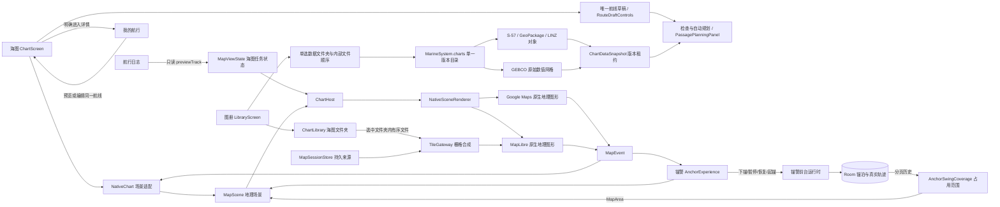

# 海图、海图库与锚警交互契约

本文描述本次代码中的实际职责、接口和状态。业务存储使用 WGS84 坐标与米；用户看到的坐标、距离、航速由 `DisplayFormats` 按全局偏好格式化。

## 数据图册与自动规划（2026-09-25）

图册维护并配置资料；海图只有一个航线编辑工作区。手动调整、检查与自动生成建议消费同一份草稿。当前资料包统一提供海图与数据，显示模式可独立切换，背景图像不参与航线计算。潮汐、天气、天气路由和基于环境的通航窗口不在本轮范围。`PassageEnvironmentReference` 仅保留未来提供方/版本/有效期的扩展形状，当前没有连接环境提供方，也不伪造修正值。

### 用户路径

1. 图册只有 `.yklpkg` 资料包列表，支持新建空包及纯海图、纯数据、两者组合。包内海图槽位由 `ChartLibrary` 管理 MBTiles，数据槽位由 Core 管理同一文件夹内多份 S-57、GeoPackage / LINZ 和 GEBCO。支持原生文件、目录及对应子包导入；新增数据是明确替换完整来源，不把多个资料类型暗中混合。选择资料包立即决定准星和规划的数据，包内海图可切换显示。打开管理和查看范围不改变来源。只在包内排序，包之间没有优先级。“准星信息”控制紧邻坐标的深度与设施读数，不改变规划条件。常规地图不绘制数据矢量；“查看覆盖范围”也只读目录边界。显式“生成离线海图”才将真实数据保存为 MBTiles，完成后按请求持久保存的 `collectionId` 登记到原包，只登记本次文件；若原包已移除或数据已换，不按相同数据 ID 猜另一个包，保留实际文件供手动加入。生成结果供后续离线显示。文件 metadata 和用户维护的包说明各自保留。
2. 地图头部来源入口只显示当前背景和已启用航行数据，并提供同一资料包的选择和管理入口；不再单独选择第二份规划数据。切换背景不清空数据、不改写船舶参数，也不使同一数据和路线的检查结果失效。底图颜色、图片水深标注和文件夹范围都不是计算水深的证据。
3. 海图只有“规划航线 / 继续航线草稿”一个编辑入口；“我的航行”中的新建、继续和编辑已有航线都进入同一张海图、同一个 `OsStore.draftRoute`。当前同 ID 的未保存草稿优先继续；换成另一条已存航线需要确认，不静默覆盖。
4. 在当前地图用准星设置起点、终点并添加途经点，或明确使用当前有效船位为起点。拖动既有航点调整路线；从收藏地点添加、查看航点及手动路线反向在同一编辑器内完成。无需先选择“手动”或“自动”模式。
5. 常驻地图的航线摘要显示航点数与最近一次明确检查状态。检查与自动规划面板只消费当前草稿，不再持有独立 `from / to / useExisting / pickedRouteId`。编辑停顿只自动保留草稿，**不会后台自动启动完整航线检查**；完整检查只在用户点“检查当前航线”时运行，避免抢占自动规划作业。缺数据时仍能手动画线；问题项可回到当前地图定位，资料修复只跳到“图册 / 当前资料包”，船体修复只跳到“设置 / 船舶资料”，返回保留草稿。
6. “自动规划”是当前编辑器的主生成动作：轻量门槛通过后优先占用规划作业直接生成粗航线，不先做一遍完整原线分析，也不在候选后再重复完整分析。候选在当前地图叠加比较；“采用并继续编辑”验证输入和数据版本未变后替换同一份草稿，等待保存回执后回到地图编辑。保留一次采用撤销，后续编辑存在时不以旧撤销覆盖它。不会自动开始导航或记录。
7. “保存航线”写入“我的航行”，实际落盘成功前不清空草稿；失败保留同一 ID 重试。成功后结束编辑展示，回到正常地图；只有明确查看已存航线才显示预览。“保留并退出”和返回只离开编辑，保留可继续的草稿；“丢弃草稿”是单独的确认动作。自动保留草稿不冒充已正式保存航线。
8. 草稿可直接进入现有“开始导航”确认，不强制绕经航线列表。开始前可检查本船真实接入段和余下路径，保留自动绕行的形状点；采用建议或保存收藏不替代出发确认。重新规划余程先以有效船位和后续目标装入同一编辑器；替换执行中的路线仍是带会话/修订比较和分析引用的明确确认命令。
9. 对象点按只查询当前地图位置，不移动镜头或准星。重叠对象先给列表，详情展示名称、深度依据和版本；保存参考位置、按明确点按坐标加入草稿分别确认，航标不会自动成为目的地。拿不到原生标记的真实触点时不以对象中心冒充。深度全部使用全局单位。准星坐标文字立即更新。海图页在用户尚未点准星之前就维护一层**不可见的语义数据层**，但这层不是固定精度：它按当前 zoom 做 LOD。缩得远时加载更大范围、只取接近当前显示比例尺的粗岸线/深度区/主要风险；放得近时缩小范围并逐步加入等深线、测深点和小型设施。当前层按地图中心分 bucket 后后台预取，最近 8 块内存复用；不送 GPU、不改变海图表现，也不把背景像素当数据。准星首先在已驻留语义层上同步 hit-test，命中路径没有 IPC、SQLite 或文件 IO；只有当前区域尚未预取或预取被截断时才回退到 Core 精确查询。精确查询保留完整超时兜底，不能再为了追求“1 秒”把真实数据误判成无数据。

### 实现入口与恢复

- `ChartScreen` 保持原生地图宿主，`RouteDraftSummary / RouteDraftControls / RouteDraftDialogs` 只负责当前编辑和对象动作；草稿仍由现有 `OsStore` 字段与 `DurableSnapshotStore` 保存。
- `PassagePlanningPanel` 现在是“检查与自动规划”面板，不是独立规划页面。`planningRequest` 固定当前路线、图册启用的数据 ID、船舶参数与可选避让区；兼容字段 `backgroundKey` 使用固定的数据上下文标识，不再存显示图层身份。`DraftPassageAnalysis` 仅承担编辑停顿后的草稿自动保留和规划叠加清理，不再自动提交完整分析。
- `LibraryBackgroundSettings / LibraryDataSettings` 复用原 `MapSessionStore` 来源持久化文件和键，避免丢失旧配置。数据列表使用即时生效的单选控件，一次只选一个文件夹；显式“不使用数据”可以清空选择。没有跨文件夹优先级，也没有另一个“已启用资料”弹窗。只有详情中的文件/图幅可排序，顺序经 `ChartDataService.reorderCells` 落盘并递增资料版本。旧多选偏好迁移时仅保留原第一项作为当前选择，其余已安装资料不删除。
- 新数据导入只显示 Core 后台任务，全部来源校验和索引成功后才将文件夹加入目录；失败或取消不留空条目。`sourceUri / sourceIsFolder` 保存原来源，同一规范 URI 去重，重选复用已有身份。普通原生文件/文件夹优先关联 SAF 原件，GPKG/GeoTIFF 只读 fd，S-57/ASCII 直接读源流；本机只保存派生查询索引。提供方不能随机读取或不提供稳定修改时间时才缓存原件；压缩包仍先完整校验解包。版本和索引显式更新，不把外部修改静默混入已获取的快照。更新保留旧可读版本直到完整成功；升级清理空 PENDING 占位，真实部分内容保留供重扫。进度分文件次序与当前文件全部表对象量，不显示虚构的整包百分比。
- `ChartDataset.preparing / preparationIssue / offlineReadable` 分别表达作业进行、未完成原因和实际可读性；局部可读不等于文件夹完整。退出图册不取消 Core 作业，取消或失败保留已发布部分；重启标记中断，由用户继续准备。未准备文件不作为不存在的障碍或已确认空水域。改名和文件夹 metadata 不打断后台准备，内容提交仍核对目录身份，并保留当前名称、说明与文件次序。原权限失效时显式重连，不自动改用别的来源；单个 S-57 更新仍遵守连续更新链。
- 当前变更不调整全局黑白主题、W10M 磁贴强调色、导航运行时或资料许可。API 全量索引仅在完整源码 checkout 中重新生成，不能由局部读取覆盖。

### 真实数据链与边界

`ChartBundleStore`（持久绑定/原子事务）→ 包内 `ChartLibrary`（显示文件）+ Core `ChartDataService`（原生资料、索引、版本）→ `MapSessionStore.activeBundleId`（唯一活动包）→ 海图显示 / `inspectPosition` 准星查询 / 离线规划 / 显式 MBTiles 生成 / Filament 三维资料场景。原件直读或按提供方限制缓存，压缩包校验解包；所有数据读取沿同一不可变版本租约。覆盖预览只读目录范围，不再获取全国对象或绘制抽样色块。

| 资料 | 实际用途与边界 |
| --- | --- |
| MBTiles / 内置全球底图 / 卫星 | 地图显示背景；栅格图像不是自动规划的深度或覆盖依据 |
| 未加密 S-57 ENC | 读取真实海图对象、拓扑、图幅与更新链；格式支持不等于完整 S-52/ECDIS 制图或认证 |
| GeoPackage 矢量包 | 支持 EPSG:4326 / EPSG:3857 的矢量点线面及多部件，不读取 GeoPackage 栅格瓦片；经转换统一为 WGS84。规划语义按 [GeoPackage profile](../GEOPACKAGE_CHART_PROFILE.md) 显式声明，不猜普通 GIS 的水深字段 |
| LINZ LDS 水文 GeoPackage | `LinzLdsAdapter` 核对正式 Hydro 图层名称、原字段与几何类型，再映射实际 S-57 语义。保留提供方、来源日期、深度基准和稳定 `fidn`。参考用途是解析事实，不能通过用户修改用途声明升级为 ENC；有足够数据时可做离线参考规划，结果至少需要核对 |
| GEBCO 数值网格 | 读取 WGS84、原生 15 角秒、单波段有符号数值 GeoTIFF / BigTIFF 或 ESRI ASCII `.asc`；保存原始像元与 NoData，按窗口读取。支持 GeoTIFF 无压缩、LZW、Deflate；不支持 NetCDF、旋转网格、影像瓦片、阴影图或 TID 分类网格。数值是海平面高程，不是海图基准水深；只能参与参考规划，不能证明近岸安全 |

数据文件夹提供重命名、独立 metadata 编辑、整文件夹 `.yklgeodata` 导出、原源重扫、重连、内部优先级和移除；单文件导入使用同一套生命周期。S-57 沿原连续更新规则处理；GeoPackage 可在 QGIS 等外部工具中编辑原文件，再扫描安装同文件夹的完整新版。App 不编辑官方深度、航标或覆盖对象，也不修改来源文件；索引准备或安装失败保留上一完整版本。收藏坐标、用户航线、避让区仍是独立用户内容，不能回写成海图证据。

- 实际解析 `.000` 与连续 `.001` 起的更新，核对图幅、版次、更新序列和记录版本；处理增加/修改/删除及 edition=0 取消。保留 FSPT/VRPT 拓扑、外环/孔洞、SOUNDG 独立深度点、DEPARE/DEPCNT、干出/疏浚、陆地、碍航物、航标灯、交通/限制、桥梁净空、覆盖和质量元数据。
- S-57 读取当前只接受受支持的 ENC 3.x chain-node、WGS84 经纬度及 DDR 字段布局；S-57 非 WGS84 不作伪转换。普通属性、Latin1 和 UTF16LE 国家语言字段可解码。若 M_SDAT / M_VDAT / M_CSCL 局部覆盖采用与图幅不同的基准或尺度，当前标记未支持，不套用错误的统一基准。未支持几何或语义不会悄悄用于“已检查”。
- 读取版本在租约存续期间不随更新或删除变化；分页查询显式说明是否还有数据。地图可有绘制数量上限，分析独立分页读取，不能把未显示的对象当成不存在。
- LINZ 跨日期线 MultiPolygon 的有效分量在同一连续经度分支合并；原始有效但展开后自交的分量只保留局部 envelope 未知对象，不能生成深度或覆盖。有效旁侧分量照常使用，未知范围仍阻止无依据的放行；详见 [GeoPackage profile](../GEOPACKAGE_CHART_PROFILE.md#linz-lds-原始导出适配2026-09-27)。
- GeoPackage 的普通字段名、任意图层名称、几何 Z/M 和地图颜色不自动成为水深或通航语义；只有 profile 或命中完整官方 schema 的 LINZ adapter 可以解释。LINZ 深度面的实际几何可以形成参考覆盖，不伪造 ENC `M_COVR`，也不补造缺失基准。S-57 与开放包消费同一套 `NauticalFeature`；数值栅格通过同一个 `ChartDataService` 快照读取，不另设资料选择。
- `acquireSnapshot` 固定调用方明确选择的版本；`browse` 按图幅 / 类别 / 文本筛选，以稳定对象 ID 跨包分页，`readFeature` 读取同一版本的完整详情，空间 `query` 给地图和分析使用。三种读取都有内部临时读租约与 SQLite 取消信号；调用方在离页 / 输入更换时释放快照，内部读取结束后才允许清理旧索引。不存在的对象返回空结果，失效快照和损坏索引显示错误，不伪装成空资料。
- `DataEligibility.automatic` 让新导入与恢复的旧目录按真实内容参与分析，不再要求用户手动登记“仅浏览／分析许可”。已有明确过期、取消和有效期仍保留；解析器的 `ChartCellRevision.referenceOnly`、深度、覆盖、基准、质量与障碍规则不变。LINZ/GEBCO 的结果仍是需核对的参考结论，不能通过修改 metadata 升级为 ENC。来源、许可和署名作为 metadata 保留，不作为人为开关。
- 导入导出严格分开：`.yklpkg` 是图册容器，`.yklcharts` 是图片海图子包，`.yklgeodata` 是航行数据子包；后缀及清单 kind 必须一致。原始交换集 ZIP 不得冒充 Yokuli 包。清单版本 1/2 仍可读，版本 2 保留文件夹与逐文件 metadata。数据导出经 `ChartDataService.exportPackage` 持有版本和原件，完整打包后写目标文档；离页不取消，失败/取消/中断独立呈现。只有已完整安装集合可以完整导出，旧部分版本必须重扫补全；缺少原件时不能拿索引冒充原文件。
- 关联原件在 `sources.json` 保存 `ChartSourceLink(uri, size, modified, sha256)`，不持久化 `/proc/self/fd` 临时路径。导入前记录指纹，提交前核对来源版本；读取时同版本 5 秒内合并元数据检查，不在每个对象/准星查询重读全包。没有稳定修改时间的提供方在导入时缓存，以免规划需要反复完整哈希。纯本地版本无需 SAF 检查。
- 新快照/读取发现 `CHART_SOURCE_CHANGED / CHART_SOURCE_PERMISSION_LOST / CHART_SOURCE_MISSING` 时显式失败，资料状态显示不可读；不改用其他文件夹。GeoTIFF 窗口句柄覆盖解码生命周期，前后核对原件版本，离开查询释放 fd。导出从关联 URI 读取原件，完整打包前后核对 SHA-256；变更或权限失效时不发布混合版本的包。旧私有副本不会自动删除，用户更新/重连成功后才由原版本租约机制回收。
- metadata 不随 `ChartDataState` 或规划快照广播。界面通过可取消的 `readMetadata(datasetId, cellId?, revision?)` 点开读取，版本改变时拒绝旧请求；文件夹编辑等待读取完成。原件/元数据读取持短租约，防止换版清理与读取竞争。
- 文件夹说明和每个文件的 metadata 互不覆盖。GeoPackage/S-57/数值栅格从原格式提取可展示字段，文件内容仍完整保留；大段或大量 metadata 的界面摘要有界，导出保留原始文件本身。海图文件夹同样可编辑说明并导出全部保留的 MBTiles，包含本机隐藏/移除显示的文件；显示开关不被当成删源文件。
- `rasterWindows` 与矢量读取共用快照租约；按原像元窗口读取，不插值、不从地图截图反推。GEBCO 无数据格保持未知，来源分辨率、海平面基准和不含障碍/法律通航信息的限制随证据保留。导入页默认自动识别产品；文件元数据不能明确识别时，用户可声明官方 GEBCO 2026 高程，不能把普通 TIF 或 TID 声明成可航行水深。
- Android SQLite 初始化中会返回结果集的 `PRAGMA` 统一走查询游标并实际消费结果；纯 GEBCO GeoTIFF 导入不得在栅格解析前因 `execSQL` 查询类型失败，也不要求把有效 `.tif` 转成 ASCII。
- 这是实用地理对象绘制，**不是完整 IHO S-52/ECDIS 制图或认证系统**。S-63 尚无获许可客户端集成、生产 OEM 设备密钥/标识、User Permit 和对应 cell permits，不能解密或宣称已支持 NZ ENC。S-101/S-100 后续可扩展，但当前没有解码器。

技术依据：[GDAL S-57 官方格式说明](https://gdal.org/en/stable/drivers/vector/s57.html)、[IHO ENC 保护](https://iho.int/en/enc-data-protection-s-57)、[LINZ ENC 服务](https://encservice.linz.govt.nz/about)。通用 LINZ 参考地理数据不因为能显示就成为航行 ENC；[LINZ 用途说明](https://www.linz.govt.nz/guidance/data-service/linz-data-service-guide/questions-and-answers)。APK 随包保留 GDAL 对象/属性字典的来源与许可证。

### 分析与规划的当前实现

纯合同在 `core/runtime-contract/.../planning/PassageContract.kt`；几何和作业在 `runtime/marine-local/.../planning`。使用已有 GeographicLib WGS84 反解和 [JTS 几何运算](https://locationtech.github.io/jts/javadoc/org/locationtech/jts/geom/Geometry.html)。长航线按局部块检查完整线段与走廊，保留日期线、陆地岛屿和孔洞；只在选定文件夹内，按文件/图幅 `priority`、编图尺度处理覆盖归属；低数值优先，兼容旧资料的相同 priority 时仍保留尺度等既有消歧。

`PassageRequest` 固定路线几何/版本、当前唯一数据文件夹 ID（列表字段兼容旧格式，最多一个）、船体参数、避让区与 UTC 出发时刻；显示背景不参与分析身份。`PassageAnalysis` 固定数据集版本、规则版本、累计距离、结果等级和每个问题的航段/位置/沿程距离/对象证据。换路线、资料、船体或避让区后旧结果显示条件已变化，不能直接采用旧方案。ETA 只按明确计划速度估计，不包含潮汐/天气修正。

结果只有“有冲突 / 需要核对 / 资料不足 / 已检查条件下未发现冲突”，没有安全分数。测深点不扩展成区域；深度区间保留上下界和基准；沿程图分别表示覆盖、资料空白、深度区间和孤立测深点，横轴是固定累计距离。限制/交通和无法完整解释的条件要核对，不凭缺少告警推定允许。

`PassagePlanningEligibility` 是界面与运行时共用的资料门槛。目录检查返回 `BLOCKED / CHECK_REQUIRED`，先核对明确选择、存在性、离线可读性、用途与有效结构化覆盖。**自动规划采用 route-first 路径**：端点门槛读取局部水域对象和有界原始栅格窗口，不提前把整片栅格 polygonize；实际搜索仍检查 NoData、陆地、浅水和端点可通行性。矢量水域可缺少深度证据，但不能只有文件包围框。缺少真实水域时保存 `INSUFFICIENT`、`complete=false`、零候选及原因。自动规划不会在搜索前完整分析原线、搜索后又完整分析候选；粗层候选仍须做局部细节走廊复核，完整证据报告由独立“检查当前航线”按需运行。

一个文件夹可以有多份数据文件：选中该文件夹后，内部各单元按文件/图幅优先级与尺度合并覆盖和深度，允许起点在文件 A、终点在同文件夹的文件 B。其他文件夹代表可切换的资料类型，不参与叠加，也不要求或提供跨文件夹排序。高优先级单元内缺失的深度不能偷偷借低优先级资料补成已知。单元质量问题只影响其有效优先级范围与实际查询区域相交的部分；远方或被高优先级完整遮盖的单元不阻断本区。缺少 / 损坏覆盖时，元数据边界只用来判断可能影响，绝不充当有效覆盖。端点门槛只是搜索前提，完整搜索边、走廊和最终候选仍需实际几何检查。

全国 LINZ GeoPackage 按比例尺带组织时，一带的所有相关对象表属于同一个文件，避免覆盖、水深与障碍被误当作互相替代的图幅。新文件通过真实 `linzScaleBand` 元数据默认从细到粗排序，不把比例尺带伪装成编制比例尺，不改变已保存的用户优先级。新导入的 GeoPackage 把无法定位对象、覆盖结构与覆盖语义问题保存在 `wholeCellIssues`；可定位的深度、基准及未解释对象问题保留在对象上，规划只检查当前查询窗口和有效优先级范围内的真实对象。远方覆盖先用真实几何边界排除，再进入本地投影；当前窗口内混用同一资料单元的深度基准仍为资料不足。旧目录缺少 `wholeCellIssues` 时继续使用原全幅保守规则，不能因升级就视作已经复核。

`PassageWorldPurpose.REFERENCE_DRAFT` 与 `FULL_ANALYSIS` 保持明确分离。自动规划可使用已有真实 DEPARE/DRGARE 水域面：只缺深度下界、测深数值或垂直基准时保留未知证据，不把整片水面当作陆地；已有可解释的数值浅水仍按吃水/余深筛选。没有覆盖、NoData、损坏或无法解释的几何、陆地、干出、碍航物、净空不足与用户避让仍不能通行。测深点和等深线不扩展成水域，不借其他来源填补高优先资料的未知，也不填入 LAT 等假定基准。

所有自动生成候选均为 `draftOnly=true / complete=false`。成功路径的实际走廊与缺深度/基准面相交时，进一步保留 `INSUFFICIENT`、航段、位置、沿程距离和对象引用；远方缺测不替代实际相交判断。细节证据读取不完整也明确保留资料不足。候选可比较、采用并继续编辑，不能通过候选分析引用直接替换执行中的导航。独立“检查当前航线”继续使用 `FULL_ANALYSIS`，不沿用草稿的缺深度例外。当前规则版本为 `geometry-25-bounded-distance-draft-water`；旧计算失效而用户航线与参数保留。

**NZ 矢量规划稳健性（2026-09-30）**：规划构造 coverage、depth、blocked 与 navigable 几何时，所有 UNION / INTERSECTION / DIFFERENCE 统一经过 JTS OverlayNG Robust，并在进入 overlay 前修复无效局部几何；不再把旧式 overlay 的 `non-noded intersection` / `side location conflict` 原样冒充成“陆地”或整段无路。矢量搜索采用 Basic Theta* 父节点可见直连，直航道直接形成长航段，陆地、干出、障碍、浅水与用户避让仍由最终 `navigable` 的 line-of-sight 硬约束。真正无法解释的局部对象继续保留资料不足/未知语义，不能因修复几何而伪装成已确认安全水域。

**分层推断规划**：矢量自动规划先在较小窗口使用与航段尺度匹配的比例尺寻找主走廊，失败再扩大粗范围或尝试完整细节。粗候选以约 2.5 km 的短段逐段读取细节走廊，遇到实际冲突只修补相关局部，最多 12 轮；不会只因为路线形状看起来绕远就否决真实可通过的水路。搜索用地理距离成本和未加权启发式，直线经完整硬约束查线可通过时立即采用两个原始端点；形状点删除仍须通过同一走廊查线。船宽、浅水和硬障碍的约束不会因简化而放宽。有界 Theta* 是离散近似候选，不能宣称连续空间全局最短路。

候选导航资格同时在 Core 命令端检查：`LocalNavigationSessionService` 遇到带 `analysisReference` 的 START/REPLAN，通过现有规划所有者核对引用；草稿专用候选始终拒绝，REPLAN 还必须命中当前已完成候选、当前资料版本与同一路线几何。拒绝沿原导航回执持久化，不能绕过 UI 按钮直接提交草稿引用。手动 START 仍可引用当前完整接入检查，无分析引用的手动导航保留既有行为；这不是把资料不足改成安全结论。

自动规划是有界、可取消的离线 A*，目标是**先自动出一条可编辑的粗航线**，而不是要求用户先配置一套复杂的避障模型。这里“陆地不可穿越”和“规划失败”必须严格分开：陆地、岛屿、半岛等是搜索网格中的不可走区域，**它们的出现应触发 A* 向两侧继续展开并自动寻找绕行水路，而不是终止规划**。未知/NoData 或真正没有连续水域时才可能导致无解。限制区与交通规则属于后续 `REVIEW`，不作为粗略出线的硬墙。纯栅格路线在首次范围找不到通路时会自动扩大两档绕行范围，用户不需要为了普通岛屿/岸线手工补中间航点。

基础船舶信息即可启动规划：用户只需要维护**吃水、船宽、水面以上最高点**。自动规划请求不再读取旧版的 UKC、障碍附加余量、走廊半宽、转弯半径或计划航速，因此隐藏字段不会继续暗中改变路线。纯数值栅格使用明确配置的船宽/走廊余量，不另加几百米岸距；矢量分析仍保留保守走廊。船高只在桥梁/高空净空实际相关时使用。用户自定义避让区仍是可选附加约束，不是常用流程的必填项。

对于 GEBCO 等参考高程，自动规划不要求海图基准可信深度面作为出线前置条件。原始正值/零值、NoData 和所设吃水不足的像元不可通行；缺少吃水时仅进行水陆搜索。用户端点不再自动挪到周边水域后接回，陆地、无数据、吃水不足分别说明，不能把接回原点的穿陆地短线隐藏在候选里。每条待搜索航段限制 80 km，扩大范围及节点预算均有界；无解不等于真实不存在海路。当前显式自动规划命令仍只一次性更新可撤销草稿，不保存正式路线，不启动导航或记录。

**控制点与快速栅格规划补充（2026-09-27）**：自动规划把用户明确选择的 A/B/C 当作控制点，把算法新增点当作形状点。采用过一次建议后继续添加 C，下一次规划会先剥掉旧形状点，只拿 A/B/C 重新生成整条路线；旧版本漏更新末点索引的草稿也按物理末点恢复最新用户目标。纯 GEBCO / 数值高程资料走原始像元 A* 快速通道，不再先把搜索区域 polygonize 成大量 JTS 面；混合数据和矢量海图仍使用完整几何引擎。自动规划按钮生成的新结果会直接变成当前草稿中的完整折线，随后继续添加 C 时仍只把 A/B/C 当控制点重算。用户已在图册选择的数据默认就是规划输入，附加 UKC、走廊和转弯半径保持可选，不作为“先出一条粗航线”的必填门槛。

**自动／手动混合编辑补充（2026-09-27）**：自动规划产生的完整折线在编辑态逐点编号，编号是当前物理折线顺序，不等于导航时的业务目标序号。所有编号点都可拖动；拖动后该点加入人工控制点集合。长按距离航线约一个手指命中范围内的位置，会投影到最近线段并在该处插入人工控制点；之后所有编号顺延。点按编号点提供删除操作，删除时同时重映射业务目标索引。再次自动规划会先提取现有人工控制点，再重新生成各控制点之间的形状点，因此手工调整不会被悄悄丢掉。2026-09-30 起 GEBCO 优化代价改为实际距离，取消原来的岸距倍数惩罚；陆地、NoData、所设吃水、船宽及避让区仍是明确约束。

**长距离性能**：节点通行状态与有界可见性缓存归单次作业。单窗口逐原像元 supercover 查线；多窗口在每个文件的网格边界切分线段，按文件优先级检查每段，禁止高优先 NoData 被低优先深水补洞。最终所有候选段使用同一通行检查复核。

**控制点接入**：保留精确人工端点，不静默更换为附近水点。原端点、接入网格的短段和最终简化段遵守同一条件；分辨率不足明确说明并由用户决定移动航点或更换资料。

**原生 GEBCO 拓扑**：单窗口搜索以原始像元为节点，多窗口用投影网格并查询原始数据。启发式不乘加权系数，优化实际距离；最终在同一通行条件下向最远可见点拉直。该有界离散近似不是连续空间最短路或航海安全证明。

**任意角度 GEBCO 规划**：Basic Theta* 尝试父节点至下一节点的可见连接。`RasterSupercover` 覆盖被线段触及的全部原始格，包括角点两旁格；不再使用会漏角格的 Bresenham。直水路直接返回原始两端，所有路径分支共用拉直与最终逐段检查，避免多余阶梯点和无理由绕弯。

岸距软惩罚已移除，避免本可直航时出现无理由绕弯。吃水、船宽、避让和已知硬障碍仍限制可通过集合；Theta* 可见性结果按本次搜索缓存，多窗口/混合资料继续使用通用投影网格。单次纯数值栅格读取最多 1,048,576 个原像元，扩大的是局部读取预算，不降采样或抹掉小岛。

**作业预算与复用（2026-10-03）**：Core 的 `PassageWorkSession` 按快照租约、船型、避让、坐标、窗口、尺度、用途和规则版本缓存局部 `PassageWorld`。48 MiB 估算预算同时计入原始坐标、JTS 几何与投影缓存，超预算逐出最旧条目。细查已通过前段与后续来源说明复用相同 world；工作集随单次请求释放，不能跨已取消的投影回调或旧快照复用。它尚不是持久导航场或跨请求路网。

整单自动规划有 20 秒、完整分析有 30 秒宿主单调时钟期限，覆盖准备资料、查询、构面、搜索与细查。单次搜索尝试另有 3 秒预算，为扩大范围和改用细节留出机会；到整单期限持久保存 `INTERRUPTED` 与原输入，明确说明超时不代表没有海路。取消沿现有查询、循环与 JTS 归并检查点传播，**单个 JTS overlay 仍不可抢占**，这些是协作式预算，不是设备实测的绝对响应保证。结果原子保存和租约释放不被页面离开截断。

作业属于进程级服务，离开页面不取消；进程死亡后的未完成作业标记中断，冻结请求、作业种类和航段选择由原工作区保留。编辑恢复以已保留的同一份草稿为准，用户重新计算时使用当前图册数据和船体参数，不自动续算或重放副作用。结果/避让区落盘有错误状态，不把内存结果说成已保存。规划已通过现有 Core 窄端口供 Shell 使用；持久导航场/层次路网、跨重启自动续算、S-63 解密、环境/帆船天气路由仍未实现。

## 拓扑

```mermaid
flowchart LR
  CS[海图 ChartScreen] --> NC[NativeChart 场景适配]
  CS --> RD[唯一航线草稿 / RouteDraftControls]
  RD --> PP[检查与自动规划 / PassagePlanningPanel]
  LIB[图册 LibraryScreen] --> CL[ChartLibrary 海图文件夹]
  LIB --> DS[单选数据文件夹与内部文件顺序]
  DS --> SERVICE[MarineSystem.charts 单一版本目录]
  SERVICE --> VECTOR[S-57 / GeoPackage / LINZ 对象]
  SERVICE --> RASTER[GEBCO 原始数值网格]
  VECTOR --> LEASE[ChartDataSnapshot 版本租约]
  RASTER --> LEASE
  LEASE --> PP
  CL -->|选中文件夹内有序文件| TG[TileGateway 栅格合成]
  MS[MapSessionStore 持久来源] --> TG
  MY[我的航行] -->|预览或编辑同一航线| CS
  TR[航行日志] -->|只读 previewTrack| VS[MapViewState 海图任务状态]
  CS -->|明确进入详情| MY
  NC --> SC[MapScene 地理场景]
  AW[锚警 AnchorExperience] --> SC
  AW -->|下锚/暂停/恢复/起锚| RT[锚警前台运行时]
  RT --> DB[(Room 锚泊与真实轨迹)]
  DB -->|分页历史| SW[AnchorSwingCoverage 占用范围]
  SW -->|MapArea| SC
  VS --> CH[ChartHost]
  SC --> CH
  CH --> NS[NativeSceneRenderer]
  NS --> GM[Google Maps 原生地理图形]
  NS --> ML[MapLibre 原生地理图形]
  TG --> ML
  GM --> EV[MapEvent]
  ML --> EV
  EV --> NC
  EV --> AW
```

三个应用共用地图能力，但不共用页面状态。海图、锚警、地点预览、地图选点器分别持有自己的 `MapViewState`。改变某个任务的镜头，不会移动其他应用的镜头。地图来源由系统统一管理，在图册配置。

## 地理与地图接口

| 类型 | 字段或动作 | 中文含义 |
|---|---|---|
| `GeoPoint` | `lat`, `lon` | WGS84 纬度、经度；只接受有限且合法的坐标 |
| `MapSource` | `Offline`, `Satellite`, `CustomLayer(layerId)` | 内置离线底图、卫星、自定义文件夹图层；不是规划数据选择 |
| `MapVessel` | `point`, `courseDegrees`, `fresh` | 船位、可用航向、是否新鲜；陈旧船位使用灰色 |
| `MapPoint` | `id`, `point`, `label`, `color`, `radiusDp`, `draggable`, `style` | 稳定身份的地理图钉；大小是屏幕 dp，位置始终是地理坐标 |
| `MapLine` | `id`, `points`, `color`, `widthDp`, `dashed` | 有序轨迹或航线；颜色 alpha 可表示时间衰减 |
| `MapCircle` | `id`, `center`, `radiusMeters`, `color`, `dashed` | 以米为半径的真实地理范围 |
| `MapArea` | `id`, `boundary`, `holes`, `color`, `dashed` | 有边界的观测色斑；颜色不是水深或安全海域判断 |
| `MapScene` | `vessel`, `points`, `lines`, `circles`, `areas`, `demo` | 供渲染器使用的不可变场景快照；渲染器不承担导航、记录和锚警业务 |
| `MapViewState` | `center`, `zoom`, `follow`, `showCrosshair` | 本任务镜头、缩放、跟随和准星显示 |
| `MapViewState` | `ruler` | 两个测距端点；拖动修改真实坐标 |
| `MapViewState` | `selectedPlaceId` | 海图本地选中的地点，选中不会自动打开其他应用 |
| `MapViewState` | `previewTrack`, `previewTitle` | 航行日志请求的只读历史轨迹预览，不覆盖实时记录 |
| `MapViewState` | `datasetPreview`, `datasetPreviewNote` | 图册发起的整份/单文件数据预览；只属于当前海图访问，不修改 `selectedDatasetIds`，关闭或返回后结束 |
| `MapViewState` | `interactive`, `scaleTopDp` | 是否接受手势、比例尺在屏幕上的位置 |
| `MapViewState` | `fly(point, zoom)`, `fit(points)` | 显式镜头请求；`fit` 覆盖指定地理范围 |
| `MapCameraRequest` | `id`, `point`, `zoom`, `points` | 单次镜头命令；消费后清除，重组不会重复执行 |
| `MapSessionStore` | `source`, `select`, `selectedLayer`, `sourceName`, `removingLayer` | 持久化地图来源并处理文件夹断开；既有方法名保留兼容 |
| `MapSessionStore` | `selectedDatasetIds`, `selectDataset` | 图册当前单选数据文件夹；列表字段仅为旧存储兼容，长度为 0 或 1。所有规划只读消费 |
| `MapSessionStore` | `view(key, center, zoom)` | 按任务键取回独立镜头状态 |
| `MapSessionStore` | `unitPreferences`, `chinese` | 全局单位与语言的地图显示适配 |
| `MapSessionStore` | `snapshot`, `snapshotSource`, `snapshotCapturedAt`, `snapshotDemo` | 海图磁贴的真实地图快照及来源/时间/演示标识 |
| `MapSessionStore` | `saveFailed` | 来源偏好写入失败，界面不能伪称已保存 |
| `MapEvent` | `CameraChanged(center, zoom)` | 原生相机的实际状态回报 |
| `MapEvent` | `ItemSelected(id)` | 点中原生图钉，由应用决定是预览还是业务操作 |
| `MapEvent` | `PointMoved(id, point)` | 拖动测距或编辑航线的端点 |
| `MapEvent` | `CoordinateSelected(point, longPress)` | 普通点按进入选点；航线编辑时长按路线附近用于在最近线段插入人工控制点 |
| `MapEvent` | `GestureStarted` | 真实手势开始，关闭跟随并显示准星 |
| `ChartCamera` | `project`, `unproject`, `move`, `zoom`, `fit` | 原生投影、反投影与镜头桥接；屏幕像素不写入业务模型 |
| `ChartHost` | `update`, `updateStyle`, `captureSnapshot`, `lifecycle`, `destroy` | 原生地图资源、生命周期、来源切换和磁贴快照 |

地理图形由 `NativeSceneRenderer` 直接加入原生 Google Maps / MapLibre，相机缩放和平移时与地图同帧变换。此前第二层 Canvas 按回调重新投影地理位置的方式已移除；屏幕 Canvas 只画准星和比例尺。渲染器按稳定图形 ID 比较内容，船位变化不会清空并重建所有航线和区域。

比例尺由共享 `MarineUnitFormats.scaleBar` 在用户选定的单位内取 `1/2/5 × 10^n`，包含 `0.5 / 0.02 / 0.001` 等小数尺度，再根据真实投影距离反算线段长度。默认所有缩放均跟随全局距离单位；设置可显式选择另一种固定比例尺单位。没有“小于一海里改米”的隐式规则，船体/锚链的尺寸单位也不再影响比例尺。标签完整宽度参与背景绘制，不将小数截为整数或把短距离扩成超出视口的一整海里。

## 海图用户故事

1. 拖动地图：关闭跟随，准星显示；坐标紧贴底部操作栏。显示准星或坐标时，原生地图的尺寸保持不变。
2. 点中收藏：只高亮该坐标，在底部显示名称、格式化坐标、距船距离及最多两行备注。主操作“前往这里”，次操作编辑和更多；明确打开完整资料才关联进入地点对象。更换地点替换摘要，不移动地图镜头。
3. 完整应用启动由桌面或应用列表负责；海图工具不再常驻“我的航行”等应用目录。地点、航线和来源修复各自保留有明确对象和来路的入口。
4. 标记：按可见操作区分“标记此处”和“记录当前船位”。点下后就地显示同一对象及真实保存状态；无有效船位且未选点时，先明确进入“选择标记位置”，不能把地图中心悄悄说成船位。
5. 测距：A/B 两点都由原生引擎定位；拖动只改变相应坐标。关闭测距仅清理测距状态。
6. 规划航线：一个地图编辑器、一份草稿，自动与手动编辑使用同一条完整折线。自动规划后的每个拐点都显示连续编号并可拖动；拖动自动形状点会把它升级为人工控制点。长按现有航线附近会在最近线段上插入一个新的人工控制点并重新编号；点按任意编号点可查看并删除它。后续再次自动规划只重算人工控制点之间的水路。保存成功结束编辑，不自动常驻预览，也不修改正在导航的冻结路线。 草稿主线与自动规划预览线拥有独立生命周期：规划开始、失败、取消或预览清理只能移除临时 planning overlay，不能隐藏或删除仍有至少两个草稿点的主路线。MapLibre 原生线层在业务场景未变化时也会检查 source/layer 完整性；若 style 重建导致线层丢失，应立即自愈重建，因此不得出现“编号点仍在但草稿线永久消失”的状态。
7. 日志回看：日志设置 `previewTrack` 和标题，再显式打开海图。橙色历史轨迹和实时记录分别显示，可从“更多”结束日志预览。
8. 船位暂不可用：留在地图，产生可追溯系统通知；不把点击“船位”变成跳到设置。
9. 海图来源：头部查看当前图册来源并关联进入图册设置，不在规划里重新选择数据；底部更多不重复提供图源。自定义海图无覆盖时保留内置 Natural Earth 全球离线背景。卫星的联网与宿主条件见 [离线底图边界](OFFLINE_WORLD_BASEMAP.md)。声纳调查入口已从海图移除。

### 标记与落盘回执

`Place.capture` 是可选的 `PlaceCapture`，旧收藏仍能读取。`capturedAtUtc` 记录点击时间；“记录当前船位”同时冻结当次船位的 `positionObservedAtUtc` 和 `positionSource`。地图准星选点只记录点击时间，不伪造船位来源。编辑名称、备注或分类保留依据；改动坐标清除原船位依据，避免新位置继续冒充旧观测。

写入仍通过 `MySailingRepository.put` 和 `OsStore.saveWithFeedback`，由既有 `DurableSnapshotStore` 保存。`placeCommit(id)` 暴露该对象最近一次 `DurableCommit`；`PlaceSaveFeedback` 在海图摘要及地点详情共用“保存中/已保存/尚未保存”。成功来自实际落盘回执或包含该对象的后续完整快照，不来自内存里已经出现图钉。失败原地重试相同 ID 和已冻结内容，不重新采样、不新增重复地点；退出页面不取消进程级写入。

### 导航预览与当前目标

单点“前往这里”直接显示本船到目的地的几何草图与距离，不展示只有一项的起始航点选择。多点预览显示路线及当前起始目标，按保存顺序继续；更改起点明示跳过哪些前置航点，最近点只作解释性提示。草图不是自动避障航路，不创建第二个原生地图。

“开始”才更新现有导航状态；当前目标卡直接提供下一航点/确认到达。未确认到达时跳点和终点结束需要确认，操作核对原路线 ID、目标索引。缺船位时“检查来源”直接进入 `data_center:source/POSITION`，返回恢复原预览、选点或管理子状态，来源修复不自行开始导航。

底部地点摘要使用真实进退动画，保持 `NativeChart` 实例、相机及视口不变；退出摘要停止接收操作。开始导航可明确选择“同时开始航行记录”，偏好保存在 `recordWhenNavigating`。记录继续调用现有 voyage 命令与独立结果通知；已有记录不重复启动，暂停记录不自动恢复，导航和记录分别结束。访问返回及当前导航所有者边界见 [应用访问契约](APP_NAVIGATION_CONTRACT.md#地点摘要前往与来源修复)。

## 海图库结构与 CRUD

| 类型 | 字段 | 中文含义 |
|---|---|---|
| `ChartFolder` | `id`, `uri`, `name`, `displayName`, `layerName`, `enabled` | 一个文件夹就是一个显示组；稳定 ID、持久 URI 与用户标签。`layerName` / `enabled` 只兼容旧档案，旧图层名称作为 `displayName` 保留 |
| `ChartFile` | `id`, `uri`, `source` | 文件身份、读取地址、所属文件夹 URI |
| `ChartFile` | `name`, `filename`, `label`, `displayName` | 档案元信息名称、实际文件名、用户显示名、最终显示名；重命名不改原文件 |
| `ChartFile` | `minZoom`, `maxZoom`, `tileSize`, `scheme` | 栅格缩放范围、像素尺寸及 TMS/XYZ 规则 |
| `ChartFile` | `focus`, `previewZoom` | 显式预览这张海图的有效中心与缩放级别 |
| `ChartFile` | `bytes`, `modified`, `attribution` | 大小、更新时间、署名 |
| `ChartFile` | `enabled`, `priority`, `error` | 是否参与文件夹显示、内部优先级（小数值优先）、读取失败原因 |
| `ChartLayer` | `id`, `name`, `files` | 自动由文件夹生成的可渲染快照，不是用户另外创建的实体；文件按优先级排序，排除禁用和读取失败项 |
| `ChartLayer` | `rasterSize`, `minZoom`, `maxZoom` | 根据参与海图推导的合成栅格规格 |
| `ChartLibrary` | `files`, `folders`, `excludedFiles`, `layers` | 当前档案、文件夹、显式移除记录、可用图层 |
| `ChartLibrary` | `busy`, `progress`, `failure`, `rejected`, `revision` | 真实扫描进度、失败结果和渲染刷新版本 |

操作：

- `linkFolder` / `importCopy`：连接用户文件夹、导入本机副本。
- 文件夹连接后立即生成显示快照，无创建/删除图层命令；`setLayer` 只作为旧调用的 `renameFolder` 别名，不提供独立 UI。
- `renameFolder` / `renameFile`：编辑用户标签，保留原路径和文件名。
- `toggle` / `includeAll`：单个或批量决定是否参与渲染。
- `moveFile`：修改重叠区域优先级；高优先级空白/透明区域继续显示下层。
- `rescan`：发现新增、更新、移除文件，保留用户顺序、显示名和显式移除记录。
- `forget` / `restore`：从库中移除与恢复单个海图；重新扫描不擅自恢复已移除项。
- `forgetFolder`：断开引用，保留原文件。

海图页直接点选文件夹用于显示，旁边的管理入口只打开内容；文件行展开后可设置内部优先级、启用、定位、重命名和移除。旧目录、文件 ID、标签和显式移除记录均沿原索引读取；未“创建图层”的旧文件夹现在也直接可选，不删除或重新导入其内容。

### 数据文件夹的持久结构与操作

| 类型/端口 | 字段或动作 | 中文含义 |
|---|---|---|
| `ChartDataset` | `id`, `name`, `sourceUri`, `sourceIsFolder` | 文件夹是一个数据选择单位；原目录授权可用于后续重扫。旧文件/包导入继续保留，无源 URI 时可显式重连 |
| `ChartDataset` | `revision`, `cells`, `rasters`, `offlineReadable` | 同一目录版本中的矢量单元与栅格元数据，及真实本机可读状态 |
| `ChartCellRevision` | `cellId`, `sourceName`, `priority`, `referenceOnly` | 稳定单元、供列表展示的原文件名、内部覆盖顺序、解析器确认的参考资料限制；用途表单不能清除该限制 |
| `RasterBathymetryGrid` | `width`, `height`, `pixelWidthDegrees`, `pixelHeightDegrees`, `bounds`, `sourceName`, `product`, `noData` | 图册展示的真实尺寸、角分辨率、覆盖、原文件名、产品版本与缺测标识 |
| `MapSessionStore` | `selectDataset` | 单选当前数据文件夹或显式清空，沿原持久键保存；不进行跨文件夹叠加或排序，不复制到每条路线 |
| `ChartDataService` | `reorderCells(datasetId, cellIds)` | 完整排列验证后落盘同文件夹内优先级、递增版本，使旧分析条件过期 |
| `ChartDataService` | `importPackage(...replaceDatasetId...)` | 原源重扫或重连后的完整安装；成功后同 ID 替换，失败保留原副本 |
| `ChartDataService` | `rename`, `updateEligibility`, `remove` | 修改目录名称与用途记录，或移除本机离线副本；从不删除外部来源文件 |

列表单选后立即选用，管理页不会再次要求选一个“包”。不同文件夹只切换，不叠加。数据文件夹的“预览数据与覆盖”以及单文件“预览此文件与覆盖”进入同一个海图只读预览：矢量按当前数据显示规则呈现，数值栅格先显示覆盖，放大后有界显示高程分级；底部明确显示正在预览哪份数据，并可由用户另行选择“设为当前数据”。预览本身不改变规划选择。移除本机副本成功后取消该文件夹选择。更新不自动选用新资料，已选文件夹更新时沿用原选择。图册支持无 / 在线 LINZ / 自定义离线文件夹。在线 LINZ 经 WFS 下载有限区域，再由同一 GeoPackage/LINZ 解析器建立原子本机版本；自定义文件夹仍用系统文件选择器授权。浏览和规划固定本机索引版本；关联原件的目录必须保持授权且文件未变，GeoTIFF 窗口直接读取原件。来源删除/变更/撤销权限明确停止读取并要求重连或更新；压缩包、提供方缓存及旧私有版本不依赖外部原目录持续在线。资料由用户导入，GEBCO 全量数据未随 APK 内置；读取与导入有尺寸、窗口和存储预算，超出时明确拒绝，不把未读部分当成完整覆盖。

## 锚警故事与观测范围

主线是“下锚 → 确认锚点与范围 → 开始值守 → 起锚回顾”。地图占据主要空间，当前距离/半径在底部简短显示；原来的大说明卡片已移除。复杂的锚点估计、风与深度阈值属于内部选项页，不占据常用下锚流程。NMEA 实测深度仍可作为警戒输入；这与移除声纳调查功能是独立事项。

- `AnchorExperience` 通过 `MarineServices.anchor` 调用下锚、更新、暂停、恢复、确认及起锚命令，不创建另一套锚警状态。
- 定位可信性继续由 `AcceptedAnchorPositionPolicy` 判断。用当前船位下锚需要可信定位；地图选定的已知锚点可以创建等待定位的会话，界面明确显示等待。
- 最近轨迹使用最近 30 分钟、10 个时间档位渐隐。拒绝/隔离的位置和数据源变化、断流会断线，不伪造船走过的路径。
- `AnchorSwingCoverage` 通过 `AnchorDao.pointsPage(sessionId, afterTimestamp, afterId, limit)` 读取全部会话历史，然后只增量处理新点。
- `add(samples)` 只累计有效、未隔离的真实样本。`areas()` 输出格子对应的 `MapArea` 色斑，浓度表示停留样本量。
- 最多保留 800 个格子；超出后合并网格，保留旧位置和样本数，不因近期轨迹裁剪丢失整体范围。
- 起锚后，回顾地图同样从已保存完整历史还原区域，最近轨迹与整体范围同时保留。

`AnchorSwingCoverage` 的色斑是“曾观测到船位的区域”，不是声纳扫描、水深、航道或保证安全的锚泊区。地图只显示真实数据能够支持的内容。

## 历史实图记录（2026-09-17，非本轮验证）

2026-09-17，在 `emulator-5554` 上通过真实 UI 检查了自定义 `QA_Priority` 图层下的准星、测距缩放、地点预览、显式详情跳转、从海图重新打开我的航行根页、锚警下锚确认与取消。比例尺在两个缩放级别显示 `500 m`、`200 m`；原生 A/B 图钉与底图一起缩放。创建的临时“标记 2”已通过 UI 删除，未改动原来的标记、航线或来源设置；未启动真实锚警。截图位于 `docs/experience/screenshots/experience3-*.png`。

实图发现版权文字与顶部状态叠放，以及右侧缩放按钮可能覆盖测距端点，已在代码中修正：版权位置只跟随底部上下文区高度变化，缩放按钮移到右上方，地图视口保持原尺寸。最终 APK 需包含此后续修正。此轮没有宣称完成海上锚警实测或所有文件提供器兼容验收。

### 三维海图与相机

生产链为 `ChartNavigationSpatial` → `NavigationSpatialView` → `NavigationSpatialSurface`。这是海图应用内的显示方式，复用当前资料包和唯一导航会话，不创建第二份船位或导航状态。当前实门、下一淡门和沿线菱形目标各自使用真实坐标；航线从执行时冻结的 `NavigationRouteSnapshot.geometry` 读取，不以逐帧方位/距离重新拼出目标位置。线条不改弯、不抬高原路线来绕地形，而作为明确的导航覆盖符号显示；目标、路线和独立 COG 箭带均不能代替地形或安全水域证据。

`NavigationSpatialSurface` 使用已接入的 Filament 1.75.1，加载现有详细船模、真实资料生成的 PBR 地形 GLB，提供随船、概览、海底三个视角。顶栏只有三种模式与资料入口，不重复占据大标题空间。随船围绕实际船位；概览与海底默认北向，不随手机转动，海底移除装饰海面以查看已有高程/区间模型。进入地图固定区域或收藏航线预览时保留该区域，不跳回远处船位、不启动导航；“船位”才显式恢复跟随。

单指转向、双指平移及按钮共用同一原生相机；自由查看冻结跟船，相机可以跨越已加载窗口，实际观察中心以节流回调驱动相邻分块加载。捏合与缩放按钮只改变观察距离，不解除随船。船位按真实观测间隔做显示插值、不外推；小幅移窗重投影已显示相机，大范围切换直接换中心，避免飞过未加载的空白。物标可查看名称、来源、深度证据及实际定位，并回到原海图定位，不新增应用栈。导航操作复用海图原有对话框，暂停、继续、切换目标与结束仍归唯一 Core 会话；剩余距离、ETA、横偏直接呈现 Core 摘要。

船首向决定船模方向，COG 仅显示独立箭带；没有近期 Heading 时用中性位置标记，不能拿 COG 补船头。已校准的横倾/纵倾直接用于船模，不再扣除安装零点；缺失的姿态轴平滑回中性示意，原观测仍为空，不能把上次倾角永久表现为实时。手持观察支持平放、倾斜和横屏，只改变观察方位；固定模式使用数据中心确认的船首向。缺少方向、目标或资料不会阻断已能显示的三维地形，状态与修复入口收在资料面板；引擎或网格载入失败提供重新载入及返回海图，不吞掉异常或用固定四秒截止误报画面卡死。

帧循环只更新相机和模型变换；地形、路线、海面 GLB 在帧外构建，GPU 资源异步载入。相机与姿态使用帧时间缓动，命中只在点按时依据最后成功提交帧的矩阵与真实模型高程计算，不每帧遍历创建点击矩形；窗口外、未上传的目标与水面视角下的测深点不能残留点击。切换资料来源立即清除旧地形；同源原点变化只重投影已有块，替代块 GPU 就绪后才撤下旧块，避免把旧岸线移到新位置或在上传间隙闪空。过时 GPU 上传及时取消并释放。渲染层持有并释放引擎、Surface、交换链、IBL、灯光、材质、资产和帧回调；页面遮挡/后台暂停帧与手持传感器租约，取消加载释放资料快照。动态分辨率、局部网格预算及有限阴影控制成本，不据此承诺所有设备达到固定帧率。

抬起提示不自行切换；只有用户打开自动切换偏好才按角度、稳定时间和滞迟切换，编辑、拖图、通知、面板和自由查看期间抑制。系统地磁模型仅作近似真北换算，未启用相机 AR、天气或实时海况。环境光、反射、水面微波和雾仅用于画面，不来自实际海况观测。

### 离线资料生成三维场景（2026-10-03）

三维是用户主动打开的独立观察方式；海图图片、数据查询和三维派生网格保持分离，不能以此恢复普通地图的自动数据叠加。`NavigationTerrainLoader` 调用 `ChartDataService.acquireDisplaySnapshot / query / rasterWindows / releaseSnapshot`，读取当前单选文件夹的不可变版本。Core 先按局部窗口裁覆盖和查询对象，再跨进程发送；远方独立环不进入局部拓扑，孔洞、未知遮盖和文件优先级仍保留。显示租约不能越窗查询，裁后面边界不能冒充真实岸线；完整 `acquireSnapshot` 与规划几何不变。常驻目录只传覆盖能力摘要，该摘要最多允许发起检查，不证明具体水域覆盖或导航资格。

三维海图与 AIS 共用 `NavigationTerrainRuntime`、`MaritimeTerrainLayer` 和 `MaritimeTrafficLayer`。资料视野支持 500 m–32 km，由相机观察范围决定；密集资料不再缩小整个视野。固定地理网格最多先选 9 块，最近块先发布，周围块陆续加入；因读取预算导致空白的块可细分至总计 24 块。每块有自己的固定原点、真实范围和来源版本，几何按矩形边界裁剪，根场景只聚合块与可点击物标。实际有资料/已完成的范围才能显示，缺测与预算限制保留提示。

原点按半径的 1/3 分桶并设内圈滞迟，数据帧不触发重新编译。相机范围与已加载地形范围解耦，原生手势不等数据读取；换片不会改变用户缩放。可见二维导航/抬起提示提前准备最近一块，三维航行时预取前方窗口；取消与页面生命周期一致，不新建后台导航任务。导航视图同时呈现真实 AIS 目标；AIS 三维也呈现 Core 冻结的当前导航路线，风险、选择和导航状态仍由原各自领域所有者提供。

生产数据链为 `ChartDataService` → `NavigationTerrainLoader` → `ChartDrawingClipper` 的矢量与 `rasterMasks` → `NavigationTerrainGeometry` → `NavigationTerrainMeshBuilder` → `NavigationTerrainProducts` → `NavigationChartScene.patches` → 共享原生绘制层。每块的两个自包含 glTF 2.0 GLB 只含位置、法线、索引和 PBR 材质，没有外部纹理、相机或灯光；场景坐标为以固定 WGS84 原点为基准的东 x、上 y、南 z，单位米。渲染宿主持有船模、水面、相机与导航线，`FOLLOW / OVERVIEW / SEABED` 复用同一资料结果而不切换业务导航会话。

- GEBCO 顶点取真实像元中心和原始高程，有限差分法线只平滑显示。正高程与负高程分别输出到表面和海底网格；跨零三角形的显示切边不新增测深证据。LOD 对照块内每个原像元与实际三角面，不能以四角深水抹掉中间岛屿或浅脊；符号不同或显示误差超出 25 cm–1 m 时递归细分，NaN 也细分到原单元后留空。三角形必须整体位于同一优先级有效范围内，不能跨越高优先级空值、孔洞或局部未知区。预算耗尽留白并提示，不放宽误差掩盖缺失。源分辨率与垂直基准保留在 `NavigationChartSource`，并呈现当前窗口实际读取与缺失像元数量。
- ENC / GeoPackage 深度区间显示为下界阶地，半透明侧带表达已知上下界，并带 `DEPTH_INTERVALS`；这不是精确海底模型。孤立测深只在原测量位置画小标，点间不补造地形。陆地保留真实多边形与孔洞，没有高程属性时只画零平面轮廓并标记 `LAND_HEIGHT_UNKNOWN`；原始岸线只画窄带，不用包围框补陆地。
- 航标、灯和港口设施使用有来源的定位与不同符号模型，显示尺寸不是实物尺寸。设施与测深分配独立预算，优先保留船位附近并分散选取真实测深点，不平均、插值或移动原点。`NavigationChartMarker` 保留身份、名称、位置、来源与深度证据，供宿主点按查看；水下测深只在海底视角参与命中。警告和资料来源与场景一起发布；同一文件内的不同垂直基准也分别保留，不能被合称为统一精确高程。
- 当前每块矢量预算为 4,096 个对象、350,000 个局部几何顶点，Core 显示快照另限 250,000 个局部覆盖顶点；栅格预算 262,144 个原像元。设施最多 64 个、测深点最多 96 个，实际数量随场景发布。超预算明确返回部分/精度限制，不省略未知遮罩后继续画一个貌似完整的海底。每块最多生成 24,000 个三角形（表面 10,000、海底 14,000），两个 GLB 总计不超过 8 MiB。孔洞用 JTS 多边形三角化保留，不用三角扇填平；过于复杂的单面明确跳过并标记预算限制。
- 原件核验等待最多 4 秒，每块加载最多 10 秒、一个区域最多 32 秒；协作式取消覆盖查询与生成循环，单次 JTS 运算仍不能硬抢占。取消/失败都释放 Core 租约。已完成块可先显示，超时保留部分状态，仍可见时从已有缓存续读一次，之后交由显式重试；永久预算限制不自动循环重试。没有整个区域假百分比。
- `NavigationTerrainProducts` 保存带 SHA-256 校验的二进制 `.ykm` 派生网格，元数据包括原点、修订、真实来源、警告、设施和覆盖计数。临时写入、fsync 后原子发布，损坏回退重建。内存 32 MiB/96 块，磁盘 192 MiB/1,024 块；收到内存压力清内存，退出页面不会清盘或清除其他宿主仍可用的结果。缓存不成为用户原件库，也不写入业务水深状态。
- 命中缓存前调用 `ChartDataService.validateDisplayProduct(datasetId, revision)`：Core 钉住当前来源目录、核验原件/权限/索引/栅格并再次核对修订，只回传布尔值，避免为了复用网格再次裁全国覆盖面。冷块仍持有 `acquireDisplaySnapshot` 局部租约。来源变化或不可读立即隔离旧产物，缓存不能让被删除的原件继续冒充有效资料。
- 共享地形层分块异步 GPU 上传、复用同 key 资产；地形失败单独呈现，不把 AIS 交通和导航画面一起判为卡死。共享交通层按真实尺寸/艏向绘制，缺方向用中性标记，观测年龄和风险保持领域语义。

真实限制：未接入潮汐、天气、实时海底扫描或建筑物测绘；普通海图栅格图片不能产生地形。资料缺失保持空白，设施模型不提供实测高度，区间面不提供逐点净空保证。GLB 成功生成只证明展示数据链完成，不等同于海上导航安全判断或设备帧率结论。

### 路线形状与导航目标

自动规划曲线保留完整路径用于绘制、沿程距离、横偏和引导；插值点不是需要用户确认的业务航点。`Route` / `NavigationRouteSnapshot.navigationTargetIndices` 指定实际业务目标，旧路线缺少该字段时保留原每点目标语义；`geometryIndex` 只跟踪沿线路径。目标方位与沿线转向分别发布，立体指向不能直接指向障碍物另一侧的终点替代沿线引导。不能在给定转弯约束下保留用户中间目标时，规划明确拒绝该候选。

GPX 导出保留所有路线点，并在 Yokuli 命名空间扩展中保存业务目标索引；本机重导不会把所有形状点变成确认航点。外部应用不认识该扩展时仍可读取标准路线几何，不承诺其导航目标策略相同。

## ENC 矢量呈现接入（2026-09-27）

### 使用故事与边界

本节保留显式资料预览与海图生成所复用的矢量表现规则。2026-09-30 起，常规 `MarineMap` 不连续叠加数据矢量；图册“数据”页面仅提供准星信息开关，具体查询链见下节。矢量表现模型保留基础／标准／全部、昼夜配色、深度阈值、名称和灯扇区等设置供受控生成入口使用。水深输入和读数沿全局 `MarineUnitFormats` 换算，持久化仍为米。显示偏好不修改原始 ENC、不改变规划吃水、不叠加另一份数据文件夹。GEBCO 是数值栅格，海图配色和矢量细节开关不把它伪装成 ENC；它通过独立数据预览及准星原始像元查询呈现。

用户设置的安全水深与实际绘出的安全等深线不同：对每个 `(datasetId, cellId)`，选择当前可见原始 `DEPCNT` 中不浅于阈值的第一条；深区分色与粗线使用该图幅的实际值。只能使用下一条更深等深线时会明确显示实际值；没有可用等深线会提示缺失，不插值一条虚构等深线。危险测深加粗，但不会把大范围深区平均值当成点测量。

基础模式保留陆地、岸线、深度区域、安全等深线和危险物；`SCAMIN` 不得隐藏这些内容。标准模式加入航标、灯、航道、限制区、桥梁净空和名称。全部模式显示质量范围及尚无专用规则对象的通用轮廓／标记，完整对象属性仍能在地图点选查询。未知类、超过原图精度、视口查询／符号预算截断、缺覆盖及几何损坏均产生显示说明；地图只显示最重要的一条和其余项数，点按展开，不堆多张状态卡。

浅水危险物结合本图幅周边深区、`VALSOU`、`WATLEV` 与质量属性决定突出方式；不能因为用户关闭名称、切换基础模式或缩小地图就消失。航标依据 `BOYSHP`、`CATCAM`、`COLOUR` 和同位置 `TOPMAR` 生成简化形状。灯光使用 `SECTR1/2` 的真方位，按从海上望向灯的定义反转 180° 后绘制；扇区半径是有界显示长度，**不表示实际能见距离**。没有灯色、扇区或测深资料不补造属性。

### 准星信息与局部查询（2026-09-30）

「图册 → 数据 → 准星信息」沿同一 `ChartPortrayalPreferences.showCursorInformation` 由 `MapSessionStore` 原子保存。常规海图、锚警及其他 `MarineMap` 宿主不再连续绘制所选数据的对象叠加；切换或移动地图不会自动发起全视口资料分页与 JTS 裁剪。所选文件夹仍是离线规划和指点查询的唯一资料来源。旧矢量表现偏好供显式资料预览及离线海图生成使用，不再作为常规地图的另一层开关。

海图与锚警复用 `MapCrosshairReadout / ChartCursorReadout`。拖动停止 300 ms 后，`ChartCursorProbe` 调用可取消的 `ChartDataService.inspectPosition(datasetIds, point, radiusMeters)`。Core 在同一次请求内部取得并释放不可变版本租约，按空间索引查局部对象，使用实际多边形孔洞、未知范围和文件内部优先级判断命中；同一坐标的覆盖判断复用缓存。原始多边形和全国 coverage 不跨 IPC，也不为一个准星构造或裁剪整幅 JTS 面。

点查询与共享绘制裁剪均按连续边展开经度，再将整个几何分量对齐到查询窗口；不能逐顶点折回 ±180° 后把远处海岸连接成横穿全球的长边。孔洞与所属外环对齐，独立岛屿保留；显式全球生成只在接缝另一侧加入真实分量副本。来源检查复用不可变版本的 inventory，并合并同版本五秒内的外部元数据检查；纯本地包不逐次访问 SAF，不为每次准星重新哈希整包。

`ChartPositionInfo` 返回资料 ID、版本、名称、`ChartPositionHit` 摘要和可选 `ChartPositionRaster` 原始像元。面和线摘要的 `geometry=NONE` 明确表示省略几何，距离与最近位置另列；真实点保留其原始坐标。需要完整几何仍走固定快照的 `readFeature`。水深和附近设施分别显示为坐标下方的小框，点按打开现有对象详情，不移动相机或准星。详情里的栅格查询复用同一紧凑端口。

包含准星的深度面显示原始区间；孤立测深显示“附近测深”及距离，等深线显示附近等深值；GEBCO 显示估算深度或地表高程。半径随缩放限制为 2–150 米，按整米稳定，读数全部使用全局单位。不把底图颜色、缩放或附近点插值为准星处实测深度。没有原始像元就是未知，高优先级空值和局部未知几何不借低层补齐。

单次扫描上限为 384 个候选、24 MB 原始对象载荷，最多返回 48 个摘要；高优先级文件未查完整时，只保留之前完整读取的文件和已知未知区，并明确标记部分内容。Core 在 6.5 秒截止后返回 `CHART_POSITION_QUERY_TIMEOUT`，不能把内部超时当成用户取消而不回包；Shell 在 8 秒等待上限后原位提供重试。改变位置、数据版本或离场取消旧查询；当前页面只缓存 8 份相同位置、半径与资料版本的已完成结果，不将旧位置读数放到新坐标下，也不因别的文件夹更新反复读取。

新导入尚未完成时只在图册任务中显示，不进入所选资料列表或准星数据源。已安装资料的更新继续使用原可读版本。对旧版本遗留的部分资料仍区分准备状态与此处无值，点按可进入图册重扫；完整资料在此无值才显示无深度数据。读取失败原位重试，不另发 toast 或通知。原文件只读，收藏和草稿动作沿现有确认链执行。

### 显式资料表现链路

以下为复用的表现能力，不表示普通地图仍连续订阅全视口数据。

`ChartPortrayalPreferences`（纯契约）→ `MapSessionStore`（原子持久化显示偏好）→ `rememberStructuredChart`（同一不可变快照、有界分页）→ `ChartDrawingClipper`（文件夹内部文件优先级与真实覆盖裁剪）→ `structuredScene`（语义规则、分级深度、符号与文字避让）→ `MapScene` → `NativeSceneRenderer / LibreSceneGeometry / NativeSoundingLayer`。

- 当前视口最多读取 12,000 个完整对象；超限明确提示放大。点选保留未经显示抽稀的已查询对象，不按图标颜色反推事实。
- 多边形填充与真实边界分别裁剪；视口边缘和图幅拼接边不能变成假岸线。岛屿孔洞和日期变更线沿原几何保留。
- 普通符号与标签有预算、稳定世界网格避碰；危险符号优先保留。测深网格保留实际最浅点，不平均数据。原生地图在同一帧投影图形与图标，不用屏幕 Canvas 追赶缩放。
- 图标为本项目原创 Android 矢量路径，文字由本地字体生成；没有联网 glyph 依赖，不复制 OpenCPN GPL 代码或图标。样式更换／视图退出会取消生成与上传任务并释放原生图层、source 和 sprite。
- 日／暮／夜改变海图语义调色板及周边内置参考底图亮度。红／绿航标与洋红危险语义不跟随 Shell 强调色；用户栅格图的像素不被伪装成矢量深区。

### 标准依据与未覆盖项

采用 [IHO S-52 6.1.1](https://docs.iho.int/iho_pubs/standard/S-52/S-52%20Edition%206.1.1%20-%20June%202015.pdf) 中的显示类别、安全等深线、分级深度与昼夜呈现原则；参考 [IHO 呈现公告](https://iho.int/s-52-portrayal-bulletins) 的等深线文字密度要求，以及 [OpenCPN 官方矢量显示说明](https://opencpn.org/wiki/dokuwiki/doku.php?id=opencpn:manual_basic:set_options:charts:vector_display) 的用户参数组织。它们是规则和交互参考，不是第三方程序或资源的导入。

**这是实际接入的增强 ENC 呈现，不是完整 IHO Presentation Library 或获认证 ECDIS。** 尚未覆盖全部对象／属性 lookup table、全部条件符号程序、全部复杂线型与填充 pattern、官方 Chart 1 图例／符号精确复现、IEC 显示校色与型式认可、S-63 解密。质量区显示资料属性，不以 UI 星级替代测量质量评估。完整 S-52 一致性不能由“能读取 S-57”或“图标看起来相似”推出，后续必须在同一规则入口扩充，不能另建平行地图状态。

### GEBCO 粗略地形草图（2026-09-27）

官方 GEBCO 2026 数值网格在 `REFERENCE_ONLY` 状态下可以进入粗略地形搜索，不要求用户把它标成正式航行分析资料；参考用途例外适用于解析为 `GEBCO_2026_Grid` 的数值栅格及由明确 LINZ LDS 语义识别的参考单元，过期/取消资料和普通未知 GIS 文件不会绕过用途门槛。生成的候选继续保留参考来源与 `REVIEW`，只按当前显式规划请求更新草稿，不自动保存或开始导航。GEBCO 官方条款明确说明该 Grid 不应被用于导航或海上安全，因此界面必须持续展示这一限制，结果只能作为人工规划时的粗略地形参考。

### LINZ 区域资料与规划（2026-09-30）

- 设置 → LINZ 保存用户 API 密钥；密钥用 Android KeyStore 加密落盘，不进入公开状态、资料 URL、备份、错误消息或日志。`ChartDataState.linz` 只发布是否已配置、完整缓存的日期和区域。
- `ChartDataService.configureLinz` / `refreshLinz` 属于原图册所有者。在线源使用固定 `linz-online` ID，仍遵守单一资料选择；更新完整后才能替换旧索引。缓存区域内可离线，区域外必须先完整下载；无网络/无密钥/分页不全保持旧版本并停止本次新区域规划。
- WFS 2.0 获取官方目录中明确识别的 1:22k–1:90k 水文层，再按 BBOX、500 条分页、稳定排序下载。检测重复页、总数改变、大小/对象/顶点预算、坐标和几何错误。覆盖由实际深度面裁剪到本次完整下载区域，不能用 BBOX 填造水域。
- LINZ 是数据服务，不提供本实现可调用的航线计算 API。下载后仍运行本机规划。手机入口下载有限区域，全国批量入口为 `scripts/download_linz_offline.py`：从私有文件读取 WFS 密钥、核对下载前后 `hits` 总数、分页身份及末尾空页，每个比例尺带完整发布一个 GeoPackage。同一来源的不同对象类别不能拆成互相遮蔽的优先级文件。失败保留可续传阶段，不能发布半包；密钥不进入下载资料、清单或代码仓库。
- LINZ LDS 水文资料不替代 ENC，未按 Notices to Mariners 修正；参考路径保持 REVIEW。依据：[LINZ WFS 版本](https://www.linz.govt.nz/guidance/data-service/linz-data-service-guide/web-services/versions-and-version-support)、[LINZ 用途与基准](https://www.linz.govt.nz/node/6334)、[空间过滤](https://www.linz.govt.nz/guidance/data-service/linz-data-service-guide/web-services/wfs-spatial-filtering)。
- 独立检查区分“中心线穿过原始陆地像元”和“靠近岸线像元的不确定余量”；后者是需要精细资料核对，不能报告为已经走陆路。
