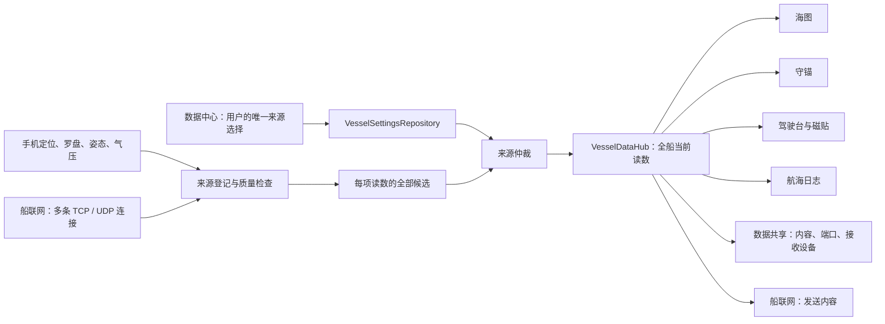

# 数据中心：全系统统一的来源选择

更新：2026-09-18

数据中心回答“这项读数是什么、来自谁、最后何时更新、要用谁的”。船联网回答“与哪些设备建立连接、如何收发”。数据共享回答“本机开放什么内容给哪些接收设备”。三个应用操作不同业务对象，不互相代替。

## 页面与用户故事

- **读数 → 位置**：查看最后位置和时间，明确选择关闭、手机 GPS 或一条已连接的 NMEA 输入；连接内有多个船位提供者时再选实际来源。不会为了选船位自动启动连接。守锚进行中锁定船位选择；暂停后才可修改。
- **读数 → 某项读数**：同一列表列出手机和各 NMEA 输入的候选，显示各自最后读数、更新时间和质量。自动采用候选或固定某个来源。固定来源暂时没更新时保留选择，不自动换成别的。
- **对地航速、对地航向**：默认跟随船位来源；显式指定后可采用另一来源。指定读数不会隐式打开 GPS 或网络连接。
- **手机 → 定位**：显式控制手机 GPS 的启停和权限；与位置页编辑同一份系统位置选择。
- **手机 → 固定手机**：对齐船艏、可匹配当前有效的同北向基准船载罗盘；确认手机朝向和姿态安装。船首向与手机原始方向分别显示，COG 不用作船首向。
- **船联网**：只维护连接、收发情况、原始报文和发送策略；没有“用这条连接的船位”或嵌套来源设置。
- **数据共享**：只维护本机服务端、分享内容、连接的客户端和实际写出记录；没有手机定位或手机安装设置。

## 唯一配置与接口

| 对象 / 接口 | 职责 |
| --- | --- |
| `VesselSettingsRepository.metricSourcePins` | 每项指标指定的稳定来源键。数据中心编辑，其他应用读取；不在 UI 创建第二份副本。 |
| 系统 `GpsDataSource` 与 `POSITION_CONNECTION` | 全局船位模式与固定 NMEA 输入；保留显式选择与守锚锁。 |
| `MainViewModel.setVesselMetricSource(metric, sourceId)` | 统一修改指标来源；非船位字段传 `null` 还原自动选择。船位指定 NMEA 来源需有效连接，手机/关闭使用显式定位命令，不能以 `POSITION + null` 自动换船位。旧 `setNmeaMetricSource` 仅为兼容委托。 |
| `VesselMetricSelectionPolicy.choose(settings, metric, sourceKey)` | 对现有配置应用逐字段选择；仅在用户点自动时清除旧船首向共用偏好，不覆盖其他字段。 |
| `VesselDataSnapshot.candidates` | 所有登记来源的候选及各自时效；不能只暴露当前采用的那一个连接。 |
| `VesselObservation.sourceIdentity` | 实际采用的物理来源，与用户 pin 分开显示；连接重连不改变稳定来源键。 |
| `VesselObservation.receivedElapsedRealtime` | 此项有效测量自己的接收时间；空字段和心跳不能刷新读数年龄。 |
| `VesselSourceIdentity.transportProfileId` | 有值时对应真实网络连接；手机传感器不伪装为连接。 |
| `NmeaConnectionSpec` | 连接协议、地址、端口、收发及发布内容，不拥有全船指标来源选择。 |
| 本机服务发布策略 | 端口、能力选择、转发输入，不拥有全船指标来源选择。 |
| `DataCenterScreen(os, initialMetric)` | 数据中心入口；`POSITION` 等指标 ID 为子页入口，`phone` 打开手机页。 |

派生数据通过原来的计算模型获取；数据中心不编造手动关闭或来源选择开关。尚未提供过读数的来源不会伪造一个有值的候选。失效的方向数据不继续用作当前船头方向；普通慢速更新的读数保留上次值并显示时间。

## 旧版船首向偏好兼容

旧版真、磁船首向共用的来源偏好不在升级时静默清除，来源页会明确标记。用户指定某项来源后，该字段独立 pin 优先且禁止备用来源顶替；选择“自动”时明确清理旧共用偏好，另一字段已有独立 pin 保留。真风各字段指定来源后也绕过自动计算回退：外部来源停止时不能拿推算值冒充原来源。

## 发布策略升级

新发布策略只提供“数据中心的读数”和“转发输入连接”。旧版 `PHONE` 配置保留正在运行的发送内容，并明确显示“手机专用 · 旧配置”；不会在升级后静默改成船载数据。停止后，用户必须在内容编辑器明确采用数据中心、保存后再启动。原始转发仍按输入身份防止回送，不修改全系统采用的读数来源。

## 返回与页面保留

数据中心内部展开指标或安装页，返回时还原原来的滚动位置与 pivot。外部应用直接打开 `data_center:POSITION` 或 `data_center:phone` 时，首层返回交给 Shell，还原调用应用的具体页面。深链进入手机页后再进入安装或位置页，先返回手机页，再返回调用者。

数据中心不会使用任何连接或服务的“启动”动作刷新列表。前台传感器显示资源由 Shell 统一持有，避免离场动画里的旧应用释放新应用正在使用的传感器。
