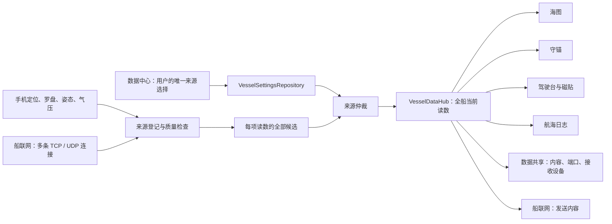

# 数据中心：全系统统一的来源选择

更新：2026-09-25

数据中心回答“这项读数是什么、来自谁、最后何时更新、要用谁的”。船联网回答“与哪些设备建立连接、如何收发”。数据共享回答“本机开放什么内容给哪些接收设备”。三个应用操作不同业务对象，不互相代替。

## 页面与用户故事

- **读数 → 位置**：查看最后位置和时间，明确选择关闭、手机 GPS 或一条已连接的 NMEA 输入；连接内有多个船位提供者时再选实际来源。不会为了选船位自动启动连接。守锚进行中锁定船位选择；暂停后才可修改。
- **读数 → 某项读数**：同一列表列出手机和各 NMEA 输入的候选，显示各自最后读数、更新时间和质量。自动采用候选或固定某个来源。固定来源暂时没更新时保留选择，不自动换成别的。
- **对地航速、对地航向**：默认跟随船位来源；显式指定后可采用另一来源。指定读数不会隐式打开 GPS 或网络连接。
- **手机 → 定位**：显式控制手机 GPS 的启停和权限；与位置页编辑同一份系统位置选择。
- **手机 → 固定手机**：手机留在实际使用的支架中，可斜装或竖装；明确确认当前安装姿态为横倾、纵倾零点，再分别微调船首向、横倾和纵倾。可匹配当前有效、同北向基准的船载罗盘。船首向与手机原始方向分别显示，COG 不用作船首向。
- **船联网**：只维护连接、收发情况、原始报文和发送策略；没有“用这条连接的船位”或嵌套来源设置。
- **数据共享**：只维护本机服务端、分享内容、连接的客户端和实际写出记录；没有手机定位或手机安装设置。

## 唯一配置与接口

| 对象 / 接口 | 职责 |
| --- | --- |
| `VesselSettingsRepository.metricSourcePins` | 每项指标指定的稳定来源键。数据中心编辑，其他应用读取；不在 UI 创建第二份副本。 |
| 系统 `GpsDataSource` 与 `POSITION_CONNECTION` | 全局船位模式与固定 NMEA 输入；保留显式选择与守锚锁。 |
| `MarineServices.sources.setVesselMetricSource(metric, sourceId)` | 统一修改指标来源；非船位字段传 `null` 还原自动选择。船位指定 NMEA 来源需有效连接，手机/关闭使用显式定位命令，不能以 `POSITION + null` 自动换船位。旧 `setNmeaMetricSource` 仅为兼容委托。 |
| `VesselMetricSelectionPolicy.choose(settings, metric, sourceKey)` | 对现有配置应用逐字段选择；仅在用户点自动时清除旧船首向共用偏好，不覆盖其他字段。 |
| `VesselDataSnapshot.candidates` | 所有登记来源的候选及各自时效；不能只暴露当前采用的那一个连接。 |
| `VesselObservation.sourceIdentity` | 实际采用的物理来源，与用户 pin 分开显示；连接重连不改变稳定来源键。 |
| `VesselObservation.receivedElapsedRealtime` | 此项有效测量自己的接收时间；空字段和心跳不能刷新读数年龄。 |
| `VesselSourceIdentity.transportProfileId` | 有值时对应真实网络连接；手机传感器不伪装为连接。 |
| `NmeaConnectionSpec` | 连接协议、地址、端口、收发及发布内容，不拥有全船指标来源选择。 |
| 本机服务发布策略 | 端口、能力选择、转发输入，不拥有全船指标来源选择。 |
| `DataCenterScreen(os, initialMetric)` | 数据中心入口；`POSITION` 等指标 ID 为子页入口，`phone` 打开手机页。 |

派生数据通过原来的计算模型获取；数据中心不编造手动关闭或来源选择开关。尚未提供过读数的来源不会伪造一个有值的候选。失效的方向数据不继续用作当前船头方向；普通慢速更新的读数保留上次值并显示时间。

## 固定安装与校准

`VesselMountCalibration.attitudeFrameVersion=3` 保存当前固定安装的单位四元数，而不是要求手机平放。`PhoneVesselAttitudeFrame` 将之后的旋转映射到安装确认时的水平船体参考，横倾、纵倾零点只由用户明确重设。陀螺仪角速度使用同一固定安装变换。船已倾斜时，用户可输入已知横倾/纵倾偏差；应用不会声称所确认的零点就是绝对水平。

通常以手机顶部的水平投影确定初始船艏；顶部接近竖直时使用屏幕外法线，随后用户核对并调整船首向。安装转换后仍使用实际磁北/真北参考，不能以相对 yaw、COG 或归零动画代替船首向。手机原始罗盘字段独立保留，船首向候选使用 `PhoneHeadingSample.liveVesselTrueHeadingDegrees / liveVesselMagneticHeadingDegrees`；守锚证据使用经过完整性门控的 `vesselTrueHeadingDegrees / vesselHeadingQuality`。

| 接口 / 字段 | 当前行为 |
| --- | --- |
| `confirmFixedPhoneMount()` | 需要新鲜姿态与可用罗盘；一次保存固定安装零点，清除三项微调，不更换来源，也不自动继续暂停的记录。 |
| `setPhoneHeadingAlignment(offsetDegrees)` | 保存 −180° 至 180° 的船首向修正；不是重新捕获姿态。 |
| `setPhoneAttitudeAlignment(heelDegrees, pitchDegrees)` | 保存各 −45° 至 45° 的横倾、纵倾修正；正值为右舷下沉、艏部抬起。更新校准版本，活动记录建立相应新姿态分段。 |
| `invalidateFixedPhoneMount()` | 移动手机后停用旧安装的船首向和姿态，等待明确重新确认。 |
| `heelOffsetDegrees / pitchOffsetDegrees` | 与四元数一起由校准 DataStore 持久化，并进入系统备份。 |

旧版 frame 1/2 的“平放绝对姿态”不能被自动解释成新的固定零点；升级/恢复后标为需要重新确认。未知版本或损坏四元数不能作为已确认船体安装。没有姿态传感器时不显示可用的固定安装功能。数据中心、驾驶台、地图、记录和共享消费同一个校准后的数据中心结果。

## 明确替换船位来源

UI 只提交一次“改用手机”或“采用这条 NMEA 输入”，不模拟先关旧来源再开新来源。运行时先检查守锚锁；活动守锚依赖当前来源时拒绝替换，显示原因并保留去当前守锚的入口，绝不自动暂停。

手机替换由现有 `SystemLocationRepository` 暂时采集真实 GNSS，精确定位权限和系统 GPS 必须可用。准备结果不提前发布成全船已采用船位。取得近 10 秒有效、非 mock 且精度不超过 100 米的 GNSS 后，再在原命令队列提交采用关系；等待最多 20 秒，等待本身不占用系统命令队列。提交时再次确认守锚状态、原来源与准备位置年龄。超时、取消、权限或持久化失败均释放租约并保留原来源；页面显示准备中及实际失败反馈。

NMEA 替换只检查用户选定的现有连接和同一代次有效船位候选，资格检查发生在 `NavigationRepository.positionSelectionReady()` 与运行时，不另开探测 socket。读取未完成或连接未开时保留当前来源；来源页直接进入 `nmea:connection:<id>` 修复，返回继续原指标。连接内 pin 与全局来源写入失败会保持/恢复原采用关系；选源不会停止其他 NMEA 内容或分享服务。

## 旧版船首向偏好兼容

旧版真、磁船首向共用的来源偏好不在升级时静默清除，来源页会明确标记。用户指定某项来源后，该字段独立 pin 优先且禁止备用来源顶替；选择“自动”时明确清理旧共用偏好，另一字段已有独立 pin 保留。真风各字段指定来源后也绕过自动计算回退：外部来源停止时不能拿推算值冒充原来源。

## 发布策略升级

新发布策略只提供“数据中心的读数”和“转发输入连接”。旧版 `PHONE` 配置保留正在运行的发送内容，并明确显示“手机专用 · 旧配置”；不会在升级后静默改成船载数据。停止后，用户必须在内容编辑器明确采用数据中心、保存后再启动。原始转发仍按输入身份防止回送，不修改全系统采用的读数来源。

## 返回与页面保留

数据中心内部展开指标或安装页，返回时还原原来的滚动位置与 pivot。外部应用直接打开 `data_center:POSITION` 或 `data_center:phone` 时，首层返回交给 Shell，还原调用应用的具体页面。深链进入手机页后再进入安装或位置页，先返回手机页，再返回调用者。

数据中心不会使用任何连接或服务的“启动”动作刷新列表。前台传感器显示资源由 Shell 统一持有，避免离场动画里的旧应用释放新应用正在使用的传感器。

## 通知中心的来源与连接摘要

通知中心“船位来源”只读当前全局 `GpsDataSource`、已采纳 `VesselObservation`、来源年龄/质量与守锚锁；它不是 GPS 开关，打开不会启停定位或更换来源。来源详情再明确进入 `data_center:POSITION`，手机安装进入 `data_center:mount`，沿用同一配置和返回关系。

“船舶连接”读取 `MarineServices.network.connections` 的真实数量、连接/异常状态和具体连接 ID；网络在线不等于船位有效。查看摘要不连接 socket，进入对应 `nmea:connection:<id>` 才处理该连接。中心不持有第二份来源/连接策略，也不因为打开中心申请全部仪表或航向显示租约。

守锚使用中的来源限制由原领域执行。来源摘要不会自动暂停保护；任务卡明确暂停并等候命令回执后，用户才可按来源流程修改。关闭中心、历史已读或移除都不改变来源、连接、发布或守锚状态。
