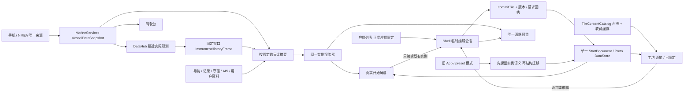

# 仪表与应用磁贴：数据与交互契约

本文件对应 `InstrumentsExperience.kt`、`MarineInstrumentGraphics.kt`、`ReadingTrace.kt`、`InstrumentHistoryModel.kt`、`InstrumentHistoryDrawing.kt`、`InstrumentWeatherPanel.kt`、`TileLibraryExperience.kt`、`TileEditorExperience.kt`、`TileContentCatalog.kt`、`ContentTileRendering.kt`、`TilePresentationState.kt`、`TilePresentations.kt` 和 Shell 的布局编辑器。内容描述实际实现，不表示已经完成真机验收。

2026-09-25：用户确认 [本轮施工故事](../phases/tile-workshop/IMPLEMENTATION.md) 后，磁贴改为“内容绑定 + 独立实例”。工坊管理可固定内容和表现，桌面管理布局，应用提供只读摘要及完整操作。按最新用户规则，新固定只从应用列表和工坊发起，业务 App 内固定按钮已移除；桌面长按仍管理已有实例。下文记录本轮生产入口，不把编译与实际设备表现混同。

## 领域边界

- 驾驶台消费系统选好的观测，不能因为打开页面就切换船位来源或创建航行。
- 我的仪表只拥有显示顺序、增删与查看读数的交互。来源、吃水、船舶资料和航行仍由各自的共享服务拥有。
- 磁贴工坊按航行与值守、常看读数、我的收藏、应用入口组织；一个应用可提供多种内容，同一规范内容只固定一次。水深与对地航速属于驾驶台的不同内容，不新增 AppId。修改/移除按 tileId 定位。
- 应用列表只固定正式应用入口；长按已固定应用显示“编辑或查看磁贴”，进入共同编辑/定位流程，不在列表菜单直接移除。工坊可固定读数、任务、收藏及应用入口。桌面长按只编辑、改尺寸、移动或移除既有实例。各业务应用声明真实内容和目的地，不提供分散的“固定到开始屏幕”按钮。
- 磁贴和仪表读取同一 `MarineServices.state.vesselData` / `DataHub`，没有独立采集或模拟读数。演示来源必须显示演示标记；磁贴点击仅进入查看，不开始导航、值守、记录或连接。

## 数据结构

| 数据类型 / 字段 | 中文含义 | 单位与约束 | 持久化 |
| --- | --- | --- | --- |
| `VesselObservation<T>.value` | 真实观测值 | 缺测为 `null`，不能补成零 | 仪表读取，不拥有 |
| `VesselObservation<T>.freshness` | `FRESH / HELD / STALE / UNAVAILABLE` 新鲜度 | 航向和姿态数字/指针只使用 `FRESH` 且质量已知；其他读数保留最后观测，灰色并标时间 | 来源服务拥有 |
| `VesselObservation<T>.receivedElapsedRealtime` | 接收的单调时钟时刻 | 毫秒；仅比较时效，不当 UTC | 来源服务拥有 |
| `VesselObservation<T>.sourceIdentity` | 具体设备或连接的身份 | 详情原样显示来源名称 | 来源服务拥有 |
| `VesselObservation<T>.conflict` | 来源之间的不一致 | 详情解释，不擅自切换来源 | 来源服务拥有 |
| `VesselDataSnapshot` | 同一次融合后的船舶数据快照 | 航速用节，方位和姿态用度，深度用米，温度用摄氏度 | 来源服务拥有 |
| `VesselDataSettings.customLayout` | 我的仪表的有序 ID 列表 | `List<InstrumentTileId>`，去重，顺序即显示顺序 | `vessel_data_settings` DataStore |
| `InstrumentTileId` | 仪表稳定身份 | 不用数组索引绑定读数；拖动后 ID 不变 | 枚举名称 |
| `Reading` | 时间轴中的一份观测 | `value / unit / source / elapsed / observedUtcMillis / freshness / quality / sourceKey / continuityKey / validForMillis`；物理身份与显示名分开，UTC 捕获后不随刷新改写 | DataHub 最近 15 分钟；回看可保留本次固定快照 |
| `VesselDataSnapshot.heelDegrees / pitchDegrees` | 独立选源的横倾/纵倾 | 两项各自保留时间、来源与质量；同时有效才画地平线 | 来源服务拥有 |
| `InstrumentReadingPolicy` | 数字与量表共用的展示策略 | 保留读数不等于允许导航/报警继续使用；风角为 -180°～180° | 无持久化 |
| `ShellApp.id` / `entry` | 正式应用身份 / 根入口 | All Apps 仅收正式应用，不把内容登记成应用 | 应用目录 |
| `TileBinding` | 提供者、内容种类、稳定内容 ID | `providerId / kind / contentId / unknownKind`；来源、语言、样式不参与身份 | Shell 文档 |
| `TileBinding.contentKey` / `startEntryId` | 规范去重键 / Start-only 入口 | 长度编码避免分隔符歧义；APP 保留原入口，内容入口用规范身份编码 | 由 binding 派生 |
| `TilePlacement.tileId` | 实例的稳定身份 | 换内容、尺寸、样式仍保留；不按应用找第一块 | Shell 文档 |
| `TilePlacement.binding / presentation` | 此块内容与表现 | `TilePresentation(style, legacyMode, rotate, intervalSeconds)`；兼容值只迁移一次 | Shell 文档 |
| `TilePlacement.size` | 小 / 中 / 宽 | 内容首版使用中/宽，只有应用入口可用小图标 | Shell 文档 |
| `TilePlacement.rank / preferredCell` | 排序 / 用户网格位置 | 唯一布局记录，工坊不另存第二个布局 | Shell 文档 |
| `TilePlacement.revision` | 实例最后变更版本 | 并发编辑/删除冲突使用此值 | Shell 文档 |
| `StartDocument.revision / receipts / removedTiles` | 文档版本、近期提交回执、移除逆操作 | 同一次 Proto DataStore 更新提交；不提前发布未落盘位置 | Shell 文档 |
| `TileContentChoice` | 只读目录声明 | 标题、用途、所属应用、合法尺寸/样式、默认值与查看目的地；不含实时数据 | 静态声明 + 既有收藏缓存 |
| `TileFrame` | 一帧内容呈现 | 主读数、优先状态、来源/参考、固定短历史、真实封面信息；不写回业务 | 只在内存派生 |
| `<app>.tile.mode / animate / interval` | 旧应用偏好迁移输入 | 复制到各旧实例后，新编辑不再覆写 App 级键 | 仅兼容读取 |

## 公开调用与状态流

| 调用 / 流 | 输入 | 结果与业务约束 |
| --- | --- | --- |
| `InstrumentsScreen(os)` | 系统上下文 | 航行 / 帆航 / 姿态 / 天气 / 回看 / 我的六个透视页 |
| `MainViewModel.updateVesselDataSettings(settings)` | 更新后的布局偏好 | 通过仓库保存；界面订阅结果，不覆盖数据观测 |
| `MarineCompass(os, snapshot)` | 真船首向、对地航向 | 真北罗盘；船首向和航向分别显示，跨 359° → 1° 走最短动画 |
| `WindRose(os, snapshot)` | 真风和视风角度、速度 | 船艏朝上，两组箭头表示来风方向；缺哪组就不画哪组 |
| `AttitudeHorizon(os, snapshot)` | 已校准的横倾与纵倾 | 2D 地平线；失去观测隐藏动态地平线，明确等待校准观测 |
| `InstrumentGauge(os, snapshot, tile)` | 某个稳定仪表 ID | 方位罗盘、带中线的有符号偏差或标注范围的刻度；读数单位调用全局格式器 |
| `ReadingTrace(os, values, metric, now, current?)` | 最近观测样本及当前权威观测 | 固定本次窗口、样本及坐标；显示截止时刻和新观测数；明确更新才替换窗口。按稳定来源身份/字段有效期断线；历史端点不自行证明实时有效 |
| `InstrumentPressureHistory(os, live, active)` | 内容服务持久气压与当前来源 | 固定查询截止 UTC；从真实存储读取样本，另订阅截止后的新增数量；存储错误直接呈现，不把未落盘观测说成已保存 |
| `TileLibraryScreen(os, initialApp?)` | 工坊来路与可选旧应用筛选 | 添加 / 已固定两个 Pivot；应用名旧入口只做筛选，不创建第二个编辑任务 |
| `tileContentChoices(os)` / `tileContentDescriptor(os,binding)` | 规范绑定与已有收藏缓存 | 静态目录不收集船舶数据；对象或提供者失效仍返回可解释描述，保留实例 |
| `instanceTilePresentation(os, placement, active)` | 实例的全部配置与可见性 | 桌面和唯一预览调用同一渲染器；显式实例配置优先，不从 App 偏好覆写 |
| `TileEditorHost(os)` | Shell 临时编辑会话 | 应用列表/工坊的新固定与桌面既有实例编辑共用草稿、真实几何预览和来路；不启动额外工坊最近任务 |
| `LauncherEngine.commitTile(request)` | requestId、稳定 tileId、绑定/表现/尺寸、预期版本 | 返回 Saved / AlreadyPinned / Conflict / Failed；落盘后才发布正式布局 |
| `LauncherEngine.removeTile(...) / undoTile(...)` | 请求 ID、目标实例/版本或原移除请求 | 移除和撤销按实例；不删除应用内容或停止业务任务，不覆盖后续桌面变动 |
| `LauncherAction.RevealTile(tileId)` | 已固定实例身份 | 显式进入真实 Start 并定位；保存本身不强制去桌面 |
| `StartDocumentRepair / Validator` | 已保存布局 | 核对实例结构与规范内容身份；未知提供者和对象未加载不等于坏布局，旧重复记录保留并说明 |

## 用户故事与保存时机

1. 看仪表：打开即可看到船首向 / 航向图形；切到帆航看真风、视风相对船艏方向。缺测是缺测，不显示默认航向或虚构海况。
2. 定制驾驶台：进入“我的” → 添加常用仪表 → 排列 → 长按拖动或点上移 / 下移 → 完成。添加弹窗使用独立草稿，快速连续选中或取消选中只修改草稿，“完成”一次保存，“取消”、返回或点遮罩丢弃草稿；不从异步 DataStore 结果反复读取并覆盖。长按手势结束才提交重排；显式上移、下移和移除立即保存。详情也能添加到我的仪表。
3. 看来源：点读数打开观测详情，看来源、时效与冲突说明；无需被带到系统设置。
4. 固定内容：应用列表长按正式应用，或工坊添加目录选择具体内容 → 已绑定内容的 Shell 编辑器 → 一块真实预览、合法尺寸与少量表现 → 确认添加 → 真正保存后回原应用列表/工坊位置。收藏地点、航线先在所属应用保存，再从工坊“我的收藏”选择；业务详情不放固定按钮。应用列表和工坊识别已固定内容后都提供编辑/查看位置，不重复添加；已固定清单按实际桌面顺序管理，桌面长按只管理已有实例。
5. 旧版本升级：先把旧应用/preset 的内容、明确模式和轮换设置迁成独立实例，保留 tileId、位置、rank 与尺寸；旧 preset 保留原 App 根点击含义，不先按 App 合并。迁移后的实例不再被 App 偏好覆盖。已经被旧版删掉的历史实例无法凭空恢复。
6. 看趋势：选择具体仪表 → 只看该仪表的当前/最后读数、历史和来源。水深不会附带无关的气压面板；只有选择气压时才出现 1/3/6 小时气压变化。读数详情同样打开自己的曲线。
7. 手机作船舶传感器：航行页“固定手机”或姿态页“安装与校准” → 确认手机顶部朝向船艏，或匹配同时收到的船网艏向 → 直接预览手机方向及对齐后的船首向。姿态安装另选船艏边缘并确认，不会把当前横倾归零；没有实时读数时禁止确认艏向。

## 历史可视化与固定回看

历史图是回看，不伪装成不断被重算的实时仪表。`ReadingTrace` 在打开、选择 1/5/15 分钟或明确点“更新至现在”时，捕获本次不可变样本列表、截止时刻和坐标范围。后台继续采集；新观测只更新数量提示，不移动旧点、不重新分桶、不让 DataHub 的短期淘汰抹去正在查看的样本。时间轴使用实际时刻，卡片明确区分“本段末次”与选中样本；切单位是用户明确改变呈现，原始值不变。初次为空也不会补零，收到样本后提示更新。

气压长期回看通过已有内容服务查询 1/6/24 小时的真实存储快照，同样固定截止 UTC；另订阅截止后的新记录数量，明确更新才重新查询。旧版本没有连续段信息的记录保留为独立点；只有相同非空 `continuityKey`、正向时间且间隔不超过 180 秒的新记录可以连接。保存或读取恢复中的错误从 `pressureStorageIssue` 呈现，不能把未保存的实时读数混入“已记录”图。存储/来源规则由数据领域拥有。

| 历史内容与真实入口 | 呈现类型 | 选择原因与限制 |
| --- | --- | --- |
| 对地/对水航速、真/视风速、流速；仪表回看及详情 | 36 个固定时间桶的低–高范围柱与均值横划 | 看波动范围和极值，不用密集心电图；缺口不合并来源 |
| COG、船首向、目标方位；回看/详情 | 按实际采样时刻的 0–360° 方位时间图 | 保留先后顺序；跨北断开，避免把 359°→1°画成反向大转弯 |
| 真风向、流向；回看/详情 | 方位玫瑰图 | 表示方向分布；扇区长度是样本数，不是假装停留时长；均值按向量计算 |
| 横倾/纵倾、舵角、风角、横向偏差、角速度、VMG/VMC、1/3/6 小时气压变化 | 零中线双向极值柱 | 正负物理意义清楚；气压变化不能当绝对气压；风角归一到 ±180° |
| 水深、龙骨下余量；详情 | 向下增加的实测深度柱/范围 | 负余量可以显露；不补海床，不冒充声纳 |
| 绝对气压、气温、水温；短期回看/详情；天气页长期气压 | 真实点和同源连续直线 | 不平滑，不拿可变桶末值替换历史点；断源、时间缺口不连线 |
| 总航程、本次航程；仪表详情 | 同源连续差值的分段增量柱 | 累计量转成可比较的行进增量；重置和缺口不算入增量 |
| 冲击候选；仪表详情 | 整数阶梯图 | 原值是每次观测时前 5 分钟的滚动次数；下降是移出窗口，禁止求差当新增事件、禁止各窗求和 |
| 运动强度、横摇周期、目标距离；仪表详情 | 范围柱与均值；运动强度轴固定 0–100 | 强度是算法指数，不因微小变化放大到满屏；周期是秒、目标距离是剩余距离，均不冒充累计量 |
| 航行日志航迹与回放 | 地理分段轨迹、真实样本船标、时间拖动条 | 时间游标选择已有样本；船位缺口隐藏船标，不插值制造航行；报告仍用统计读数和覆盖率 |
| 守锚近期轨迹和全部占用区域 | 按年龄渐隐轨迹 + 观测占用网格色斑 | 近期方向与总体覆盖分别表达；色斑浓度是样本量，不是水深或 GPS 精度圈 |
| AIS 观测历史 | 按目标/连续段绘制的地图或三维尾迹 | 表示收到过的位置；与虚线 COG/CPA 预测分开，不能把预测写回历史 |
| 沿途随记、记录事件、通知记录 | 带时刻、来源/应用的离散记录列表 | 事件没有连续数值，不画曲线；通知按应用分组，清除记录不等于确认业务告警 |

最后四类由日志、守锚、AIS、通知各自持有。本表仅统一选择图型的依据，不把这些历史迁入仪表，也不创建另一份采集服务。相关边界见 [航行与 NMEA](VOYAGE_AND_NMEA_CONTRACTS.md)、[通知中心](NOTIFICATION_CENTER_CONTRACT.md)。回看选定指标后，来源离线或实时缓存到期不能自动跳到另一个指标。

## 2026-09-18 修订的回归入口

`app-shell/src/rebuildTest/java/com/yokuli/marine/shell/rebuild/ui/InstrumentReadingPolicyTest.kt` 覆盖左右舷风角、30 秒气压连续性、15 秒船首向有效期、HELD 状态、同名设备与重连代次断线、跨北趋势断线、各仪表独立趋势键。这 7 例已在 2026-09-18 本轮统一 Gradle 构建中通过；属于 rebuild 单测的 25 例之一。页面实图和真实传感器验收另行记录，不由 JVM 通过推断。

## 内容磁贴目录与读取范围

| 绑定 | 呈现 / 查看入口 | 数据依赖 |
| --- | --- | --- |
| `READING SOG` | 简洁 / 对地航速与范围–均值短图；驾驶台 SOG 详情 | 仅当前 SOG；详细模式另读 SOG 历史 |
| `READING HEADING_TRUE` | 真北方位 / 跨北断线的近期变化；驾驶台 Heading 详情 | 仅真实船首向；过期不改用 COG |
| `READING DEPTH` | 简洁 / 向下的实测深度短图；驾驶台 Depth 详情 | 当前测深和测量参考；不是 UKC 的别名 |
| `READING TRUE_WIND_SPEED / APPARENT_WIND_SPEED` | 简洁 / 真风方向或船体视风角；各自指标详情 | 各自风速，仅详细模式呈现对应辅助方向的独立时效 |
| `READING PRESSURE` | 简洁 / 真实点与同源直线；驾驶台 Pressure 详情 | 当前气压和 DataHub 最近实际压力观测 |
| `CURRENT_TASK navigation / anchorWatch / recording` | 当前任务状态；点击时进入其真实角色 | 导航状态+船位 / 值守+警报+船位 / 当前记录；不绑定固定时的会话 |
| `OVERVIEW aisTraffic` | 收到的交通、警戒、关注数量、受限状态 | 唯一 AIS 服务的数量/状态摘要，不创建雷达、地图或 3D |
| `SAVED_PLACE / SAVED_ROUTE` | 原 ID 地点/航线摘要；带存在性守卫的我的航行详情 | 仅既有用户资料缓存；删除的航线不借活动导航快照复活 |
| `APP` | 静态图标或应用摘要；原根入口 | 静态图标无实时订阅；旧 App 摘要只观察该 App 需要的字段 |

只在 `active && context.liveContentEnabled` 且 Android 生命周期处于 RESUMED 时订阅展示数据。离屏/应用遮挡/非活跃预览停止订阅与轮换；保留最后呈现，恢复时重新取权威值。`TileAgeClock` 是所有活跃磁贴共有的只读时效时钟，最后一个观察者离开时立即停表，没有每块一秒循环。目录不会以“能否收到读数”为固定前提。

新的内容磁贴不轮换关键状态。当前导航、记录、值守、AIS 的状态常驻；旧 App 轮换兼容模式也在每一帧保留关键状态。真风方向和视风角单独注明时效，不能用风速更新时间替它续命。内容可解析性分别为 Loading / Available / Missing / Failed / Unsupported；它们不替代观测 freshness/quality。未知或删除内容留下可编辑实例，不自动移除。

主读数持续更新；详细短图是五分钟固定快照，有明确截止时刻。已有快照最多在分钟边界且确有新观测时替换，尺寸改变不重采样。图型复用上面的 `InstrumentHistoryFrame`，不再为所有读数画同一种滚动折线。没有实际观测不画图；系统字体放大或高度不足时先省次要图形，保留内容身份、读数及优先时效；屏幕阅读器仍可读全部文本。

## 已知边界

- 海图封面仍明确标注“海图快照”和拍摄时间，不冒充后台持续渲染的地图；航行、船位、风、读数和连接计数直接订阅实时状态。
- 趋势属于当前进程的短期观测；长期航行回放属于航行日志，不由仪表伪造或另存一份。
- 自定义仪表目前支持增删和顺序；不把缺少来源的数据类型自动隐藏，用户可以保留待接入的仪表并看到缺测状态。
- 拖动排序支持当前可见列表区域；长列表也提供上移 / 下移的明确操作。
