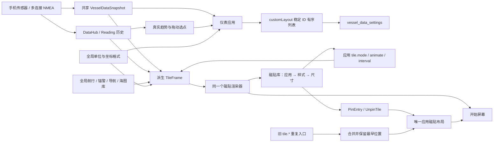

# 仪表与应用磁贴：数据与交互契约

本文件对应 `InstrumentsExperience.kt`、`MarineInstrumentGraphics.kt`、`ReadingTrace.kt`、`TileLibraryExperience.kt`、`TilePresentations.kt` 和 Shell 的布局编辑器。内容描述实际实现，不表示已经完成真机验收。

## 领域边界

- 仪表消费系统选好的观测，不能因为打开页面就切换船位来源或创建航行。
- 我的仪表只拥有显示顺序、增删与查看读数的交互。来源、吃水、船舶资料和航行仍由各自的共享服务拥有。
- 磁贴库以应用为入口。一个应用拥有一块主磁贴，样式与尺寸修改这块现有磁贴；样式不是额外的应用或额外的主屏入口。
- 磁贴和仪表读取同一个 `MainViewModel.ui.vesselData` / `DataHub`，没有独立模拟读数。演示模式必须显示演示标记。

## 数据结构

| 数据类型 / 字段 | 中文含义 | 单位与约束 | 持久化 |
| --- | --- | --- | --- |
| `VesselObservation<T>.value` | 真实观测值 | 缺测为 `null`，不能补成零 | 仪表读取，不拥有 |
| `VesselObservation<T>.freshness` | `FRESH / HELD / STALE / UNAVAILABLE` 新鲜度 | 活指针和当前数字只使用 `FRESH` | 来源服务拥有 |
| `VesselObservation<T>.receivedElapsedRealtime` | 接收的单调时钟时刻 | 毫秒；仅比较时效，不当 UTC | 来源服务拥有 |
| `VesselObservation<T>.sourceIdentity` | 具体设备或连接的身份 | 详情原样显示来源名称 | 来源服务拥有 |
| `VesselObservation<T>.conflict` | 来源之间的不一致 | 详情解释，不擅自切换来源 | 来源服务拥有 |
| `VesselDataSnapshot` | 同一次融合后的船舶数据快照 | 航速用节，方位和姿态用度，深度用米，温度用摄氏度 | 来源服务拥有 |
| `VesselDataSettings.customLayout` | 我的仪表的有序 ID 列表 | `List<InstrumentTileId>`，去重，顺序即显示顺序 | `vessel_data_settings` DataStore |
| `InstrumentTileId` | 仪表稳定身份 | 不用数组索引绑定读数；拖动后 ID 不变 | 枚举名称 |
| `Reading` | 时间轴中的一份观测 | `value / unit / source / elapsed`；过滤非有限数值 | 进程内，最多 15 分钟 |
| `ShellApp.id` | 应用身份 | 磁贴去重按照 `LauncherAppId` | 应用目录 |
| `ShellApp.entry` | 应用唯一主入口 | 旧 `tile.*` 样式入口迁回这里 | 应用目录 |
| `TilePlacement.tileId` | 桌面位置对象的稳定身份 | 换尺寸或样式时保留 | Shell 文档 |
| `TilePlacement.entryId` | 当前磁贴所属入口 | 每个应用最多一块 | Shell 文档 |
| `TilePlacement.size` | 小 / 中 / 宽 | `ICON_1X1 / STANDARD_2X2 / WIDE_4X2`，必须被该入口支持 | Shell 文档 |
| `TilePlacement.rank` / `preferredCell` | 排序 / 用户放置的网格位置 | 配置样式时保留，宽度改变时限制横向越界 | Shell 文档 |
| `<app>.tile.mode` | 动态内容样式 | `AUTO`、应用专用样式或 `STATIC`，保存为编码的 `Choice` | Shell 应用偏好 |
| `<app>.tile.animate` | 是否轮换多页信息 | `Toggle`，独立于读数更新；关闭轮换不冻结读数 | Shell 应用偏好 |
| `<app>.tile.interval` | 轮换间隔 | `6 / 10 / 15` 秒 | Shell 应用偏好 |
| `TileFrame` | 一帧磁贴展示内容 | 标题、说明、实际趋势样本、实际方位、实际距离占警戒半径比例、快照来源 | 只在内存派生 |

## 公开调用与状态流

| 调用 / 流 | 输入 | 结果与业务约束 |
| --- | --- | --- |
| `InstrumentsScreen(os)` | 系统上下文 | 航行 / 帆航 / 姿态 / 趋势 / 我的五个透视页 |
| `MainViewModel.updateVesselDataSettings(settings)` | 更新后的布局偏好 | 通过仓库保存；界面订阅结果，不覆盖数据观测 |
| `MarineCompass(os, snapshot)` | 真船首向、对地航向 | 真北罗盘；船首向和航向分别显示，跨 359° → 1° 走最短动画 |
| `WindRose(os, snapshot)` | 真风和视风角度、速度 | 船艏朝上，两组箭头表示来风方向；缺哪组就不画哪组 |
| `AttitudeHorizon(os, snapshot)` | 已校准的横倾与纵倾 | 2D 地平线；失去观测隐藏动态地平线，明确等待校准观测 |
| `InstrumentGauge(os, snapshot, tile)` | 某个稳定仪表 ID | 方位罗盘、带中线的有符号偏差或标注范围的刻度；读数单位调用全局格式器 |
| `ReadingTrace(os, values, metric, now)` | 最近观测样本 | 点按 / 拖动查看真实样本；断线、来源切换、角度跨周时断开线段 |
| `TileLibraryScreen(os, initialApp?)` | 可选的稳定应用 ID | 应用清单 → 此应用样式预览；硬件和虚拟返回都先回应用清单 |
| `tileModes(app)` | 应用身份 | 此应用支持的样式清单；应用间不混排 |
| `tilePresentation(os, app, animate, modeOverride?)` | 真实应用和可选预览样式 | 复用开始屏幕渲染器，预览与实际磁贴同源 |
| `LauncherAction.PinEntry(entry, size)` | 应用主入口及选定尺寸 | 未固定则创建，已固定则更新同一位置；不会创建同应用副本 |
| `LauncherAction.UnpinTile(tileId)` | 已固定磁贴身份 | 移除主屏入口，保留应用数据和偏好 |
| `StartLayoutEditor.pin(document, entry, catalog, size)` | 当前布局与应用目录 | 保留同应用最早位置、稳定 tileId，替换入口与尺寸；去掉旧重复项 |
| `StartDocumentRepair.repair(...)` | 已保存布局 | 按 rank、tileId 确定性修复，去重依据应用身份 |
| `StartDocumentValidator.isValid(...)` | 布局文档 | 拒绝同一应用多块主磁贴、非法尺寸和身份重复 |

## 用户故事与保存时机

1. 看仪表：打开即可看到船首向 / 航向图形；切到帆航看真风、视风相对船艏方向。缺测是缺测，不显示默认航向或虚构海况。
2. 定制驾驶台：进入“我的” → 添加常用仪表 → 排列 → 长按拖动或点上移 / 下移 → 完成。添加弹窗使用独立草稿，快速连续选中或取消选中只修改草稿，“完成”一次保存，“取消”、返回或点遮罩丢弃草稿；不从异步 DataStore 结果反复读取并覆盖。长按手势结束才提交重排；显式上移、下移和移除立即保存。详情也能添加到我的仪表。
3. 看来源：点读数打开观测详情，看来源、时效与冲突说明；无需被带到系统设置。
4. 选磁贴：磁贴库选择应用 → 左右滑看真实预览 → 选尺寸和样式 → 应用到现有磁贴。静态图标也是样式；轮换开关只控制信息页动画，真实数据仍然刷新。
5. 旧版本升级：Shell 产品迁移把每个应用旧 `tile.*` 入口合并到主入口。保留最早的 rank / tileId / 可支持尺寸；默认样式为 `AUTO`。旧版若在应用偏好中已明确保存模式，仍按该模式展示。

## 拓扑

## 已知边界

- 海图封面仍明确标注“海图快照”和拍摄时间，不冒充后台持续渲染的地图；航行、船位、风、读数和连接计数直接订阅实时状态。
- 趋势属于当前进程的短期观测；长期航行回放属于航行日志，不由仪表伪造或另存一份。
- 自定义仪表目前支持增删和顺序；不把缺少来源的数据类型自动隐藏，用户可以保留待接入的仪表并看到缺测状态。
- 拖动排序支持当前可见列表区域；长列表也提供上移 / 下移的明确操作。
