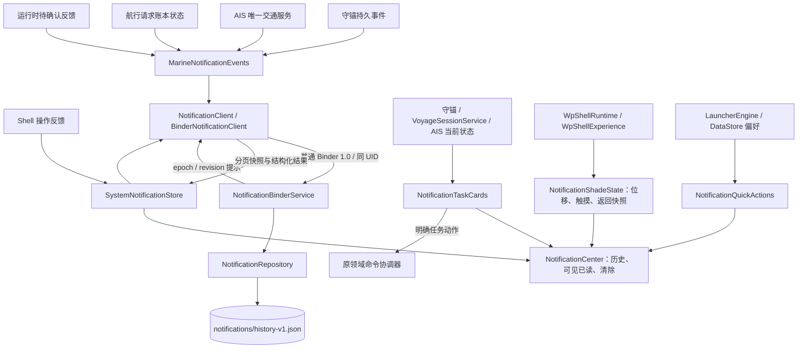

# 通知中心、快捷入口与消息服务契约

更新：2026-09-25。本文维护当前生产规则；主实施约束见 [YOKULI_MASTER_EXECUTION](YOKULI_MASTER_EXECUTION.md)，系统所有者和剩余兼容边界见 [10](../os/10-INPROCESS-SYSTEM-BOUNDARIES.md)。本轮接入消息 Binder 与应用内面板，不表示完整 Android 通知/SystemUI 已被接管。

## 所有者与真实接线

| 对象 | 唯一拥有者 | 不能由它操作的事情 |
| --- | --- | --- |
| 历史、已读、聚合、清除、消息消费游标与回执 | `NotificationRepository`，同包 `:notifications` 进程 | 结束守锚、取消 AIS 风险、启动定位或记录 |
| 当前任务与活动警报 | 原守锚、航行记录、AIS 运行时 | 以消息清除或面板关闭改变业务状态 |
| toast 队列与 Compose 兼容投影 | `SystemNotificationStore` | 写历史文件、维护第二份领域事件游标 |
| 展开、位移、触摸、焦点屏蔽、列表/详情返回快照 | Shell 的 `NotificationShadeState` | 变成消息数据库字段或业务会话开关 |
| 夜间/常亮持久偏好 | 原 Launcher 偏好存储与 Shell 偏好命令 | 修改 Android 亮度、勿扰、报警声音或后台执行授权 |
| 来源/连接摘要 | 原数据中心与连接读模型的投影 | 重选来源、打开 socket、建立副本配置 |

真实文件：`app-shell/src/rebuild/.../{SystemNotifications,NotificationShadeState,WpShellRuntime,WpShellExperience}.kt`、`ui/{NotificationCenter,NotificationShadeGestures,NotificationQuickActions,NotificationTasks,SystemAlerts}.kt`；消息服务为 `runtime/marine-local/src/main/java/com/yokuli/runtime/marine/notification/`。公开类型在 `core/runtime-contract/src/main/kotlin/com/yokuli/runtime/contract/notification/NotificationContract.kt`。签名索引见 [API_INDEX](API_INDEX.md)。

## 结构和快捷项

固定标题/设置/关闭 → 当前真实风险摘要 → 一个纵向 `LazyColumn`（四格快捷项、当前任务、存储状态、历史）→ 底部把手。中心不是第二个设置 App，也不是最近任务中的新应用。历史为空写“暂无通知记录”；服务尚未读入写“通知记录尚未载入”，均不表示安全。

- 当前采用 [Windows 10 Mobile / MDL2](WINDOWS_10_MOBILE_DESIGN.md) 的平面层级、共享字阶与无圆圈动作图标；标题使用共同页标题，通知正文 15sp、辅助信息使用 Caption，正文默认最多三行，明确展开可读全文。来源和时间在上方，首次/最近时间与次数独立保存，屏幕阅读器可读完整内容。视觉升级不改变已读、清除、警报或请求回执语义。
- 消息历史按发布应用分组，组头显示应用图标、名称及条目数；每条保留自己的标题、正文、时间、目标与清除动作，不重复放一枚应用图标。分组不合并领域事件、不改变持久消息身份，也不影响横滑和已读判断。
- 使用现有安全区，标题横向避让圆角和挖孔；不把系统 inset 重复加进动画高度。设置、关闭、把手和展开文字有至少 48dp 点击区域。
- 快捷区按可用内容宽度分列：常规两列，至少 600dp 且文字比例适合时四列，低于 260dp 或大字体时降一列。整组统一图标、标题、状态槽位与高度；不逐卡以最低高度各自撑开。快捷有限行不嵌套无约束 LazyGrid。

| 入口 | 控件及状态 | 操作 |
| --- | --- | --- |
| 夜间显示 | Switch 语义；开启/关闭、保存中、保存失败 | `requestSystemPreferences("notification.night", transform)` 修改原主题偏好，持久化成功才呈现保存结果；不改系统亮度/声音 |
| 屏幕常亮 | Switch 语义；开启/关闭、保存中、保存失败 | 相同 Shell 命令链修改 `preferences.display.keep_awake`；只控制 Yokuli 前台显示，不承诺后台运行 |
| 船位来源 | 导航按钮与箭头；手机/船载/未选用 + 数据质量/时效 | 中心 `position` 子详情查看采用来源、更新时间、限制，再明确进入数据中心 |
| 船舶连接 | 导航按钮与箭头；真实配置、在线与异常数量 | 中心 `connections` 子详情，再进入实际连接 ID；在线不等于船位有效 |

开关真值来自持久偏好，处理状态来自 `SystemPreferenceCommand`；卡片不另存本地 checked。原主题系统当前为明/暗模式，不新增“跟随系统”占位能力。导航格不以整块选中颜色暗示开关。更多/收起在网格下方独立文字入口；扩展只有实际手机安装、数据共享、声音与警报页面，不在中心临时校准，也没有“静音全部”。

## 任务与警报

`NotificationTaskCards` 仅显示实际存在的任务，不铺一排未启用灰格。主体查看任务，动作与主体是不同命中区域。状态写监控中/已暂停/数据受限/记录中/正在保存/结果未确认，按钮写暂停监控/继续记录等下一步动作。

- 守锚暂停先显示保护停止的影响确认，再调用 `AnchorService.requestPauseWatch(sessionId)`；继续调用 `requestResumeWatch`。结果读取 `MarineSystem.anchorCommands`；UNKNOWN 只 `recheck` 同一个 commandId。进入来源详情不自动暂停。任务卡不确认安全警报。
- 记录操作通过 `VoyageSessionService.request(VoyageRequest)`，带 expectedSessionId 与 requestId；所有入口复用同一协调器。实际执行由原 trip actor 与 TripDao 落盘结果写 `VoyageCommandRegistry`，不以页面状态变化猜成功。18 秒未确认保留 UNKNOWN 和命令锁；`recheck(requestId)` 经 `RuntimeCommand.QueryVoyage` 在原 actor 内只读持久事实，绝不重发原动作。Start 尚未关联实际会话 ID 时不猜已有会话属于本请求。用户明确结束当前会话可在旧 UNKNOWN 后排队，真正落盘完成后替代旧未确认请求。结束归档仍进入完整日志流程。
- AIS 任务只在用户已启用 monitoring 时出现；状态来自服务、输入和活动事件，不因图层隐藏或消息清除而停止。没有来源/权限/前台执行时说明受限，不伪装监控正常。
- 固定风险摘要分别读取当前守锚/条件警戒和最严重的活动 AIS 风险；AIS 行指向实际 `ais:target:<mmsi>`。不能仅按历史 `ALARM` 置顶，也不能清掉历史后显示“一切正常”。
- `SystemAlerts` 的独立 Android Dialog 保持原领域警报层级，关闭/已读/清除通知不调用 ack、snooze、pause 或 lift。明确警报动作仍由原领域处理；暂停后去修复来源须等待同一请求确认。Compose zIndex 不是覆盖该窗口的依据。

## 跟手面板与手势协调

`NotificationShadeState` 阶段为 CLOSED / OPENING / OPEN / DRAGGING / SETTLING。稳定锚点只有 0 与 `-heightPx`；高度来自实际测量，进度为 `1 + offset / height`。不保存半开位置到磁盘。

位移动画通过 `attachHost(rememberCoroutineScope())` 使用当前 Compose 宿主的帧时钟；宿主销毁时取消动画并按当前打开意图收敛。Application scope 只保留已提交业务与存储操作，不能用于需要 `MonotonicFrameClock` 的 Compose 动画。

- 拖动直接 `dragBy(delta)` 更新位移，不对每帧套动画；释放才按距离/速度 spring 收敛。新手势取消旧 settle，从当前偏移接管。集中阈值：向上 22% 高度，或已移动 32dp 且上甩超过 900dp/s；明显反向释放优先展开。
- 标题非按钮区和底部把手始终可向上收起，与列表滚动位置无关。快捷区域普通操作先处理点击/滚动，不给每个按钮再套关闭识别。
- 主列表优先消费自身滚动。仅在列表末端且未惯性滚动时**新开始**的向上拖动可由 `shadeListScroll` 交给面板；同场滚动撞底余量及惯性不会关闭。无可滚动内容时该策略也允许关闭。若面板已经在展开/收敛动画中，列表区域的新按下也能接管当前位移；整场纵向手势归面板且不再补发子按钮点击。
- 单条可清除消息横向 draggable，整页父层只分配 Y，不消费其 X。短拖回弹，约 35% 行宽或至少 28dp 且同向 850dp/s 快甩才请求清除；强反向释放回弹。超过 touch slop 的拖动不补触发卡片点击。
- 清除等待持久结果：COMPLETED 后历史移除，失败回弹；暂不提供自动消失式撤销条。协议 RESTORE 能恢复历史原记录，但不会重新发布事件、提示或执行业务动作。
- `blocksInput = visible || active touch`。动画中露出的底层地图仍不能接到同一手指；真正 CLOSED 且触摸结束才释放输入/焦点与截图资格，不再使用提前 expanded=false 加固定 260ms。
- 打开、关闭、再次通知键、Back、Home 都使用同一 state；Home 立即把底层切到桌面，但面板实际关闭和手指抬起前继续保留输入屏障。配置/高度改变保留合理进度并向稳定锚点收敛。保留可见关闭、通知键、系统 Back、Escape 与无障碍 dismiss，手势不是唯一入口。

普通 APK 的 Android 顶边下拉和底部系统导航仍归平台。只有已打开的 Yokuli 面板接收本轮关闭手势，不新增通知监听/Accessibility 来模拟 SystemUI。

系统栏轻提示采用 W10M 主题面板、强调色发布者图标与共享字阶，只占用既有 30dp 栏位，并用 polite live region 通知辅助技术，不覆盖应用底部命令。这里是 Android 内嵌 Shell 的空间适配；完整历史仍在通知中心。

## 阅读、清除和导航

打开中心不全量已读；新消息不因面板存在而已读。只有连接已 READY、面板稳定展开、无子详情且列表停止滚动时，约一半消息行进入可视区域持续约 400ms 才标记已读。显式打开详情也标记已读。滚动中新增记录不强制滚顶，提供“有新消息”入口。

历史清除遵循 `dismissible`，已读、删除和业务确认是三种状态。`CLEAR_ALL` 只移除可清除历史，任务、活动风险、未完成命令不在此列表被删除。旧消息不按“·”或标点拆标题，历史原文保留为正文；新发布者使用 `NoticeText` 的标题、正文、稳定 code 和受限 arguments。

消息点击先按阅读政策处理，不自动删除。目标已经是底层当前具体对象时只关闭中心并聚焦；新目标由 `WpShellRuntime.openFromNotification` 保存原页面实例及中心列表/详情/展开状态。目标内部页先退内部，到访问边界再恢复中心；继续关闭回原页面。Home 或显式离开调用链后不复活中心。对象缺失由真实目的地页面说明并提供相关列表，不能悄悄跳首页；外部 Android 权限 Activity 使用真实平台返回。

中心子详情、正文展开、更多展开是不同状态；更多/正文只是内容展开，不制造虚假 Back 层级。打开时焦点进入 pane，关闭恢复安全的原焦点；可见期间底层无障碍树与输入失活。具体访问约束见 [APP_NAVIGATION_CONTRACT](APP_NAVIGATION_CONTRACT.md)。

## 消息契约、传输与持久化

| 类型/接口 | 关键字段与语义 |
| --- | --- |
| `NoticeRecord` | id、publisher、NoticeText、occurredAtUtcMillis/updatedAtUtcMillis、level、target、domainEventId、aggregationKey、category、dismissible、read、occurrences |
| `NoticeTarget` | domain + objectType/objectId 或 section；不携带 Compose、OsStore、闭包或任意 Intent |
| `NotificationSnapshot` | epoch 为服务代次、revision 为文件内递增版本、有限 records、persistenceFailure；连接成功不保证已读到历史 |
| `NoticeCommand` | requestId、operation、record/noticeId、可选 expectedRevision/expectedEpoch、领域事件流/序号、publishMode（事件发生或原卡状态更新） |
| `NotificationClient` | snapshot/connection/results 只读 StateFlow；`execute(command)`、`result(requestId)`、`close()`；results 有界保留迟到完成结果 |
| `NoticeServiceInfo` | protocolMajor/minor、epoch、READ_HISTORY/UPDATE_HISTORY/PUBLISH_EVENTS/READ_RECEIPTS 能力；仅授权本应用 UID |
| `NoticeAction` | 当前只支持 OPEN_TARGET，由记录 target 派生 primaryAction；警报确认/暂停不能藏在消息点击里 |
| 结果 | COMPLETED=持久完成；REJECTED=拒绝；PERSISTENCE_FAILED=保留待恢复；NOT_SENT=未发送；UNKNOWN=通信中断可能已执行 |

协议是普通 Binder descriptor/版本 1.0，非 Stable AIDL。服务在 runtime Manifest 中 `exported=false`，每笔事务/回调检查真实同 UID，不相信 publisher 自报身份。页面、事件桥共享主进程客户端；服务进程只有一个仓储。

每页最多 20 条并按 96k 字符传输上限动态缩小，历史最多 200 条、订阅最多 8，callback 只提示 epoch/revision。消息文件读取硬上限 32MB，结构化 arguments 最多 16 项且每值最多 256 字符。客户端初次/断连后重新握手、注册回调、按同 revision 分页；分页中有变化重取，不拼混不同版本。服务死亡公布 DISCONNECTED、保留历史，Client death 清订阅，重连不自动执行未知 UI 命令。协议不兼容或权限拒绝明确受限；这些不是有效船位、可用声音或系统安全状态。

`NotificationRepository` 以 AtomicFile 保存 schema/revision、记录、领域去重窗口 512、守锚事件游标和最近 128 请求回执及参数摘要。同 requestId 相同命令返回原结果，不同内容拒绝。写入成功检查比较完整文件与待提交 UTF-8 字节，按缓冲区读取，不再假设 JSON 的 revision 位于前 256 字节；ART 的字段排序差异和较长历史不能被误判为保存失败。去重及回执有界，不能描述成无限期恰好一次保证；领域原始事件仍由原存储保留。

先提交文件再发布新 revision/成功结果。写失败保留旧快照与一份 pending 完整事务，独立 persistenceFailure + 显式 retry；读取失败保护原历史并提供重新读取，不能用空投影覆盖。两种故障在中心分别说明。不在同一失败仓储递归发布失败消息。客户端最多 32 个在途请求，等待 12 秒仍未回则 UNKNOWN，但客户端 scope 中的真实调用继续，最近 64 条 results 回执允许晚到结果回流；页面关闭不会取消已提交事务。Shell 的 `hasUnknownCommands` 保留未知操作锁，`recheckPending()` 查询同一 requestId，只有原请求晚到/查询确认才解除，不自动换 ID 重发。只有运行时领域发布桥可对有稳定事件 ID/游标的 PUBLISH 幂等重送。

`MarineNotificationEvents` 直接订阅运行时 `pendingUserFeedback`，持久发布完成后才消费，避免 UI 异步提示发出就丢掉原反馈。船位时效继续由数据读模型表达，不把更新间隔转换成通知风暴。航行通知直接订阅 `voyage.commands`，使用稳定 `voyage-command:<requestId>` 与 `STATE_UPDATE`，UNKNOWN → CONFIRMED 更新同一消息而不增加发生次数。旧反馈的发布者归属推断仍集中在运行时兼容转换；新 AIS、守锚、航行发布者提供明确身份、目标与语义参数。

迁移从旧 `system-notifications.json` 的数组或含 items/anchorEventId/aisNoticeIds 格式读取，保留双语正文和游标；新文件成功前原文件不删除。未知/损坏 schema 不写空文件覆盖；只允许消息服务写新文件，旧 Shell 保存、面板 expanded 与 `MarineNoticeBridge` 事件订阅路径退出。

收藏/航线的资料文件是独立存储。`ContentRecoveryStatus` 区分原资料读失败与新改动写失败：`experience-v1.json` 读取或版本失败后 `DurableSnapshotStore` 拒绝写入，用户从中心真实重新读取；成功后先保留完整恢复副本，再合并当前收藏/航线，保留当前非空草稿，不移动地图或重启导航。原草稿/导航快照可通过系统文件选择器导出恢复副本；后台读写/导出使用进程 scope，关闭面板不取消提交。损坏文件尚不能解析时不会宣称已恢复，也没有自动修复不认识的格式。

## 真实边界

本轮完成消息领域的所有者、纯契约、真实客户端、服务、版本/同 UID 授权/分页/订阅/断连和持久化接线。内部通知服务不是安全警报唯一存储，不拥有导航/记录/守锚/AIS 生命周期。普通反馈消息在不可恢复的进程中断时不具有领域日志级别的可靠投递保证；关键业务事件保留在原领域并经稳定身份重播。

完整 MarineSystem IPC、独立服务 APK/UID、第三方授权 SDK、Android 通知监听/SystemUI/锁屏/Recents 接管、完整 ROM 镜像及设备运行仍未完成。编译只能说明构建结果，不证明跟手体验、硬件、警报声音或后台存活。后续功能继续沿 [领域接入路径](../os/02-DOMAIN-AND-CONTRACTS.md#新功能接入路径) 与本契约扩展，不另开第二套消息/快捷/业务状态。
