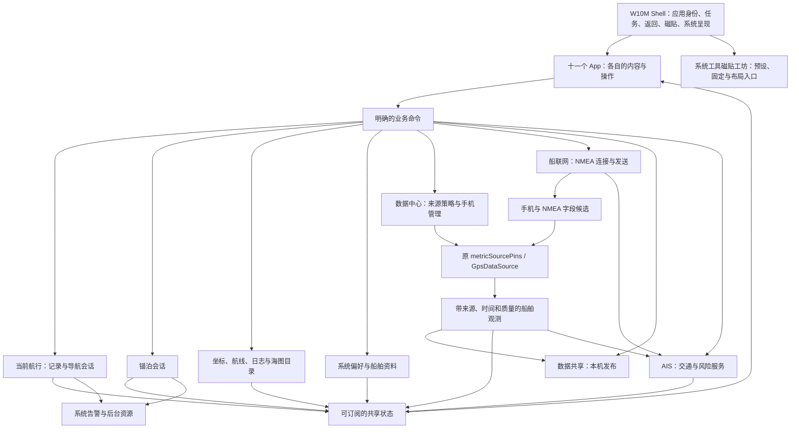

# Yokuli OS：应用领域与系统模型

> 本文沿用 0.4 建立的领域模型，当前补齐 Windows 10 Mobile 基线、AIS 交通工作区与导航业务所有权的实际边界。数据来源统一归独立数据中心，船联网负责连接/发送，数据共享负责本机发布。具体接口见 [完整接口与拓扑](OS_INTERFACE_TOPOLOGY.md)、[数据中心契约](DATA_CENTER_CONTRACT.md) 与 [应用导航契约](APP_NAVIGATION_CONTRACT.md)。

更新：2026-09-25。本文区分领域约定与实际接入，**不把模型描述当作设备运行结果**。文中明确注明 0.4、experience.5 的记录只属于历史版本，[experience.5 交付记录](../experience/EXPERIENCE_5_DELIVERY.md)不代表当前代码或本轮运行结果。

本文取代此前按旧 Anchor App 页面组织产品的做法。用户分多条提出的反馈全部有效；[整改清单](OS_REWORK_BACKLOG.md)逐条跟踪。保留已经改善的海图体验、真实数据引擎和原 Shell，重新组织应用职责和控制权。

## 1. 产品基线

Yokuli OS 是一套共享船舶状态、用户作品和交互语言的航海应用系统。当前以默认全屏 Android App 交付，构建、应用身份和 API_KEY 管理沿用 `yokuli_marine_shell`。固件不是本轮范围。

Shell 沿用用户确认的 `codex/shell-map-contract` 的应用身份和任务边界，当前视觉升级为 [Windows 10 Mobile / MDL2](WINDOWS_10_MOBILE_DESIGN.md)：Start、磁贴、应用列表、横滑、转场、最近任务、虚拟键及方角控件使用共享系统。普通页面和持续观察场景分别采用适合其任务的紧凑头部，不再要求每页堆叠 WP8 大标题。底部 Home 保持回桌面，右侧原搜索键打开内部通知。

当前目录包括十一个业务 App，另有属于 Shell 的系统工具「磁贴工坊」。数据中心承接全局逐项选源与手机传感器管理；AIS 消费独立交通服务而不拥有连接。两者复用系统仓库，不增加另一套业务配置。功能扩展先归入明确的用户任务，不能因为存在一组旧代码就新增航海 App。每个业务 App 的首页呈现正在操作的对象：地图、记录、船体、仪表或连接，而不是设置列表。技术详情放在对象详情或诊断中。

## 2. Raymarine 的参考与 Yokuli 的取舍

本次核对的是 Raymarine 官方 LightHouse 4 操作手册 81406 Rev 29，不把它的菜单或硬件产品全部复制进来。

| 官方参考事实 | 在 Yokuli 的具体采用方式 |
| --- | --- |
| Home 提供应用入口，同时提供 My data、告警和设置等共享入口。[Home](https://docs.raymarine.com/81406/en-US/latest/HomescreenOverview-56D9967C.html) | Shell 管应用身份、任务和系统能力；保留当前 W10M Start，不另造 Raymarine 风格首页。 |
| My data 集中管理航点、航线、航迹和导入导出。[My data](https://docs.raymarine.com/81406/en-US/latest/MyData-5879EABF.html) | 我的航行拥有坐标与航线，日志拥有已经发生的航程；共享实体可以被地图引用，无需复制。 |
| 系统按数据类型选择来源，显示正在使用的来源和值，手动选择可明确指定来源。[Data sources](https://docs.raymarine.com/81406/en-US/latest/DataSourcesMenu-56D2C7E7.html) | 系统统一仲裁船位、风、深度等字段；NMEA 连接是否打开与该字段是否采用它，是不同状态。 |
| Dashboard 使用设备和传感器提供的系统数据，并允许选择、自定义显示页。[Dashboard](https://docs.raymarine.com/81406/en-US/latest/DashboardAppOverview-C3060522.html) | 仪表专注真实读数、趋势和空间姿态；可用能力取决于真实数据，不嵌入旧 Sail 产品。 |
| 告警管理汇总活动告警与历史。[Alarms](https://docs.raymarine.com/81406/en-US/latest/AlarmsManager-86A857A6.html) | 锚警负责判断锚泊风险，系统统一呈现、发声、确认和记录告警。 |
| 原生应用可组合显示，部分应用依赖特定硬件。[MFD apps](https://docs.raymarine.com/81406/en-US/latest/MFDApps-57F51FDE.html) | 先把手机上的全屏操作做好；共享组件为未来组合提供基础。本轮不靠分屏、雷达或无设备的页面扩充目录。 |

右栏是针对 Yokuli 的设计决策，不是声称 Raymarine 已采用这些内部模型。

## 3. 十一个 App 的边界

| App | 用户打开它要完成的事 | 拥有的对象与内容 | 与系统及其他 App 的关系 |
| --- | --- | --- | --- |
| 海图 / Chart | 看船位、选点、测距、规划与使用航线 | 当前地图视野、准星、双图钉、选中对象、路线编辑交互 | 读取共享船位、坐标、航线与当前记录；写入我的航行；调用系统导航和记录命令；不管理文件夹或网络连接。 |
| 图册 / Chart Library | 让自己的海图文件可靠地成为可用图层 | 用户授权的文件夹、命名图层、文件索引、覆盖范围、文件优先级和异常 | 提供图层目录及瓦片；“在地图查看”选择该图层并正式打开海图；不再用多个显示开关控制各地图。 |
| 航海日志 / Logbook | 记录这次航行、回顾发生过的事 | 当前航程视图、历史航程、航迹、事件、备注、回放、报告和导出 | 系统拥有运行中的记录会话；日志是其完整操作与阅读界面。合并原“航行记录”和“航行日志”。 |
| 守锚 / Anchor Watch | 下锚、确认守望范围、观察走锚、处理警戒、起锚 | 锚泊会话、锚点估计、警戒几何、摆动轨迹、风深度条件、锚泊历史 | 读取同一船位和共享地图；向系统发布告警；收藏锚地时创建/关联我的航行中的一个坐标。 |
| 我的航行 / My Sailing | 管理以后要去、值得记住和已经收藏的地方与线路 | 坐标、航点用途、锚地资料、集合、标签、航线、导入导出 | 是坐标与航线的唯一数据所有者；海图、锚警、日志引用同一 ID。锚地不另建一套地点库。 |
| 驾驶台 / Helm | 读懂现在的船况，以及正在怎样变化 | 可配置的航行/帆船/船体/环境仪表页、曲线、罗盘、3D 姿态和读数详情 | 订阅系统数据和当前导航；来源选择、安装校准由明确请求进入数据中心后返回；不私有启动航程、定位或连接。 |
| AIS | 看懂周围交通、关注目标、理解会遇并按需在海图查看 | 雷达、三维与船舶列表；目标摘要/详情、相机和观察范围；交通提醒的配置入口 | 订阅唯一 `AisTrafficService`；连接来自船联网，本船数据来自系统采纳结果；不另收 NMEA 或重算警报；目标海图使用关联访问。 |
| 数据中心 / Data Center | 看懂每个读数从哪里来，选择可信来源，管理手机定位与安装 | 全候选、采纳结果、更新时间、逐指标来源固定、手机 GPS、船艏与姿态校准 | 复用原 `VesselSettingsRepository.metricSourcePins`、`GpsDataSource / POSITION_CONNECTION`；手机和 NMEA 同一选源入口；不拥有网络连接或发布服务。 |
| 船联网 / Boat Network | 同时连接多台设备，看清每条连接的接收与发送 | 命名连接、传输配置、重连、输入/输出路由、每连接流量与原始语句 | 提供带身份的数据候选；发送系统已采用的观测或转发指定输入；字段采纳由数据中心统一管理。 |
| 数据共享 / Data Sharing | 把系统读数供其他设备连接使用，查看谁接收了什么 | 本机监听地址/端口、客户端、发布能力、转发输入和实际写出 | 与船联网共用发布规则；手机和船载数据均来自原系统选源，不再有独立手机来源页。 |
| 设置 / Settings | 配置整个 OS、自己的船以及跨应用偏好 | 船舶资料、单位、坐标格式、语言、显示、声音、磁贴与应用偏好、权限、备份与系统信息 | 各设置有明确拥有者；通用设置一次修改全局生效，业务操作仍留在对应 App。 |

**系统工具：磁贴工坊 / Tile Studio。** 拥有磁贴预设的预览、固定与移除入口，读取各 App 的真实内容和 Shell 布局；不拥有航程、导航、锚警或连接。它在应用列表有独立入口，属于系统组织能力，不改变十一个业务 App 的职责。同一应用只固定一块磁贴，样式和尺寸在该应用预览页修改。

**本机节点与连接客户端分工明确。** 数据共享运行本机监听服务并向已连接客户端发布内容；连接其他端点由船联网管理。两个入口使用相同的发布能力和防回送规则，均不能另选一套系统读数或绕过数据中心启用手机定位。

原“船舶数据”拆回明确职责：日常可视化与曲线归驾驶台，全候选、全局选源与手机管理归数据中心；各应用的读数可请求同一个来源详情。声纳测深调查的界面、采样和自动恢复已移除，历史数据库保留；真实 NMEA 水深仍供驾驶台和守锚条件警戒使用。

## 4. 系统究竟统一什么



这表示逻辑所有权，不是部署进程图。当前海事领域仍在主进程；内部消息已有同 UID 的 `:notifications` Binder 服务与唯一持久写入者，不能称作安全沙箱。真实进程及兼容桥边界见 [系统接入现状](../os/10-INPROCESS-SYSTEM-BOUNDARIES.md)。

### 4.1 本次航行、记录、导航、锚泊

用户面对的是一次真实航行；系统只维护一份当前航程。**“开始记录”就是创建并开始记录这次航行，不再增加一个功能重复的“开启航行”总开关。** 海图上的记录按钮、日志的当前航程和磁贴打开同一套控制界面。

| 状态 | 含义 | 谁能改变 |
| --- | --- | --- |
| VoyageSession：无 / 记录中 / 暂停 / 保存中 / 已完成 | 这次航行的时间、轨迹和事件；暂停只是暂停采样，形成明确断段 | 唯一记录控制器；各入口发同一种命令 |
| NavigationSession：无 / 前往坐标 / 跟随航线 / 到达 | 当前引导目标和进度，可在不记录时使用 | 目标为唯一导航运行时；当前由 `OsStore` 与 `Navigation.kt` 管理，见下文现状 |
| AnchorSession：无 / 准备 / 值守 / 暂停 / 结束 | 对一个锚泊位置的持续守望 | 锚警业务控制器 |
| 观测质量：可用 / 过期 / 无来源 / 权限阻止等 | 当前会话能否获得可信数据；不是另一套航行开关 | 数据来源系统和运行时 |

表中的“唯一导航控制器”是领域目标，当前尚未成为独立系统运行时端口：`Navigation.kt` 仍通过 `OsStore.navigationRoute`、`activeRouteId`、`routeLeg` 管理引导及冻结路线。返回与页面状态隔离已经在 Shell 落地，但不代表导航业务所有权已迁移。下一项独立迁移应收拢导航状态、路线版本、命令结果和恢复，再让所有页面消费同一运行时；本轮 AIS 改造不虚报这项工作已完成。

关键规则：

- 记录可以覆盖途中锚泊。下锚不结束整次航行；锚泊开始/结束可作为日志事件。
- 开始导航不自动开始记录；保存路线不开始导航，也不自动把所有路线画在海图上。
- 结束记录不结束导航或锚警。起锚不删除收藏，也不结束航程。
- 关闭一个 App、按 Home 或切到仪表不停止后台会话。
- 失去位置时保留会话，显示数据中断与告警，轨迹断段；不把旧船位继续标为实时，不悄悄启用手机 GPS。
- 记录暂停与锚警暂停是不同命令，标题明确包含对象；通用“暂停航行”不作为含混入口。
- 运行时重启恢复已持久化会话，但仅在原权限和来源策略允许时恢复资源；状态必须说明恢复中或缺失条件。
- 每条连接和输出的用户运行意图分别处理。恢复航程不能重开用户主动断开的连接或已停止的输出；保存地址和路由不代表开始运行。`NmeaConnectionLeasePolicy` 仅恢复同次开机中明确开启且未停止的连接；主动停止会撤销运行意图，保存配置不代表自动连接。

### 4.2 一份船位，多种连接

传输连接、可用观测、实际采用的来源分别建模：连接成功可以还没收到船位；选择手机船位也不妨碍 NMEA 提供风和深度。

数据中心是船位与逐指标选源的唯一应用入口。它读取 `VesselDataSnapshot.candidates` 的全部候选与采纳结果，使用 `MarineServices.sources.setVesselMetricSource` 更新原 `VesselSettingsRepository.metricSourcePins`。船位沿用现有 `GpsDataSource`、`POSITION_CONNECTION` 与定位服务流程；数据中心没有自己的源设置表或第二套偏好副本。

船位策略的用户入口统一为：**关闭 / 手机 / NMEA**。它们映射到同一个枚举状态；用户可以直接明确替换，不必先关闭旧来源。替代来源准备合格后由运行时采用，活动守锚会拒绝替换。

- 选择手机：自动请求所需 Android 权限与定位服务启用；只有实际取得位置后才显示可用。系统定位未开启时给出系统启用流程，不能伪造成功。
- 关闭手机：停止 Yokuli 对手机位置的订阅；记录、锚警和本机 NMEA 不能绕过这项选择继续请求位置。其他 App 或 Android 的全局定位开关不由 Yokuli 伪称已关闭。
- 选择 NMEA：至少有连接已建立；有效船位尚未来时显示“等待船位”。指定连接与实际来源可见，手机船位禁用。
- 关闭 NMEA 船位不等于断开 NMEA；仍可接收风、深度、AIS 等支持的数据。
- 断线后选中的来源保留，显示原因；不默默换到手机。恢复入口修改同一个系统来源策略。
- 多条 NMEA 输入可同时存在。首轮船位使用明确指定的 NMEA 来源，只有一个可用来源时可直接选它，多个时显示来源列表；深度、风、航向等按字段分别选择，不能“最后一条报文覆盖全部船况”。船位按优先列表自动换源是后续显式选项，不默认开启。
- 手机 GNSS 的暂时旧值、从未得到定位、权限不足、系统定位关闭和接收器错误分别呈现。上次更新时间属于来源详情，短暂未更新不改写成连接断开，不触发定位重启或连续全局通知。底层保留真实采样时间并拒绝倒退样本；不能为减少提示而延长所有业务的安全阈值。

每个值携带 `sourceId`、连接代次、采样/接收时间、单位、质量及失效原因。派生值还保留其输入来源。位置、SOG/COG 等耦合观测避免拼接成来自不同时刻不同船位源的假快照。演示数据单独标记，不能不经说明混入真实输出或日志。

来源类别过滤先于固定来源和优先级，固定 NMEA 来源不能绕过“手机”或“关闭”策略。海图、记录、守锚、驾驶台和系统编码输出都消费同一个选中观测，仍保留各自更严格的质量门槛。来源变化产生新的证据代次与记录，锚警不能把换源跳点误作连续摆动证据。

锚警值守期间运行时拒绝船位替换，不会为了切源自动暂停。用户先明确暂停，再通过同一系统策略选择替代来源；新来源资格通过后采用，重新建立合格定位证据并说明天线参考差异，保持已确认锚点。首轮不引入藏在锚警里的第二套来源覆盖逻辑。

### 4.3 告警与权限

锚警、位置丢失和可用的其他业务规则产生告警；Shell 共用一套呈现、声音、确认和历史。确认声音不等于消除触发条件，也不自动停止业务会话。

一般定位质量变化只在来源与使用它的内容处显示，不能用常驻弹层挡住地图按钮。普通操作反馈使用 Shell 已有状态栏位置，不抢焦点、不改变 App 视口；真正的锚警和长期合格船位丢失仍按原业务规则告警。0.4.0-domains.2 已接入这条呈现分流，GNSS 与后台硬件行为仍需真机验证。

后台资源由会话需求与系统来源策略共同决定。页面组合与销毁没有开关 GPS、重建 socket 或停止记录的副作用。权限不足时显示真实受阻状态；不能以“开关已开”冒充服务已运行。

长时间等待定位、写轨迹或生成报告不能堵塞系统控制命令。记录与锚警各自保持状态变更有序，耗时工作可取消并反馈准备/保存状态；告警确认和锚警暂停不排在一次记录启动的定位等待之后。

### 4.4 AIS：看懂周围交通，再决定是否查看海图

2026-09-25 的生产界面按消费用户的任务重新组织：打开 AIS 看周围 → 左右滑动雷达、三维和目标列表 → 点一个目标查看距离、航速、最近接收和风险 → 关注或明确进入海图查看位置/航迹 → 返回同一个 AIS 页面。AIS 不再嵌入第二套海图。雷达和三维的距离档位只是观察范围，不更改警戒阈值；目标列表的筛选也不能减少运行时监控的目标。

AIS 应用是 `AisTrafficService` 的客户端。连接继续由船联网拥有，AIS 只消费其已接收且带来源身份的报告；本船位置和运动来自系统采纳结果。页面只保留访问路径、选中目标、范围、相机和展开状态，不新增位置采集、预测真值或警报仓库。

首页的 48dp 应用栏加 44dp 页签栏把空间留给观察场景；输入统计进入接收详情。雷达与三维共用相机式量程尺，跟手预览并在操作结束后保存同一个范围偏好。多连接汇总先表达仍在接收的事实，再补充异常连接数；一条连接正在重连不能盖掉另一条正在接收的整体状态。

点选后的摘要覆盖在场景底部，回答目标是谁、距离/方位、正在接近还是远离、风险与资料年龄；拖开后复用完整详情，面板移动只改变偏移，不改三维画布尺寸或重建 Surface。把手跟手移动，松手结合位移与速度归位；内容区优先滚动，返回先收起再取消选中。完整船舶列表仍是可横滑到的独立观察页，不与场景机械地平分高度。

目标详情的船名由应用页头或面板摘要呈现，内容首屏保留关键相对关系与明确操作。活动警报、遇险设备状态、位置来源冲突不能藏入技术详情；确认与五分钟后提醒继续分别发出原 `Acknowledge`、`Snooze` 命令，确认阅读不能宣称风险解除。关注和本机备注名继续持久化到 AIS 服务。

位置与航向、船舶广播资料、数据来源、原始报文按需展开；未收到的静态字段省略，不能补成零，也不排成一整屏“未提供”。接收时间和位置报告时间分别展示，新的静态报告不能把旧船位变成实时；历史缓存、来源冲突、无船首向及不能计算会遇的原因仍明确保留。已经删除的输入只显示历史身份，不再导航到不存在的连接详情。

“在海图查看”使用 `chart:ais:<MMSI>` 关联访问并恢复原 AIS 调用者；在本应用切换到三维观察只恢复原工作区，不重复向内部路径压入首页。原生海图先按当前视口及缓冲范围筛选普通目标，再施加 512 个显示预算；风险、选中、关注及遇险目标单独保留，显示预算不删减交通服务参与判断的事实。

三维船艏前视是依赖有效位置与 Heading 的透视视角，相机、标签与拾取共享投影；暂缺数据时保留偏好并降级北向，用户在数据恢复后明确恢复前视。概览的最小显示尺寸只提高可辨识性，报告点保持真实，放大模型不参与风险计算。示意桥高为 4–18m、未知时默认 6m，不能作为真实测量。模型池从船形/中性各 4 个开始，按需每帧各补至多 4 个，避免空画面也预建满额实例。

通知中心已沿 [通知契约](NOTIFICATION_CENTER_CONTRACT.md) 接入整页跟手关闭和真实消息 Binder 客户端；本轮不将旧审阅文档对旧版 `AnimatedVisibility` 的描述当作当前缺陷重复重写。通知读取/清除仍不能确认 AIS 风险或停止业务。

生产入口为 `ui/AisScreen.kt`、`ui/AisTargetDetail.kt`、`ui/AisVesselSheet.kt`，可视化仍消费同一份 `TrafficSnapshot`；图表中的会遇与风险结果由系统领域运行时提供，UI 不重算一套。

## 5. 共享对象，消除数据复制

| 对象 | 核心含义与边界 |
| --- | --- |
| GeoCoordinate | WGS84 经纬度值；格式化使用系统坐标偏好，不承载收藏身份。 |
| SavedPlace | 唯一稳定 PlaceId、名称、类型、标签、集合、备注、媒体及坐标资料；类型可为普通标记、锚地、码头等。普通标记可仅有一个坐标；较大的地点可有范围中心和多个具体 Spot。航点是坐标在导航中的用途，不需要重复保存另一实体。 |
| SavedSpot / AnchorageDetails | 具体坐标具有稳定 SpotId；锚位可附底质、避风方向、深度参考和参数。路线、锚警可以明确引用 SpotId，不能拿 Place 中心替代实际锚位。既有 Place / Spot / Visit 关系、媒体与原会话关联保留。 |
| Route / RouteLeg | 有序路线及点的引用/坐标快照；允许临时路线点，不强迫每个折点成为收藏。导航启动时冻结使用版本，随后编辑不暗改正在执行的路线。 |
| VoyageRecord | 已发生航程的采样、轨迹、事件及引用；历史位置保持当时快照，后来移动收藏点不重写历史。 |
| AnchorSession | 一次实际锚泊，具有时间与守望状态，可关联一个 SavedPlace；收藏坐标和启动锚警是两个操作。 |
| ChartFolder / ChartLayer | 一个授权文件夹可创建一个自命名图层；目录索引不复制原文件。图层 ID 与显示名分离。 |
| ChartFile | 文件身份、格式、覆盖、比例/缩放、启用状态、优先级和可读性；同一图层内确定性合成。 |
| VesselProfile | 船名、尺寸、吃水、天线/换能器位置与参考、手机安装和校准；被海图、锚警、仪表、日志及 NMEA 派生值共同使用。 |
| SystemPreferences | 单位、坐标格式、语言、时间显示、显示与声音、后台偏好、磁贴与应用声明偏好；每项只有一个持久化拥有者。 |
| TileDefinition / TileInstance | 内容预设、对应 App、允许尺寸，以及 Start 中的位置与实例身份；多种预设可以指向同一 App，不复制业务数据或后台会话。 |

删除与导入必须尊重引用：删除收藏不能破坏历史航迹；删除路线不能静默停止正在使用的导航；迁移锚地保留 ID 映射、笔记、媒体和到访记录。GPX 负责可交换内容，系统完整备份承载 GPX 不能表达的资料；导入前呈现重复项处理结果。

坐标可附带来源与不确定度，未知坐标用空值，不用默认地图中心或 0,0 替代。现有 Room 已有地点、锚位和到访及 Migration19To20；先通过一个 MySailingRepository 适配既有数据和当前 JSON 收藏，统一业务读写边界，不急于重写存储。不能仅按距离自动合并地点，不能把一个历史访问计数补成虚构的多条访问记录。活动导航和锚警采用启动时确认的坐标快照，编辑收藏不能暗改正在使用的目标。

## 6. 所有地图是一套体验

### 6.1 地图来源

系统只保存一个明确的当前地图来源：

```text
Offline
Satellite
CustomLayer(layerId)
```

海图右上直接列内置离线“地图”、“卫星”和每个自命名图层，使用共享 W10M `ChoiceRow` 的单选指示；整行具有单选语义，不可用项真正禁用。卫星影像与地名需要网络，不冒称为内置离线影像。入口本身显示当前名称，点击生效并保持相机位置。不能再出现“我的海图”下面还藏多个可同时开启文件夹的含混状态。

选中名称立即更新，绘制另有加载/就绪/当前区域无覆盖/文件失败/在线不可用状态。加载期间不能把旧来源的画面冒充新选择的结果；快速切换只接受最新请求的回调。

选自定义图层时只合成该图层所属文件夹的可用文件。文件优先级从高到低；高优先级有有效像素的覆盖区优先，无覆盖/透明处才使用下一张，不能用整块瓦片把低优先级有效区域遮掉。同优先级用稳定顺序，不能每次扫描改变结果。缩放选择尊重真实分辨率，过度放大时明确反馈。

0.4.0-domains.2 的自定义海图路径下方内置 Natural Earth 1:50m 陆地几何与海洋背景，资源随 APK 打包，不依赖首次下载。它始终在用户海图下方，无覆盖或透明处显示概略地理背景；不会成为海图库里的伪用户文件夹，也不会改变文件优先级。该背景没有水深、障碍物或助航标志，不能充当航海精度海图，更不代表在线或卫星画面已经缓存。来源、公共领域许可与转换记录见[内置底图说明](OFFLINE_WORLD_BASEMAP.md)。

海图库的“在地图查看”就是选择该文件夹图层并打开海图。文件授权失效保留选择并显示修复入口；不偷偷显示另一张海图冒充成功。删除当前图层时明确告知将回到在线，且离线时在线不可用的状态仍可见。

航线、航迹、锚警圈、AIS、坐标和实测水深是业务内容，不塞进地图来源选择器。当前任务需要的内容随场景呈现，必要的高级显示设置留在相应业务入口。

### 6.2 共用地图，分别拥有任务

建立一个实际使用的 `MarineMap`，接收：

- `MapScene`：船位、地点、路线、轨迹、区域、选中对象及质量。
- `MapViewState`：中心、缩放、朝向和跟随状态；各 App 场景分别保存视野，避免回放把主海图带走。
- `MapInteraction`：浏览、准星选点、双图钉测距、路线编辑等明确模式。
- `MapCommands`：选中、确认坐标、相机移动等有类型的回调。

地图来源、绘制规则、船标、比例尺、选点和手势一致。业务会话不藏进地图组件，组件不直接读整个 OsStore，不创建另一个大业务容器。

锚警使用这套地图显示锚点、船位、轨迹、范围；日志使用它回放；我的航行使用它预览坐标。选择锚点调用同一个坐标选择器，返回结果给锚警，不能在锚警 App 内塞入整套海图 App 或旧 Anchor 地图。

准星和底部操作条覆盖在稳定的地图视口上；显示/隐藏不能改变 MapView 的测量尺寸、重新 fit 或重建相机。地图拖动优先于 App 的横滑切页，手势归属清楚。切换来源使用单一状态驱动 SDK 图层更新，无需退出 App。

## 7. NMEA 的技术与产品模型

### 7.1 多连接运行时

`ConnectionId` 标识命名连接，`generation` 区分一次重连前后的报文。每条连接独立持有 transport、输入缓存、重连策略、接收/发送统计及错误。断开一条不能 clear 全部 NMEA、关闭其他连接或让所有读数消失。

首轮使用已经有真实技术基础的 TCP/UDP；其他协议只有在传输适配器与硬件支持实际可用时才出现。TCP 客户端、UDP 接收/发送、TCP 服务端及其 peer 是不同角色；UDP 必须保留远端地址，不能把不同发件人合并成同一个来源。

同一本地 UDP 端口由一个实际监听器按 peer 分流，不能给每个逻辑连接绑定一个碰运气的重复 socket。一个双向 TCP 连接只有一个串行 writer；多个输出规则通过该 writer 排队，不能各自直接写 socket。

```text
多条连接 / 手机传感器
  -> 有来源身份的原始观测
  -> 字段候选与质量检查
  -> 系统来源策略
  -> 可订阅的船舶数据
  -> App、记录、锚警和获准输出
```

接收设置归连接，船位选择归系统数据来源。连接 App 的首页是实际连接列表和数据流，点某条再看详情、语句、过滤及输出对象；不是一张总开关表。

### 7.2 输出与本机角色

输出明确区分“转发某个输入”和“把系统采纳的数据编码成 NMEA”。每条规则显示目标连接、字段/句型、频率和实际结果。默认不向任何设备盲发，不把“已配置”显示为“已写出”。

来源身份贯穿输入与派生值，禁止把报文回送原 peer；对网络外部回环使用有限的指纹/时间窗去重和限流，不能声称 NMEA 协议提供跨设备全局环路追踪。一个坏连接或慢客户端不能阻塞其他输入。

数据共享显示监听地址、端口、接入客户端、发布能力和最后实际写出时间。发布系统当前采纳读数时，手机与船载来源由数据中心统一选择；转发时明确指定输入连接并执行同一防回送规则。船联网负责连接其他端点和主动写出，两个应用都不再拥有手机来源开关。

旧 PHONE 发布配置需要用户在“内容”中确认系统读数或指定输入并保存后再启动；不会因迁移把原来只含手机的输出悄悄扩大成全部船载来源。界面名称改变不等于扩大获准发布范围。

0.4.0-domains.1 已在模拟器与本机 fixture 之间实际验证两条 TCP 输入、两条 TCP 输出并行及停止隔离：停掉指定船位输入后，其他输入和非位置系统输出继续，位置未自动切源。详见[实测记录](../experience/NMEA_CONNECTIONS_VERIFICATION.md)，其中单独披露并纠正了 QA 配置恢复脚本错误。该结果不覆盖 UDP 共享端口、慢端压力、外部网络环路或 .2 新界面的验收。

## 8. 每个 App 的完整使用故事

每条故事既要求有可操作的内容，也要求异常时回得来。内容丰富不等于首页同时显示所有读数。

| App | 首轮完整故事 | 领域内的扩展方向 |
| --- | --- | --- |
| 海图 | 拖图看船位 → 准星选点 → 一键标记 → 拖动两枚图钉测距 → 选一条路线预览 → 开始导航 → 从同一记录按钮记录航程 | 选定对象的信息卡、路线反向/从某点加入、清楚的偏航/到点提示；AIS 与潮汐只在真实数据支持时呈现。 |
| 海图库 | 授权文件夹 → 扫描并说明有效/失败文件 → 为文件夹创建命名图层 → 排优先级 → 在覆盖预览中核对 → 选择使用 → 外部文件变化后重新扫描 | 缺失文件定位、重复识别、授权修复、离线区域检查；不能假装整个文件夹都导入成功。 |
| 航行日志 | 从海图开始记录 → 日志看当前航迹和时间线 → 加一个带备注的时刻 → 途中下锚仍属于同次航行 → 结束保存 → 回放事件 → 导出 | 航程日历、地点关联、照片/船况事件、航程对比与可读报告；内容来自实际记录。 |
| 锚警 | 用船位或准星确定锚点 → 查看偏移和可信度 → 调整守望范围 → 开始值守 → 看船舶摆动与范围关系 → 处理告警 → 起锚并可收藏地点 | 船体/天线几何辅助、按实际链长和水深作有来源的估计、风变与水深趋势、锚泊回顾；估计和测量明确区分。 |
| 我的航行 | 搜索/浏览自己的坐标 → 将某点归为锚地并补笔记 → 组合路线 → 查看分段和总长 → 明确选择预览或导航 → GPX 交换 | 集合、标签、重复合并、到访时间线、照片、防护方向、备选线路；收藏不会自动开始锚警。 |
| 驾驶台 | 选择航行/船体等关注页 → 查看真实读数和趋势 → 明确请求数据中心修改来源或校准 → 返回原仪表页 → 保存自己的布局 | 可选大字单项、帆船风角、罗盘、环境曲线、船体多视角；没有安装/数据时显示缺失状态，不把零度示意当成测量。 |
| AIS | 看周围交通 → 左右滑动雷达 / 三维 / 目标列表 → 点船看距离和风险 → 关注或在海图查看 → 返回原观察页 | 日常首屏围绕交通态势；接收诊断、船舶广播资料、来源和原始报文按需展开。范围是视图尺度，不是警报阈值。 |
| 数据中心 | 选择一个指标 → 比较手机和 NMEA 候选的数值、时间、来源 → 固定来源 → 在各应用看到同一采纳结果；手机页启停定位、固定与校准 | 数据源仍使用原唯一偏好，候选和选中值分开，不另造配置。 |
| 船联网 | 建立两个命名连接 → 同时观察接收 → 设置一条实际输出 → 断开其中一条 → 其余连接继续 | 每连接语句过滤、冻结阅读、重连诊断、分享可审查的配置；高级诊断不占据正常首屏。 |
| 数据共享 | 选择发布能力或转发输入 → 保存监听设置 → 启动 → 查看客户端与实际写出 → 停止 | 共用系统选源和发布策略，不创建手机数据源开关或另一套来源配置。 |
| 设置 | 输入船名与单位 → 各 App 同步 → 自定义一块磁贴 → 调整常亮/语言 → 查看定位权限 → 需要选源时明确进入数据中心 → 返回原任务 | 船舶安装示意、可理解的备份恢复、每应用声明的偏好、后台运行状态；开发诊断放“关于/诊断”。 |

系统工具磁贴工坊的故事是：预览真实内容 → 固定所需的专用磁贴 → 在 Start 调整尺寸与位置 → 从磁贴恢复对应 App → 调整内容轮换偏好或移除磁贴。海图画面、导航、速度、航向、水深、风、锚距、记录和 NMEA 流量各有预设；同一 App 仅固定一块磁贴，修改预设保留原位置和所属应用。

守锚的首次入口先选择“正在下锚”“已经锚好，知道锚点”“已经锚好，锚点不确定”。正在下锚会固定这次点击时的可信船位作为可调整地图参考，并显示记录时间；它不是海底锚点，不能在调整范围期间悄悄跟随新船位。未知锚点直接进入临时边界与实际链长/水深设置，不藏在高级开关中。

`AnchorSetupDraft` 保留上述情境、参考点/采集时间/来源和设置参数，由现有守锚服务保存到设备存储；这是尚未启动的草稿，不是假装运行的保护。保存失败保留当次输入并给原位重试。来源修复使用 `data_center:source/POSITION` 的访问关系，返回本次设置和原地图；取消会清理草稿。首次来源为空时仍可查看或选地图点，只有实际启动命令的回执能宣布值守生效。

锚警另外必须走通：

1. 值守中 NMEA 断开：地图保留最后位置并标出时间，系统告警；用户明确暂停后，可在同一来源选择流程改用手机。原会话保留，只有新来源提供有效、新鲜且通过锚警质量检查的位置后才恢复计算；记录来源改变，不移动已确认锚点，不因权限通过自动清除告警。不能打开一个被套在锚警里的 NMEA 全产品。
2. 结束值守后收藏：锚泊回顾选择“保存为锚地”，写入/关联同一个 SavedPlace，稍后在我的航行继续编辑媒体与笔记。守望会话不是收藏数据库。
3. 不知道准确锚点：用户先确认临时参考点和守望范围，在该范围上监控并积累摆动证据；参考点、估计候选与船位用不同含义呈现。证据不足显示等待，生成候选后显示不确定范围，由用户采用或拒绝。估计器不能自行移动已采用的警戒中心；采用过程记录为会话事件，收藏保留估计来源身份。

导航的偏航值表示相对所选规划线的几何距离，到点与方位来自有效实时位置及目标坐标；缺少可信定位时停止更新实时结论。规划连线本身不含已验证水深、障碍或自动避让含义。此阶段实现手工规划与几何引导，自动航路需要另有真实海图能力后才能成立。

## 9. 统一设置和交互契约

设置按“系统 / 我的船 / 应用”组织共享 W10M 内容，而不是把所有业务设置搬到一个大页面。

- 系统：语言、单位、坐标格式、时间显示、外观、常亮/运动、声音与告警呈现、权限与后台、备份、关于。
- 我的船：船名、船体尺寸和吃水、固定设备参考/偏移。手机安装、校准与所有逐项选源由数据中心管理，继续写共享模型；改一个参考值后所有使用者采用同一解释。
- 应用：Start 布局/重置、每个应用声明的磁贴内容和偏好；磁贴库预览及固定不同内容，调整大小/位置继续使用原 Shell 操作。普通磁贴可以选择内容，专用磁贴保留明确的内容用途；每 App 可关闭轮换或选择 6/10/15 秒间隔，系统减少动画优先，Start 不可见时不持续轮换。
- NMEA 连接参数、海图文件优先级、锚警半径等业务配置在各自对象详情中，不回流成设置杂物箱。

显示单位由一个格式化入口处理。内部保留标准单位，禁止改显示单位时改写原记录数值。历史采用用户当前显示单位，保留原始数据参考。中英文同时实现，不把翻译当成最后一轮修饰。

跨 App 只有两种机制：

1. 明确打开目标 App/对象，例如 `OpenLogbook(voyageId)`、`OpenPlace(placeId)`，由 Shell 创建/恢复正确任务和返回关系。
2. 小而明确的能力请求，例如 `PickCoordinate(initialPoint)`、`SelectSource(field)`，返回结果给调用者，不嵌入另一个 App 的整个工作区。

工具/弹层先关闭；App 内详情返回上一页；跨应用对象完成后由 Shell 恢复调用者的原页面实例。底部左键 Back，中间 Home 回开始屏幕，右侧原搜索键打开通知；顶部下滑留给 Android。不能再用全局 `Int` 广播并让不同页面各自猜意思。也不能在关闭页面/对话框时顺手修改全局手机安装或航行状态。

### 9.1 最近任务、首次打开与恢复

0.4.0-domains.2 的最近任务从实际窗口捕获 App 内容范围，包含原生地图；预览保存在当前进程内，任务关闭时移除。捕获失败或未就绪显示明确占位，不用重新绘制的示意卡冒充真实截图。快照属于预览，不是另一份可操作 App。

没有现存任务时，使用对应 App 图标、名称与原 Shell 启动转场。普通入口或磁贴打开新的首页访问，最近任务 `ActivateTask` 恢复现有页面。跨应用对象链接及 `openLinked("chart")` 保存调用者与目标原会话；目标内部再深入时先返回内部，最后恢复调用页。Shell 使用 `savedUiStateKey` 区分相同地址的不同页面实例；选择、菜单、滚动和草稿由页面可保存状态持有。Home 明确结束当前调用链。此处的冷/热指 Shell 任务生命周期，不承诺 Android 进程被杀后还原全部临时界面。

关闭最近任务只释放该任务的界面保存状态和预览；后台记录、锚警及连接仍由各自会话控制。新任务再打开时重新进入其入口，不能通过界面销毁隐式停止服务。子页、相机与输入能否完整恢复仍需逐场景检查，不能把使用状态保存组件等同于全部验收通过。

## 10. 复用与迁移决策

| 保留 | 重新组织或替换 |
| --- | --- |
| 原 Shell 引擎、Compose 组件、布局存储、AppPreference 契约及历史 WP8 参考 | 十一个业务 App 与系统工具目录、当前 W10M 样式、实际任务预览和磁贴预设；不复制 Shell 另写一套。 |
| 旧 NMEA 解析、校验、传输、重连、输出、客户端处理 | 单连接全局状态改为每连接状态；增加明确路由与来源仲裁。 |
| Room 航迹、轨迹采样/写入、导出、锚警算法、告警、传感器与校准 | 通过领域适配接口使用；不把旧 MainViewModel 及 UI 路由作为新 App 的产品框架。 |
| 新海图的准星、测距、相机修复、文件夹解析与文件优先级基础 | 提取共享地图场景；一个来源选择模型；替换所有业务中的旧地图 UX。 |
| 原船体 3D 表达、真实趋势与数据质量 | 仪表直接组合内容组件，删除外包着它的旧 Sail 工作区。 |
| 原构建、API_KEY vault/注入和应用身份 | 不搬运明文 Key，不新建一套凭据配置，不改变已有发布来源。 |

持久化采用现有数据库与 Shell DataStore。每个配置明确选择一个权威存储，迁移成功前保留旧数据，迁移有版本号和 ID 映射，重复运行不重复导入。不得用清空用户数据来完成目录重组。

锚泊与航程数据库已经独立，不需要再造航行数据库。共存时让锚警开始/暂停/结束向现有航程事件写入带 AnchorSessionId 的事件，完整锚警数据继续保留在原表；前台状态同时表达“记录中”和“值守中”，各会话只释放自己的资源需求。

实现顺序及可观察完成条件见[整改清单](OS_REWORK_BACKLOG.md)。本轮以手动完整故事为验收，先做真实场景，再补工程化；编译成功不代表体验完成。
