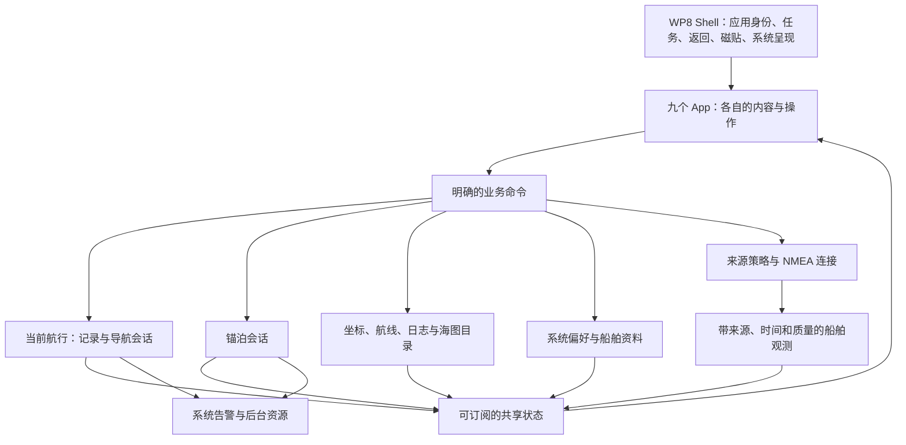

# Yokuli OS：应用领域与系统模型

日期：2026-09-09。状态：本轮整改的产品与技术决策，**不是当前 APK 的完成情况**。

本文取代此前按旧 Anchor App 页面组织产品的做法。用户分多条提出的反馈全部有效；[整改清单](OS_REWORK_BACKLOG.md)逐条跟踪。保留已经改善的海图体验、真实数据引擎和原 Shell，重新组织应用职责和控制权。

## 1. 产品基线

Yokuli OS 是一套共享船舶状态、用户作品和交互语言的航海应用系统。当前以默认全屏 Android App 交付，构建、应用身份和 API_KEY 管理沿用 `yokuli_marine_shell`。固件不是本轮范围。

Shell 的视觉与交互基线是用户确认的 `codex/shell-map-contract`：Start、磁贴、应用列表、横滑、转场、搜索、最近任务、虚拟实体键、字体比例、方角按钮。应用内部遵守同一套 WP8 大标题、Pivot 横滑和子页左上返回。领域整改不重新设计这套 Shell。

九个一级 App 是本轮目录。功能扩展先归入明确的用户任务，不能因为存在一组旧代码就新增 App。每个 App 的首页呈现正在操作的对象：地图、记录、船体、仪表或连接，而不是设置列表。技术详情放在对象详情或诊断中。

## 2. Raymarine 的参考与 Yokuli 的取舍

本次核对的是 Raymarine 官方 LightHouse 4 操作手册 81406 Rev 29，不把它的菜单或硬件产品全部复制进来。

| 官方参考事实 | 在 Yokuli 的具体采用方式 |
| --- | --- |
| Home 提供应用入口，同时提供 My data、告警和设置等共享入口。[Home](https://docs.raymarine.com/81406/en-US/latest/HomescreenOverview-56D9967C.html) | Shell 管应用身份、任务和系统能力；保留 WP8 Start，不另造 Raymarine 风格首页。 |
| My data 集中管理航点、航线、航迹和导入导出。[My data](https://docs.raymarine.com/81406/en-US/latest/MyData-5879EABF.html) | 我的航行拥有坐标与航线，日志拥有已经发生的航程；共享实体可以被地图引用，无需复制。 |
| 系统按数据类型选择来源，显示正在使用的来源和值，手动选择可明确指定来源。[Data sources](https://docs.raymarine.com/81406/en-US/latest/DataSourcesMenu-56D2C7E7.html) | 系统统一仲裁船位、风、深度等字段；NMEA 连接是否打开与该字段是否采用它，是不同状态。 |
| Dashboard 使用设备和传感器提供的系统数据，并允许选择、自定义显示页。[Dashboard](https://docs.raymarine.com/81406/en-US/latest/DashboardAppOverview-C3060522.html) | 仪表专注真实读数、趋势和空间姿态；可用能力取决于真实数据，不嵌入旧 Sail 产品。 |
| 告警管理汇总活动告警与历史。[Alarms](https://docs.raymarine.com/81406/en-US/latest/AlarmsManager-86A857A6.html) | 锚警负责判断锚泊风险，系统统一呈现、发声、确认和记录告警。 |
| 原生应用可组合显示，部分应用依赖特定硬件。[MFD apps](https://docs.raymarine.com/81406/en-US/latest/MFDApps-57F51FDE.html) | 先把手机上的全屏操作做好；共享组件为未来组合提供基础。本轮不靠分屏、雷达或无设备的页面扩充目录。 |

右栏是针对 Yokuli 的设计决策，不是声称 Raymarine 已采用这些内部模型。

## 3. 九个 App 的边界

| App | 用户打开它要完成的事 | 拥有的对象与内容 | 与系统及其他 App 的关系 |
| --- | --- | --- | --- |
| 海图 / Chart | 看船位、选点、测距、规划与使用航线 | 当前地图视野、准星、双图钉、选中对象、路线编辑交互 | 读取共享船位、坐标、航线与当前记录；写入我的航行；调用系统导航和记录命令；不管理文件夹或网络连接。 |
| 海图库 / Chart Library | 让自己的海图文件可靠地成为可用图层 | 用户授权的文件夹、命名图层、文件索引、覆盖范围、文件优先级和异常 | 提供图层目录及瓦片；“在地图查看”选择该图层并正式打开海图；不再用多个显示开关控制各地图。 |
| 航行日志 / Logbook | 记录这次航行、回顾发生过的事 | 当前航程视图、历史航程、航迹、事件、备注、回放、报告和导出 | 系统拥有运行中的记录会话；日志是其完整操作与阅读界面。合并原“航行记录”和“航行日志”。 |
| 锚警 / Anchor Watch | 下锚、确认守望范围、观察走锚、处理警戒、起锚 | 锚泊会话、锚点估计、警戒几何、摆动轨迹、风深度条件、锚泊历史 | 读取同一船位和共享地图；向系统发布告警；收藏锚地时创建/关联我的航行中的一个坐标。 |
| 我的航行 / My Sailing | 管理以后要去、值得记住和已经收藏的地方与线路 | 坐标、航点用途、锚地资料、集合、标签、航线、导入导出 | 是坐标与航线的唯一数据所有者；海图、锚警、日志引用同一 ID。锚地不另建一套地点库。 |
| 仪表 / Instruments | 读懂现在的船况，以及正在怎样变化 | 可配置的航行/帆船/船体/环境仪表页、曲线、罗盘、3D 姿态和读数详情 | 订阅系统数据和当前导航；校准写入共享船舶资料；不再私有启动航程、请求定位或管理 NMEA。 |
| NMEA 输入及输出 / NMEA Connections | 同时连接多台设备，看清每条连接的接收与发送 | 命名连接、传输配置、重连、输入/输出路由、每连接流量与原始语句 | 提供带身份的数据候选；读取系统获准发送的观测；不独占船位选择，也不拥有当前航程。 |
| 本机 NMEA 客户端 / Local NMEA | 使用本机 NMEA 能力，清楚看到谁提供、谁接收、实际发送了什么 | 该 App 的命名保持用户要求；运行职责见下方待确认项 | 与外部连接管理共用一个网络运行时和数据源系统，不再启动第二套解析器、GPS 或数据中心。 |
| 设置 / Settings | 配置整个 OS、自己的船以及跨应用偏好 | 船舶资料、单位、坐标格式、语言、显示、声音、磁贴与应用偏好、权限、数据来源、备份与系统信息 | 各设置有明确拥有者；通用设置一次修改全局生效，业务操作仍留在对应 App。 |

**唯一待确认的业务词义：本机 NMEA 客户端。** 已向用户询问是“汇总手机与系统数据并供其他设备连接的本机节点”，还是“连接本机服务并消费数据的客户端”。早期愿景偏向前者，但不能把它当成已经确认。两个角色在技术模型中分开，最终 App 的首页和命名解释随答复确定；其余八个 App 与系统模型不依赖该答案。

原“船舶数据”拆回正确职责：实时读数与曲线归仪表；全局来源选择归设置中的数据来源；某个读数可打开同一个来源详情。原“个人水深图”的有用能力成为海图的实测水深内容、日志的调查记录和仪表的深度显示，不作为第十个孤立 App。已有数据保留，入口在迁移表中映射。

## 4. 系统究竟统一什么



这表示逻辑所有权，不要求拆成多个进程、Gradle 模块或微服务。先在现有 Android 进程中用小接口、明确状态和现有存储实现。

### 4.1 本次航行、记录、导航、锚泊

用户面对的是一次真实航行；系统只维护一份当前航程。**“开始记录”就是创建并开始记录这次航行，不再增加一个功能重复的“开启航行”总开关。** 海图上的记录按钮、日志的当前航程和磁贴打开同一套控制界面。

| 状态 | 含义 | 谁能改变 |
| --- | --- | --- |
| VoyageSession：无 / 记录中 / 暂停 / 保存中 / 已完成 | 这次航行的时间、轨迹和事件；暂停只是暂停采样，形成明确断段 | 唯一记录控制器；各入口发同一种命令 |
| NavigationSession：无 / 前往坐标 / 跟随航线 / 到达 | 当前引导目标和进度，可在不记录时使用 | 唯一导航控制器；海图和我的航行调用它 |
| AnchorSession：无 / 准备 / 值守 / 暂停 / 结束 | 对一个锚泊位置的持续守望 | 锚警业务控制器 |
| 观测质量：可用 / 过期 / 无来源 / 权限阻止等 | 当前会话能否获得可信数据；不是另一套航行开关 | 数据来源系统和运行时 |

关键规则：

- 记录可以覆盖途中锚泊。下锚不结束整次航行；锚泊开始/结束可作为日志事件。
- 开始导航不自动开始记录；保存路线不开始导航，也不自动把所有路线画在海图上。
- 结束记录不结束导航或锚警。起锚不删除收藏，也不结束航程。
- 关闭一个 App、按 Home 或切到仪表不停止后台会话。
- 失去位置时保留会话，显示数据中断与告警，轨迹断段；不把旧船位继续标为实时，不悄悄启用手机 GPS。
- 记录暂停与锚警暂停是不同命令，标题明确包含对象；通用“暂停航行”不作为含混入口。
- 运行时重启恢复已持久化会话，但仅在原权限和来源策略允许时恢复资源；状态必须说明恢复中或缺失条件。
- 每条连接和输出分别保存用户要求运行/主动停止的意图。恢复航程不能重开用户主动断开的连接或已停止的输出；保存地址和路由不代表开始运行。

### 4.2 一份船位，多种连接

传输连接、可用观测、实际采用的来源分别建模：连接成功可以还没收到船位；选择手机船位也不妨碍 NMEA 提供风和深度。

船位策略的用户入口统一为：**关闭 / 手机 / NMEA**。界面若使用两个开关，二者都允许关闭，打开一个时另一个禁用；它们映射到同一个枚举状态。

- 选择手机：自动请求所需 Android 权限与定位服务启用；只有实际取得位置后才显示可用。系统定位未开启时给出系统启用流程，不能伪造成功。
- 关闭手机：停止 Yokuli 对手机位置的订阅；记录、锚警和本机 NMEA 不能绕过这项选择继续请求位置。其他 App 或 Android 的全局定位开关不由 Yokuli 伪称已关闭。
- 选择 NMEA：至少有连接已建立；有效船位尚未来时显示“等待船位”。指定连接与实际来源可见，手机船位禁用。
- 关闭 NMEA 船位不等于断开 NMEA；仍可接收风、深度、AIS 等支持的数据。
- 断线后选中的来源保留，显示原因；不默默换到手机。恢复入口修改同一个系统来源策略。
- 多条 NMEA 输入可同时存在。首轮船位使用明确指定的 NMEA 来源，只有一个可用来源时可直接选它，多个时显示来源列表；深度、风、航向等按字段分别选择，不能“最后一条报文覆盖全部船况”。船位按优先列表自动换源是后续显式选项，不默认开启。

每个值携带 `sourceId`、连接代次、采样/接收时间、单位、质量及失效原因。派生值还保留其输入来源。位置、SOG/COG 等耦合观测避免拼接成来自不同时刻不同船位源的假快照。演示数据单独标记，不能不经说明混入真实输出或日志。

来源类别过滤先于固定来源和优先级，固定 NMEA 来源不能绕过“手机”或“关闭”策略。海图、记录、锚警、实测水深和代理输出都消费同一个选中观测，仍保留各自更严格的质量门槛。来源变化产生新的证据代次与记录，锚警不能把换源跳点误作连续摆动证据。

锚警值守期间船位不自动换源；用户主动在同一系统策略中切换时，重新建立合格定位证据并说明天线参考差异，保持已确认锚点。首轮不引入藏在锚警里的第二套来源覆盖逻辑。

### 4.3 告警与权限

锚警、位置丢失和可用的其他业务规则产生告警；Shell 共用一套呈现、声音、确认和历史。确认声音不等于消除触发条件，也不自动停止业务会话。

后台资源由会话需求与系统来源策略共同决定。页面组合与销毁没有开关 GPS、重建 socket 或停止记录的副作用。权限不足时显示真实受阻状态；不能以“开关已开”冒充服务已运行。

长时间等待定位、写轨迹或生成报告不能堵塞系统控制命令。记录与锚警各自保持状态变更有序，耗时工作可取消并反馈准备/保存状态；告警确认和锚警暂停不排在一次记录启动的定位等待之后。

## 5. 共享对象，消除数据复制

| 对象 | 核心含义与边界 |
| --- | --- |
| GeoCoordinate | WGS84 经纬度值；格式化使用系统坐标偏好，不承载收藏身份。 |
| SavedPlace | 唯一稳定 PlaceId、名称、类型、标签、集合、备注、媒体及坐标资料；类型可为普通标记、锚地、码头等。普通标记可仅有一个坐标；较大的地点可有范围中心和多个具体 Spot。航点是坐标在导航中的用途，不需要重复保存另一实体。 |
| SavedSpot / AnchorageDetails | 具体坐标具有稳定 SpotId；锚位可附底质、避风方向、深度参考和参数。路线、锚警可以明确引用 SpotId，不能拿 Place 中心替代实际锚位。既有 Place / Spot / Visit 关系、媒体与原会话关联保留。 |
| Route / RouteLeg | 有序路线及点的引用/坐标快照；允许临时路线点，不强迫每个折点成为收藏。导航启动时冻结使用版本，随后编辑不暗改正在执行的路线。 |
| VoyageRecord | 已发生航程的采样、轨迹、事件及引用；历史位置保持当时快照，后来移动收藏点不重写历史。 |
| AnchorSession | 一次实际锚泊，具有时间与守望状态，可关联一个 SavedPlace；收藏坐标和启动锚警是两个操作。 |
| ChartFolder / ChartLayer | 一个授权文件夹可创建一个自命名图层；目录索引不复制原文件。图层 ID 与显示名分离。 |
| ChartFile | 文件身份、格式、覆盖、比例/缩放、启用状态、优先级和可读性；同一图层内确定性合成。 |
| VesselProfile | 船名、尺寸、吃水、天线/换能器位置与参考、手机安装和校准；被海图、锚警、仪表、日志及 NMEA 派生值共同使用。 |
| SystemPreferences | 单位、坐标格式、语言、时间显示、显示与声音、后台偏好、磁贴与应用声明偏好；每项只有一个持久化拥有者。 |

删除与导入必须尊重引用：删除收藏不能破坏历史航迹；删除路线不能静默停止正在使用的导航；迁移锚地保留 ID 映射、笔记、媒体和到访记录。GPX 负责可交换内容，系统完整备份承载 GPX 不能表达的资料；导入前呈现重复项处理结果。

坐标可附带来源与不确定度，未知坐标用空值，不用默认地图中心或 0,0 替代。现有 Room 已有地点、锚位和到访及 Migration19To20；先通过一个 MySailingRepository 适配既有数据和当前 JSON 收藏，统一业务读写边界，不急于重写存储。不能仅按距离自动合并地点，不能把一个历史访问计数补成虚构的多条访问记录。活动导航和锚警采用启动时确认的坐标快照，编辑收藏不能暗改正在使用的目标。

## 6. 所有地图是一套体验

### 6.1 地图来源

系统只保存一个明确的当前地图来源：

```text
Online
Satellite
CustomLayer(layerId)
```

海图右上直接列“在线”“卫星”和每个自命名图层，当前项有勾选，入口本身显示当前名称。点击立即生效并保持相机位置。不能再出现“我的海图”下面还藏多个可同时开启文件夹的含混状态。

选中名称立即更新，绘制另有加载/就绪/当前区域无覆盖/文件失败/在线不可用状态。加载期间不能把旧来源的画面冒充新选择的结果；快速切换只接受最新请求的回调。

选自定义图层时只合成该图层所属文件夹的可用文件。文件优先级从高到低；高优先级有有效像素的覆盖区优先，无覆盖/透明处才使用下一张，不能用整块瓦片把低优先级有效区域遮掉。同优先级用稳定顺序，不能每次扫描改变结果。缩放选择尊重真实分辨率，过度放大时明确反馈。

海图库的“在地图查看”就是选择该文件夹图层并打开海图。文件授权失效保留选择并显示修复入口；不偷偷显示另一张海图冒充成功。删除当前图层时明确告知将回到在线，且离线时在线不可用的状态仍可见。

航线、航迹、锚警圈、AIS、坐标和实测水深是业务内容，不塞进地图来源选择器。当前任务需要的内容随场景呈现，必要的高级显示设置留在相应业务入口。

### 6.2 共用地图，分别拥有任务

建立一个实际使用的 `MarineMap`，接收：

- `MapScene`：船位、地点、路线、轨迹、区域、选中对象及质量。
- `MapViewState`：中心、缩放、朝向和跟随状态；各 App 场景分别保存视野，避免回放把主海图带走。
- `MapInteraction`：浏览、准星选点、双图钉测距、路线编辑等明确模式。
- `MapCommands`：选中、确认坐标、相机移动等有类型的回调。

地图来源、绘制规则、船标、比例尺、选点和手势一致。业务会话不藏进地图组件，组件不直接读整个 OsStore，不创建另一个大业务容器。

锚警使用这套地图显示锚点、船位、轨迹、范围；日志使用它回放；我的航行使用它预览坐标。选择锚点调用同一个坐标选择器，返回结果给锚警，不能在锚警 App 内塞入整套海图 App 或旧 Anchor 地图。

准星和底部操作条覆盖在稳定的地图视口上；显示/隐藏不能改变 MapView 的测量尺寸、重新 fit 或重建相机。地图拖动优先于 App 的横滑切页，手势归属清楚。切换来源使用单一状态驱动 SDK 图层更新，无需退出 App。

## 7. NMEA 的技术与产品模型

### 7.1 多连接运行时

`ConnectionId` 标识命名连接，`generation` 区分一次重连前后的报文。每条连接独立持有 transport、输入缓存、重连策略、接收/发送统计及错误。断开一条不能 clear 全部 NMEA、关闭其他连接或让所有读数消失。

首轮使用已经有真实技术基础的 TCP/UDP；其他协议只有在传输适配器与硬件支持实际可用时才出现。TCP 客户端、UDP 接收/发送、TCP 服务端及其 peer 是不同角色；UDP 必须保留远端地址，不能把不同发件人合并成同一个来源。

同一本地 UDP 端口由一个实际监听器按 peer 分流，不能给每个逻辑连接绑定一个碰运气的重复 socket。一个双向 TCP 连接只有一个串行 writer；多个输出规则通过该 writer 排队，不能各自直接写 socket。

```text
多条连接 / 手机传感器
  -> 有来源身份的原始观测
  -> 字段候选与质量检查
  -> 系统来源策略
  -> 可订阅的船舶数据
  -> App、记录、锚警和获准输出
```

接收设置归连接，船位选择归系统数据来源。连接 App 的首页是实际连接列表和数据流，点某条再看详情、语句、过滤及输出对象；不是一张总开关表。

### 7.2 输出与本机角色

输出明确区分“转发某个输入”和“把系统采纳的数据编码成 NMEA”。每条规则显示目标连接、字段/句型、频率和实际结果。默认不向任何设备盲发，不把“已配置”显示为“已写出”。

来源身份贯穿输入与派生值，禁止把报文回送原 peer；对网络外部回环使用有限的指纹/时间窗去重和限流，不能声称 NMEA 协议提供跨设备全局环路追踪。一个坏连接或慢客户端不能阻塞其他输入。

本机服务如果被选为该 App 的职责，显示监听地址、端口、接入客户端、共享字段和最后实际写出时间；本机数据即使没有外部 NMEA 也可在权限与来源允许时发布。若用户指本机消费客户端，则连接本机端点并显示其消费内容，不再复制服务端开关。服务和客户端能力可以共用引擎，产品入口必须解释各自角色。

现有旧引擎的本机输出主要受 Phone/App 来源过滤限制。将来支持选定外部输入汇总时需要显式拓展来源规则和反回送策略；不能仅改页面名称就声称已支持。

## 8. 每个 App 的完整使用故事

每条故事既要求有可操作的内容，也要求异常时回得来。内容丰富不等于首页同时显示所有读数。

| App | 首轮完整故事 | 领域内的扩展方向 |
| --- | --- | --- |
| 海图 | 拖图看船位 → 准星选点 → 一键标记 → 拖动两枚图钉测距 → 选一条路线预览 → 开始导航 → 从同一记录按钮记录航程 | 选定对象的信息卡、路线反向/从某点加入、清楚的偏航/到点提示；AIS 与潮汐只在真实数据支持时呈现。 |
| 海图库 | 授权文件夹 → 扫描并说明有效/失败文件 → 为文件夹创建命名图层 → 排优先级 → 在覆盖预览中核对 → 选择使用 → 外部文件变化后重新扫描 | 缺失文件定位、重复识别、授权修复、离线区域检查；不能假装整个文件夹都导入成功。 |
| 航行日志 | 从海图开始记录 → 日志看当前航迹和时间线 → 加一个带备注的时刻 → 途中下锚仍属于同次航行 → 结束保存 → 回放事件 → 导出 | 航程日历、地点关联、照片/船况事件、航程对比与可读报告；内容来自实际记录。 |
| 锚警 | 用船位或准星确定锚点 → 查看偏移和可信度 → 调整守望范围 → 开始值守 → 看船舶摆动与范围关系 → 处理告警 → 起锚并可收藏地点 | 船体/天线几何辅助、按实际链长和水深作有来源的估计、风变与水深趋势、锚泊回顾；估计和测量明确区分。 |
| 我的航行 | 搜索/浏览自己的坐标 → 将某点归为锚地并补笔记 → 组合路线 → 查看分段和总长 → 明确选择预览或导航 → GPX 交换 | 集合、标签、重复合并、到访时间线、照片、防护方向、备选线路；收藏不会自动开始锚警。 |
| 仪表 | 选择航行/船体等关注页 → 拿到真实读数 → 点读数看趋势和来源 → 固定并校准手机 → 用 3D 船体观察横倾/纵倾 → 保存自己的布局 | 可选大字单项、帆船风角、罗盘、环境曲线、船体多视角；没有安装/数据时显示缺失状态，不把零度示意当成测量。 |
| NMEA 输入输出 | 建立两个命名连接 → 同时观察接收 → 指定船位和深度的不同来源 → 设置一条实际输出 → 断开其中一条 → 其余连接继续 | 每连接语句过滤、冻结阅读、重连诊断、分享可审查的配置；高级诊断不占据正常首屏。 |
| 本机 NMEA | 待角色确认后，以“输入来源 → 实际本机运行 → 消费者/客户端 → 故障恢复”形成一条闭环 | 沿用旧实现的本机独立能力，保留反向输出和汇总的技术潜力，不创建另一个船舶数据源总开关。 |
| 设置 | 输入船名与单位 → 各 App 同步 → 自定义一块磁贴 → 调整常亮/语言 → 查看定位权限和当前来源 → 修复后返回原任务 | 船舶安装示意、可理解的备份恢复、每应用声明的偏好、后台运行状态；开发诊断放“关于/诊断”。 |

锚警另外必须走通：

1. 值守中 NMEA 断开：地图保留最后位置并标出时间，系统告警；用户可在同一来源选择流程改用手机。原会话保留，只有新来源提供有效、新鲜且通过锚警质量检查的位置后才恢复计算；记录来源改变，不移动已确认锚点，不因权限通过自动清除告警。不能打开一个被套在锚警里的 NMEA 全产品。
2. 结束值守后收藏：锚泊回顾选择“保存为锚地”，写入/关联同一个 SavedPlace，稍后在我的航行继续编辑媒体与笔记。守望会话不是收藏数据库。
3. 不知道准确锚点：用户先确认临时参考点和守望范围，在该范围上监控并积累摆动证据；参考点、估计候选与船位用不同含义呈现。证据不足显示等待，生成候选后显示不确定范围，由用户采用或拒绝。估计器不能自行移动已采用的警戒中心；采用过程记录为会话事件，收藏保留估计来源身份。

导航的偏航值表示相对所选规划线的几何距离，到点与方位来自有效实时位置及目标坐标；缺少可信定位时停止更新实时结论。规划连线本身不含已验证水深、障碍或自动避让含义。此阶段实现手工规划与几何引导，自动航路需要另有真实海图能力后才能成立。

## 9. 统一设置和交互契约

设置按“系统 / 我的船 / 应用”组织 WP8 内容，而不是把所有业务设置搬到一个大页面。

- 系统：语言、单位、坐标格式、时间显示、外观、常亮/运动、声音与告警呈现、权限与后台、数据来源、备份、关于。
- 我的船：船名、船体尺寸和吃水、传感器参考/偏移、手机安装与校准。改一个参考值后所有使用者采用同一解释。
- 应用：Start 布局/重置、每个应用声明的磁贴内容和偏好；调整大小/位置继续使用原 Shell 操作。
- NMEA 连接参数、海图文件优先级、锚警半径等业务配置在各自对象详情中，不回流成设置杂物箱。

显示单位由一个格式化入口处理。内部保留标准单位，禁止改显示单位时改写原记录数值。历史采用用户当前显示单位，保留原始数据参考。中英文同时实现，不把翻译当成最后一轮修饰。

跨 App 只有两种机制：

1. 明确打开目标 App/对象，例如 `OpenLogbook(voyageId)`、`OpenPlace(placeId)`，由 Shell 创建/恢复正确任务和返回关系。
2. 小而明确的能力请求，例如 `PickCoordinate(initialPoint)`、`SelectSource(field)`，返回结果给调用者，不嵌入另一个 App 的整个工作区。

App 内详情先返回上一级；工具/弹层先关闭；再由原 Shell 返回任务。不能再用全局 `Int` 广播并让不同页面各自猜意思。也不能在关闭页面/对话框时顺手修改全局手机安装或航行状态。

## 10. 复用与迁移决策

| 保留 | 重新组织或替换 |
| --- | --- |
| 原 Shell 引擎、Compose 组件、布局存储、AppPreference 契约和 WP8 参考 | 九 App 注册与旧入口映射；不复制 Shell 样式另写一套。 |
| 旧 NMEA 解析、校验、传输、重连、输出、客户端处理 | 单连接全局状态改为每连接状态；增加明确路由与来源仲裁。 |
| Room 航迹、轨迹采样/写入、导出、锚警算法、告警、传感器与校准 | 通过领域适配接口使用；不把旧 MainViewModel 及 UI 路由作为新 App 的产品框架。 |
| 新海图的准星、测距、相机修复、文件夹解析与文件优先级基础 | 提取共享地图场景；一个来源选择模型；替换所有业务中的旧地图 UX。 |
| 原船体 3D 表达、真实趋势与数据质量 | 仪表直接组合内容组件，删除外包着它的旧 Sail 工作区。 |
| 原构建、API_KEY vault/注入和应用身份 | 不搬运明文 Key，不新建一套凭据配置，不改变已有发布来源。 |

持久化采用现有数据库与 Shell DataStore。每个配置明确选择一个权威存储，迁移成功前保留旧数据，迁移有版本号和 ID 映射，重复运行不重复导入。不得用清空用户数据来完成目录重组。

锚泊与航程数据库已经独立，不需要再造航行数据库。共存时让锚警开始/暂停/结束向现有航程事件写入带 AnchorSessionId 的事件，完整锚警数据继续保留在原表；前台状态同时表达“记录中”和“值守中”，各会话只释放自己的资源需求。

实现顺序及可观察完成条件见[整改清单](OS_REWORK_BACKLOG.md)。本轮以手动完整故事为验收，先做真实场景，再补工程化；编译成功不代表体验完成。
