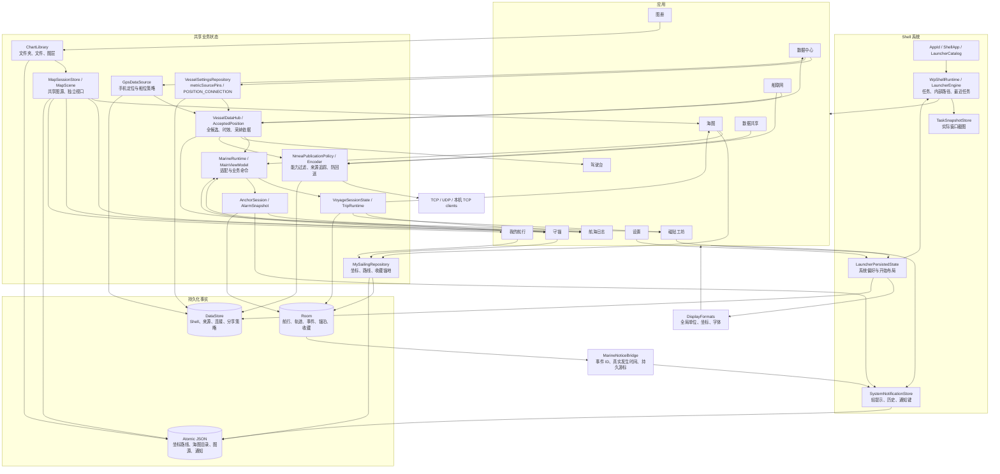

# Yokuli OS 0.5：应用边界、接口与数据拓扑

更新：2026-09-18，experience.5（versionCode 9）。本文对应 `app-shell/src/rebuild` 实际入口。构建继续沿用 marine_shell 的包名、Gradle、签名和 API Key 注入。代码里的遗留技术模块仍由适配层调用，不把遗留 UI 当作新应用。

本轮审查的代码修复与验证边界见 [experience.5 记录](../experience/EXPERIENCE_5_DELIVERY.md)。表格描述实现约定，不代表所有硬件、后台限制和长时间船上场景均已通过验证。

## 这轮实现计划与边界

| 用户反馈 | 实现位置与决定 |
| --- | --- |
| 1、2 准星底栏与比例尺 | 准星读数、选中对象与底部命令连在一起；比例尺独立在地图左上，显示 1/2/5 系列整数量级。 |
| 3、26 WP 排版、控件、动效 | Shell 与应用共用 Selawik 字族、48sp 轻标题、32sp Pivot、圆形单选、矩形开关/输入框、水平五点进度、按压倾斜；提供全局文字大小。保留 Android 无动画的系统可访问性行为。 |
| 4 缩放抖动 | 地理点、线、范围交给同一个地图引擎原生绘制；Compose 不再异步投影地图标注。 |
| 5、6、15、16、22 应用关系 | 地图内先预览坐标，详情为显式动作；普通应用入口回首页，最近任务恢复原页面实例；跨应用对象操作返回原调用页；根页不显示“返回 OS”；内部返回处理先于 Shell，失活画面不能抢键。 |
| 7 声纳 | 移除测深调查产品入口、UI、采样订阅和自动恢复；保留历史数据库和真实 NMEA 水深读数。 |
| 8、9 航行日志 | `MarineRuntime.voyage` 是统一会话视图；开始/暂停/继续/保存使用同一命令；系统栏、海图、日志和磁贴同步。日志支持当前航迹、时刻、历史、编辑、回放、导出与地图预览。 |
| 10、21 仪表 | 罗盘、风向、姿态、量表按数据含义可视化；“我的”持久化增删与排序，提供长按拖动和上下移动。 |
| 11、23 磁贴 | 应用列表 → 该应用的真实样式预览 → 尺寸 → 应用；同一应用一块磁贴，旧重复项迁移合并。读数实时订阅，地图底图快照标记时间。 |
| 12 全局单位 | 显示统一走 `DisplayFormats`；DD/DMM/DMS 编辑使用同一解析器；原始记录不随显示偏好改写。 |
| 13、14 锚警 | 地图为主，下锚 → 定位置/范围 → 值守 → 起锚；最近轨迹渐隐，累计停留区域来自本次真实历史。 |
| 17 设置 | 设置只管系统、个人偏好、船舶、权限、声音、资料备份和关于；手机与 NMEA 来源、手机定位和校准统一由数据中心管理；样式集中到磁贴工坊。 |
| 18 来源与分享 | 船联网管理连接与发送，数据中心统一字段采用，数据共享管理本机服务；发布共用系统读数、能力选择、真实包过滤及逐 IP 防回送。 |
| 19 通知 | 全局顶部轻提示 + 底部右侧通知键（替换搜索）；中间始终是 Home；顶部下滑交给 Android 系统。通知中心保留应用、时间、正文、级别、已读、重复次数和可选详情；阅读不确认警报。 |
| 20 海图库 | 文件夹 / 命名图层 / 文件明确分层；创建、扫描、改名、启停、优先级、移除/恢复、解除关联和地图使用均有明确效果。 |
| 24 数据结构 | 本文总图和边界表；各领域子契约细化字段、接口、事件与存储；`API_INDEX.md` 给出源码声明索引。 |
| 25 全屏 | 系统栏和虚拟键贴近窗口边缘；圆角横向避让，不用整页上下缩进；键盘独立抬升。曲面屏视觉最终以真机为准。 |

## 整体拓扑

箭头表示读写/订阅关系，不表示新建进程。后台业务不依赖哪个应用当前可见。通知、开始屏幕和应用内界面不能各维护一份“是否正在航行”的布尔开关。

## 全部应用对外边界

| 应用 | 入口 / 对象地址 | 读取 | 提交的业务动作 | 数据所有权 |
| --- | --- | --- | --- | --- |
| 海图 | `chart` | `MapScene`、可信船位、选中坐标/路线、全局航行 | 选点、标记、规划、预览、导航、记录命令 | 独立视口与地图临时工具；收藏交给我的航行 |
| 图册 | `library`、`library:<folderId>` | 文件夹扫描、文件状态、命名图层、覆盖 | 授权、扫描、改名、排序、启停、恢复、解除关联、使用图层 | `ChartFolder / ChartFile / ChartLayer` |
| 航海日志 | `voyages`、`voyage:<id>`、`replay:<id>`、`report:<id>` | 当前 `VoyageSessionState`、历史轨迹/事件/时刻 | 开始、暂停、继续、结束、时刻笔记、改名、导出、历史地图预览 | `TripSession / Sample / Event / Waypoint` |
| 守锚 | `anchor` | 选中船位、锚点、警戒圈、近期轨迹、累计范围、警报 | 下锚、设点/半径、值守、暂停、起锚、收藏 | `AnchorSession`；收藏引用统一坐标 |
| 我的航行 | `places`、`place:<id>`、`route:<id>`、`anchorage:<id>`、`collection:<id>` | 收藏坐标、锚地具体位置、集合、路线 | CRUD、GPX、预览、前往、编辑路线、集合整理 | `Place / Route` 与已有 Room anchorage 实体 |
| 驾驶台 | `instruments` | 已采纳 `VesselObservation`、趋势、导航 | 选表、详情、增删/排序；需要改来源或校准时请求数据中心 | 只拥有显示布局；不切换连接或私建来源策略 |
| 数据中心 | `data_center`、`data_center:phone`、`data_center:<VesselMetricId>` | `VesselDataSnapshot.candidates` 全候选、已采纳观测、原来源策略、手机传感器 | `setVesselMetricSource`、船位来源选择、手机 GPS 启停、手机安装/校准 | 复用 `VesselSettingsRepository.metricSourcePins`、`GpsDataSource / POSITION_CONNECTION`；不创建新配置存储 |
| 船联网 | `nmea`、`nmea:outputs` | 多连接、流量、输入报文、系统发布读数 | CRUD/连接/停止、发送能力与转发输入选择 | `NmeaConnectionSpec` 与连接运行意图；不拥有系统字段来源策略 |
| 数据共享 | `local_nmea` | 本机监听状态、连接客户端、数据中心采纳结果、实际输出 | 设置端口、发布能力与转发输入、启动/停止 | `LocalNmeaServerSettings` 与 listener 生命周期；不再私有管理手机来源 |
| 设置 | `settings`、`settings:<section>` | 持久化系统/船舶偏好 | 修改语言、单位、坐标、颜色、文字大小、常亮、声音、权限、备份 | `LauncherPersistedState`、`VesselDataSettings` |
| 磁贴工坊 | `tiles`、`tiles:<appId>` | 应用声明的样式、当前固定项、真实内容 | 选择样式/尺寸、固定、更新、取消固定 | Shell 的 tile preference 与 `StartDocument` |

`nmea:outputs` 兼容已有入口，连接内部负责读写选择。`settings:sources`、`nmea:sources`、`sources` 和 `data.sources…` 统一迁移到数据中心。旧 `data` 仍指驾驶台；sonar/trip 等旧链接只作迁移，不恢复已移除产品。

### experience.5 的关键读写约定

- 应用稳定 ID、对象路径和已有数据不随品牌名称变化。图册、航海日志、守锚、驾驶台、船联网、数据共享、磁贴工坊分别对应原来的 LIBRARY、VOYAGES、ANCHOR、INSTRUMENTS、NMEA、LOCAL_NMEA、TILES。
- `Reading` 保留 `freshness / quality / sourceKey / elapsed / validForMillis`。显示来源名与稳定物理来源身份分开。普通数值显示最后观测和年龄；实时船首向/COG/姿态必须采用字段自己的有效性，不能借位置更新时间续命。
- `Fix` 的位置、SOG、COG、heading 各自计时。`MapVessel` 的 heading 只转船形，COG 只画一分钟对地向量。GGA 的位置与 VTG 的航速/航向通过已采纳字段组合，COG 永不冒充船首向。
- `navigationRoute` 是启动导航时的冻结路线；`MapViewState.previewRoute` 是另一个明确预览版本。导航卡、地图、目标切换使用相同冻结版本。
- 当前船位下锚使用开始时可信船位，确认页也显示该语义和实时预览。两个开始入口共用 `anchorWatchInput`，估计模式不丢失锚链、水深及 UNKNOWN 状态。
- 数据中心按指标展示 `snapshot.candidates` 中的所有来源及当前采纳结果，不按 NMEA 传输类型过滤掉手机。`MainViewModel.setVesselMetricSource` 是逐指标选源写入口，仍写原 `metricSourcePins`；船位沿用 `GpsDataSource`、`POSITION_CONNECTION` 与现有定位服务。手机安装与校准也写原模型。船联网只管连接和发送，数据共享只管监听与发布；发布内容选择不会重新仲裁来源。
- `NmeaConnectionLeasePolicy` 只恢复同次开机中用户明确开启且未停止的连接；持久连接配置本身不是授权自动连接的开关。RAW 和 SYSTEM 待发批次携带真实来源代次，写出前再次校验。
- `MarineNoticeBridge` 从 Room 订阅背景警报，以事件 ID 和真实发生时间写入 `SystemNotificationStore`。持久游标防止已删除通知在重启时复活；读取通知不会 acknowledge 或停止警报。
- 每次页面访问有独立 `savedUiStateKey`，地址相同不代表页面实例相同。跨应用对象访问保留调用者和目标原会话；`openLinked("chart")` 让地图完成后回原调用页。普通 `open` 首页是新访问，最近任务 `ActivateTask` 恢复已有页面；Home 结束跨应用调用链。任务图像最长边 1920px，卡片按原视口比例展示；上滑逐帧跟手，抬手判定位移和速度，不足则弹回。

## 系统接口与数据结构

| 接口 | 输入 | 状态 / 输出 | 必须遵守 |
| --- | --- | --- | --- |
| `OsStore.open(destination)` | 应用根地址或对象地址 | Shell 命令 | 不直接给另一个 App 修改局部选中变量 |
| `OsStore.openLinked(destination)` | 带调用关系的目标地址，例如 `chart` | `LauncherAction.Open(preserveCaller=true)` | 目标完成后恢复原调用页面实例；普通“打开应用”仍用 open |
| `WpShellRuntime.open / openLinked / dispatch / input` | 根入口、`LauncherAction`、`ShellInput` | `LauncherEngine.state` | 普通首页创建新页面实例；对象和显式 linked 请求保留调用关系；最近任务用 ActivateTask |
| `BindInternalAppInputHandler` | 当前画面的返回处理 | 是否消费按键 | `LocalInternalAppInputEnabled=false` 的离场画面不接键；内部工具/子页先处理 |
| `LauncherAction.Open` | token、preserveCaller、replaceTaskRoute | 页面实例、应用内父栈及可嵌套调用关系 | 对象跨应用返回调用页，目标内部深入先退内部；桌面直接打开对象才回所属应用父首页 |
| `setVesselMetricSource(metric,sourceId)` | 指标与稳定来源 ID；非船位可清除固定项 | 原 `metricSourcePins` 与已采纳快照 | 通过现有仓库与业务入口更新，不直接改候选或新建偏好副本 |
| `VesselDataSnapshot.candidates` | 来自手机/连接/派生的观测 | 按指标组织的全部候选 | 与最终采纳值同时展示；来源的传输身份与业务用途分离 |
| `TaskSnapshotStore.bind / captureCurrent / retain` | 任务、窗口、实际内容区域 | `TaskSnapshot(bitmap,capturedAt)` | 使用 PixelCopy，失败保持旧图；不拿假 UI 代替真实预览 |
| `updateSystemPreferences` | 当前持久化状态的变换 | DataStore -> 全局偏好 | 原子更新，不写第二份业务设置 |
| `OsStore.notify` | 中英正文、AppId、级别、详情地址、去重键 | `SystemNotice` | 全部通知留历史；关键异步业务明确传 app |
| `SystemNotificationStore.open / close / toggle / remove / clearRead` | 通知中心操作 | 已读状态、最多 200 条记录 | 阅读/清除通知不确认警报、不停止值守；顶部不注册下滑手势 |
| `formatDistance / Speed / Depth / Bearing / Angle / Temperature / Coordinates / Metric` | 内部规范数值 | 当前全局格式字符串 | 缺测显示 —；不伪造 0；不更改保存值 |
| `formatLatitude / Longitude / parseCoordinate` | 当前格式与用户文字 | 十进制度或 null | 支持 DD/DMM/DMS，范围和方向校验，分秒不得 ≥60 |

`SystemNotice` 字段：`id` 稳定通知身份；`app` 发布者；`chinese/english` 双语正文；`createdAt` UTC 毫秒；`severity` 信息/警告/警报；`destination` 可选明确对象；`read` 已读；`key` 去重语义键；`occurrences` 同一短时事件次数。新增领域警报与运行时服务反馈保存中英文原文。升级前已保存的单语历史保留当时原文，不凭空重译。

`GeoPoint` 的 lat/lon 为 WGS84 十进制度。`Place` 包含 id/name/point/note/kind/collection，kind 为 MARK/ANCHORAGE/MARINA/HAZARD。`Route` 包含稳定 id、名称、有序 points；`navigationRoute` 是启动时冻结的版本，`displayedRouteId` 只是地图预览。保存与导航、显示不是同一动作。

`LauncherPersistedState` 是 Shell 布局与偏好的唯一存储：`languageTag`、`themeModeName`、`accentName`、`measurementUnitSystemName`、`appPreferenceValues` 与 `document`。坐标格式和文字大小属于 appPreferenceValues 的 `preferences.coordinate.format`、`preferences.display.text_size`。界面中的 OsStore 字段只是响应式读模型。

## 业务字段、事件、存储的细化

- [海图、海图库、锚警接口与字段](CHART_INTERACTION_CONTRACT.md)：地图事件、原生渲染、文件优先级、渐隐轨迹与累计范围。
- [航行与 NMEA 接口及数据约定](VOYAGE_AND_NMEA_CONTRACTS.md)：会话状态机、完整分享字段、逐 peer 防回送、关闭语义。
- [仪表与应用磁贴契约](INSTRUMENT_TILE_CONTRACT.md)：数据质量、实时订阅、布局结构、样式与去重迁移。
- [数据中心契约](DATA_CENTER_CONTRACT.md)：全部来源候选、唯一选源策略、手机定位与安装校准、连接和发布边界。
- [应用导航契约](APP_NAVIGATION_CONTRACT.md)：普通首页、对象请求、调用者恢复、页面实例与最近任务。
- [源码接口索引](API_INDEX.md)：生产入口、模型、接口与公开方法的实际声明位置；以链接代码为准。

## 全屏与视觉资产

内容背景铺满窗口；圆角半径与两侧切口决定边缘控件横向退让。`ShellSafeBands.statusSegments` 从实际 30 dp 高度中扣除中心/悬浮挖孔，状态栏与通知共用剩余横向区段，不整页下移。底部系统手势区域不额外推高虚拟键，软键盘另行抬升。不同厂商的曲面/挖孔信息存在硬件差异，模拟器结果不能替代所有真机。

字体使用 Microsoft 公开发布的 [Selawik 1.01](https://github.com/microsoft/Selawik/releases/tag/1.01)，是官方开源 Segoe UI 替代字族，不宣称它就是 Segoe WP。授权文本随 APK 保存在 `assets/licenses/Selawik-OFL.txt`。中文由 Android CJK 字体回退；字体、大小、字重和行高在共用组件统一。WP 的参考依据继续使用仓库已确认的录屏与测量，不新增 Material 样式。

## 诚实的实现边界

海图磁贴的地图图像有捕获时间，实时船位/速度另行更新；没有启动一个后台地图渲染器制造“实时地图”。锚泊累计色块表示本次记录到的位置占用，不是测深、海底扫描或可航行水域。曲线是有限历史，完整回放依赖航行记录。声纳历史数据仅保留，当前不采集、不恢复。通知中心是 Yokuli 内部通知，不读取其他 Android App 的通知。真实硬件 GNSS、海上守望、设备兼容性仍需要用户后续实船体验。
