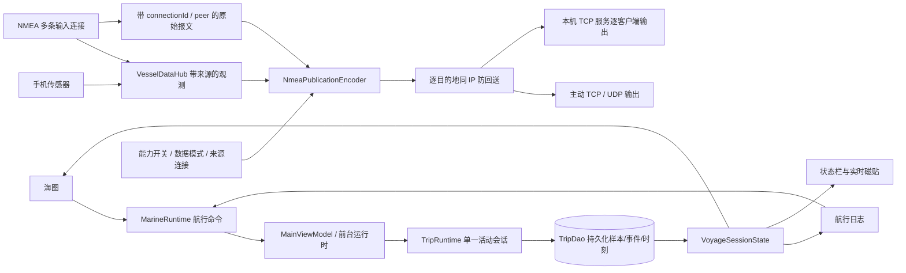

# 航行与 NMEA 接口及数据约定

本次实现把“航行”作为全局会话，把“分享”作为每个目的地自己的发布策略。界面只提交命令、观察事实，不用按钮的本地开关假装运行成功。

## 航行

| 接口 / 模型 | 职责与约束 |
| --- | --- |
| `MarineRuntime.voyage: StateFlow<VoyageSessionState>` | 唯一应用层会话视图：`id`、`phase`、`name`、米制距离、开始/暂停时间、累计暂停时间、时刻数量、命令处理中标记 |
| `VoyagePhase` | `IDLE → STARTING → RECORDING ↔ PAUSED → SAVING → IDLE`；保存中的记录直到数据库确认才关闭 |
| `startRecording(name, motion)` | 提交到前台 TripRuntime；同一时刻只允许一条开始命令；来源未开启时不创建虚假航迹 |
| `pauseRecording / resumeRecording / finishRecording` | 海图和日志共用；等待数据库确认后发布应用通知；超时明确显示尚未确认 |
| `TripSessionEntity` | 持久化航行摘要；数据库是事实来源，UI 生命周期不停止记录 |
| `TripSampleEntity` | 按时间保存位置和船况；缺失值为 null，保持轨迹间断 |
| `TripEventEntity` | 开始、暂停、结束、来源变化、下锚等真实事件 |
| `TripWaypointEntity` | 航行中的时刻及其位置、名称、笔记；与“我的航行”的通用坐标收藏分工明确 |
| `renameTrip / editTripMoment / deleteTrip` | 已结束航行可改名、时刻可编辑笔记；删除不作用于正在运行的航行 |
| `tripMapData / tripReplay / tripReport` | 读取历史地图、时间轴与统计；海图预览明确标注历史航行，不能变成实时船位 |

日志内船位来源不再跳到设置。来源选择归 NMEA 的“数据来源”。日志负责记录、回放、事件、报告和导出。

`RuntimeDiagnostics.pendingUserFeedback` 保留最多 64 条尚未交付的运行时反馈，避免 `StateFlow` 合并状态时丢失连续事件；`MarineRuntime` 逐条写入持久通知中心，再调用 `consumeRuntimeFeedback(id)` 精确消费。`RuntimeUserFeedback` 同时保留中文与英文内容；应用页面切换不影响交付。暂停/继续命令会先核对当前会话状态，已暂停时不会再次发送暂停命令。

## 数据来源与分享

| 接口 / 模型 | 职责与约束 |
| --- | --- |
| `NmeaConnectionSpec` | 每条连接有稳定 ID、名称、传输类型、目标/本机端口、接收/发送开关、feed、forwardFrom、capabilities |
| `NmeaFeed.SYSTEM` | 编码全系统实际选中的观测，保留来源追踪，排除演示、过期或无法证明来源的数据 |
| `NmeaFeed.PHONE` | 只发布本机位置、校准船首向、转向、姿态、气压，不借用船载同名数据冒充手机 |
| `NmeaFeed.RAW` | 只转发用户选中的输入连接；保留实际报文来源，用能力选择过滤 |
| `NmeaCapability` | 船位航速、船首向、转向、姿态、气压、视风、真风、对水航速、水深读数、水温、其他原始数据 |
| `NmeaPublicationPolicy.selected(spec)` | null 兼容旧配置默认；空集合明确代表不分享任何数据 |
| `NmeaPublicationPolicy.filter` | 真实包级能力开关。混合 XDR 按四字段组筛选并重算校验码，不泄漏关闭的数据 |
| `NmeaPeerGuard.sameHost` | 按 IP 阻止回送，不按端口；支持 IPv4、IPv6、网络地址格式与解析后的主机名别名 |
| `NmeaPublicationEncoder.encode / forward` | 本机服务和主动发送共用的编码/转发边界；生成数据也追溯派生值的所有原始来源 |
| `NmeaRawFrame` | connectionId、generation、实际 peer、原始句子、单调接收时间，防止丢失输入来源 |
| `NmeaConnectionSnapshot` | 连接状态、实际写出数、丢弃数和最近语句；排队与真正写出分开 |
| `LocalNmeaServerSettings` | 持久化监听端口、feed、capabilities、forwardFrom；同一次开机内显式运行租约 |
| `NmeaSharingServer.publish(sentence, clientId)` | 本机服务按客户端分别应用 IP 防回送，不把一份已过滤数据无条件广播给所有设备 |
| `NmeaPublicationEditor` | 本机服务与 NMEA 输出共用的可视化选择器，展示能力名称、选中状态、来源及当前读数 |

原始协议始终使用协议规定单位（例如节和米），显示才按全局偏好格式化。关闭校验仅兼容缺少校验码的旧设备，界面使用“忽略传输中损坏的数据”解释其意义，并放入高级选项。

NMEA 连接编辑器与本机分享编辑器的未保存草稿通过 `rememberSaveable` 随应用任务保留；能力与输入 ID 集合使用 `NmeaStringSetSaver` 显式保存为字符串列表，最近任务切换不会把草稿重置成已保存设置。

声纳测绘已退出当前版本的采集、启动、恢复与网格订阅路径；已有数据库记录保留，普通 NMEA 水深观测仍属于船舶数据能力。

## 本次验证

2026-09-17：`:legacy-marine:testDebugUnitTest --tests '*NmeaPublicationPolicyTest'` 通过全部 8 项检查。覆盖混合 XDR 中关闭字段不会泄漏、重算校验、视风/真风独立选择、空集合关闭与旧配置迁移、额外句型限制、系统读数不会被误标为手机传感器、IPv4/IPv6 地址解析，以及同 IP 不同端口和 localhost 别名的阻断。该结果证明包级规则；不冒充真实船载设备上的端到端验收。

转发还需满足输入连接仍开启且 `NmeaRawFrame.generation` 等于当前连接代次；系统生成数据的每个 NMEA 来源也检查同样的代次条件。断开与重连会让旧缓冲帧失效。TCP 服务网络边界统一补齐 CRLF，使原始转发保持逐句可解析。

实际模拟器收发、同 IP 防回送、能力过滤、编辑草稿恢复及全局航行控制记录见 [NMEA 与航行 QA](NMEA_VOYAGE_QA_2026-09-17.md)。这补充了包级单测，不替代真实船载设备验收。
